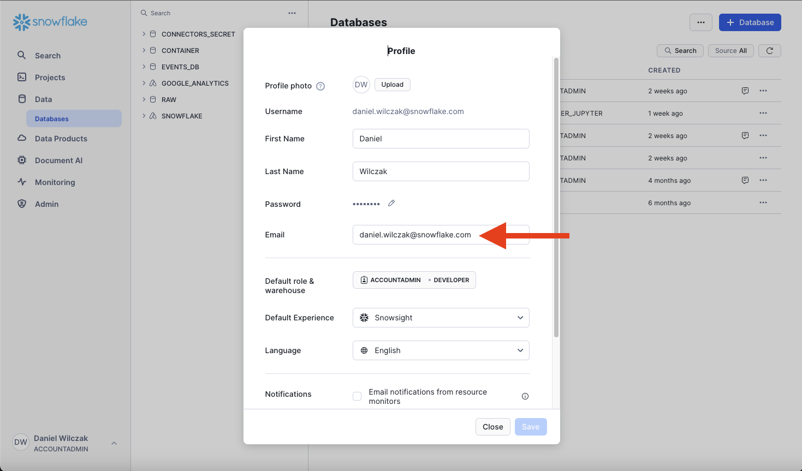

# Support Ticket
In this tutorial we will show how to submit a support ticket in Snowflake. Support tickets are submitted for a varity of reasons. For example - configuration settings, query error or optimization etc. Support tickets are typically answer withing 12 hours based on the ticket complexity.

## Video
Video in development.

## Requirement
You will need to be an **account admin** to submit the support ticket request.

## Walk Through :octicons-feed-tag-16:

To start we will click on our profile name in the bottom left corner and click on support.

??? warning "If you have not submitted a ticket in the past or added your email to their user profile"

    You will have to setup an email in your profile before you are allowed to submit a support ticket. To add a email we will navigate to the your profile.
    

    Update the email and click save.
    

Click on "+ support ticket" to add a new ticket

We will fill in the support ticket with the settings showen and click "create case".

We are done! Now all communication will happen in the ticket messaging system.

