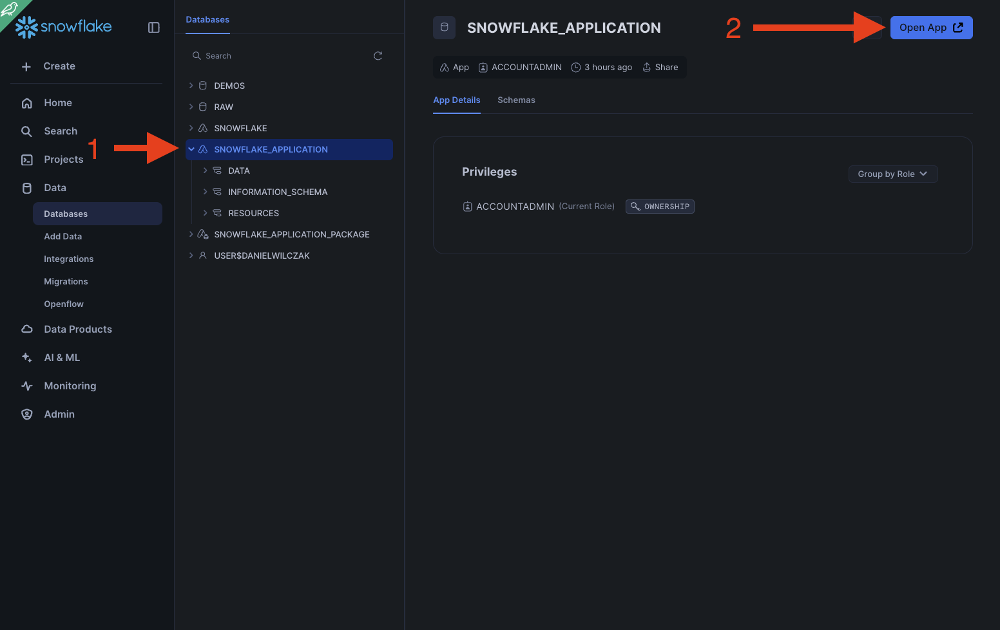
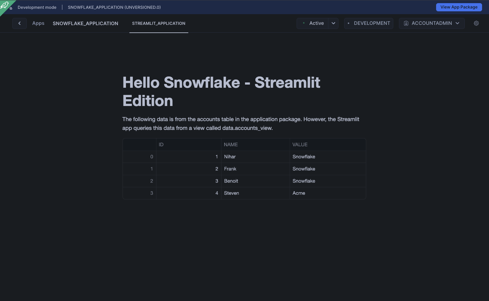

# Native Application - Traditional Streamlit
Goal of this tutorial is to build a traditional native application that has sql function, data that is shared, and a streamlit application that uses that shared data.

## Video
Video still in development.

## Requirements
- Snowflake account, you can use a [free trial](https://signup.snowflake.com/). We also assume no complex security needs.

## Download
- Files ([Link](https://sfc-gh-dwilczak.github.io/tutorials/apps/native/traditional/files/code.zip))

## Setup :octicons-feed-tag-16:
This tutorial is very UI focused so we suggest to follow along with the video and use the files / code provided. 

### Example V1 - Basic funtions
The goals in this first step is to introduce you to a native application framework and how to upload files to the stage. In this example we'll run the first block of code and then upload [V1 files](https://sfc-gh-dwilczak.github.io/tutorials/apps/native/traditional/#download) to the stage. Then run the second to create the application from the package.

=== ":octicons-image-16: Code"

    ```sql linenums="1"
    use role accountadmin;
    create application package snowflake_application_package;
    use application package snowflake_application_package;
    create schema core;
    create or replace stage files;

    -- Now go upload v1 zip contents to the package's files stage.

    create application snowflake_application
    from application package snowflake_application_package
    using '@snowflake_application_package.core.files';

    call snowflake_application.resources.hello();
    ```

=== ":octicons-image-16: Result"

    ```linenums="1"
    | HELLO            |
    |------------------|
    | hello snowflake! |
    ```


###  Example V2 - Share data
The of this exmaple is to show how you can add data that will be shared with the application to the end consumer. In this example we'll run the first block of code and then upload [V2 files](https://sfc-gh-dwilczak.github.io/tutorials/apps/native/traditional/#download) to the stage. Then run the second to create the application from the package.

=== ":octicons-image-16: Code"

    ```sql linenums="1"
    use application package snowflake_application_package;

    -- Create and add data to package.
    create schema if not exists shared_data;

    create table if not exists accounts (id int, name varchar, value varchar);

    insert into accounts values
    (1, 'Nihar', 'Snowflake'),
    (2, 'Frank', 'Snowflake'),
    (3, 'Benoit', 'Snowflake'),
    (4, 'Steven', 'Acme');

    select * from accounts;

    grant usage on schema shared_data to share in application package snowflake_application_package;
    grant select on table accounts to share in application package snowflake_application_package;

    drop application snowflake_application;

    -- Upload V2 files to the stage before running.

    create application snowflake_application
    from application package snowflake_application_package
    using '@snowflake_application_package.core.files';

    use application snowflake_application;
    select * from data.accounts_view;
    ```

=== ":octicons-image-16: Result"

    ```linenums="1"
    | ID | NAME   | VALUE     |
    |----|--------|-----------|
    | 1  | Nihar  | Snowflake |
    | 2  | Frank  | Snowflake |
    | 3  | Benoit | Snowflake |
    | 4  | Steven | Acme      |
    ```

###  Example V3 - Streamlit 
For this example we'll add a streamlit application to our application so users can visulize the data we have shared with them. In this we'll upload the [V3 files](https://sfc-gh-dwilczak.github.io/tutorials/apps/native/traditional/#download) and then run the code.

=== ":octicons-image-16: Code"

    ```sql linenums="1"
    -- Upload V3 files to the stage.
    drop application snowflake_application;

    use application package snowflake_application_package;

    create application snowflake_application
    from application package snowflake_application_package
    using '@snowflake_application_package.core.files';
    ```

=== ":octicons-image-16: Result"

    ```linenums="1"
    | status                                                    |
    |-----------------------------------------------------------|
    | Application 'SNOWFLAKE_APPLICATION' created successfully. |
    ```

Now we can click on the application and go to the app.


Now we can see our streamlit application that is referencing our shared data.


### Versioning and deploying the application
To version your application and deploy the application so it can be share to other consumers please watch the video, it is all done in the UI.