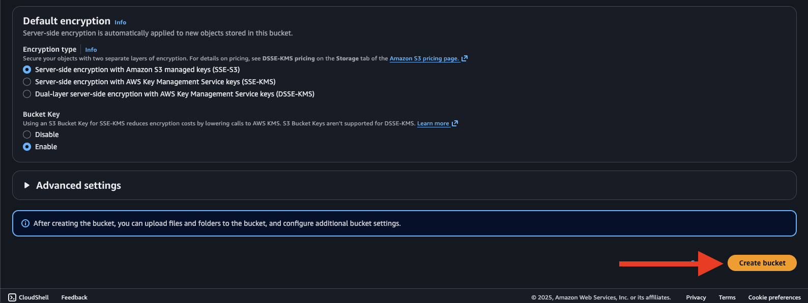
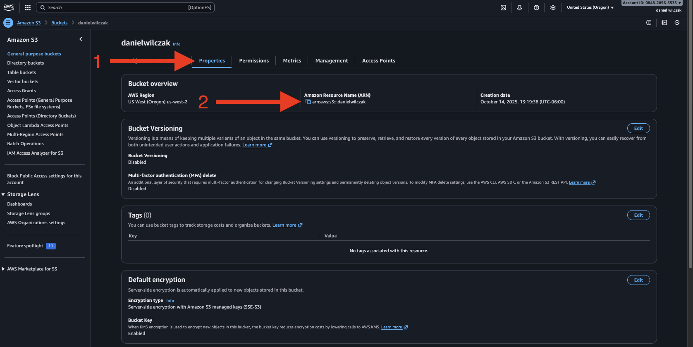
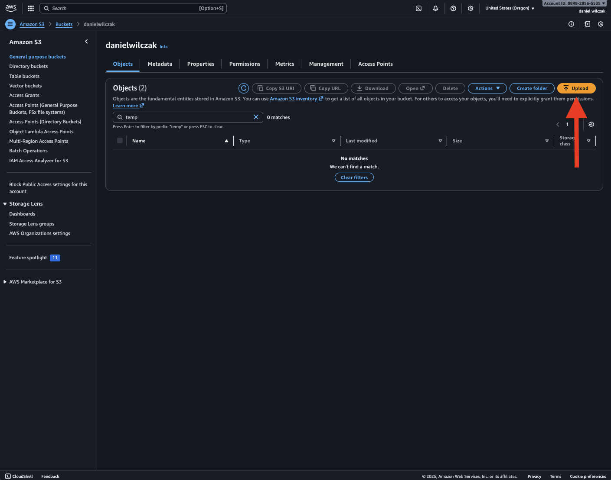
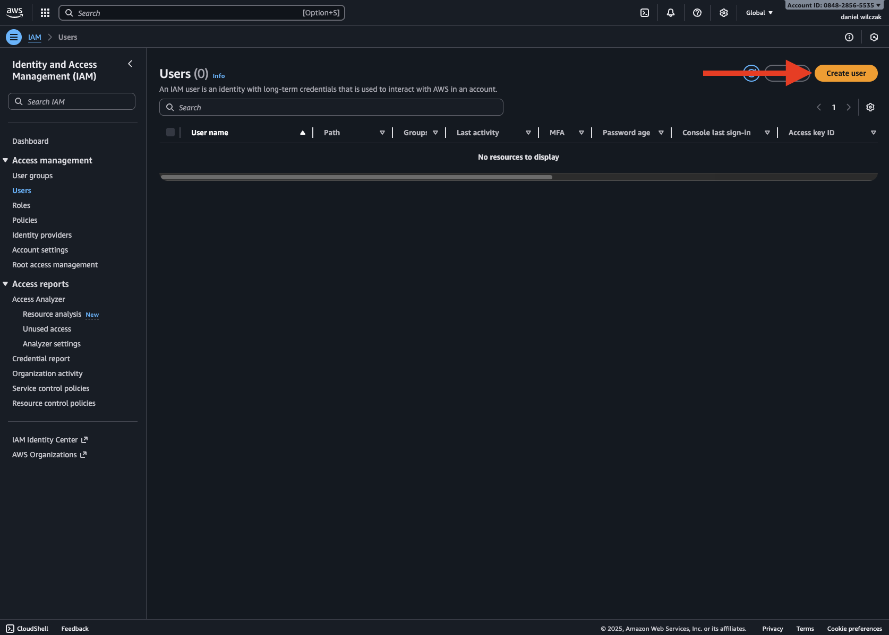
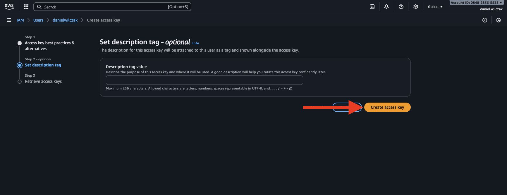
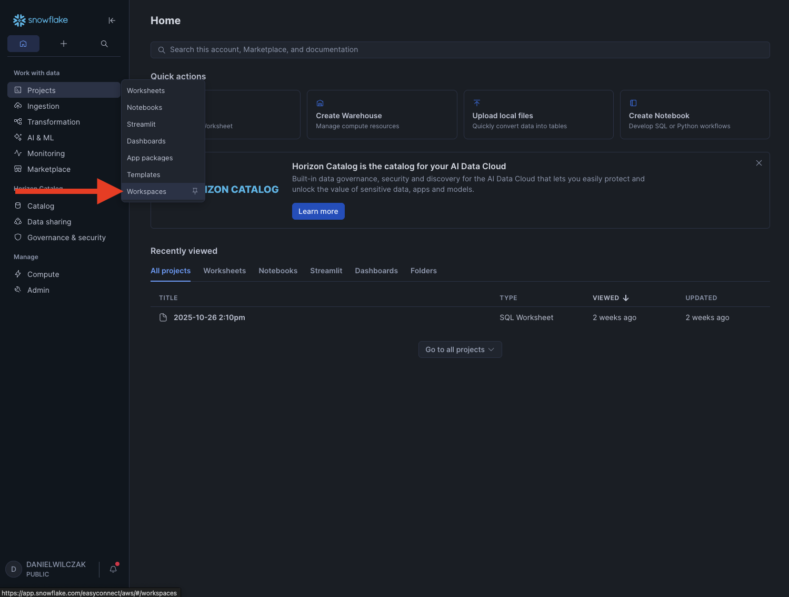
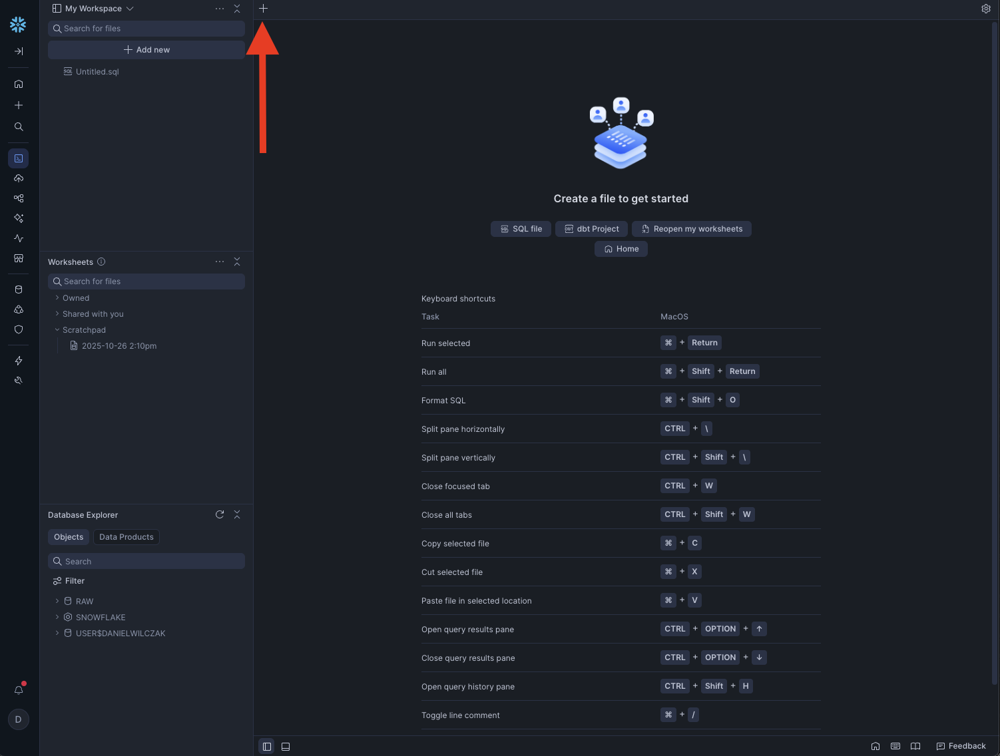

# Connect Snowflake to S3 Storage via Key/Secret
In this tutorial we will show how to generate a key and secret for an S3 bucket and then use that in Snowflake to create a stage.

## Requirements
- Snowflake account, you can use a [free trial](https://signup.snowflake.com/). We also assume no complex security needs.
- AWS account, you can setup a [free account](https://aws.amazon.com/free/) to get started.

## Video
Video in development.

## Download  :octicons-feed-tag-16:
- Sample data ([Link](https://sfc-gh-dwilczak.github.io/tutorials/data/data.zip))

## AWS
Sign into your aws account.

??? note "If you don't have a bucket yet follow here"

    Search S3 in the navigation bar.
    

    Click Create bucket.
    

    Select general purpose and give your bucket a name.
    

    Keep all the default settings and click "Create bucket".
    ""

Lets start by selecting the bucket we want Snowflake to access.


We'll first copy our ARN by going to properties.


If we have a new bucket, we can take the time here to upload the [sample data](https://sfc-gh-dwilczak.github.io/tutorials/data/data.zip).


### Access Policy
Lets setup a read policy that we later apply to a user that will then be used by Snowflake to access the bucket. Search and click on "IAM".


Click Policies.


Click create policy.


Next we'll want to click json and add the JSON below and updating our ARN.

=== ":octicons-image-16: Template"

    ```json linenums="1"
    {
        "Version": "2012-10-17",
        "Statement": [
            {
                "Effect": "Allow",
                "Action": [
                "s3:GetObject",
                "s3:GetObjectVersion"
                ],
                "Resource": "<COPY ARN HERE>/*" /* (1)! */
            },
            {
                "Effect": "Allow",
                "Action": [
                    "s3:ListBucket",
                    "s3:GetBucketLocation"
                ],
                "Resource": "<COPY ARN HERE>", /* (2)! */
                "Condition": {
                    "StringLike": {
                        "s3:prefix": [
                            "*"
                        ]
                    }
                }
            }
        ]
    }
    ```
    { .annotate }

    1.  

    2.  

=== ":octicons-sign-out-16: Example"

    ```json linenums="1"
    {
        "Version": "2012-10-17",
        "Statement": [
            {
                "Effect": "Allow",
                "Action": [
                "s3:GetObject",
                "s3:GetObjectVersion"
                ],
                "Resource": "arn:aws:s3:::danielwilczak/*"
            },
            {
                "Effect": "Allow",
                "Action": [
                    "s3:ListBucket",
                    "s3:GetBucketLocation"
                ],
                "Resource": "arn:aws:s3:::danielwilczak",
                "Condition": {
                    "StringLike": {
                        "s3:prefix": [
                            "*"
                        ]
                    }
                }
            }
        ]
    }
    ```

This is what it will look like.


Give the policy a name, make sure to remember this name we will need it later. Click "Create Policy".


### Create User

Lets create the user and apply the policy to it. Start by going to users.


Click create user.


Give the user a name.


Now will select "Attach policies directly", search and select our policy, and click next.


Click "Create user".


### Key/Secret Generation

Now that we have our user lets generate our credientals. Select the user.


Go to "Security credentials" and then click "create access key".


Select other and then click next.


Click "Create access key".


Copy your access key and secret we will use this in Snowflake in the next step.


## Snowflake
Lets now head into Snowflake and create a sql sheet in workspaces.

??? note "If you don't have a database, schema or warehouse yet."

    === ":octicons-image-16: Database, schema and warehouse"

            ```sql linenums="1"
            
            -- Create a database to store our schemas.
            create database if not exists raw;

            -- Create the schema. The schema stores all objects.
            create schema if not exists raw.aws;

            /*
                Warehouses are synonymous with the idea of compute
                resources in other systems. We will use this
                warehouse to query our integration and to load data.
            */
            create warehouse if not exists development 
                warehouse_size = xsmall
                auto_suspend = 30
                initially_suspended = true;

            use database raw;
            use schema aws;
            use warehouse development;
            ```



Create a new sheet.


From here we'll add our stage code and paste in our bucket name, key and secret. Click run.

=== ":octicons-image-16: Code"

    ```sql linenums="1"
    create or alter stage s3
        url='s3://<BUCKET NAME>/'
        credentials=(
            aws_key_id='<KEY>'
            aws_secret_key='<Secret>'
        )
        directory=(enable=true);
    ```

=== ":octicons-image-16: Example"

    ```sql linenums="1"
    create or alter stage s3
        url='s3://danielwilczak/'
        credentials=(
            aws_key_id='AKIARH....BWUZ7Q'
            aws_secret_key='Vh597QKZqMX....sdoAAK4GD90M'
        )
        directory=(enable=true);
    ```

=== ":octicons-image-16: Result"

    ```sql linenums="1"
    Stage area S3 successfully created.
    ```

This is what it will look like once ran.


Now that we have created our stage we can go view the files in it. If you don't see the file right away, hit refresh. From here we can start loading data. But the process is the same as our [S3 tutorial](https://sfc-gh-dwilczak.github.io/tutorials/clouds/aws/s3/#load-the-data) and not need to repeat here.
