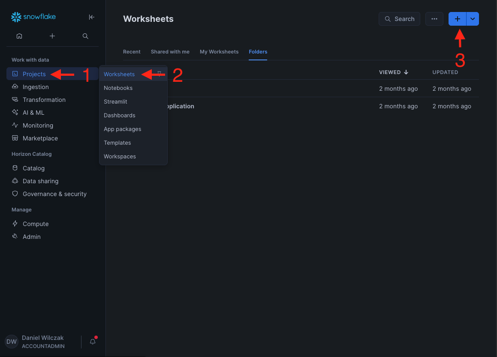

# Azure Entra ID SCIM to Snowflake
In this tutorial, we’ll walk through how to setup Azure EntraID SCIM to provision users and role to our Snowflake account.

## Video
Video still in development.

## Requirements
- Snowflake account, you can use a [free trial](https://signup.snowflake.com/). We also assume no complex security needs.
- An Azure account with P1 Security otherwise you will not be able to add groups.

## Snowflake
Lets start with the easy part, lets get Snowflake setup. Our first goal will be to create our azure provisioning role, example engineer role and the security integration and finally grab the needed URL and token that will be used in Azure Entra ID.

!!! note
    If you plan on using your own role to be provisioned, make sure it's owned (1) by the "aad_provisioner" role.
    { .annotate }

        1. ```grant ownership on role engineer to role aad_provisioner copy current grants;```

Lets open a worksheet (1) and add in the code below. This will create a engineer and aad_provisioner role. We will give the engineer role to myself in this tutorial via Entra ID SCIM group.
{ .annotate }

1. 

=== ":octicons-image-16: Code"

    ```sql linenums="1"
    use role accountadmin;

    -- Create a povisioning role that will be used by azure to create and grant roles.
    create role if not exists aad_provisioner;
    grant role aad_provisioner to role accountadmin;
    grant create user on account to role aad_provisioner;
    grant create role on account to role aad_provisioner;

    -- Create a new role called engineer and give it's ownership to aad_provisioner.
    create role if not exists engineer;
    grant role engineer to role sysadmin;
    grant ownership on role engineer to role aad_provisioner copy current grants;

    -- Create the integration.
    create or replace security integration aad_provisioning
        type = scim
        scim_client = 'azure'
        run_as_role = 'AAD_PROVISIONER';
    ```

=== ":octicons-image-16: Result"

    | status                                               |
    |------------------------------------------------------|
    | Integration AAD_PROVISIONING successfully created.   |


Now that we have our provisioning role, engineer role and integration we will just need to write down two things. Our Tenant URL and Token. There will both be needed later.


=== ":octicons-image-16: Code"

    ```sql linenums="1"
    -- Your tenant URL that needs to be provided to Azure.
    select concat('https://',CURRENT_ORGANIZATION_NAME(),'-',CURRENT_ACCOUNT_NAME(),'.snowflakecomputing.com/scim/v2/');

    -- Your token that needs to be proved to azure.
    select system$generate_scim_access_token('AAD_PROVISIONING');
    ```


=== ":octicons-image-16: Result"

    | URL                                                            |
    |----------------------------------------------------------------|
    | https://EASYCONNECT-SECURITY.snowflakecomputing.com/scim/v2/   |

    and

    | Token                                                                                       |
    |---------------------------------------------------------------------------------------------|
    | ver:2-hint:61552672773-did:1049-ETMsDgAAAZgvJl/6ABRBR....../UK7NvDTjYOLgtFb0fyV+YLI/VnZxcDr |


## Azure
Now for the fun / long part of setting up azure. Lets start in azure by logging into our [azure portal](https://portal.azure.com/) and navigate to Microsoft Entra ID.


!!! Note
    If you already have SSO setup you can skip to the provisioning step which is 3 images down.


Next lets click on Enterprise Applications on the left navbar.


Click on new application.


In the Browse Azure AD Gallery search bar, search for Snowflake, and choose Snowflake for Microsoft Entra ID application. Give your Snowflake application a name, then click the Create button at the bottom.


Lets navigate to provisioning on the left side menu.


Click Add configuration.
  

Now enter in your tenant URL and token we got from Snowflake earlier, click test and create.
  

Once created your ready to create a group and assign it.
  

Next lets go to groups to create the engineer group.
  

Add a new group.
  

!!! warning 
    Make sure to name the group the same as your Snowflake role.

Make it a securiy group and name it engineer.


Now we'll head back to the enterprise application and click on "Assign users and groups".
  

Click add a user/group.
  

!!! warning 
    Make sure to add the group, not the user.

Lets add the engineering group. 
  

Once the group is added we'll go back to provisioning.
  

!!! warning 
    This will only start the scheduled event. You will need to provision ondemand in the follow up step to see results.

We'll start the provisioning task. 
  

Validate you want to start the provisioning scheduled task.
  

To adhoc add the engineering group to Snowflake. We'll click "provision on demand", search for the engineer role and add it.
  

Once selected we'll click the users we want to add and then click provision.
  

Once completed you'll get check boxes and you can head over to Snowflake to see your new user and it's role.
  

Under admin then users you can see my users has been added. We'll want to click on the user to see thier assigned role.
  

We can also see the role has been assigned to the user.
  


