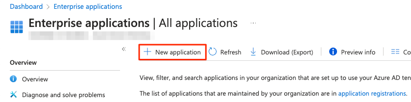
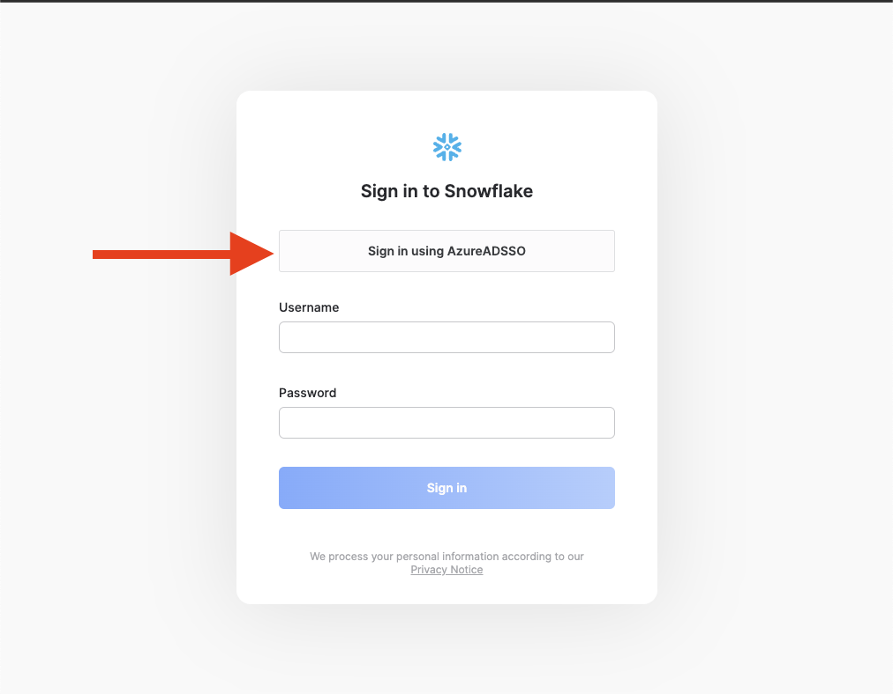

# Azure (SSO) to Snowflake
In this tutorial we will show how to setup authentication to Snowflake using SSO with Azure Microsoft Entra ID Identity Provider which used to called Azure Active Directory.

## Video
<iframe width="850px" height="478px" src="https://www.youtube.com/embed/Dm1k-SSldRA?si=qfS4jV8tp3YA3cnS" title="YouTube video player" frameborder="0" allow="accelerometer; autoplay; clipboard-write; encrypted-media; gyroscope; picture-in-picture; web-share" referrerpolicy="strict-origin-when-cross-origin" allowfullscreen></iframe>

## Azure :octicons-feed-tag-16:
Lets start in azure by setting up the SSO and then adding the users to the approved list.

### Setup
Lets start in azure by logging into our [azure](https://portal.azure.com/) and navigate to Microsoft Entra ID.


Next lets click on Enterprise Applications on the left navbar.


Click on new application.


In the Browse Azure AD Gallery search bar, search for Snowflake, and choose Snowflake for Microsoft Entra ID application.


Give your Snowflake application a name, then click the Create button at the bottom.


Once the application is created, on the left side choose Single sign-on, then choose SAML in the middle panel.


In the middle pane under the Basic SAML configuration section, click the Edit button.


Next we'll want to get our Snowflake account URL which will be entered into the saml configuration. Lets head to Snowflake and click 


Click the copy button on "Account/Server URL". Save this somewhere we will use it twice.


Once in the menu, click "Add Identifier".


To add and identifier, click in the empty space a form will appear. Got to love microsoft UI.


!!! warning
    Make sure to add in the ``https://`` for both url's and ``/fed/login`` for the reply/second URL.

Once you have the form, enter in your account URL we got from Snowflake earlier. Make sure to add in the ``https://`` for both and ``/fed/login`` for the reply URL. Click save once entered.


Go back to the application's SAML-based Sign-on page, scroll down to the SAML Certificates section. Download the Federation Metadata XML. We will use this file in our Snowflake steps later.


### Add users
!!! warning
    If you don't add the user in the Azure AD group they will not be able to use the SSO login on Snowflake. 

Lets add users into the azure AD group for the application. First click on "Users and groups" on the left side navbar and then "add user/group". 


Select Users and groups.


Select the user or groups you want to add. The search bar can be very helpful when you have alot of users/groups.


Finally click assign.


## Snowflake :octicons-feed-tag-16:
Next we will setup Snowflake with the information we got from our ``federation metadata xml`` file (1). To make this process easier I suggest formatting your XML file so it's easier to look through. I used [VS code](https://code.visualstudio.com/) and an [xml formatter](https://marketplace.visualstudio.com/items?itemName=redhat.vscode-xml) to accomplish this. Once you have the file open in vs code and the xml extension installed, select all the code and right clicl -> "Format Document". 
{ .annotate }

1. 


### Setup
Lets open a worksheet (1) in snowflake and enter the code below by entering in the necessary areas from our federation metadata xml file.
{ .annotate }

1. 

=== ":octicons-image-16: Template"

    ```sql linenums="1"

    use role accountadmin;
    create security integration azureadintegration
        type = saml2
        enabled = true
        saml2_snowflake_acs_url    = 'https://[...].snowflakecomputing.com/fed/login' /* (1)! */
        saml2_snowflake_issuer_url = 'https://[...].snowflakecomputing.com' /* (2)! */
        saml2_issuer               = 'https://sts.windows.net/[...]/'  /* (3)! */
        saml2_sso_url              = 'https://login.microsoftonline.com/[...]/saml2' /* (4)! */
        saml2_x509_cert            = 'MIIC8DCCAdigAwIBAg.......eaq/4d52DuNwD'  /* (5)! */
        saml2_provider = 'CUSTOM'
        saml2_enable_sp_initiated = true
        saml2_sp_initiated_login_page_label = 'Azure AD SSO';
    ```
    { .annotate }

    1. 

    2. 

    3. ```
       <EntityDescriptor ID="_8416250f-50fb-...8bcd335e92" entityID="https://sts.windows.net/9a2d78cb-73...fc1ac5ef57a7/" xmlns="urn:oasis:names:tc:SAML:2.0:metadata">
       ```

    4. ```
       <SingleSignOnService Binding="urn:oasis:names:tc:SAML:2.0:bindings:HTTP-Redirect" Location="https://login.microsoftonline.com/9a2d78c...-fc1ac5ef57a7/saml2" />
       ```

    5.  ```
        <X509Certificate>
        MIIC8DCCAdigAwIBAgIQQH4r9rnBiKlPEFVEjpdNhTANBgkqhkiG9w0BAQ
        .......
        Y9B1uSBpb4OmtWZ/LRNzHBDcDNbR oQ6PiPd2yWhtUfbYClOoNcMFOkk8E
        </X509Certificate>
        ```

=== ":octicons-image-16: Example"

    ```sql linenums="1"
    use role accountadmin;
    create security integration azureadintegration
    type = saml2
    enabled = true
    saml2_snowflake_acs_url    = 'https://EASYCONNECT-DEMO.snowflakecomputing.com/fed/login'
    saml2_snowflake_issuer_url = 'https://EASYCONNECT-DEMO.snowflakecomputing.com'
    saml2_issuer               = 'https://sts.windows.net/0fdf63dd-5e4d-4975-b415-5e75f710ae3a/'  
    saml2_sso_url              = 'https://login.microsoftonline.com/0fdf63dd-5e4d-4975-b415-5e75f710ae3a/saml2' 
    saml2_x509_cert            = 'MIIC8DCCAdigAwIBAg.......eaq/4d52DuNwD'  
    saml2_provider = 'CUSTOM'
    saml2_enable_sp_initiated = true
    saml2_sp_initiated_login_page_label = 'Azure AD SSO';
    ```

=== ":octicons-image-16: Result"

    | status                                               |
    |------------------------------------------------------|
    | Integration AZUREADINTEGRATION successfully created. |


### User Management

#### Add user
!!! warning
    Users must use their email for logging into Snowflake that matches in Azure AD email or it will not work.

Lets add the user with thier email. Start by navigation to "users and roles".


Click "+ user".


Add the users email. For the username it is required that when an email is entered you put quotes around it. Like "daniel.wilczak@easyconnectapps.com".


#### Edit user
Click "edit" on the user you want to modify.


You will need to change the username, login name and display name.


### Test login
!!! note
    If you get an error stating the user doesnt exist, you either forgot to add the user in Azure or Snowflake.

Lets make sure your Azure AD is working. Logout of your Snowflake account and you should now see the Azure AD login button.



