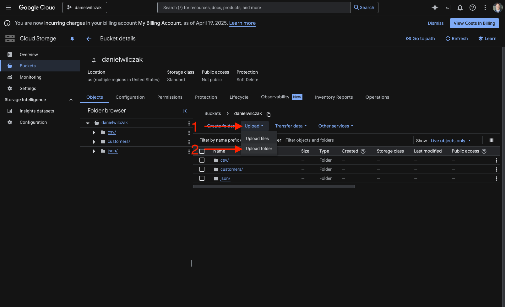

# External Tables - Google Cloud Storage
Goal of this tutorial is to setup a Snowflake [external table](https://docs.snowflake.com/en/sql-reference/sql/create-external-table#examples) on files that are stored in an external google cloud storage bucket.

## Video
Video in development.

## Requirements
- Snowflake account, you can use a [free trial](https://signup.snowflake.com/). We also assume no complex security needs.
- Google cloud account, you can setup a [free account](https://cloud.google.com/) to get started.

## Download
- [Sample Data](https://sfc-gh-dwilczak.github.io/clouds/google/external/files/data.zip)

## Setup :octicons-feed-tag-16:
!!! warning 

    This tutorial assumes you have already setup a stage with read/write privligies. If you have not [please follow this tutorial](https://sfc-gh-dwilczak.github.io/clouds/google/cloud_storage/).
    
In this section we will upload the new [sample files](https://sfc-gh-dwilczak.github.io/clouds/google/external/files/data.zip) to a GCP folder and then setup Snowflake.



## External Table :octicons-feed-tag-16:
Let's not start to create our table and see the options we can have with regard to our table.

### Simple
Lets create the table on top of the [sample files](https://sfc-gh-dwilczak.github.io/clouds/google/external/files/data.zip) we have stored in the bucket / stage.

=== ":octicons-image-16: Code"

    ```sql linenums="1"
    create or replace file format customers_csv_format
        type = 'csv'
        field_optionally_enclosed_by = '"'
        skip_header = 1;

    create or replace external table ext_customers (
        customer_id number as (value:c1::number),
        first_name string as (value:c2::string),
        last_name string as (value:c3::string),
        email string as (value:c4::string)
    )
        location = @gcp/customers
        file_format = customers_csv_format
        auto_refresh = false;
    ```

=== ":octicons-sign-out-16: Result"

    | status                                    |
    |-------------------------------------------|
    | Table EXT_CUSTOMERS successfully created. |

Now you'll be able to query the data in the table as if it were a native Snowflake table. The data will not be refreshed automaticlly in this setup, it has to be triggered manually via:

=== ":octicons-image-16: Code"

    ```sql linenums="1"
    alter external table external_customers refresh;
    ```

=== ":octicons-sign-out-16: Result"

    | file                                     | status         | description                   |
    |------------------------------------------|----------------|-------------------------------|
    | customers/2025-04-21T17-20-44-970197.csv | REGISTERED_NEW | File registered successfully. |
    | customers/2025-04-21T17-20-44-932488.csv | REGISTERED_NEW | File registered successfully. |
    | customers/2025-04-21T17-20-44-919172.csv | REGISTERED_NEW | File registered successfully. |
    | customers/2025-04-21T17-20-44-944873.csv | REGISTERED_NEW | File registered successfully. |
    | customers/2025-04-21T17-20-44-957653.csv | REGISTERED_NEW | File registered successfully. |


### Partition by
After setting up our file format and querying larger, more complex datasets, we can improve performance by partitioning the external table. Partitioning by a column like file_created_at helps Snowflake prune files during queries, reducing scan time.

=== ":octicons-image-16: Code"

    ```sql linenums="1"
    create or replace external table external_customers (
        customer_id number as (value:c1::number),
        first_name string as (value:c2::string),
        last_name string as (value:c3::string),
        email string as (value:c4::string),
        row_created_at timestamp_ntz as (value:c5::timestamp),
        file_created_at date as cast(split_part(split_part(metadata$filename, '/', -1), 'T', 1) as date)
    )
        partition by (file_created_at)
        location = @gcp/customers
        file_format = customers_csv_format
        auto_refresh = false;
    ```

=== ":octicons-sign-out-16: Result"

    | status                                         |
    |------------------------------------------------|
    | Table EXTERNAL_CUSTOMERS successfully created. |


### Auto-Refreshing

!!! warning 

    This sections assumes you have already setup event notification system via pub/sub on the stage/bucket. If you have not [please follow this tutorial](https://sfc-gh-dwilczak.github.io/clouds/google/storage/#automatic-loading).

Now that we have the data partitioned correctly we probably want to be able to see new data as it is loaded into the folder. To do se we will change the autorefresh to true. This assumes we already have event notifications setup similar to Snowpipe.

=== ":octicons-image-16: Code"

    ```sql linenums="1"
    create or replace external table external_customers (
        customer_id number as (value:c1::number),
        first_name string as (value:c2::string),
        last_name string as (value:c3::string),
        email string as (value:c4::string),
        row_created_at timestamp_ntz as (value:c5::timestamp),
        file_created_at date as cast(split_part(split_part(metadata$filename, '/', -1), 'T', 1) as date)
    )
        partition by (file_created_at)
        location = @gcp/customers
        file_format = customers_csv_format
        auto_refresh = true;
    ```

=== ":octicons-sign-out-16: Result"

    | status                                         |
    |------------------------------------------------|
    | Table EXTERNAL_CUSTOMERS successfully created. |
