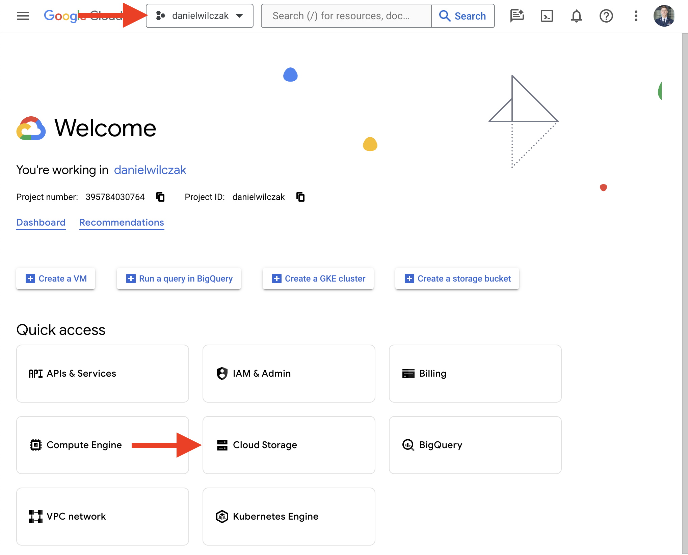
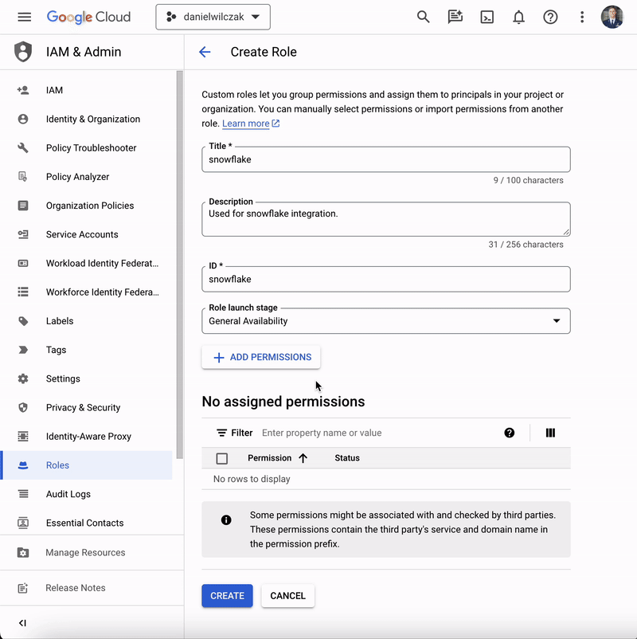
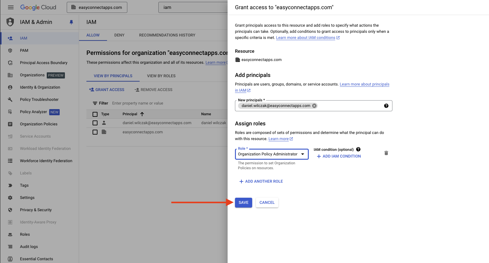

# GCP / Fivetran - Lata Lake
Goal of this tutorial is to setup and integration with Fivetran, GCP and Snowflake to allow fivetran to load iceberg data into a GCP datalake and then integrate Snowflake to be the query engine on that data.

## Video
Video still in development.

## Requirements
- Snowflake account, you can use a [free trial](https://signup.snowflake.com/). We also assume no complex security needs.
- Google cloud account, you can setup a [free account](https://cloud.google.com/) to get started.
- Fivetran account by signing up for a [free trial](https://fivetran.com/signup).

## Setup  :octicons-feed-tag-16:
!!! warning 

    Your GCP bucket and Snowflake acount have to be in the same region to be able to manage iceberg tables.


Lets start by setting up our Google Cloud Storage bucket. After that we'll connect fivetran to it and finish it off with the Snowflake integration to the Fivtran hosted Polaris Catalog.

### Google Cloud
Sign into your google account. 

#### Create project 
If you don't have a project, start by selecting/creating a project.


Click create project.


In our case we'll call the project `danielwilczak` and select the default `no orginization` for the locaition.


#### Create storage bucket
We will select our new project and click `cloud storage` to create a storage bucket.


Click `create` or `create bucket`.


!!! warning 

    Your GCP bucket and Snowflake acount have to be in the same region to be able to manage iceberg tables.

I'm going to name the bucket `danielwilczak` as well. Copy this name, we will use it later. We'll also want to make the region is the same as our Snowflake account.


Lets now select our new bucket and add a folder.


Click create folder.


Give it a name, I've named mine fivetran because that is who is loading the data.


You can now see whe have our folder. Lets move to setting up Fivetran to load data into our folder.


### Fivetran
Lets now move to connecting fivetran to our bucket. To start lets add our bucket as a destination. Click destination in fivetran.


Select GCP cloud storage as the location.


Give the destination a name.


We'll first want to copy our service account URL to give Fivetran permission to use the bucket.


#### Authorize Fivetran in GCP
Lets head back to our bucket and click the check box followed by the permissions button.


Click add principle.


Paste our service account URL given by Fivetran and then click select role.


We'll want to search for "Storage Object Admin" and then click on it in the dropdown.


Once both are added click "Save".


#### Load source data
Now we can added our bucket name, folder and click save and test.


Once tested your destination is read to use.


#### Snowflake
!!! warning 

    Currently you must grab the catalog code when the destination is created otherwise the key will be hidden '*******'. Fivetran is working on fixing this issue.

Now that our data is loaded into our GCP bucket lets connection Snowflake to it using Fivetrans hosted Polarias catalog. Lets start by going back into our GCP destination in Fivetran to copy some Snowflake code.


Once in the destination, on the top navigation bar, select "Catalog Integration", select Snowflake and then copy the sql code. We will use this in Snowflake next.


Lets head into Snowflake and add the code from fivetran and the line below. This will allow us to see the tables that are managed by the catalog.

=== ":octicons-image-16: Template"

    ```sql linenums="1"  
    -- To see the tables in the catalog
    select system$list_iceberg_tables_from_catalog('<Catalog Name>', '', 0);
    ```

=== ":octicons-image-16: Example"

    ```sql linenums="1"  
    -- To see the tables in the catalog
    select system$list_iceberg_tables_from_catalog('fivetran_catalog_throwback_refinery', '', 0);
    ```

=== ":octicons-image-16: Template"

    ```json linenums="1"  
    [
        {"namespace":"google_analytics","name":"conversion_events"},
        {"namespace":"google_analytics","name":"events_report"},
        {"namespace":"google_analytics","name":"accounts"},
        {"namespace":"google_analytics","name":"content_group_report"},
        {"namespace":"google_analytics","name":"audiences_report"},
        {"namespace":"google_analytics","name":"properties"},
        {"namespace":"google_analytics","name":"conversions_report"}
    ]
    ```

#### Grant access in GCP
We'll now need to allow Snowflake to interacte with with bucket via the external volume. To do so we'll 

=== ":octicons-image-16: Template"

    ```sql linenums="1"  
    use role accountadmin;

    -- Get our principal url to be used in GCP so we can connect to the bucket.
    describe external volume <VOLUME NAME >;
    select 
        "property",
        REPLACE(GET_PATH(PARSE_JSON("property_value"), 'STORAGE_GCP_SERVICE_ACCOUNT')::STRING, '"', '') AS url
    from
        table(result_scan(last_query_id()))
    where
        "property" = 'STORAGE_LOCATION_1';
    ```

=== ":octicons-image-16: Example"

    ```sql linenums="1"  
    use role accountadmin;

    -- Get our principal url to be used in GCP so we can connect to the bucket.
    describe external volume fivetran_volume_throwback_refinery;
    select 
        "property",
        REPLACE(GET_PATH(PARSE_JSON("property_value"), 'STORAGE_GCP_SERVICE_ACCOUNT')::STRING, '"', '') AS url
    from
        table(result_scan(last_query_id()))
    where
        "property" = 'STORAGE_LOCATION_1';
    ```

=== ":octicons-image-16: Result"

    | property           | URL                                                  |
    |--------------------|------------------------------------------------------|
    | STORAGE_LOCATION_1 | kuyp12345@gcpuscentral1-1dfa.iam.gserviceaccount.com |


Lets navigate to IAM so that we can give snowflake access to our storage account.


Create a new role.


Fill in the role information. We will call it `snowflake`. After that click `Add Permissions`.


The permissions to select can be found on [Snowflake's documentation](https://docs.snowflake.com/en/user-guide/data-load-gcs-config#creating-a-custom-iam-role). In this tutorial I have choosen `Data loading and unloading`. I have also provided a gif to show how to select the permissions because the user interface is terrible.


Navigate back to our bucket. Click `permissions`, followed by `add principle`.


In the new principles section, add your URL given by Snowflake earlier.


Now add your role by clicking `select role` -> `custom` -> `snowflake`. The last one will be your role name.


??? warning "If you get a 'Domain restricted sharing' error when you click 'Save'. "

    If you run into this error it's because google cloud has updated thier policy as of March 2024. We'll have to update them. First select your orginization (not your project), then go to IAM in the search, followed by clicking "grant access".
    

    Next we'll add our user email into the new principals area. We'll search and click on "Organization Policy Administrator".
    

    Click save.
    

    Next we'll want to update the policy. By searching IAM, selecting orgianization policies, searching domain and clicking on "Domain restricted sharing".
    

    Click Manage polcy.
    

    !!! Note

        "Allow All" is the simple approach but feel free to use [more fine grain approach via Snowflake documentation](https://docs.snowflake.com/en/user-guide/data-load-gcs-config#assigning-the-custom-role-to-the-cloud-storage-service-account).

    We'll want to overide the parent policy with a new rule. Select replace the policy and then select "Allow All". Click done and "Set Polcy." and your good to go. 
    

    The policy has been updated and you can retry adding the role to the new principal.
    


Click `Save` and your finished GCP setup.


### Add Source
This section will be vary depending on what source you plan to use. In my example I would load some data from google analytics by adding it as a connector.


Now if we check our bucket you can see fivetran has loaded the google analytics data into our data lake.


## Create - Table
Lets create a database, schema and our first table in Snowflake using everything we have created.

=== ":octicons-image-16: Template"

    ```sql linenums="1"  
    -- Create the database and schema to store the tables.
    create or replace database <Database name>;
    create or replace schema <Schema>;

    -- Create the table from  the data and the catalog.
    create or replace iceberg table <Table name>
        external_volume = '<volume>'
        catalog = '<catalog>'
        catalog_namespace = '<source name>'
        catalog_table_name = '<table name>'
        auto_refresh = true;
    ```

=== ":octicons-image-16: Example"

    ```sql linenums="1"  
    create or replace database fivetran;
    create or replace schema google_analytics_4;

    -- Create the table from  the data and the catalog.
    create or replace iceberg table accounts
        external_volume = 'fivetran_volume_throwback_refinery'
        catalog = 'fivetran_catalog_throwback_refinery'
        catalog_namespace = 'google_analytics_4'
        catalog_table_name = 'accounts'
        auto_refresh = true;
    ```

=== ":octicons-image-16: Result"

    UPDATE

Not that we have our first table created lets query from it.

=== ":octicons-image-16: Example"

    ```sql linenums="1"  
    select * from accounts;
    ```

=== ":octicons-image-16: Result"

    | NAME               | DISPLAY_NAME  | REGION_CODE | _FIVETRAN_SYNCED              |
    |--------------------|---------------|-------------|-------------------------------|
    | accounts/302439834 | danielwilczak | US          | 2025-04-24 19:48:34.101 -0700 |


## Automate - Table Creation
Now lets automate the creation off all the tables using a Python script. We'll add this python code into a "Python Worksheet". We'll want to fill in our "catalog integratio nname" and "external volume name" that we got from fivetran.

=== ":octicons-image-16: Example"

    ```python linenums="1"  
    import snowflake.snowpark as snowpark
    from snowflake.snowpark.functions import col, lit
    import json
    import datetime
    import pandas as pd
    from functools import reduce

    CATALOG_INTEGRATION_NAME = '<Catalog name>'
    EXTERNAL_VOLUME_NAME     = '<External volume name>'

    def main(session: snowpark.Session):
        # Fetch a list of tables from the external catalog
        external_catalog_tables = [
            row
            for rs in session.sql(f"select SYSTEM$LIST_ICEBERG_TABLES_FROM_CATALOG('{CATALOG_INTEGRATION_NAME}','',0) as TABLE_LIST").collect()
            for row in json.loads(rs.as_dict()["TABLE_LIST"])
        ]

        # Convert the tables to the appropriate CREATE SCHEMA and CREATE ICEBERG TABLE statements
        statements = [
            sql
            for table in external_catalog_tables
            for sql in [create_schema(table), create_table(table)]
        ]

        # Execute each of the statements and merge the resulting dataframes into one combined dataframe to show the user
        results = reduce(lambda left, right: left.union_all(right), [
            exec(session, statement)
            for statement in statements
        ])

        # Identify any tables that exist in CURRENT_DATABASE() that are not tracked in the external catalog and optionally
        sync_dropped_tables(session, external_catalog_tables, drop=False)
        
        return results.sort(col('statement_timestamp'))

    def create_schema(table):
        return f"""
    CREATE SCHEMA if not exists {table['namespace']}
    EXTERNAL_VOLUME = '{EXTERNAL_VOLUME_NAME}'
    CATALOG='{CATALOG_INTEGRATION_NAME}'
    """

    def create_table(table):
        return f"""
    CREATE OR REPLACE ICEBERG TABLE {table['namespace']}.{table['name']}
    EXTERNAL_VOLUME = '{EXTERNAL_VOLUME_NAME}'
    CATALOG='{CATALOG_INTEGRATION_NAME}'
    CATALOG_NAMESPACE= '{table['namespace']}'
    CATALOG_TABLE_NAME = '{table['name']}'
    AUTO_REFRESH=TRUE;
    """

    def exec_and_aggregate_results(session: snowpark.Session, dataframe: snowpark.DataFrame, sql: str) -> snowpark.DataFrame:
        results = session.sql(sql)
        results = results.with_column('statement_timestamp', lit(datetime.datetime.now()))
        results = results.with_column('statement', lit(sql))
        
        return dataframe.union_all(results) if dataframe else results

    def exec(session: snowpark.Session, sql: str) -> snowpark.DataFrame:
        results = session.sql(sql)
        results = results.with_column('statement_timestamp', lit(datetime.datetime.now()))
        results = results.with_column('statement', lit(sql))
        return results

    def sync_dropped_tables(session: snowpark.Session, external_catalog_tables: list, drop=False):
        all_tables_df = session.sql("""
    SELECT CONCAT(table_schema, '.', table_name) AS FQTN, table_schema, table_name  FROM INFORMATION_SCHEMA.TABLES WHERE table_catalog = CURRENT_DATABASE() and table_schema NOT IN ('INFORMATION_SCHEMA', 'PUBLIC')
    """).toPandas()

        external_catalog_tables_df = pd.DataFrame.from_dict(external_catalog_tables) 
        external_catalog_tables_df['FQTN'] = external_catalog_tables_df["namespace"].str.upper() + "." + external_catalog_tables_df["name"].str.upper()

        tables_to_drop = all_tables_df.merge(external_catalog_tables_df, on='FQTN', how='left', indicator=True)
        tables_to_drop = tables_to_drop[tables_to_drop['_merge'] == 'left_only'].drop(columns=['_merge'])
        drop_statements = tables_to_drop["FQTN"].map(lambda fqtn: f"""DROP TABLE {fqtn}""")
        
        for sql in drop_statements:
            if drop:
                session.sql(sql)
                print(f"Dropped orphan table: {sql}")
            else:
                print("Orphan table detected. Run the following to drop it:")
                print(sql)
    ```

=== ":octicons-image-16: Example"

    ```python linenums="1"  
    import snowflake.snowpark as snowpark
    from snowflake.snowpark.functions import col, lit
    import json
    import datetime
    import pandas as pd
    from functools import reduce

    CATALOG_INTEGRATION_NAME = 'fivetran_catalog_throwback_refinery'
    EXTERNAL_VOLUME_NAME     = 'fivetran_volume_throwback_refinery'

    def main(session: snowpark.Session):
        # Fetch a list of tables from the external catalog
        external_catalog_tables = [
            row
            for rs in session.sql(f"select SYSTEM$LIST_ICEBERG_TABLES_FROM_CATALOG('{CATALOG_INTEGRATION_NAME}','',0) as TABLE_LIST").collect()
            for row in json.loads(rs.as_dict()["TABLE_LIST"])
        ]

        # Convert the tables to the appropriate CREATE SCHEMA and CREATE ICEBERG TABLE statements
        statements = [
            sql
            for table in external_catalog_tables
            for sql in [create_schema(table), create_table(table)]
        ]

        # Execute each of the statements and merge the resulting dataframes into one combined dataframe to show the user
        results = reduce(lambda left, right: left.union_all(right), [
            exec(session, statement)
            for statement in statements
        ])

        # Identify any tables that exist in CURRENT_DATABASE() that are not tracked in the external catalog and optionally
        sync_dropped_tables(session, external_catalog_tables, drop=False)
        
        return results.sort(col('statement_timestamp'))

    def create_schema(table):
        return f"""
    CREATE SCHEMA if not exists {table['namespace']}
    EXTERNAL_VOLUME = '{EXTERNAL_VOLUME_NAME}'
    CATALOG='{CATALOG_INTEGRATION_NAME}'
    """

    def create_table(table):
        return f"""
    CREATE OR REPLACE ICEBERG TABLE {table['namespace']}.{table['name']}
    EXTERNAL_VOLUME = '{EXTERNAL_VOLUME_NAME}'
    CATALOG='{CATALOG_INTEGRATION_NAME}'
    CATALOG_NAMESPACE= '{table['namespace']}'
    CATALOG_TABLE_NAME = '{table['name']}'
    AUTO_REFRESH=TRUE;
    """

    def exec_and_aggregate_results(session: snowpark.Session, dataframe: snowpark.DataFrame, sql: str) -> snowpark.DataFrame:
        results = session.sql(sql)
        results = results.with_column('statement_timestamp', lit(datetime.datetime.now()))
        results = results.with_column('statement', lit(sql))
        
        return dataframe.union_all(results) if dataframe else results

    def exec(session: snowpark.Session, sql: str) -> snowpark.DataFrame:
        results = session.sql(sql)
        results = results.with_column('statement_timestamp', lit(datetime.datetime.now()))
        results = results.with_column('statement', lit(sql))
        return results

    def sync_dropped_tables(session: snowpark.Session, external_catalog_tables: list, drop=False):
        all_tables_df = session.sql("""
    SELECT CONCAT(table_schema, '.', table_name) AS FQTN, table_schema, table_name  FROM INFORMATION_SCHEMA.TABLES WHERE table_catalog = CURRENT_DATABASE() and table_schema NOT IN ('INFORMATION_SCHEMA', 'PUBLIC')
    """).toPandas()

        external_catalog_tables_df = pd.DataFrame.from_dict(external_catalog_tables) 
        external_catalog_tables_df['FQTN'] = external_catalog_tables_df["namespace"].str.upper() + "." + external_catalog_tables_df["name"].str.upper()

        tables_to_drop = all_tables_df.merge(external_catalog_tables_df, on='FQTN', how='left', indicator=True)
        tables_to_drop = tables_to_drop[tables_to_drop['_merge'] == 'left_only'].drop(columns=['_merge'])
        drop_statements = tables_to_drop["FQTN"].map(lambda fqtn: f"""DROP TABLE {fqtn}""")
        
        for sql in drop_statements:
            if drop:
                session.sql(sql)
                print(f"Dropped orphan table: {sql}")
            else:
                print("Orphan table detected. Run the following to drop it:")
                print(sql)
    ```

=== ":octicons-image-16: Result"

    | status                                                | STATEMENT_TIMESTAMP     | STATEMENT                                                                                                                                                                                                                                                               |
    |-------------------------------------------------------|-------------------------|-------------------------------------------------------------------------------------------------------------------------------------------------------------------------------------------------------------------------------------------------------------------------|
    | Schema GOOGLE_ANALYTICS successfully created.         | 2025-05-23 14:28:14.514 |  CREATE SCHEMA if not exists google_analytics EXTERNAL_VOLUME = 'fivetran_volume_buffer_concierge' CATALOG='fivetran_catalog_buffer_concierge'                                                                                                                          |
    | Table CONVERSION_EVENTS successfully created.         | 2025-05-23 14:28:14.517 |  CREATE OR REPLACE ICEBERG TABLE google_analytics.conversion_events EXTERNAL_VOLUME = 'fivetran_volume_buffer_concierge' CATALOG='fivetran_catalog_buffer_concierge' CATALOG_NAMESPACE= 'google_analytics' CATALOG_TABLE_NAME = 'conversion_events' AUTO_REFRESH=TRUE;  |
    | GOOGLE_ANALYTICS already exists, statement succeeded. | 2025-05-23 14:28:14.520 |  CREATE SCHEMA if not exists google_analytics EXTERNAL_VOLUME = 'fivetran_volume_buffer_concierge' CATALOG='fivetran_catalog_buffer_concierge'                                                                                                                          |
