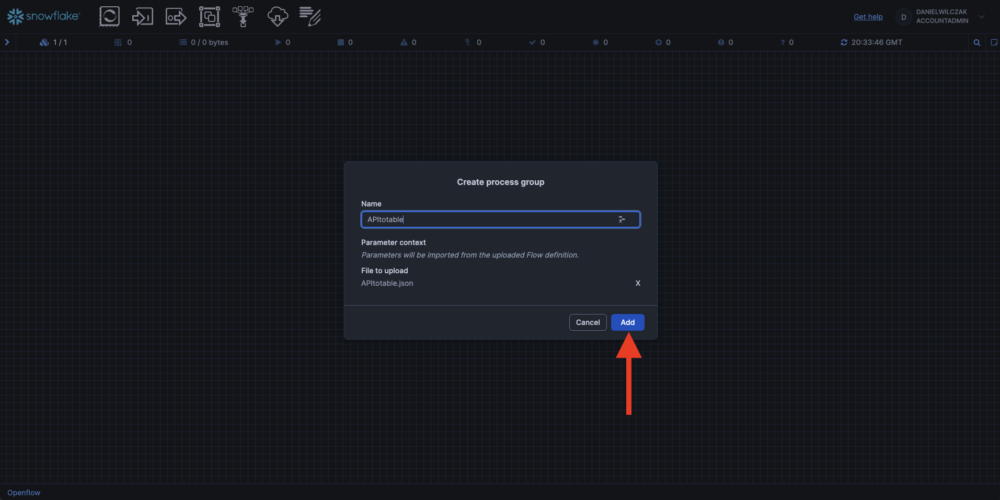
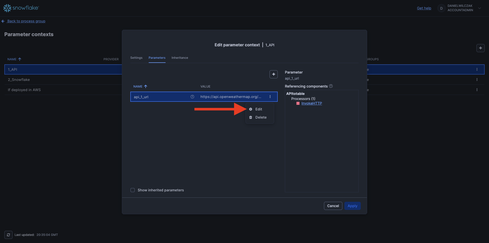
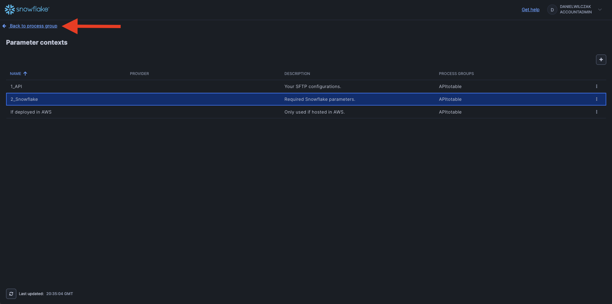
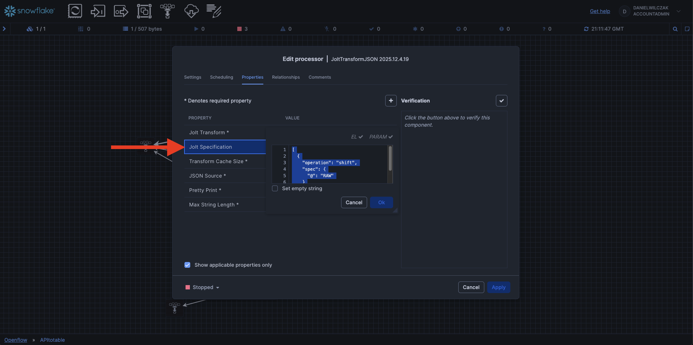
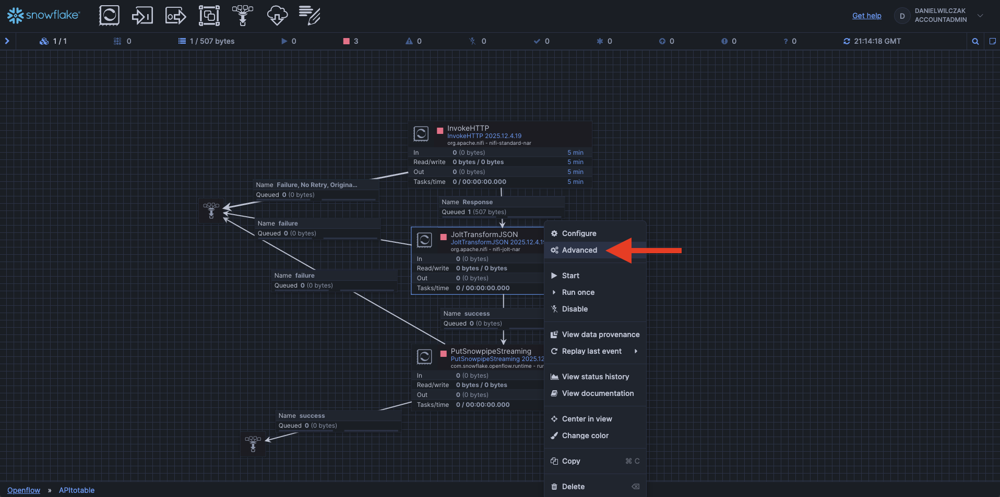
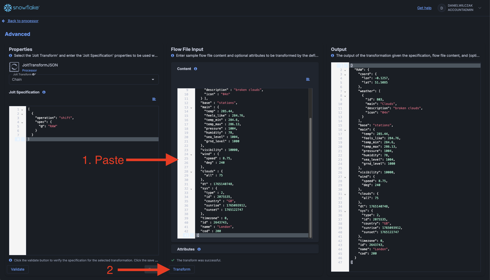
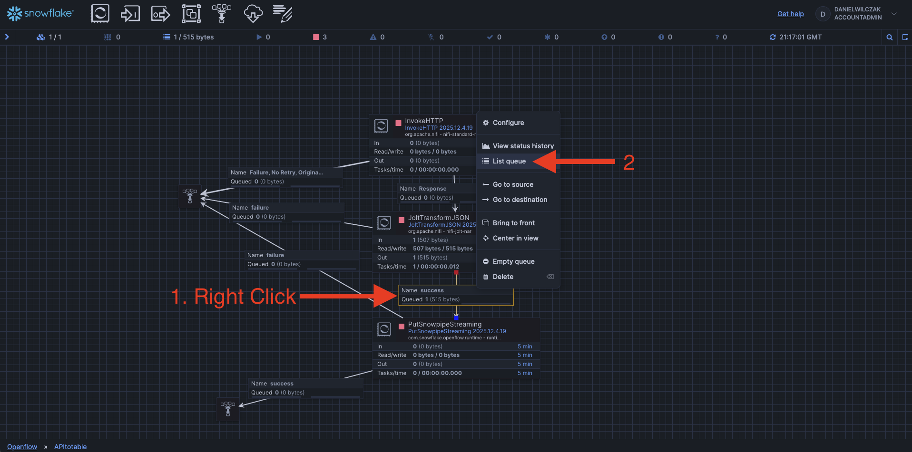

# Openflow - API
Goal of this tutorial is to load data from an API into Snowflake table via openflow.

## Video
Video still in development

## Requirements 
- You can NOT be on a trial account. ([Link](https://docs.snowflake.com/en/developer-guide/snowpark-container-services/overview))
- Snowflake account has to be in an AWS region.([Link](https://docs.snowflake.com/en/developer-guide/snowpark-container-services/overview#available-regions))

## Download  :octicons-feed-tag-16:
- Connector ([Link](https://sfc-gh-dwilczak.github.io/tutorials/engineering/openflow/connectors/api/files/files.zip))

## Snowflake
Lets start the snowflake setup by going into a workspace worksheet (1) and creating the nesseray objects for openflow and the connector.
{ .annotate }

1. 

??? note "If you don't have a database, schema, or warehouse yet."

    === ":octicons-image-16: Database, schema and warehouse"

        ```sql linenums="1"
        -- Create a database to store our schemas.
        create database if not exists raw;

        -- Create the schema. The schema stores all objects.
        create schema if not exists raw.api;
        create schema if not exists raw.network;

        /*
            Warehouses are synonymous with the idea of compute
            resources in other systems. We will use this
            warehouse to query our integration and to load data.
        */
        create warehouse if not exists openflow 
            warehouse_size = xsmall
            auto_suspend = 30
            initially_suspended = true;
        ```

!!! warning "Only required if your hosting openflow in Snowflake (SPCS)"
    Lets create the network rule and external access that will allow openflow/snowflake to talk with our API.

    === ":octicons-image-16: Code"

        ```sql linenums="1"
        -- Create network rule for the api
        create or replace network rule api_network_rule
            mode = egress
            type = host_port
            value_list = (
                'api.openweathermap.org'
            );

        -- Create one external access integration with all network rules.
        create or replace external access integration openflow_external_access
            allowed_network_rules = (api_network_rule)
            enabled = true;
        ```

    === ":octicons-sign-out-16: Result"

        Integration OPENFLOW_EXTERNAL_ACCESS successfully created.

Now we will need a table to store the contents of our API call.
=== ":octicons-image-16: Code"

    ```sql linenums="1"
    create or replace table weather (
        raw variant
    );
    ```

=== ":octicons-sign-out-16: Result"

    Table WEATHER successfully created.

## Openflow
Next we'll head into openflow to setup our runtime and add the connector.


??? warning "If you get the error 'Invalid consent request' or 'TOTP Invalid'"
    You will have to change your default role to a role that is not an admin role. Example default would be public.
    

Click "Launch openflow".


### Add the connector
We'll create a new runtime.


We'll select our deployment, give the runtime a name, select our snowflake role and if deployed in Snowflake our external access intergration.


Now we'll wait 5-10 minutes for our runtime to become usable.


??? warning "If you get the error 'Invalid consent request' or 'TOTP Invalid'"
    You will have to change your default role to a role that is not an admin role. Example default would be public.
    

Once the runtime is "Active" we can click to go into it.


Next we'll drag a process group to the canvas.


We'll click "Browse" button and upload our [connector](https://sfc-gh-dwilczak.github.io/tutorials/engineering/openflow/connectors/api/files/files.zip) we downloaded at the start of the tutorial.


Click "Add".


### Paramaters
Next we'll want to go into our connectors paramaters. Right click the connector and go into paramaters.


Click cancel.


#### API Credentials
From here we can see the two or three sections we need. We'll start by clicking edit on the api paramaters.


Here we can see our only paramater. This is to keep the tutorial simple. I have already add the weather data api and it's key.


#### Snowflake Credentials
Next we'll go back and edit our Snowflake configurations.


Now you only have to do the third paramater if your openflow is hosted on AWS.


#### (Optional) Snowflake for AWS
We'll want to enable our control service so that we can connect to Snowflake.


### Running the connector
To look into our connector we can double click it.


To see how we plan on hitting our endpoint we can right click and select configure.


Here we can see the configuration for how to hit the API and return a response. In this case we keep it simple and just put in the URL.


If we head back we can run the connector once to validate it works.


Now that it has been sucessfull we can list the queue of responses by right clicking and go into the queue.


Now we can view the contents of our api call.


We can see the json that has responded, we'll copy this so we can manipulate it in the next step.


We'll look into the configuration of the transformation.


Here we can see in the transformation the code used to manipulate the JSON so it fits into our single column varient column.


Now if we want a better view of the transformation or to play with it we can right click the transform processor and go into advanced.


Now we get a nice UI to paste our JSON into and click transform. This will allow us to see how the data will change after this step.


Lets head back and run it once.


We can right click and look at the queue.


View the contents


Here we can see we add the RAW header key to the data to make sure it goes into our RAW column in our weather table.


Now lets head back and run the final step once to get it into the table.


We can see it's been successful so we will go look at our table in Snowflake.


Now we can select our table and click the column to view the results in a nice way.
=== ":octicons-image-16: Code"

    ```sql linenums="1"
    select * from weather;
    ```

