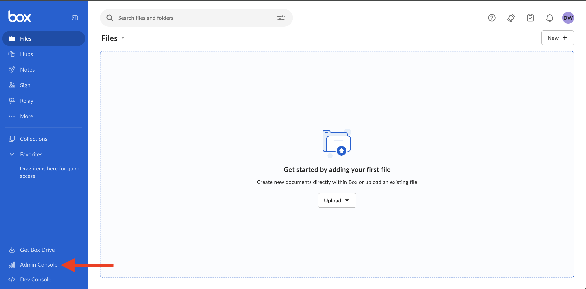
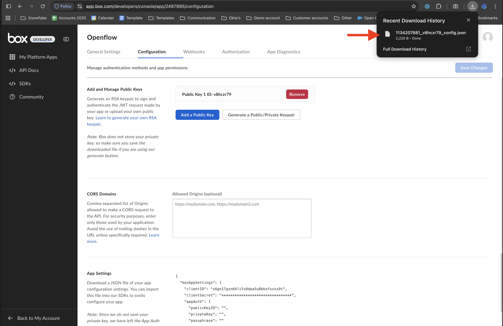
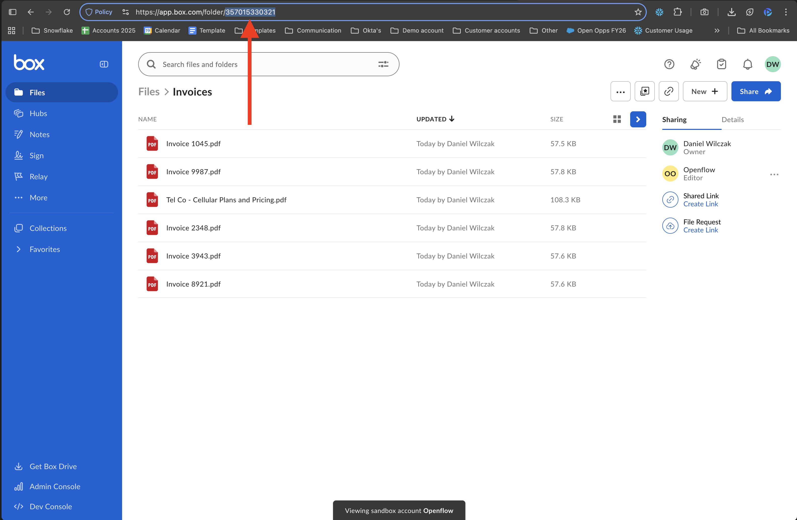
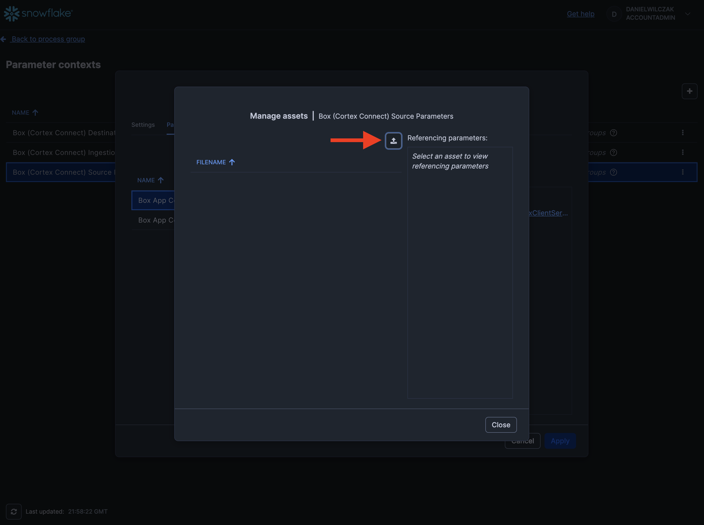
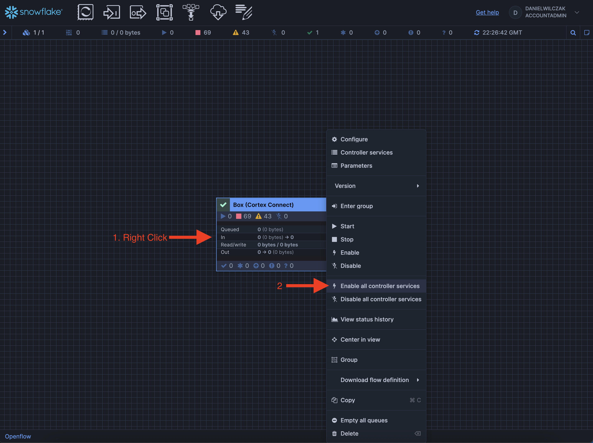
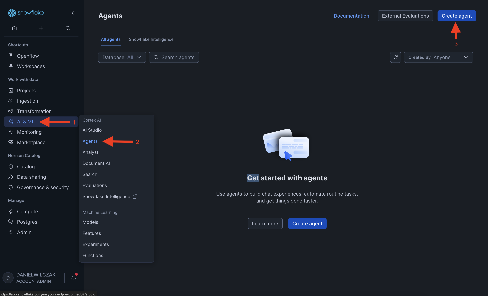
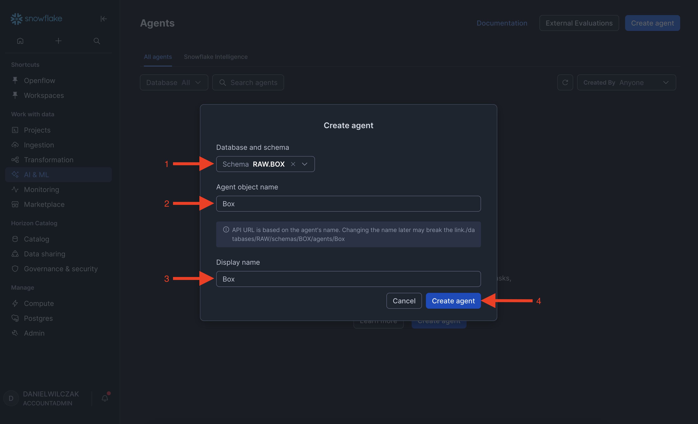
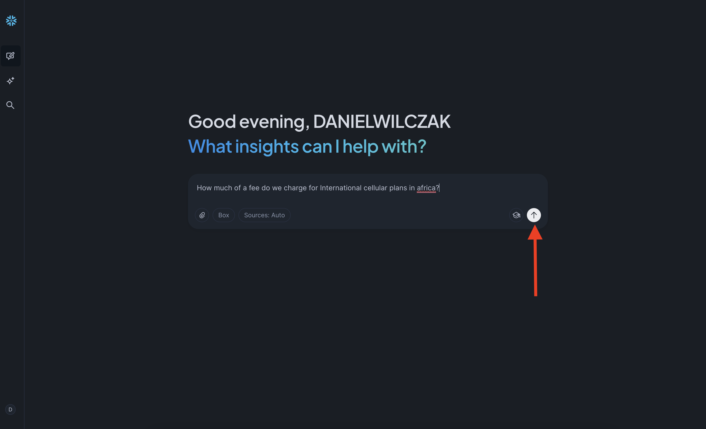

# Openflow - Box
Goal of this tutorial is to load data from Box into Snowflake via openflow. This tutorial will not cover how to setup a deployment in [Snowflake](https://sfc-gh-dwilczak.github.io/tutorials/engineering/openflow/deployments/snowflake/) or [AWS](https://sfc-gh-dwilczak.github.io/tutorials/engineering/openflow/deployments/aws).

## Video
Still in development

## Requirements 
- You can NOT be on a trial account. ([Link](https://docs.snowflake.com/en/developer-guide/snowpark-container-services/overview))
- Snowflake account has to be in an AWS region.([Link](https://docs.snowflake.com/en/developer-guide/snowpark-container-services/overview#available-regions))
- Box account must be at minimum a [busniess account](https://www.box.com/pricing). This is a requirements from [Box](https://box.com/). 

## Downloads
- Sample data - [Link](https://sfc-gh-dwilczak.github.io/tutorials/engineering/openflow/connectors/box/files/files.zip)

## Box
This tutorial will use a Box Sandbox to prevent production security complications. 

### Sanbox Creation
Lets login to our box account and go to "Admin Console".


Now we'll go to platform, select sandbox and click "Create Sandbox". This will allow us to have full access to an account.


We'll give our sandbox a name and select our email as the admin. Click "Create".


Now that the sandbox is created we will login to it.


### Development App
Once we are in the accoount or sandbox account, we'll go to [https://app.box.com/developers/console](https://app.box.com/developers/console)


We'll need to create an app so that our Openflow can connected to the account via the app. Click "Create Platform App".


We'll give our app a name and select "Server Auth -JWT" as app type.


### App Configuration
Once created we'll be launched into Configurations were we'll need to make changes. To start lets update "App Access Level" to App + Enterprise Access.


Make sure your application scope [follows Snowflake requirements](https://docs.snowflake.com/en/user-guide/data-integration/openflow/connectors/box/setup#get-the-credentials). 


Next we'll generate a Public / Private Key. Click this button will require you to enter your duo auth code or sign up for one.


Enter duo auth information.


Once duo auth you'll have to click the button again.


Once click it will download a .json file. We will use this file in openflow later.


Now lets submit our app for authorization so that our box can use it later.


Copy your Client ID and submit it to your enterprise, this removes and uneeded steep later.


!!! Note "Only needed when using a sandbox"

    Next lets head to general setting and copy our Service Account ID. This is only if you are using a Sandbox as the description explains.
    

Head back to your account.


Go to "Admin Console".


Navigate to integration select "Server Authentication Apps" and view your application.


Click "Authorize".


Click "Authorize" again.


Now your app and account is ready. Lets go add data and share it to our service account.


### Sample Data / Share
Now lets upload our [sample PDF files](https://sfc-gh-dwilczak.github.io/tutorials/engineering/openflow/connectors/box/files/files.zip) and share it with our service account because were in a sandbox. Create a new folder.


Give the folder a name and paste the service account email in the "Invite Additional People" box. Click create.


Open your folder.


Upload the [example PDF files](https://sfc-gh-dwilczak.github.io/tutorials/engineering/openflow/connectors/box/files/files.zip).


Next copy your "Folder ID" from the URL. This will be used in Openflow later.


## Snowflake
Lets start the snowflake setup by going into a workspace sql file (1) and creating the necessary objects for openflow and the connector.
{ .annotate }

1. 

??? note "If you don't have a database, schema, or warehouse yet."

    === ":octicons-image-16: Database, schema and warehouse"

        ```sql linenums="1"
        -- Create a database to store our schemas.
        create database if not exists raw;

        -- Create the schema. The schema stores all objects.
        create schema if not exists raw.box;
        create schema if not exists raw.network;

        /*
            Warehouses are synonymous with the idea of compute
            resources in other systems. We will use this
            warehouse to query our integration and to load data.
        */
        create warehouse if not exists openflow 
            warehouse_size = xsmall
            auto_suspend = 30
            initially_suspended = true;
        ```

!!! warning "Only required if your hosting openflow in Snowflake (SPCS)"
    Lets create the network rule and external access that will allow openflow/snowflake to talk with our SFTP.

    === ":octicons-image-16: Code"

        ```sql linenums="1"
        -- Create network rule for box endpoints
        create or replace network rule box_network_rule
            mode = egress
            type = host_port
            value_list = (
                'api.box.com',
                'boxcdn.net',
                'boxcloud.com',
                'dl.boxcloud.com',
                'public.boxcloud.com'
            );

        -- Create one external access integration with all network rules.
        create or replace external access integration openflow_external_access
            allowed_network_rules = (box_network_rule)
            enabled = true;
        ```

    === ":octicons-sign-out-16: Result"

        Integration OPENFLOW_EXTERNAL_ACCESS successfully created.

## Openflow
Now that we have our objects lets add the postgres connector to our deployment. Navigate to openflow in the navbar.


??? warning "If you get the error 'Invalid consent request' or 'TOTP Invalid'"
    You will have to change your default role to a role that is not an admin role. Example default would be public.
    

Launch openflow and login.


From there we can switch to the deployment where we can see our deployment and that it's active. If you don't have a deployment use either [SPCS](https://sfc-gh-dwilczak.github.io/tutorials/engineering/openflow/deployments/spcs/) or [AWS](https://sfc-gh-dwilczak.github.io/tutorials/engineering/openflow/deployments/aws_snowflake_vpc/) to deploy your Opeflow instance.


Next we'll head to runtime and click " + Create Runtime".


!!! note
    External access will only show up if your on a [SPCS deployment](https://sfc-gh-dwilczak.github.io/tutorials/engineering/openflow/deployments/spcs/).

We'll then select our runtime, give it a name, select accountadmin as the role and if your on [SPCS](https://sfc-gh-dwilczak.github.io/tutorials/engineering/openflow/deployments/spcs/) your external access integration.


Once your runtime is active and ready to go. We can head to overview and add the connector.


Click install on the "Box (Cortex Connect)" version to have Snowflake search and all needed tables setup by the connector. There are other connectors for box that are very similar but used in different way.


Select our runtime.


### Paramaters
Now that the connector is installed we'll want to input our Box and Snowflake paramaters.


Now that we are in paramaters we can break it into 3 sections those being destination, Ingestion and Source.


#### Destination
Lets click the three dots of our destination and click edit.


Now we can select either note option below based on our deployment.

??? note "If your using SPCS deployment"

    As an example we'll click the three dots and click edit. We'll put the database, schema, role and warehouse.
    

    One special paramter is the "Snowflake Authentication Strategy" with container service you can put in "SNOWFLAKE_SESSION_TOKEN" and it will not require a key_pair.
    

    This is an example input if you used the configurations given at the beginning of the tutorial.
    


??? note "If your using AWS deployemnt"

    These are the paramaters you'll need to be filled out. We will see how to get them below.
    

    To get the Snowflake Account Identifier, you'll go to the bottom left of the homepage and click account details.
    

    You'll copy your account identifier and paste it in openflow.
    

    Next to get your key we'll have to generate a public and private key and apply it to our user. To generate the key run this bash script.
    
    === ":octicons-image-16: Code"

        ```bash linenums="1"
        openssl genrsa 2048 > rsa_key_pkcs1.pem
        openssl pkcs8 -topk8 -inform PEM -in rsa_key_pkcs1.pem -out rsa_key.p8 -nocrypt
        openssl rsa -in rsa_key_pkcs1.pem -pubout -out rsa_key.pub
        ```

    === ":octicons-sign-out-16: Result"

        ```
        rsa_key_pkcs1.pem
        rsa_key.p8
        rsa_key.pub
        ```
    
    This will generate three file. We will apply the content of the .pub file to our Snowflake user using the alter user command.
    === ":octicons-image-16: Code"

        ```sql linenums="1"
        alter user danielwilczak set rsa_public_key='PUBLIC KEY';
        ```

    === ":octicons-image-16: Example"

        ```sql linenums="1"
        alter user danielwilczak set rsa_public_key='MIIBIjANBgkqhki...6VIhVnTviwDXXcm558uMrJQIDAQAB';
        ```

    === ":octicons-sign-out-16: Result"

        Statement executed successfully.

    Now that we have our public key on our user we'll move to uploading the .pem file to openflow.
    

    Click the upload button.
    

    Click the upload button again and select your .pem file.
    

    Once uploaded select the key and click "ok". Then fill out the remaing fields and click apply.
    

#### Source
Next lets head to source. Click edit on the "Run App Config FIle".


Select "Reference assists" and then the upload button.


Click upload again.


Upload your json public/private key we go from box earlier (1).
{ .annotate }

1. 

Once uploaded, we'll click "Close".


We'll select our key and click "ok".


Finally click "apply".


#### Ingestion
Now we'll move to the final section ingestion. We'll first edit our folder ID, the reason we don't use 0 in this tutorial because Sandbox's don't allow it. Click edit.


We'll put in our "Folder ID" we got from Box (1).
{ .annotate }

1. 


Next we'll edit the role that will have access to the search service. 


Since we do everthing in this tutorial with AccountAdmin we'll keep using it.


Click "Apply".


## Run
Finally we can run our connector. Head back to the process group.


Right click the process group again and click "Enable all controller services" and click start.


Next we'll right click "Enable" the connector.


!!! note
    If you get an error here, I would let the connector run one more time, sometimes the connector has race connedition problems where it doesn't know objects have been created yet and fails. It will fix itself on the next run.

Then we'll right click and hit "Start". This will kick off the ingestion. 


### Stage
Now if you don't get any errors you can go back to Snowflake and find our box schema with everything int it. Letts start with seeing that the files have been replicated.


### Cortex Search
Now that we have the files loaded and in Cortex Search automaticly lets use the playground to search through the files.


Now we can search in the playground to get relevent chunks of information.


### Snowflake Inetllegence
Now lets allow Snowflake Inetllegence to use our cortex search service to use it during it's questions answering. Lets start by going to agents.


Next put our agents into the same schema and give it a object name and diplay name. Click "Create Agent".


Next in our agent we'll go tools and a Cortex Search.


Select the location of the search service, select the service. For ID column selet web_url and title column will be full_name. Finally we'll give the tool a name and description and click "Add".


Click "Save".


Lets navigate to Snowflake Inetllegence.


We'll ask a question similar to "How much of a fee do we charge for International cellular plans in africa?".


We can see that it was able to answer the question with our documents. Also we can click the document to see it in box.


We can see that it pulled it from our international plan section.

