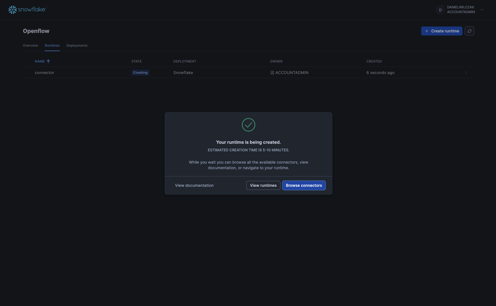
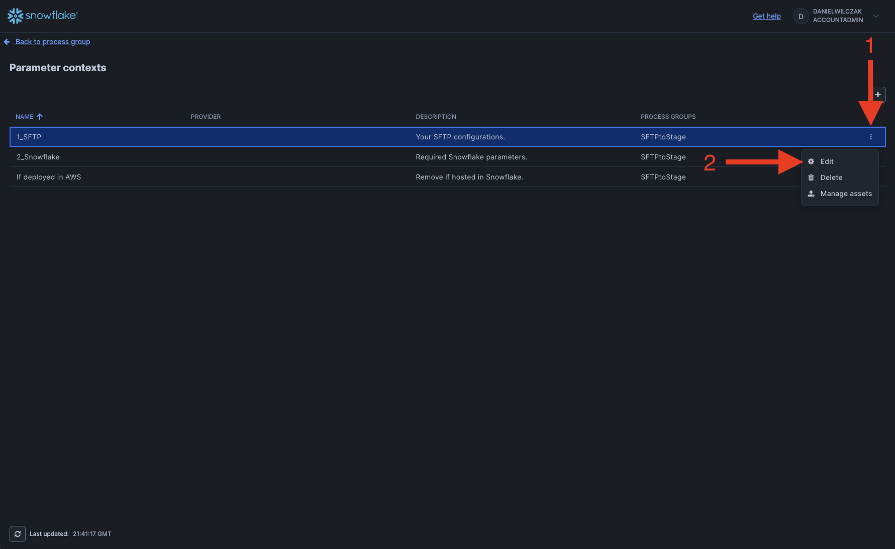
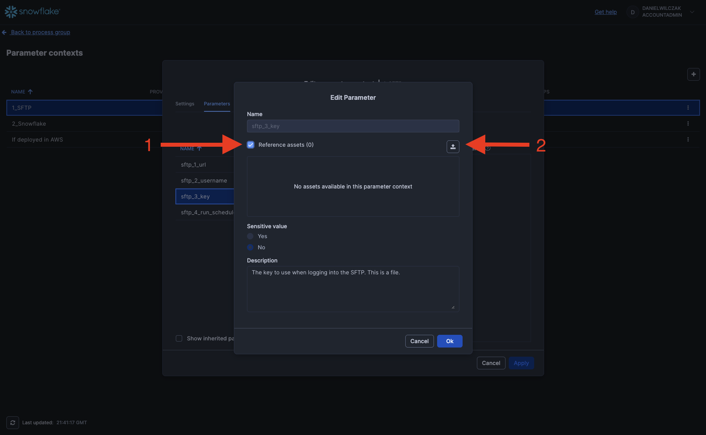
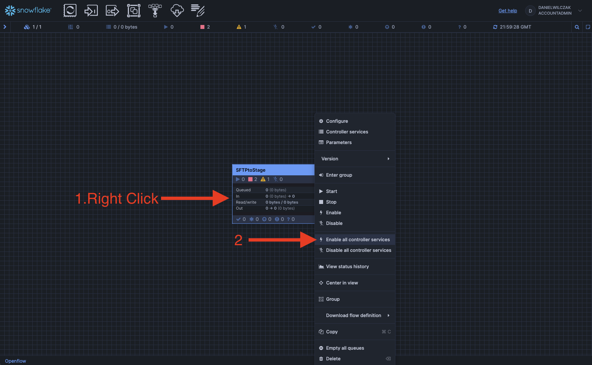
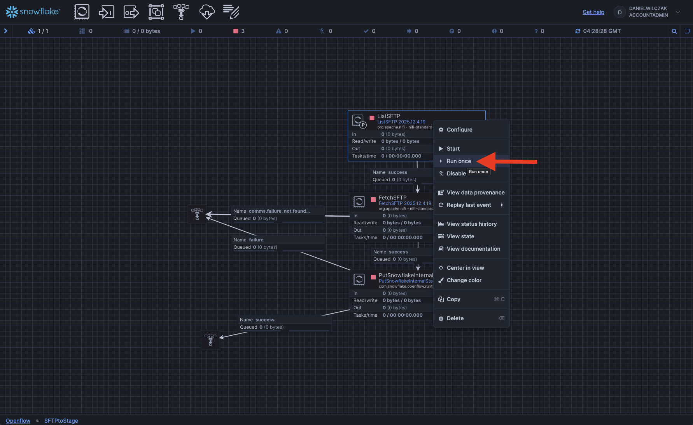
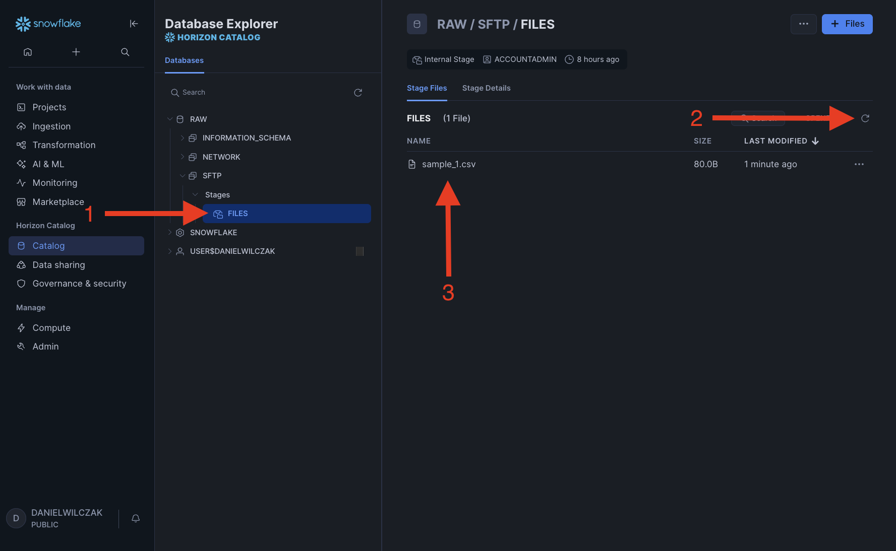

# Openflow - SFTP
Goal of this tutorial is to load data from SFTP into Snowflake stage via openflow.

## Video
Video still in development

## Requirements 
- You can NOT be on a trial account. ([Link](https://docs.snowflake.com/en/developer-guide/snowpark-container-services/overview))
- Snowflake account has to be in an AWS region.([Link](https://docs.snowflake.com/en/developer-guide/snowpark-container-services/overview#available-regions))

## Download  :octicons-feed-tag-16:
- Connector ([Link](https://sfc-gh-dwilczak.github.io/tutorials/engineering/openflow/connectors/sftp/files/files.zip))

## Snowflake
Lets start the snowflake setup by going into a workspace worksheet (1) and creating the nesseray objects for openflow and the connector.
{ .annotate }

1. 

??? note "If you don't have a database, schema, or warehouse yet."

    === ":octicons-image-16: Database, schema and warehouse"

        ```sql linenums="1"
        -- Create a database to store our schemas.
        create database if not exists raw;

        -- Create the schema. The schema stores all objects.
        create schema if not exists raw.sftp;
        create schema if not exists raw.network;

        /*
            Warehouses are synonymous with the idea of compute
            resources in other systems. We will use this
            warehouse to query our integration and to load data.
        */
        create warehouse if not exists openflow 
            warehouse_size = xsmall
            auto_suspend = 30
            initially_suspended = true;
        ```

!!! warning "Only required if your hosting openflow in Snowflake (SPCS)"
    Lets create the network rule and external access that will allow openflow/snowflake to talk with google sheets.

    === ":octicons-image-16: Code"

        ```sql linenums="1"
        -- create network rule for google apis
        create or replace network rule sftp_network_rule
            mode = egress
            type = host_port
            value_list = (
                '<SFTP URL>:22',
            );

        -- Create one external access integration with all network rules.
        create or replace external access integration openflow_external_access
            allowed_network_rules = (sftp_network_rule)
            enabled = true;
        ```

    === ":octicons-image-16: Example"

        ```sql linenums="1"
        -- create network rule for google apis
        create or replace network rule sftp_network_rule
            mode = egress
            type = host_port
            value_list = (
                'danielwilczaksftp.blob.core.windows.net:22'
            );

        -- Create one external access integration with all network rules.
        create or replace external access integration openflow_external_access
            allowed_network_rules = (sftp_network_rule)
            enabled = true;
        ```

    === ":octicons-sign-out-16: Result"

        Integration OPENFLOW_EXTERNAL_ACCESS successfully created.

Now we will need a stage to store the files we pull from our SFTP.

=== ":octicons-image-16: Code"

    ```sql linenums="1"
    -- Stage to store files in.
    create stage files directory = ( enable = true );
    ```

=== ":octicons-sign-out-16: Result"

    Stage area FILES successfully created.


## Openflow
Next we'll head into openflow to setup our runtime and add the connector.


??? warning "If you get the error 'Invalid consent request' or 'TOTP Invalid'"
    You will have to change your default role to a role that is not an admin role. Example default would be public.
    

Click "Launch openflow".


### Add the connector
We'll create a new runtime.


We'll select our deployment, give the runtime a name, select our snowflake role and if deployed in Snowflake our external access intergration.


Now we'll wait 5-10 minutes for our runtime to become usable.


??? warning "If you get the error 'Invalid consent request' or 'TOTP Invalid'"
    You will have to change your default role to a role that is not an admin role. Example default would be public.
    

Once the runtime is "Active" we can click to go into it.


Next we'll drag a process group to the canvas.


We'll click "Browse" button and upload our [connector](https://sfc-gh-dwilczak.github.io/tutorials/engineering/openflow/connectors/sftp/files/files.zip) we downloaded at the start of the tutorial.


We'll click "Add".


### Paramaters
Now we'll see the connector on the canvas, we'll right click and select "paramaters".


We'll click cancel.


Next we'll edit each paramater group. These are just the basics.


#### SFTP Credentials
We'll enter in our SFTP URL, username and upload our key. If you want to use a password you can modify this in the process I just haven't added here. I will show this in the video.


Now for the key file you'll have to click "reference assests" and then the upload button.


Click upload again.


Once uploaded click cancel.


Now select the file and click okay.


Once everything has been edited, click apply.


#### Snowflake Credentials
Now we will do the same for our Snowflake credentials.


#### (Optional) Snowflake for AWS
!!! warning "Only required if your hosting openflow in AWS"
    

### Running the connector
Next we'll head back to the canvas.


Right click the connector and add "Enable all controller services".


Now lets go into the connector to look at what we can change and also run it one step at a time. Double click the connector.


Right click the first step "ListSFTP", and click configure. This step will allow us to look into how the files are selected before grabbing them. In our case we are just going to pull all files in all folders.


Once we are happy with the configurations we can go back and right click again and click "Run Once". This will allow us to list the files to grab in the next step.


Now that it has successfully run, we can right click the success box and look at queue of files to grab.


We can see all the files to pull in on the next step.


Now we can run the next step once again. 


This time if we look at the queue it will allow us to download the file if we wanted to validate it.


Now we can run the final step that will put it into our stage.


Now that we have a successful run of the final step we can go back into Snowflake UI and see our file in the stage once we click refresh.
