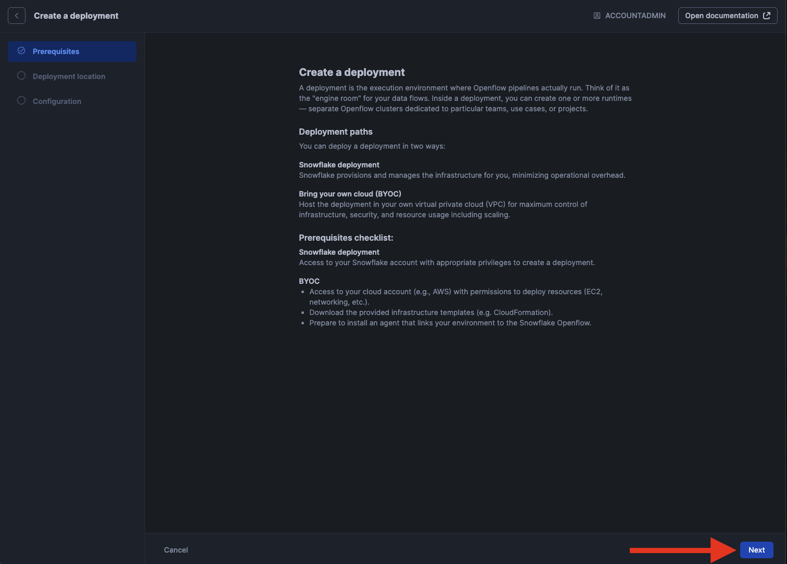
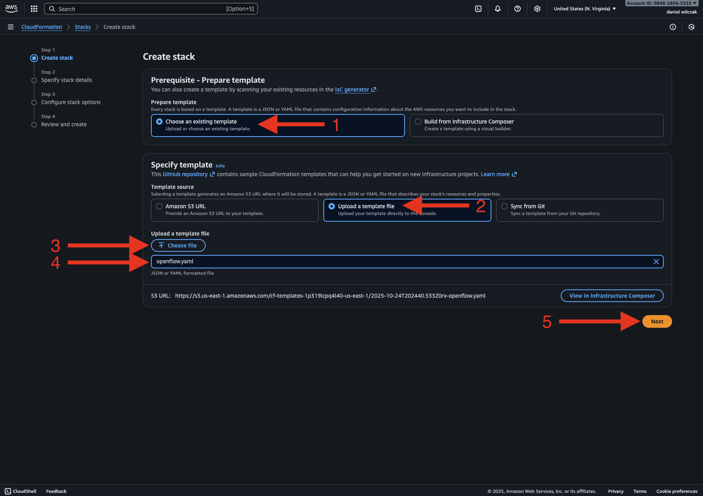

# Openflow - Hosted in AWS with Snowflake managed VPC
Goal of this tutorial is to setup openflow deployment in Snowflake container services. This will allow you to start adding runtimes that have connectors in them.

## Video
Video still in development

## Requirements 
- You can NOT be on a trial account. ([Link](https://docs.snowflake.com/en/developer-guide/snowpark-container-services/overview))
- Snowflake account has to be in an AWS region.([Link](https://docs.snowflake.com/en/developer-guide/snowpark-container-services/overview#available-regions))

## Opeflow
Navigate to openflow in the navbar.


??? warning "If you get the error 'Invalid consent request'"
    You will have to change your default role to a role that is not an admin role. Example default would be public.
    


Launch openflow and login.


### Deployment
Once logged in lets click "create deployment".


Click next.


Select AWS and click next.


This is where we will select Snowflake as the VPC deployment and click "create deployment".


This will allow us to download the cloudformation template to be used in AWS next.


## AWS
!!! warning
    Ensure your Snowflake region and AWS infrastructure are in the same region to avoid egress cost.

Lets get our deployment active by getting cloudformation to generate the necessary infrustructure.


### CloudFormation
Search cloudformation and click the icon.


Click "create stack".


Select existing template, select "upload a template file" and then upload the template we got from openflow. If you want to view what will be deployed then click "View in Infrastructure Composer" (1). Click next.
{ .annotate }

1. 



Give the stack a name and then scroll all the way down the longest page ever to the next button.


All the defaults are good here. Click the acklowledge and then next.


Scroll down anther long page and click submit.


This will kick off the creation process of all the resources. To see the process click "Resources".


Here we can watch the process.


### Network Policy (Optional)
??? warning "If you have a blocking network policy in place, please follow these steps"

    Lets copy the IP address so that we can copy it into our external access next.
    

    !!! Note
        Make sure you add the "/32" to the ip address.

    Lets create the network rule and external access in a worksheet(1) so that it will allow openflow/aws/snowflake to talk.
    { .annotate }

    1. 

    === ":octicons-image-16: Code"

        ```sql linenums="1"
        create or replace network rule openflow_network_rule
            mode = ingress
            type = IPV4
            value_list = (
                '<AWS IP ADDRESS>/32'
            );

        -- Change the existing policy.
        alter network policy <your_network_policy_name> allowed_network_rule_list = openflow_network_rule;
        ```

    === ":octicons-image-16: Example"

        ```sql linenums="1"
        create or replace network rule openflow_network_rule
            mode = ingress
            type = IPV4
            value_list = (
                '3.213.253.254/32'
            );

        -- Change the existing policy.
        alter network policy my_network_pollicy allowed_network_rule_list = openflow_network_rule;
        ```

    === ":octicons-sign-out-16: Result"

        Statement executed succesfully.

    Your network policy should be updated now to allow snowflake and aws to talk with eachother.

    
### Progress
??? Note "If you want to check on the progress"

    To check the deployment status, click on the EC2 instance.
    

    Right click the EC2 instance and click connect.
    

    Select "Connect using a private IP" and click Connect.
    

    Here we will enter the bash command below and see if we see the response "Should now work.".
    === ":octicons-image-16: Code"

        ```bash linenums="1"
        journalctl -u openflow-apply-infrastructure -f -n 10000 | grep "should now work"
        ```

    You'll see it should say, should now work but even not it still may take some time for Snowflake to update. 
    

### Waiting
Now we can go back to open flow and refresh our window or use the refresh button.


!!! warning
    It could take longer then the bash command leads to believe. I waited 40 minutes before it worked.


### Success
Now that your deployment is active we can move on to a runtime and add a connector. Please select one of the connector tutorials on the left.

