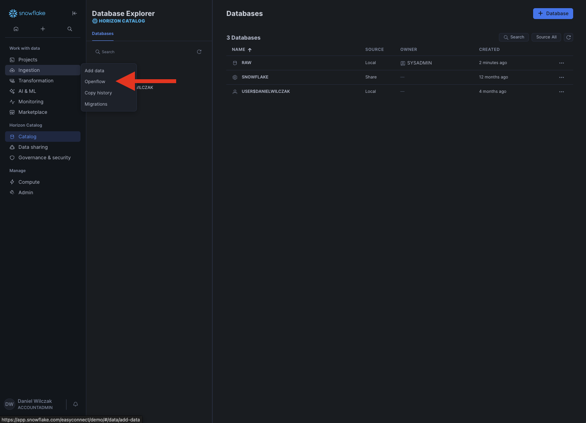
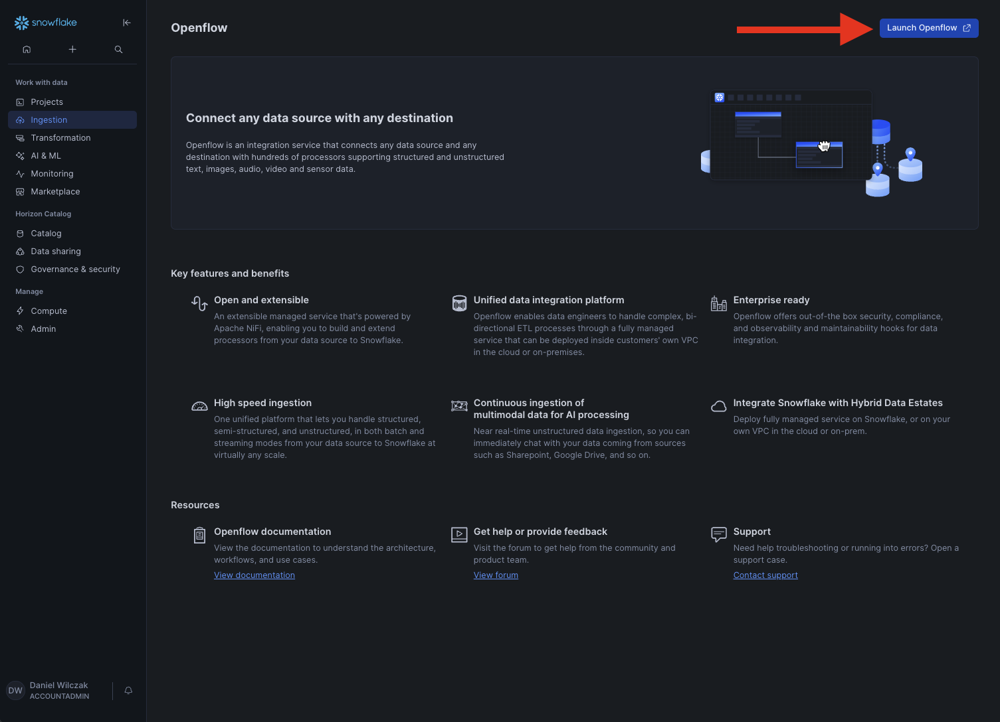
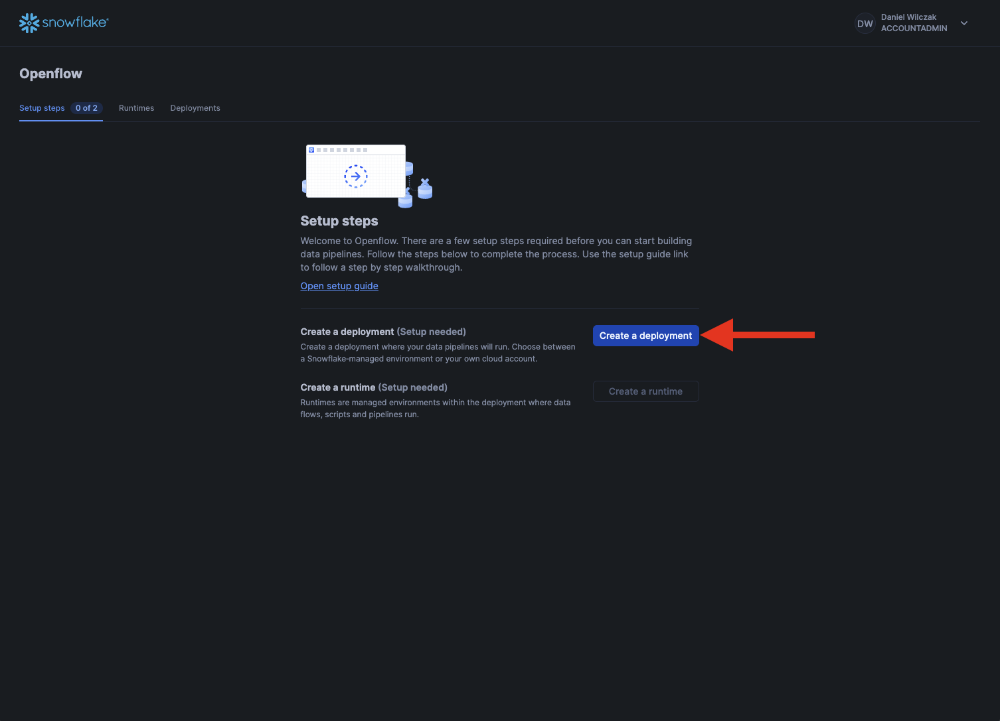
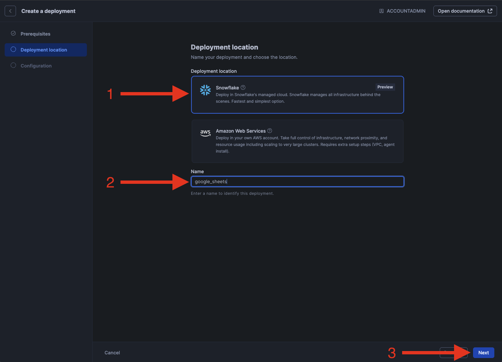
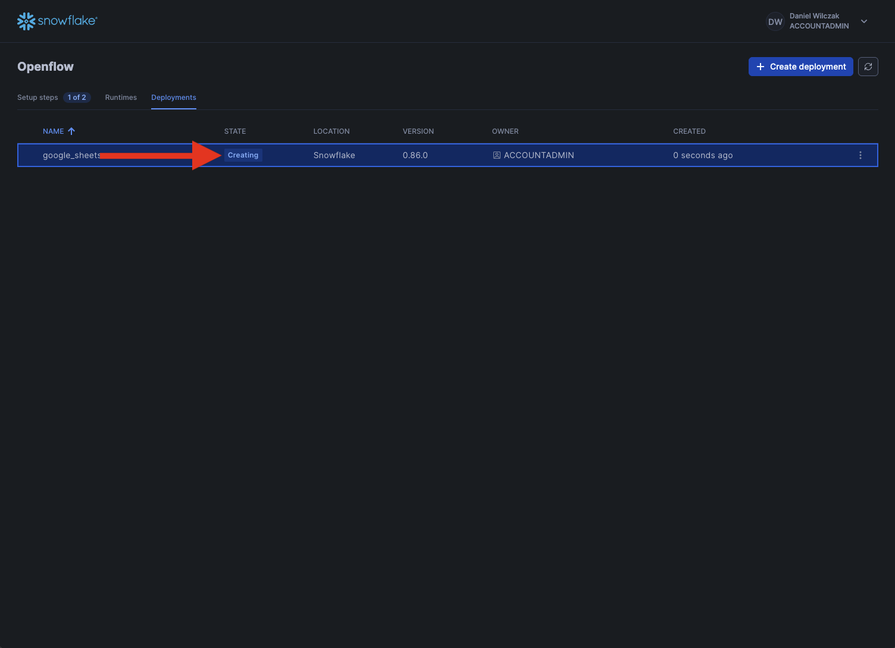
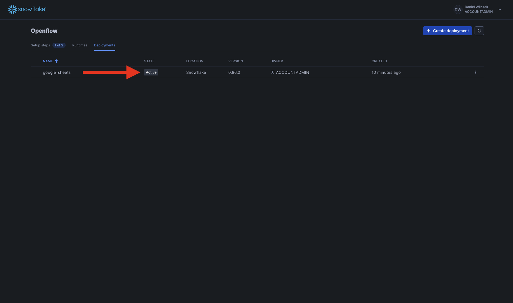

# Openflow - Hosted in SPCS
Goal of this tutorial is to setup openflow deployment in Snowflake container services. This will allow you to start adding runtimes that have connectors in them.

## Video
<iframe width="850px" height="478px" src="https://www.youtube.com/embed/eS4j6Oei1As?si=KsGOvn_8NL_7HkS-" title="YouTube video player" frameborder="0" allow="accelerometer; autoplay; clipboard-write; encrypted-media; gyroscope; picture-in-picture; web-share" referrerpolicy="strict-origin-when-cross-origin" allowfullscreen></iframe>

## Requirements 
- You can NOT be on a trial account. ([Link](https://docs.snowflake.com/en/developer-guide/snowpark-container-services/overview))
- Snowflake account has to be in an AWS region.([Link](https://docs.snowflake.com/en/developer-guide/snowpark-container-services/overview#available-regions))

## Openflow
Navigate to openflow in the navbar.

??? warning "If you get the error 'Invalid consent request'"
    You will have to change your default role to a role that is not an admin role. Example default would be public.
    

Launch openflow and login.

### Deployment
Once logged in lets click "create deployment".

Click next.

Now we'll want to select Snowflake as the deployment envirement. Give it a name and click next.

Click next.

Now your deployment will start creating. It will take between 5-15 minutes.

Now that your deployment is active we can move on to a runtime and add a connector. Please select one of the connector tutorials on the left.
