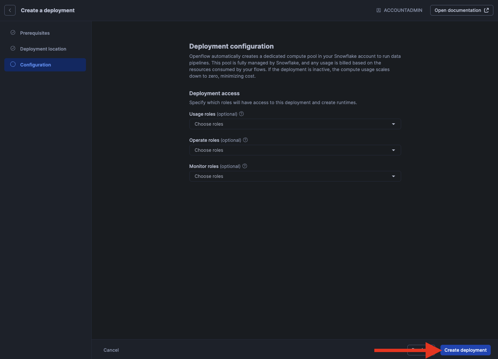

# Openflow - Hosted in SPCS
Goal of this tutorial is to setup openflow deployment in Snowflake container services. This will allow you to start adding runtimes that have connectors in them.

## Video
Video still in development

## Requirements 
- You can NOT be on a trial account. ([Link](https://docs.snowflake.com/en/developer-guide/snowpark-container-services/overview))
- Snowflake account has to be in an AWS region.([Link](https://docs.snowflake.com/en/developer-guide/snowpark-container-services/overview#available-regions))

## Snowflake
Lets start the snowflake setup by going into a worksheet (1) and creating the nesseray objects for openflow and the connector.
{ .annotate }

1. 

??? note "If you don't have a warehouse yet."

    === ":octicons-image-16: Warehouse"

        ```sql linenums="1"
        use role sysadmin;

        /*
            Warehouses are synonymous with the idea of compute
            resources in other systems. We will use this
            warehouse to query our integration and to load data.
        */
        create warehouse if not exists openflow 
            warehouse_size = xsmall
            auto_suspend = 30
            initially_suspended = true;
        ```


## Openflow
Now that we have the nessery objects lets create our deployment and runtime for openflow. Navigate to openflow in the navbar.


??? warning "If you get the error 'Invalid consent request'"
    You will have to change your default role to a role that is not an admin role. Example default would be public.
    


Launch openflow and login.


### Deployment
Once logged in lets click "create deployment".


Click next.


Now we'll want to select Snowflake as the deployment envirement. Give it a name and click next.


Click next.


Now your deployment will start creating. It will take between 5-15 minutes.


Now that your deployment is active we can move on to a runtime and add a connector. Please select one of the connector tutorials on the left.
