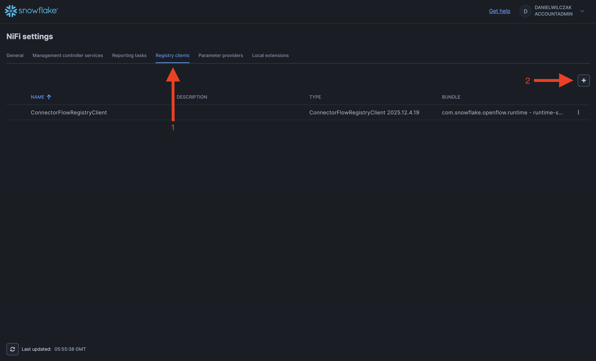
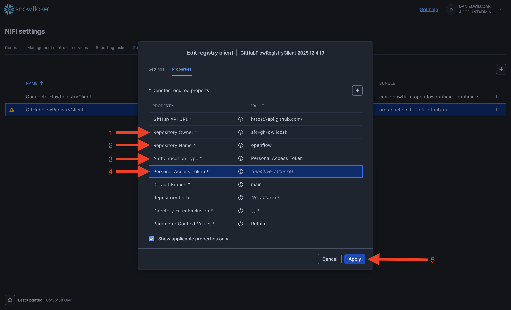
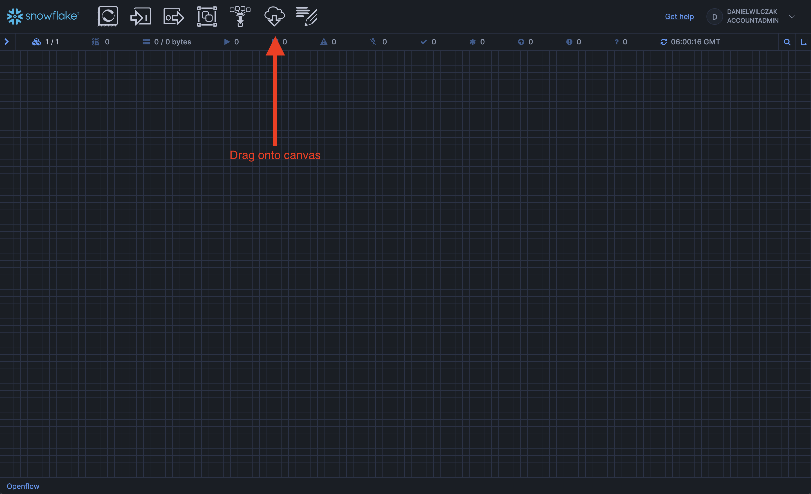

# Openflow Version Control - Github
Goal of this tutorial is to show how you can connect to a github repo and load connectors that can be version controlled.

## Video
Video still in Development

## Requirements 
- You can NOT be on a trial account. ([Link](https://docs.snowflake.com/en/developer-guide/snowpark-container-services/overview))
- Snowflake account has to be in an AWS region.([Link](https://docs.snowflake.com/en/developer-guide/snowpark-container-services/overview#available-regions))


## Github Access Token
We will need a persoanl access token to allow Openflow to work with our Git repository. First lets navigate to the token page.


Click on settings.


Next developer settings.


We'll be using a classic token.


Next we'll enter in a name, the experation of the token, and select "repo" for the scope of the permissions.


We'll copy our token, it will be used in a later Snowflake step.


## Snowflake
Lets head into snowflake and going into a workspace worksheet (1) and creating the nesseray objects for openflow and the github connection.
{ .annotate }

1. 

??? note "If you don't have a database, schema, or warehouse yet."

    === ":octicons-image-16: Database, schema and warehouse"

        ```sql linenums="1"
        -- Create a database to store our schemas.
        create database if not exists raw;

        -- Create the schema. The schema stores all objects.
        create schema if not exists raw.network;

        /*
            Warehouses are synonymous with the idea of compute
            resources in other systems. We will use this
            warehouse to query our integration and to load data.
        */
        create warehouse if not exists openflow 
            warehouse_size = xsmall
            auto_suspend = 30
            initially_suspended = true;
        ```

!!! warning "Only required if your hosting openflow in Snowflake (SPCS)"
    Lets create the network rule and external access that will allow openflow/snowflake to talk with our github repo.

    === ":octicons-image-16: Code"

        ```sql linenums="1"
        -- Create network rule for our Github account.
        create or replace network rule github_network_rule
            mode = egress
            type = host_port
            value_list = (
                'api.github.com'
            );

        -- Create one external access integration with all network rules.
        create or replace external access integration openflow_external_access
            allowed_network_rules = (github_network_rule)
            enabled = true;
        ```

    === ":octicons-sign-out-16: Result"

        Integration OPENFLOW_EXTERNAL_ACCESS successfully created.


## Openflow
Next we'll head into openflow to setup our runtime and add the connector.


??? warning "If you get the error 'Invalid consent request' or 'TOTP Invalid'"
    You will have to change your default role to a role that is not an admin role. Example default would be public.
    

Click "Launch openflow".


### Add the runtime
We'll create a new runtime.


We'll select our deployment, give the runtime a name, select our snowflake role and if deployed in Snowflake our external access intergration.


Now we'll wait 5-10 minutes for our runtime to become usable.


??? warning "If you get the error 'Invalid consent request' or 'TOTP Invalid'"
    You will have to change your default role to a role that is not an admin role. Example default would be public.
    

Once the runtime is "Active" we can click to go into it.


### Connect to Repository

First we'll head to controller settings.


The registry clients and we'll add a new one via the plus button.


We'll select github and click add.


Once added we'll click the three dots on the right and select edit.


We'll put in our github repository information as shown. I believe you can also put public repos as well.


Next we'll drag "import from repository" on to the canvas.


Now you'll be able to switch to the github registry and select your branch, bucket "aka folder to store into" and if you have a connector in there you'll be able to add it to the canvas. If not thats okay.


Now we can modify or add our process groups to our reposity by right clicking and using one of the options avaliable to us from git.
