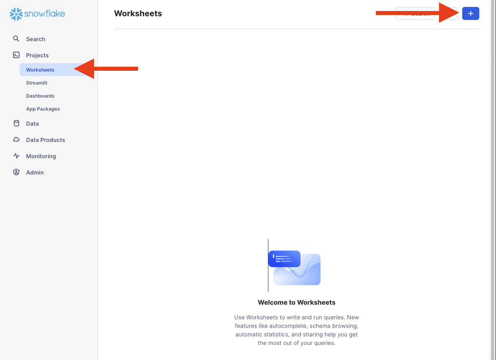
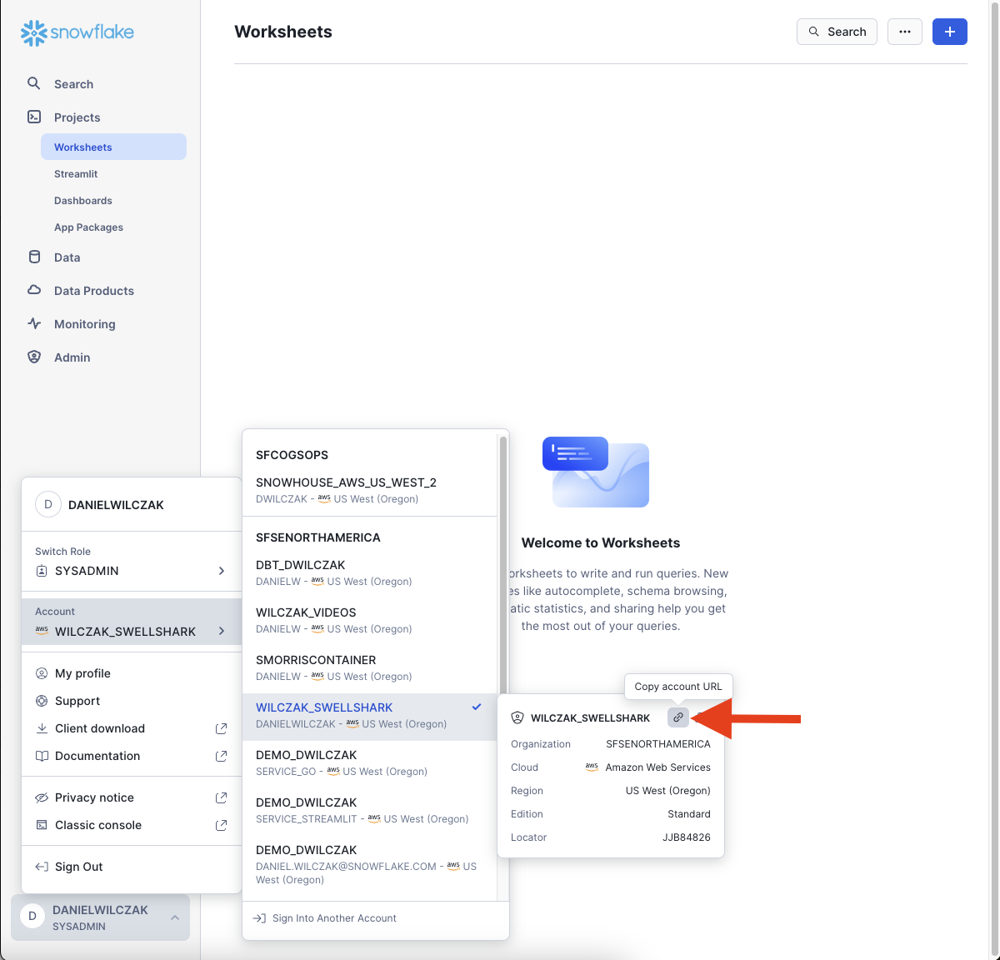
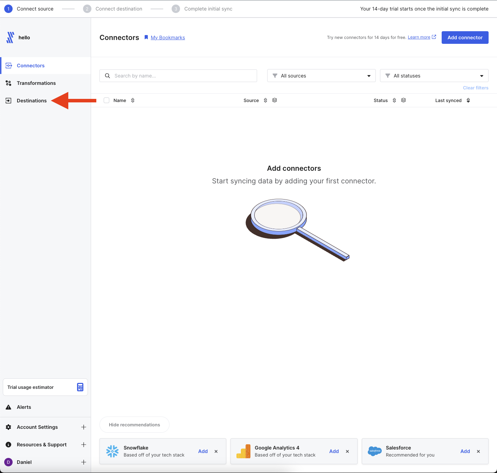
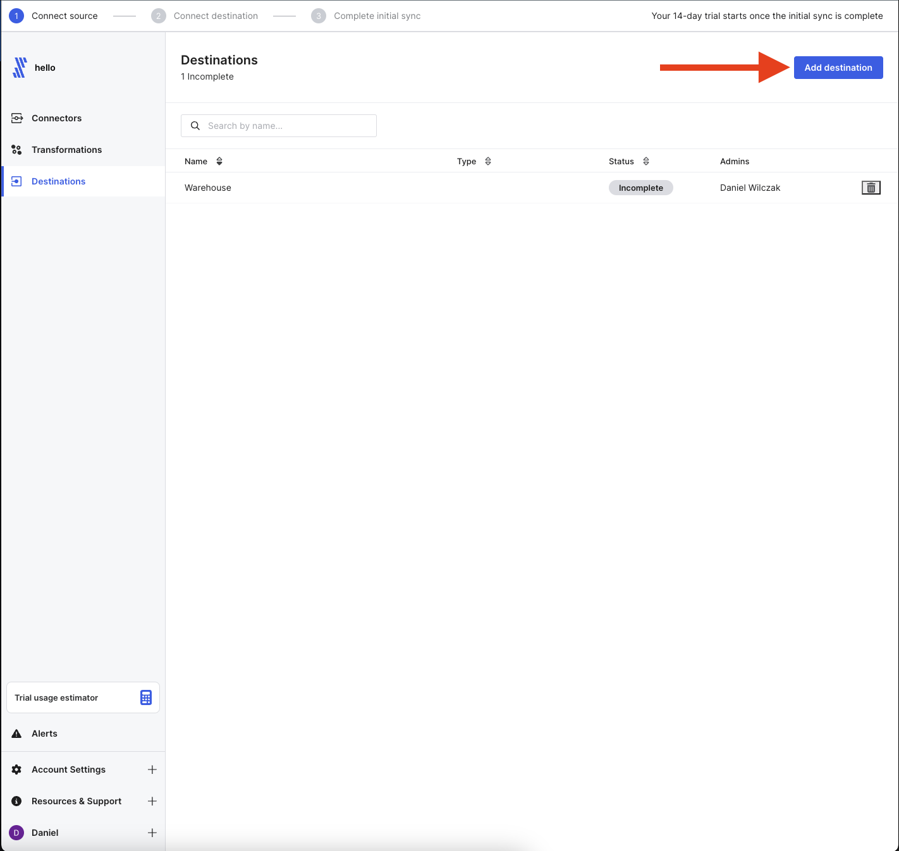
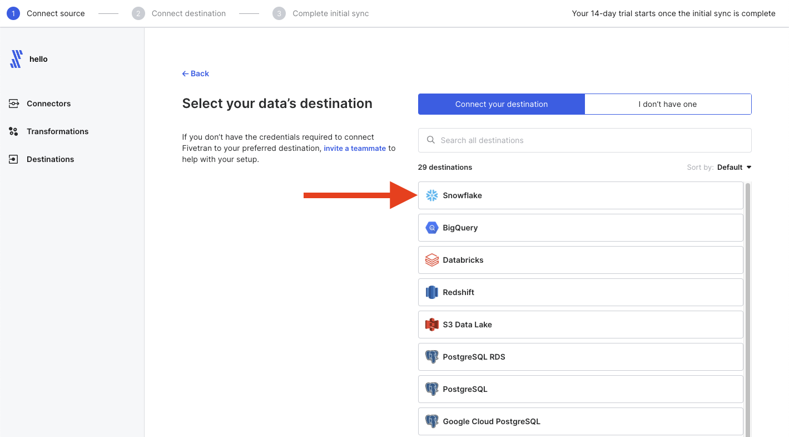
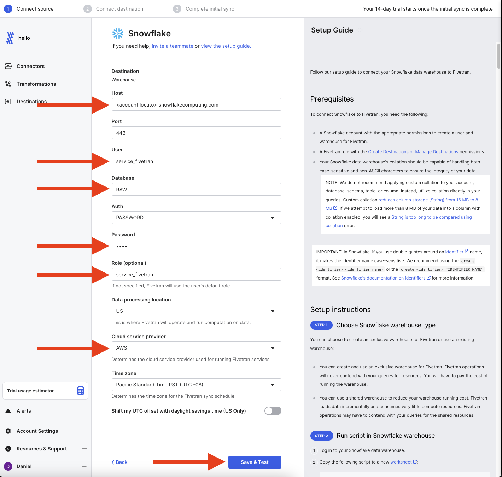

# Fivetran -> Snowflake Setup
In this tutorial we will show how to setup Snowflake as a destination for snowflake.

## Video
Video is still in developemnt.

## Requirement
You will need to have a fivetran account or [sign up for a free trial](https://fivetran.com/signup).

## Snowflake :octicons-feed-tag-16:
Lets start in Snowflake by opening a worksheet (1).
{ .annotate }

1. 

### Setup
Let's setup up the necessary resources to have fivetran function correctly. In this example we are going to create:

- Database: Raw
- User: service_fivetran
- Role: service_fivetran
- Warehouse (XS): service_fivetran

And finish it off by providring the necessary permission for fivetran. All we have to do is provide a password to the script.

=== ":octicons-image-16: Setup"

    ```sql linenums="1"
    begin;
        -- create variables for user / password / role / warehouse / database (needs to be uppercase for objects)
        set role_name = 'service_fivetran';
        set user_name = 'service_fivetran';
        set user_password = '...'; -- UPDATE PASSWORD
        set warehouse_name = 'service_fivetran';
        set database_name = 'RAW';

        -- change role to securityadmin for user / role steps
        use role securityadmin;

        -- create role for fivetran
        create role if not exists identifier($role_name);
        grant role identifier($role_name) to role SYSADMIN;

        -- create a user for fivetran
        create user if not exists identifier($user_name)
        password = $user_password
        default_role = $role_name
        default_warehouse = $warehouse_name;

        grant role identifier($role_name) to user identifier($user_name);

        -- set binary_input_format to BASE64
        ALTER USER identifier($user_name) SET BINARY_INPUT_FORMAT = 'BASE64';

        -- change role to sysadmin for warehouse / database steps
        use role sysadmin;

        -- create a warehouse for fivetran
        create warehouse if not exists identifier($warehouse_name)
        warehouse_size = xsmall
        warehouse_type = standard
        auto_suspend = 60
        auto_resume = true
        initially_suspended = true;

        -- create database for fivetran
        create database if not exists identifier($database_name);

        -- grant fivetran role access to warehouse
        grant USAGE
        on warehouse identifier($warehouse_name)
        to role identifier($role_name);

        -- grant fivetran access to database
        grant CREATE SCHEMA, MONITOR, USAGE
        on database identifier($database_name)
        to role identifier($role_name);

        -- change role to ACCOUNTADMIN for STORAGE INTEGRATION support (only needed for Snowflake on GCP)
        use role ACCOUNTADMIN;
        grant CREATE INTEGRATION on account to role identifier($role_name);
        use role sysadmin; 
        
    commit;
    ```
=== ":octicons-image-16: Result"

    ```sql linenums="1"
    UPDATE RESULT
    ```

### Account Locator
Before we move to setting up Fivetran we will want to copy our "account identifier url". This is a unique url to your account that will be used in the setup process of fivetran. The url is unique (1) to a few different type os snowflake account but the copy link feature should work for this tutorial.
{ .annotate }

1.  | URL type                 | URL format                                                         |
    |--------------------------|--------------------------------------------------------------------|
    | Regional                 | https://locator.region.snowflakecomputing.com                      |
    | Organization             | https://organization-name.snowflakecomputing.com                   |
    | Connection               | https://organization-connection.snowflakecomputing.com             |
    | Regional Privatelink     | https://locator.region.privatelink.snowflakecomputing.com          |
    | Organization Privatelink | https://organization-name.privatelink.snowflakecomputing.com       |
    | Connection Privatelink   | https://organization-connection.privatelink.snowflakecomputing.com |




## Fivetran :octicons-feed-tag-16:
Next we will setup Fivetran to have Snowflake as a destination.

### Setup
Lets start at the homepage once we have our free trial up and running. The first thing we'll want to click is destination on the left side tab.


In the top right click "Add Destination".


Next we'll want to select Snowflake as the destination of choice.


We will want to fill out all the sections marked with arrows using the information we got from the setup and our account locator we copied. We will not need the ``https://`` part to be added into fivetran.


### Testing
Finally we will click "Save and Test" and fivetran will test our connection.

ADD PHOTO HERE FOR TESTING.

### Troubleshooting
If you get an error with regard to your host, it is likely you incorrectly have your account locator. Here is some [documentation](https://docs.snowflake.com/en/user-guide/admin-account-identifier#non-vps-account-locator-formats-by-cloud-platform-and-regionr) regarding the account locator.