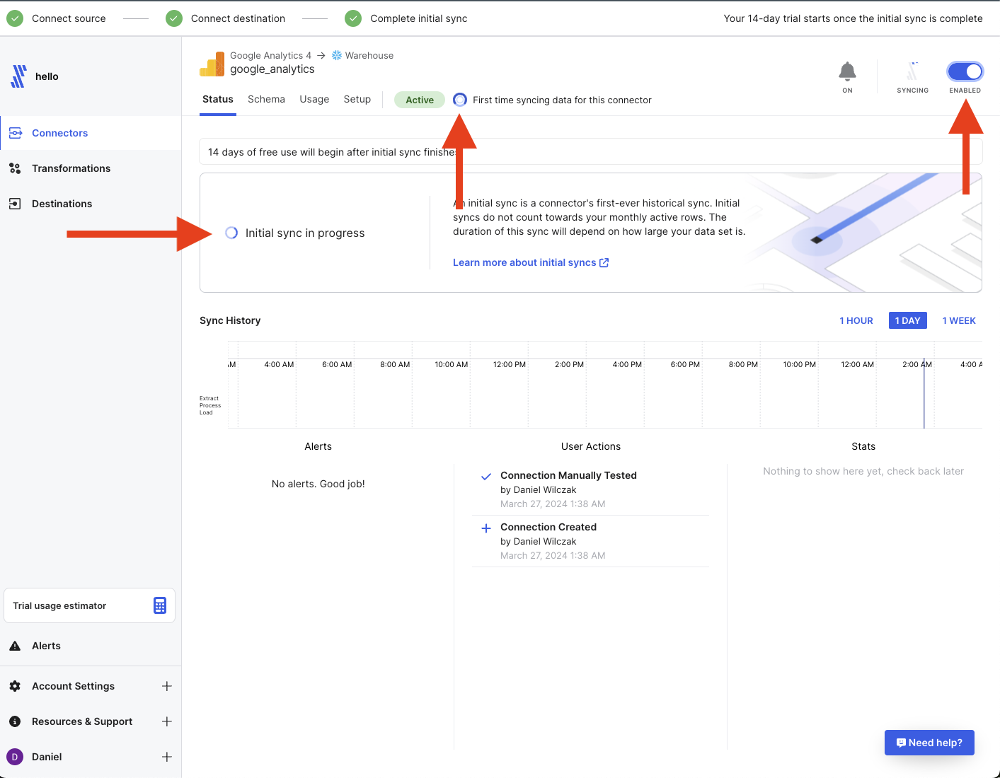

# Google Analytics -> Fivetran -> Snowflake
In this tutorial we will show how to push data from Google Analytics in Fivetran.

## Video
Video is still in developemnt.

## Requirements
1. You will need a Snowflake account which we can be setup as [trial](https://signup.snowflake.com/) if we don't have one today.
2. You will need to have a fivetran account or [sign up for a free trial](https://fivetran.com/signup).
3. You have [Snowflake as a destination](https://sfc-gh-dwilczak.github.io/tutorials/fivetran/setup/setup/).
4. You have a already working [Google Analytics](https://developers.google.com/analytics/) account. 

## Fivetran :octicons-feed-tag-16:
We will setup fivetran so to have Google Analytics data moved to Snowflake. In this example we will be moving this tutorial websites Google Analytics data.

### Setup
Lets start by adding a connector.


We will make sure that our Snowflake destination is selected and select google analytics 4 as our connector.


We will name the schema that the data will go into. I like to keep it simple and just call it ``google_analytics``.


Next we will want to authorize fivetran to connect to our google analytics account. This will have to be an admin of the account.


Click allow.


Select how much history data you will like to load in on the initial sync and if you want to specify a specific account. The initial sync is free so I would take advantage of this.


Lets test the conection and see it's successful.


Fivetran initially setups up the connector as disabled. We will want to enable it to start the process.


Once it starts you will see it's currently in the process of finishing. Once it's finished it will also send you an email.


Finally we are finished on the FIvetran side, lets move to Snowflake and see our data.


## Snowflake
Lets see the data we loaded

### View the data.
To view the data we will simply go in the data page and click our database,schema which we saved as google analytics and we can see the tables that have been loaded for us.


### Query the data.
Lets query our new data. In this example we will see how many users we have had in the last 30 days.

=== ":octicons-image-16: Query"

    ```sql linenums="1"
    select
        sum(total_users) as total_unique_users
    from
        events_report
    where
        date >= '2024-02-25';
    ```

=== ":octicons-image-16: Result"

    | TOTAL_UNIQUE_USERS |
    |--------------------|
    | 341                |

### Dashboard
Lets take the data we have an make a really quick dashboard that will tell us unique users per month. Lets start by creating a new streamlit dashboard.


Lets point it at our new data and give it a name.


Lets remove the code that is already there and paste the code below. We will have to add the pandas package but this is straight forward using the packages button on the top bar. (1)
{ .annotate }

1. 

=== ":octicons-image-16: Setup"

    ```python linenums="1"
    import streamlit as st
    from snowflake.snowpark.context import get_active_session
    import pandas as pd

    # Set the title of the app
    st.title("Monthly Total Unique Users :bar_chart:")

    # Use the active session for Snowflake
    session = get_active_session()

    # Define the SQL query to fetch monthly total unique users
    query = """
    SELECT
        TO_CHAR(DATE_TRUNC('month', DATE), 'YYYY-MM') AS month,
        SUM(total_users) AS total_unique_users
    FROM
        events_report
    GROUP BY
        TO_CHAR(DATE_TRUNC('month', DATE), 'YYYY-MM')
    ORDER BY
        month ASC
    """

    # Execute the query and convert to a pandas DataFrame
    def fetch_data(query):
        result = session.sql(query)
        df = result.to_pandas()
        return df

    # Fetching the data
    df_total_users = fetch_data(query)

    # Check if the DataFrame is not empty
    if not df_total_users.empty:
        # Plotting the data
        st.write("### Monthly Total Unique Users", df_total_users)
        st.line_chart(data=df_total_users, x='MONTH', y='TOTAL_UNIQUE_USERS')
    else:
        st.write("No data available.")
    ```

Here is the results for the tutorial website your currently reading.
