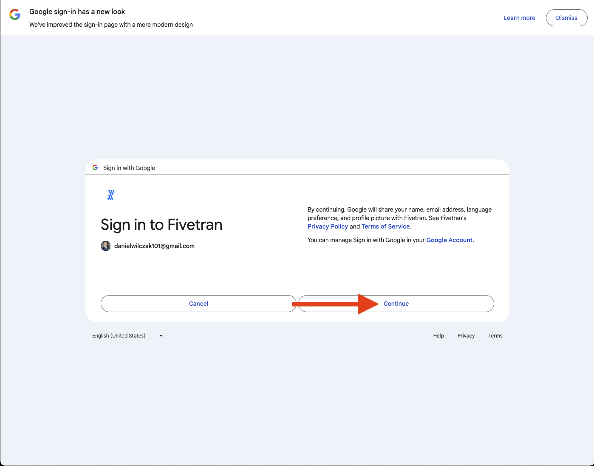
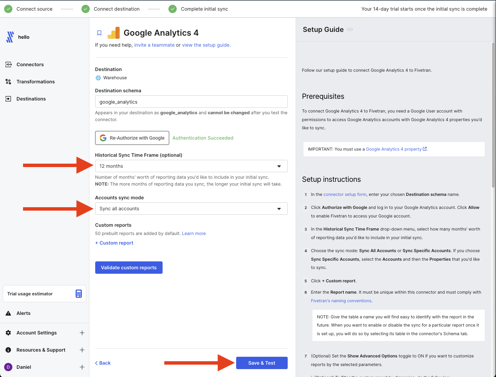

# Google Analytics -> Fivetran -> Snowflake
In this tutorial we will show how to push data from Google Analytics to Snowflake.

## Video
Video is still in developemnt.

## Requirements
1. You will need to have a fivetran account or [sign up for a free trial](https://fivetran.com/signup).
2. You have [Snowflake as a destination](https://sfc-gh-dwilczak.github.io/tutorials/fivetran/setup/setup/).
3. You have a already working [Google Analytics](https://developers.google.com/analytics/) account. 

## Fivetran :octicons-feed-tag-16:
We will setup fivetran so to have Google Analytics data moved to Snowflake. In this example we will be moving this tutorial websites Google Analytics data.

### Setup
Lets start by adding a connector.

We will make sure that our Snowflake destination is selected and select google analytics 4 as our connector.

We will name the schema that the data will go into. I like to keep it simple and just call it ``google_analytics``.

Next we will want to authorize fivetran to connect to our google analytics account. This will have to be an admin of the account.

Click allow.

Select how much history data you will like to load in on the initial sync and if you want to specify a specific account. The initial sync is free so I would take advantage of this.

Lets test the conection and see it's successful.

Fivetran initially setups up the connector as disabled. We will want to enable it to start the process.

Once it starts you will see it's currently in the process of finishing. Once it's finished it will also send you an email.

Finally we are finished on the FIvetran side, lets move to Snowflake and see our data.

## Snowflake
Lets see the data we loaded

### View the data.
To view the data we will simply go in the data page and click our database,schema which we saved as google analytics and we can see the tables that have been loaded for us.

### Query the data.
WRITE A SAMPLE QUERY

### Dashboard
CREATE A STREAMLIT DASHBOARD FROM THE DATA.