# Openflow - RDS Postgres
Goal of this tutorial is to load data from a RDS Postgres into Snowflake via openflow. This tutorial will not cover how to setup a deployment in [Snowflake](https://sfc-gh-dwilczak.github.io/tutorials/ingestion/deployments/snowflake/) or [AWS](https://sfc-gh-dwilczak.github.io/tutorials/ingestion/deployments/aws).

## Video
<iframe width="850px" height="478px" src="https://www.youtube.com/embed/ogiyCjpgNng?si=50umN4we13I1-V1h" title="YouTube video player" frameborder="0" allow="accelerometer; autoplay; clipboard-write; encrypted-media; gyroscope; picture-in-picture; web-share" referrerpolicy="strict-origin-when-cross-origin" allowfullscreen></iframe>

## Requirements 
- You can NOT be on a trial account. ([Link](https://docs.snowflake.com/en/developer-guide/snowpark-container-services/overview))
- Snowflake account has to be in an AWS region.([Link](https://docs.snowflake.com/en/developer-guide/snowpark-container-services/overview#available-regions))
- AWS account, you can setup a [free account](https://aws.amazon.com/free/) to get started.

## AWS
??? note "If you don't have a postgres RDS database, follow here."

    Search for RDS and select.
    

    Click "DB instances".
    

    Click "Create database".
    

    We'll select postgres for the database, select a version "I tested with 17", and free tier if your just learning.
    

    Select single instance since this is for learning, give your database a name, username and password.
    

    If your using SPCS to deploy your openflow, this will need to be public so that Snowflake can reach across the internet to connect to the database.
    

    Click create database.
    

    Next we'll select our database to change it's network configuration.
    

    Click it's security group.
    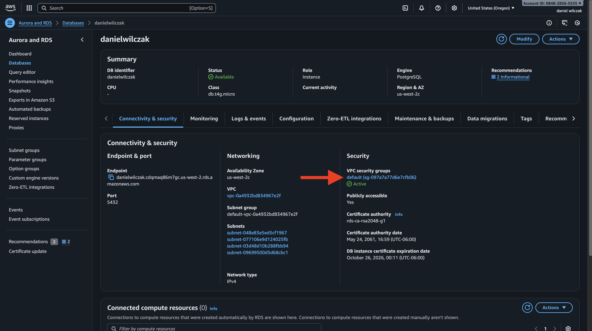

    select the security group by clicking the check box and then going to inbound traffic and edit inbound rules.
    
    
    Now we'll allow all traffic to access the postgres instance. We do this because pgadmin will have to connect and if your using SPCS deployment, Snowflake does not have static i.p's YET.
    

    Now we'll do the same thing as before but for outbound traffic.
    

    Select all traffic and click "Save Rules". Your done with your postgres RDS setup.
    


Lets start in AWS where we'll need to copy our RDS data base URL, port and configure the database paramaters to allow for replication. Lets start by searching for RDS.


Click "DB instances".


Select your database.
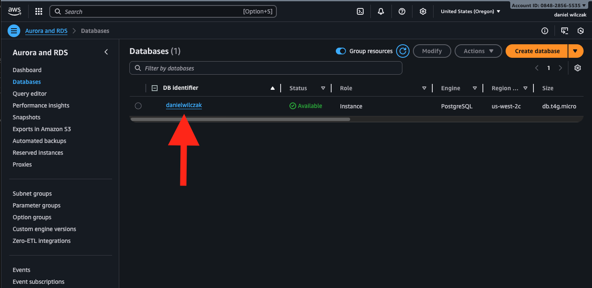

Copy your endpoint and port.
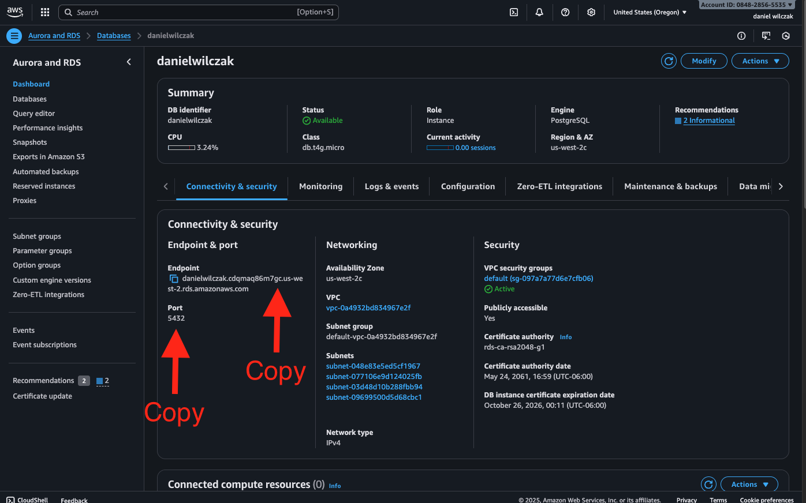

Next click paramater group.


Click create paramater group.


Give your paramater group a name, description, select postgres engine type, select your postgres version, and select DB paramter group. Click Create.


Select your paramater group.


Click edit.


Search "rds.logical_replication" and enter the value to be "1". Click save changes.
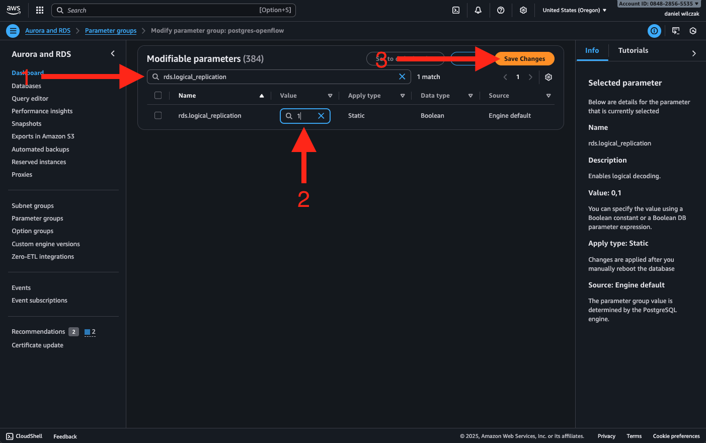

Next search "wal_sender_timeout" set this value to "0". Click save changes.


Next we'll head back to our database and click modify.
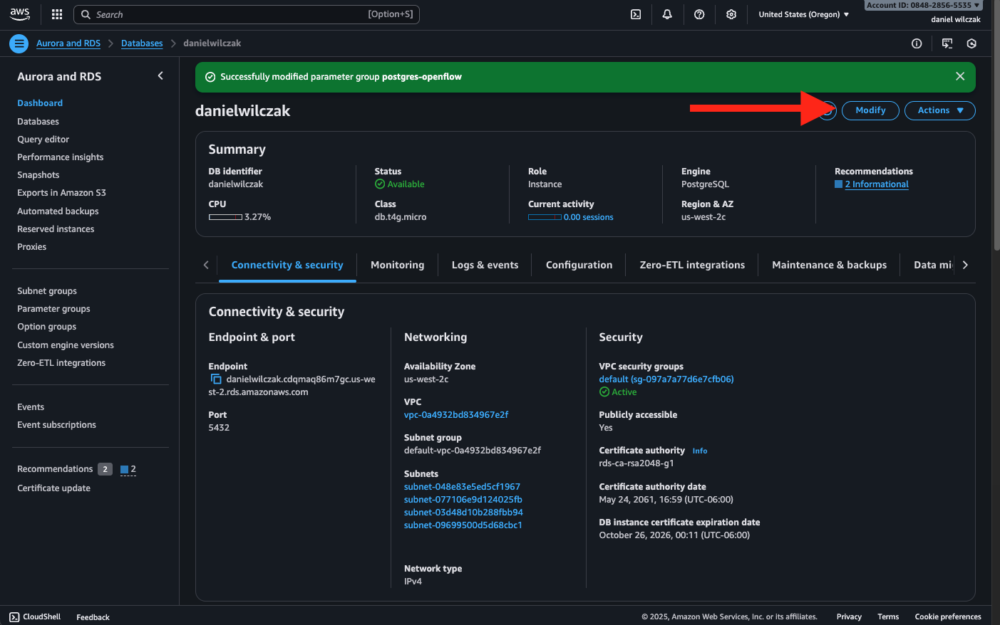

Head down to "Additional configurations" and add your parameter group.


Click continue.


Apply immediately if you do not mind a short amount of downtime. 


You will see the database begin to modify the configuration and then go back to active state.


## PGAdmin
Lets stat by [downloading PgAdmin](https://www.pgadmin.org/download/). After that we'll connect add sample data and configure a "publication" and a "replication slot".

### Example Data
Once installed we'll right click servers, hover over "Register" and click "Server".
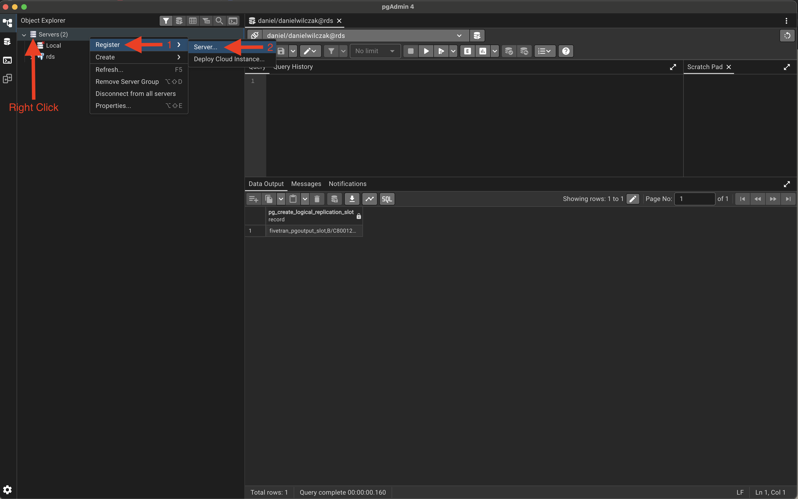

Next we'll click connection and put in our host, port, username and password. Click Save.


Next we'll want to add our sample data, first we'll open a query window.


Next add the code to first create the objects and then enter data into them.

=== ":octicons-image-16: Schmea and Tables"

    ```sql linenums="1"
    -- 1. Create the schema
    CREATE SCHEMA IF NOT EXISTS replicate;

    -- 2. Create the users table
    CREATE TABLE replicate.users (
        user_id SERIAL PRIMARY KEY,
        username VARCHAR(50) UNIQUE NOT NULL,
        email VARCHAR(100) UNIQUE NOT NULL,
        created_at TIMESTAMP WITH TIME ZONE DEFAULT CURRENT_TIMESTAMP
    );

    -- 3. Create the products table
    CREATE TABLE replicate.products (
        product_id SERIAL PRIMARY KEY,
        name VARCHAR(100) NOT NULL,
        price NUMERIC(10, 2) NOT NULL CHECK (price >= 0),
        stock_quantity INTEGER NOT NULL CHECK (stock_quantity >= 0)
    );

    -- 4. Create the orders table
    CREATE TABLE replicate.orders (
        order_id SERIAL PRIMARY KEY,
        user_id INTEGER REFERENCES replicate.users(user_id) NOT NULL,
        order_date TIMESTAMP WITH TIME ZONE DEFAULT CURRENT_TIMESTAMP,
        total_amount NUMERIC(10, 2) NOT NULL CHECK (total_amount >= 0)
    );
    ```

=== ":octicons-image-16: Insert Data"

    ```sql linenums="1"
    -- 1. Insert data into the users table
    INSERT INTO replicate.users (username, email) VALUES
    ('alice_k', 'alice.k@example.com'),
    ('bob_s', 'bob.s@example.com'),
    ('charlie_m', 'charlie.m@example.com');


    -- 2. Insert data into the products table
    INSERT INTO replicate.products (name, price, stock_quantity) VALUES
    ('Laptop Pro', 1200.00, 15),
    ('Wireless Mouse', 25.50, 200),
    ('Mechanical Keyboard', 99.99, 50),
    ('Webcam HD', 45.00, 120);


    -- 3. Insert data into the orders table
    -- Assuming user_id 1 is 'alice_k' and user_id 2 is 'bob_s'
    INSERT INTO replicate.orders (user_id, total_amount) VALUES
    (1, 1225.50), -- Order by alice_k
    (1, 99.99),   -- Order by alice_k
    (2, 45.00);   -- Order by bob_s
    ```


### Pub / Replication Slot
Next we'll create a publication and replication slot by entering the code below, you can also edit it to be only for certian tables.

=== ":octicons-image-16: Code"

    ```sql linenums="1"
    -- Choose either to include all the tables in the publication or just a few.
    create publication openflow_pub for all tables;

    -- Check all tables are in the publication.
    select * from pg_publication_tables;

    -- Create the replication group
    select pg_create_logical_replication_slot('openflow_pgoutput_slot', 'pgoutput');
    ```


## Snowflake
Lets start the snowflake setup by going into a worksheet (1) and creating the nesseray objects for openflow and the connector.
{ .annotate }

1. 

??? note "If you don't have a database, schema or warehouse yet."

    === ":octicons-image-16: Database, schema and warehouse"

        ```sql linenums="1"
        use role sysadmin;

        -- Create a database to store our schemas.
        create database if not exists raw;

        -- Create the schema. The schema stores all objects.
        create schema if not exists raw.network;

        /*
            Warehouses are synonymous with the idea of compute
            resources in other systems. We will use this
            warehouse to query our integration and to load data.
        */
        create warehouse if not exists openflow 
            warehouse_size = xsmall
            auto_suspend = 30
            initially_suspended = true;
        ```


!!! warning "Only required if your hosting openflow in [Snowflake (SPCS)](https://sfc-gh-dwilczak.github.io/tutorials/ingestion/deployments/spcs/)"

    Lets create the network rule and external access that will allow openflow/snowflake to talk with google sheets.

    === ":octicons-image-16: Code"

        ```sql linenums="1"
        -- create network rule for google apis
        create or replace network rule postgres_network_rule
            mode = egress
            type = host_port
            value_list = (
                '<YOUR AMAZON RDS URL HERE>:5432'
            );

        -- Create one external access integration with all network rules.
        create or replace external access integration openflow_external_access
            allowed_network_rules = (postgres_network_rule)
            enabled = true;
        ```
    
    === ":octicons-image-16: Example"

        ```sql linenums="1"
        -- create network rule for google apis
        create or replace network rule postgres_network_rule
            mode = egress
            type = host_port
            value_list = (
                'danielwilczak.cdqmaq86m7gc.us-west-2.rds.amazonaws.com:5432'
            );

        -- Create one external access integration with all network rules.
        create or replace external access integration openflow_external_access
            allowed_network_rules = (postgres_network_rule)
            enabled = true;
        ```

    === ":octicons-sign-out-16: Result"

        Statement executed successfully.


Now that we have our objects lets add the postgres connector to our deployment. Navigate to openflow in the navbar.


??? warning "If you get the error 'Invalid consent request' or 'TOTP Invalid'"
    You will have to change your default role to a role that is not an admin role. Example default would be public.
    

Launch openflow and login.


From there we can switch to the deployment where we can see our deployment and that it's active. If you don't have a deployment use either [SPCS](https://sfc-gh-dwilczak.github.io/tutorials/ingestion/deployments/spcs/) or [AWS](https://sfc-gh-dwilczak.github.io/tutorials/ingestion/deployments/aws_snowflake_vpc/) to deploy your Opeflow instance.


Next we'll head to runtime and click " + Create Runtime".


!!! note
    External access will only show up if your on a [SPCS deployment](https://sfc-gh-dwilczak.github.io/tutorials/ingestion/deployments/spcs/).

We'll then select our runtime, give it a name, select accountadmin as the role and if your on [SPCS](https://sfc-gh-dwilczak.github.io/tutorials/ingestion/deployments/spcs/) your external access integration.


Once your runtime is active and ready to go. We can head to overview and add the connector.


Lets search postgres and click install.


We'll select our runtime and click add.


Next head to runtime and select your runtime if not already in it.


Once in we'll want to right click the process group and select paramaters.


### Paramaters
Now that we are in paramaters we can break it into 3 sections those being destination, Ingestion and Source.

#### Destination
Lets click the three dots of our destination and click edit.
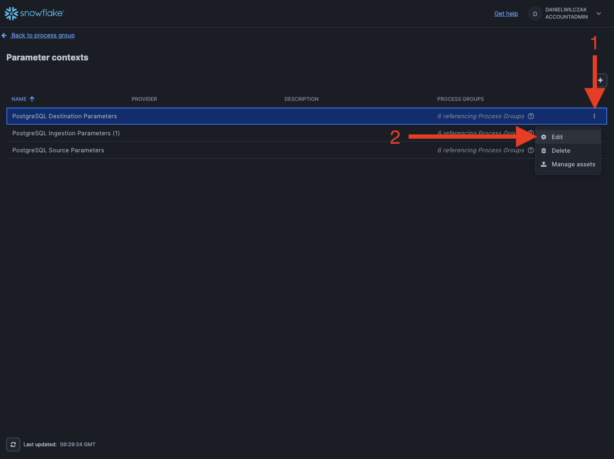

Now we can select either note option below based on our deployment.

??? note "If your using SPCS deployment"

    As an example we'll click the three dots and click edit. We'll put the database, schema, role and warehouse.
    

    One special paramter is the "Snowflake Authentication Strategy" with container service you can put in "SNOWFLAKE_SESSION_TOKEN" and it will not require a key_pair.
    

    This is an example input if you used the configurations given at the beginning of the tutorial.
    


??? note "If your using AWS deployemnt"

    These are the paramaters you'll need to be filled out. We will see how to get them below.
    

    To get the Snowflake Account Identifier, you'll go to the bottom left of the homepage and click account details.
    

    You'll copy your account identifier and paste it in openflow.
    

    Next to get your key we'll have to generate a public and private key and apply it to our user. To generate the key run this bash script.
    
    === ":octicons-image-16: Code"

        ```bash linenums="1"
        openssl genrsa 2048 > rsa_key_pkcs1.pem
        openssl pkcs8 -topk8 -inform PEM -in rsa_key_pkcs1.pem -out rsa_key.p8 -nocrypt
        openssl rsa -in rsa_key_pkcs1.pem -pubout -out rsa_key.pub
        ```

    === ":octicons-sign-out-16: Result"

        ```
        rsa_key_pkcs1.pem
        rsa_key.p8
        rsa_key.pub
        ```
    
    This will generate three file. We will apply the content of the .pub file to our Snowflake user using the alter user command.
    === ":octicons-image-16: Code"

        ```sql linenums="1"
        alter user danielwilczak set rsa_public_key='PUBLIC KEY';
        ```

    === ":octicons-image-16: Example"

        ```sql linenums="1"
        alter user danielwilczak set rsa_public_key='MIIBIjANBgkqhki...6VIhVnTviwDXXcm558uMrJQIDAQAB';
        ```

    === ":octicons-sign-out-16: Result"

        Statement executed successfully.

    Now that we have our public key on our user we'll move to uploading the .pem file to openflow.
    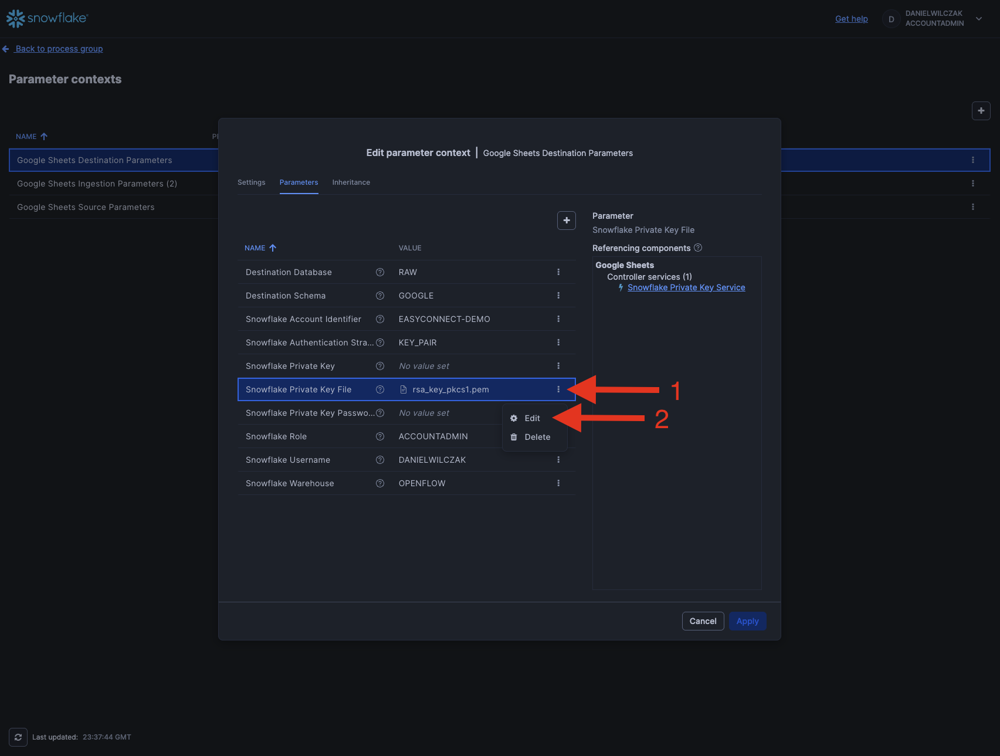

    Click the upload button.
    

    Click the upload button again and select your .pem file.
    

    Once uploaded select the key and click "ok". Then fill out the remaing fields and click apply.
    


#### Ingestion
For this section it's all about selecting what data you want and how often you want the warehouse to merge the changes into the final table. In my case I'll use the regex expression ``replicate\..*`` to grab all tables from the replicate schema. It's a comma seperated list if you want multiple tables or multuple schemas.


#### Source
Next we'll head to the final paramater source. We'll first edit the connection URL.
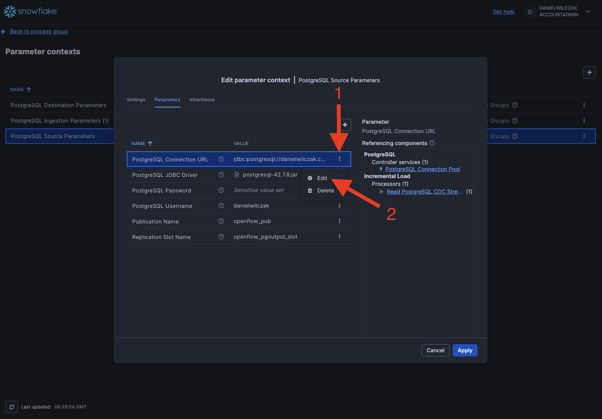

The format here is as shown below:

=== ":octicons-image-16: Code"

    ```txt linenums="1"
    jdbc:postgresql://<DATABASE URL>:5432/<Database Name>
    ```

=== ":octicons-image-16: Example"

    ```txt linenums="1"
    jdbc:postgresql://danielwilczak.cdqmaq86m7gc.us-west-2.rds.amazonaws.com:5432/daniel
    ```

Next we'll want to [download the JDBC Driver](https://jdbc.postgresql.org/download/) for our database. I used the Java 8 version.


We'll head back to openflow and upload our driver.


Click upload again in the next window.


Once uploaded you can select your driver and click "ok".


Finally you'll put in your postgres password, username, publication name, and replication slot name. Click Apply.
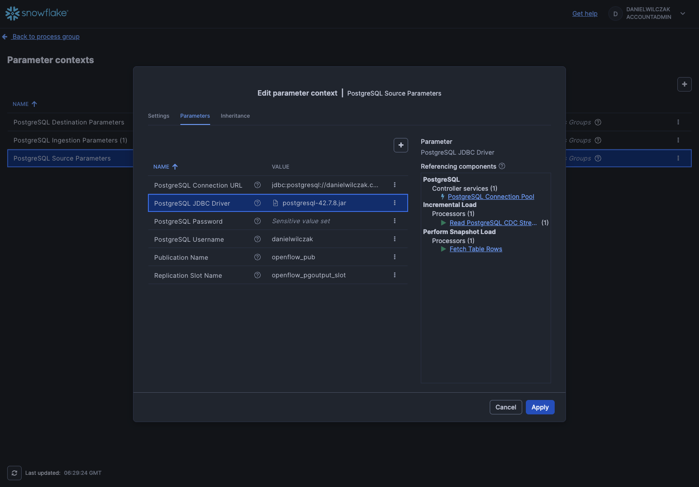

## Run
Finally we can run our connector. Head back to the process group.


Right click the process group again and click "Enable all controller services" and click start.
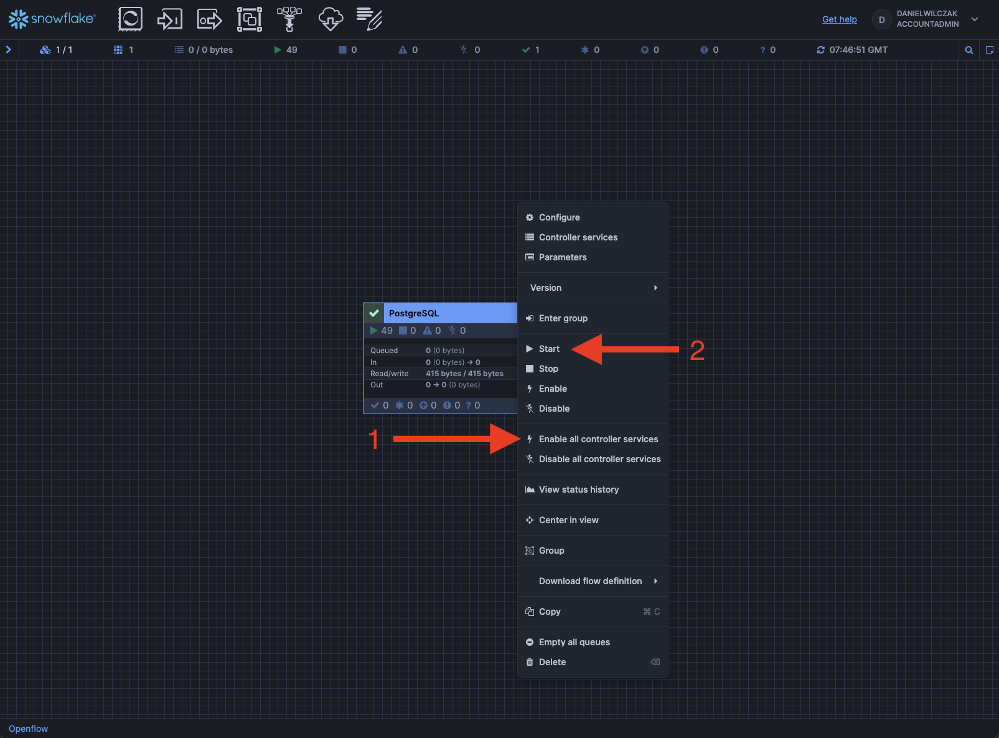

Now if you don't get any errors you can go back to Snowflake and find your shema with your tables loaded.

