# Science - Cortex Analyst
In this tutorial we will go through an introduction to setting up cortex analyst. We'll show two ways to deploy it via streamlit in Snowflake and Flask.

## Video
Video still in development.

## Requirements
- Snowflake account, you can use a [free trial](https://signup.snowflake.com/). We also assume no complex security needs.

## Download  :octicons-feed-tag-16:
- Sales Semantic Layer ([Link](https://sfc-gh-dwilczak.github.io/tutorials/science/analyst/files/sales.yaml))

## Setup  :octicons-feed-tag-16:
Lets create some example data first the our chatbot (Cortex Analyst) can use later on.

??? note "If you don't have a database, schema or warehouse yet."

    === ":octicons-image-16: Database, schema and warehouse"

        ```sql linenums="1"
        use role sysadmin;
        
        -- Create a database to store our schemas.
        create database if not exists raw;

        -- Create the schema. The schema stores all our objectss.
        create schema if not exists raw.cortex;

        /*
            Warehouses are synonymous with the idea of compute
            resources in other systems. We will use this
            warehouse to call our user defined function.
        */
        create warehouse if not exists development 
            warehouse_size = xsmall
            auto_suspend = 30
            initially_suspended = true;

        create warehouse if not exists development 
            warehouse_size = xsmall
            auto_suspend = 30
            initially_suspended = true;

        -- We'll use this stage "folder" to store our semantic layer.
        create stage files directory = ( ENABLE = true );

        use database raw;
        use schema cortex;
        use warehouse development;
        ```


=== ":octicons-image-16: Tables"

    ```sql linenums="1"  

    -- Product Table
    create or replace table product (
        product_id string primary key,
        product_name string,
        category string,
        brand string
    );

    -- customer table
    create or replace table customer (
        customer_id string primary key,
        customer_name string,
        region string
    );

    -- sales table (denormalized)
    create or replace table sales (
        sale_id string primary key,
        sale_date date,
        day_of_week string,
        store_name string,
        city string,
        region string,
        product_id string,
        customer_id string,
        quantity_sold int,
        revenue float
    );

    ```

=== ":octicons-sign-out-16: Result"

    | status                            |
    |-----------------------------------|
    | Table SALES successfully created. |


Lets now insert some data to those tables.

=== ":octicons-image-16: Insert"

    ```sql linenums="1"  
    -- insert into product
    insert into product (product_id, product_name, category, brand) values
    ('p001', 'smartphone x', 'electronics', 'branda'),
    ('p002', 'laptop pro', 'electronics', 'brandb'),
    ('p003', 'wireless earbuds', 'accessories', 'branda');

    -- insert into customer
    insert into customer (customer_id, customer_name, region) values
    ('c001', 'alice johnson', 'north'),
    ('c002', 'bob smith', 'south'),
    ('c003', 'carol lee', 'east');

    -- insert into sales
    insert into sales (sale_id, sale_date, day_of_week, store_name, city, region, product_id, customer_id, quantity_sold, revenue) values
    ('s0001', '2023-04-01', 'saturday', 'downtown store', 'new york', 'east', 'p001', 'c001', 2, 1200.00),
    ('s0002', '2023-04-02', 'sunday', 'uptown store', 'chicago', 'midwest', 'p002', 'c002', 1, 1500.00),
    ('s0003', '2023-04-03', 'monday', 'suburban store', 'los angeles', 'west', 'p003', 'c003', 3, 300.00);
    ```

=== ":octicons-sign-out-16: Result"

    | number of rows inserted |
    |-------------------------|
    | 3                       |

## Building Cortex Analyst :octicons-feed-tag-16:
Now that we have our data loaded into our tables lets build the semantic layer and play with it in the Cortex Analyst playground.

To start lets upload our [example semantic layer](https://sfc-gh-dwilczak.github.io/tutorials/science/analyst/files/sales.yaml) to our stage. We can do that by clicking "+ Files".
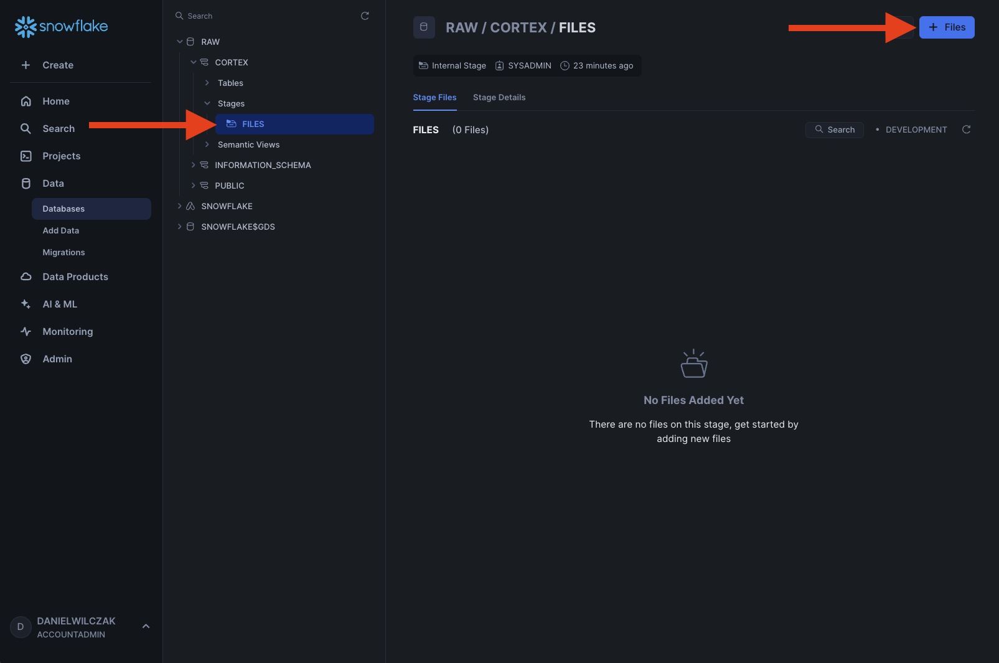

Click browse.
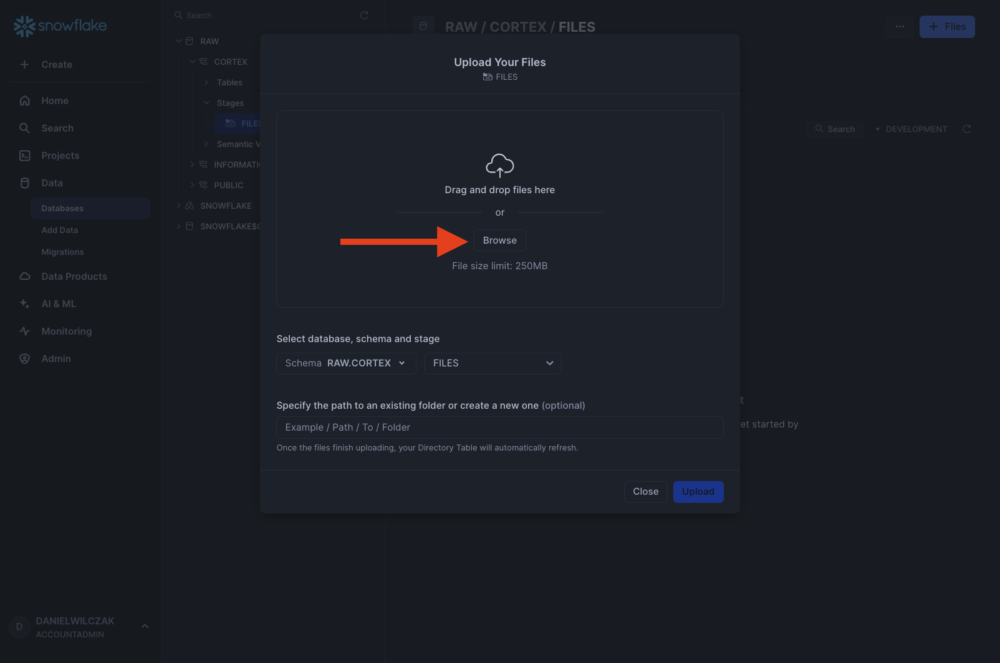

Select the [example semantic layer](https://sfc-gh-dwilczak.github.io/tutorials/science/analyst/files/sales.yaml) called sales. 
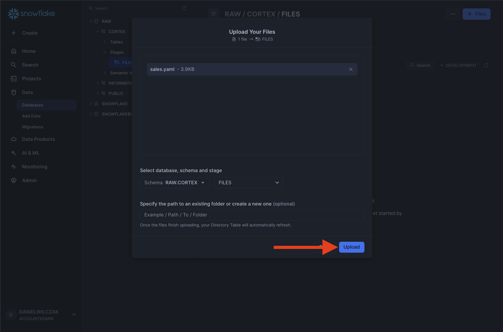

Now that we have our example uploaded we can head to cortex analyst under the AI / ML Studio.
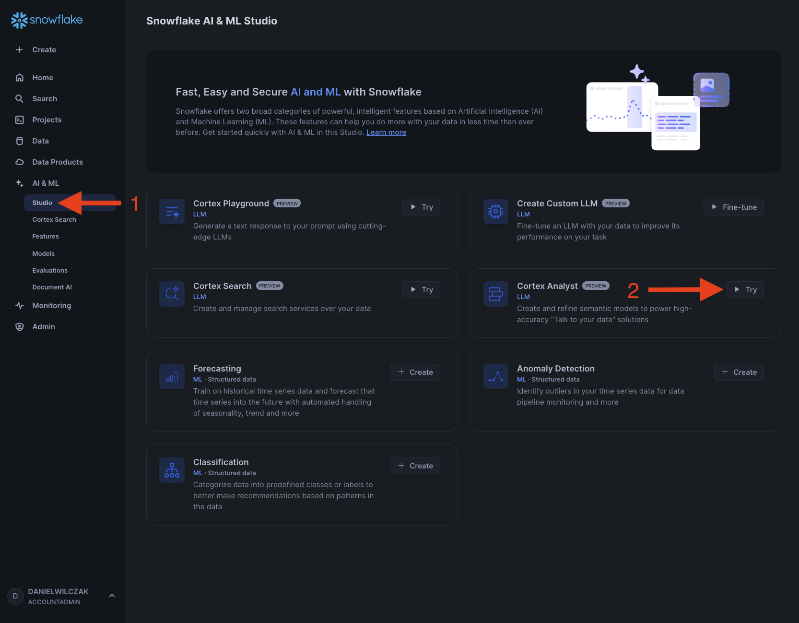

We'll select our semantic layer from our stage and click open.
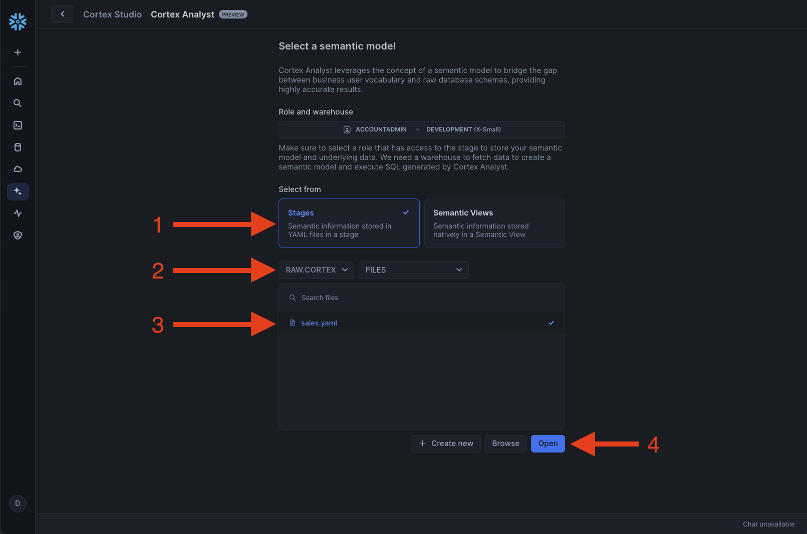

Now that it's open we can immediately start playing with the semantic layer / chatbot.
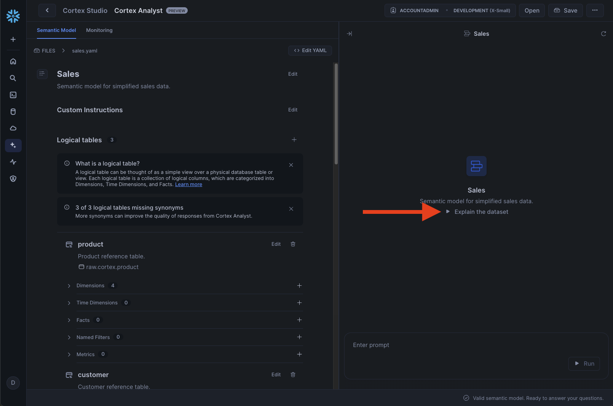

We can see that the chatbot gives us example questions we can click and get results from. These examples are in the semantic layer.
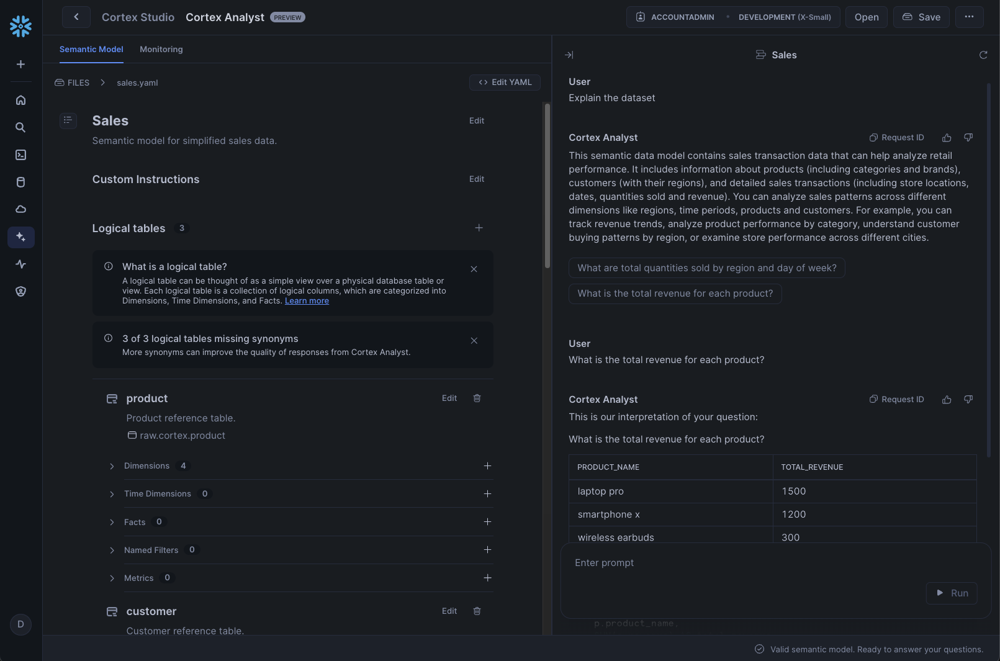

We can also leave edit mode to show what it can potentially look like when we deploy the applicaiton.
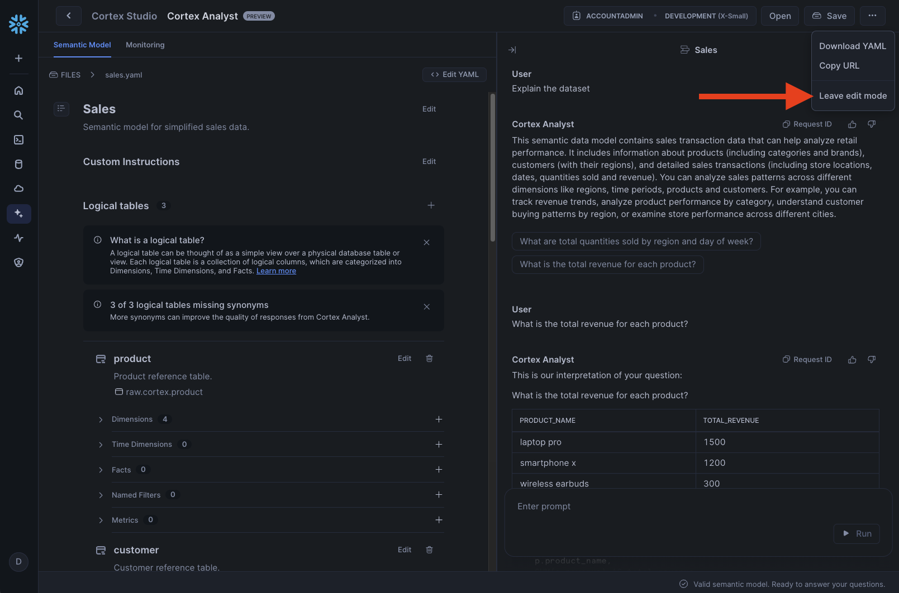

You can see that our chatbot not only gives us the data in a table but also as a query. This can be changed in the future to remove the sql and or add a diagram / chart.
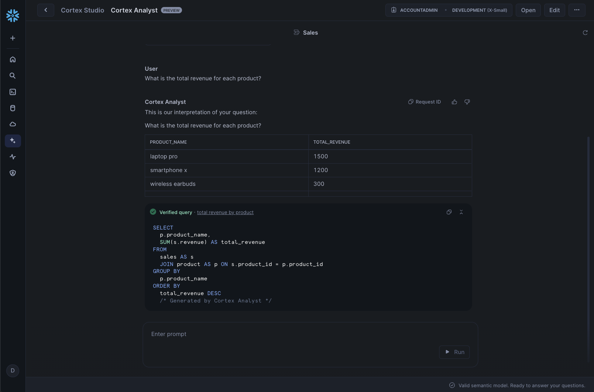


### Edit Semantic Layer
In the playground we can also edit the semantic layer by using the GUI interface or by code. A great note here is that I found it helpful to use chatgpt to write my semantic layer code for me. I just provided it the table defenitions and it built the rest. Took me only 15 mins to get it to my liking with some great example quries.
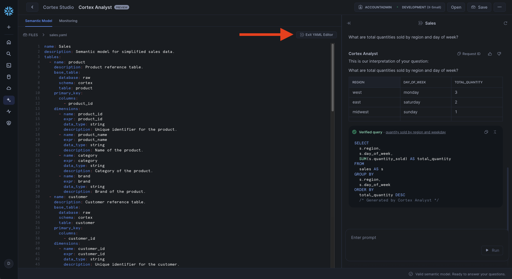

### Monitoring
You can monitor the usage of this semantic layer by going to the monitoring tab, this allows you to see how people are using your chatbot to help correct it without asking for feedback.
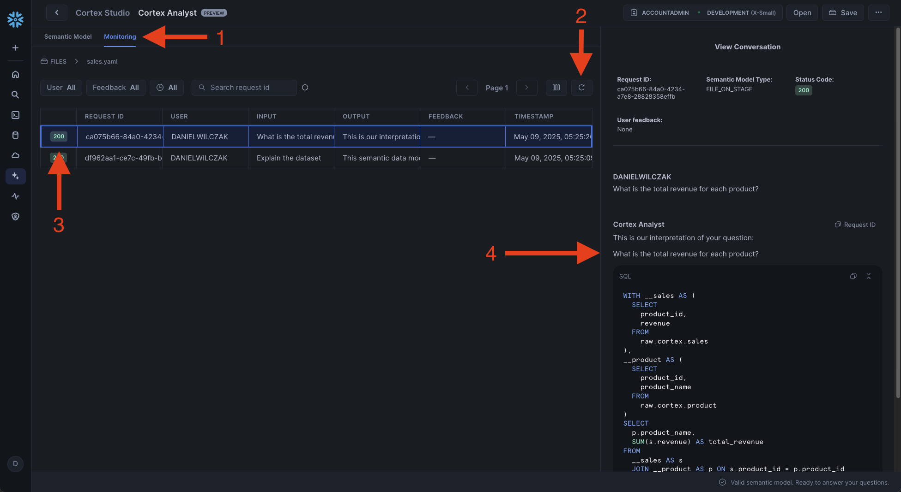


## Deployment :octicons-feed-tag-16:
Now that we have our cortex analyst chatbot built we'll want to deploy it. In this section we have two example platforms but you can deploy to many more.

### Streamlit in Snowflake
Lets deploy our semantic layer / chatbot in streamlit in Snowflake. 

#### Downloads
- Streamlit Application ([Link](https://sfc-gh-dwilczak.github.io/tutorials/science/analyst/files/streamlit.py))

#### Streamlit
To start lets create a new streamlit application in Snowflake.
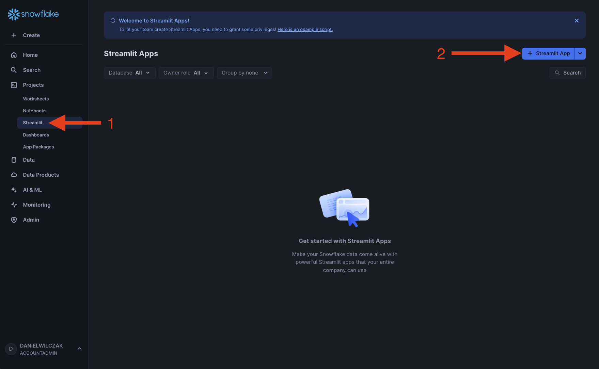

Lets give our streamlit app a name, where to put it and finally the warehouse that will be used.
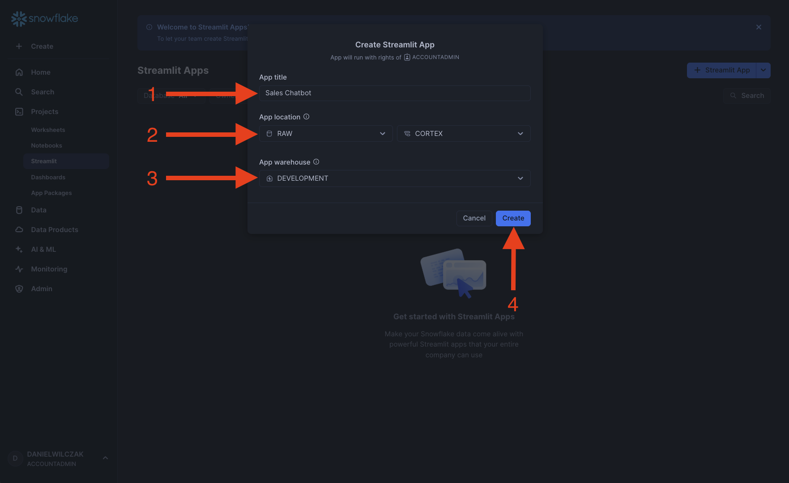

!!! note 

    If you put your semantic file somewhere else you'll just update it the string of the location.

Now that we have the app, lets copy in the code from the [example application](https://sfc-gh-dwilczak.github.io/tutorials/science/analyst/files/streamlit.py) that we downloaded earlier and hit run.
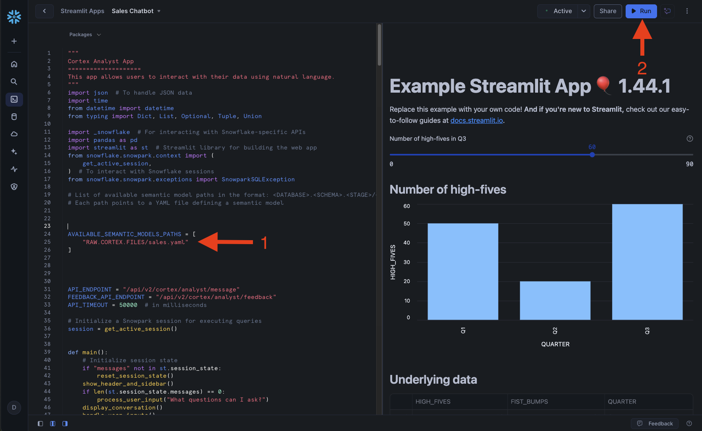

Now you can see the chatbot and start using it and sharing it with any team who needs a sales chatbot.
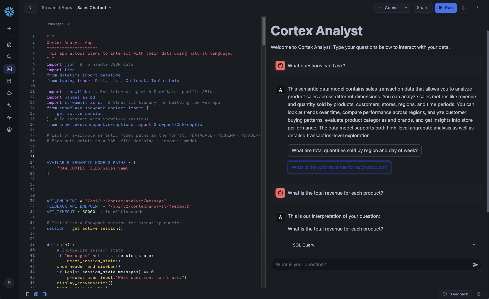


### Flask Website
Lets move to a build use case where we want to add our semantic layer into our application. In this example we'll build two additional semantic layers and then deploy them in our flask application. Make sure we download the necessary files for this section.

#### Downloads
- Flask Application ([Link](https://sfc-gh-dwilczak.github.io/tutorials/science/analyst/files/flask.zip))
- All semantic layers ([Link](https://sfc-gh-dwilczak.github.io/tutorials/science/analyst/files/semantic.zip))

#### Snowflake
Lets adding some new tables for our new semantic layers.
=== ":octicons-image-16: Tables"

  ```sql linenums="1"  
  CREATE TABLE raw.cortex.campaign_dim (
    campaign_id STRING PRIMARY KEY,
    campaign_name STRING,
    channel STRING,
    start_date DATE,
    end_date DATE
  );

  CREATE TABLE raw.cortex.ad_fact (
    ad_id STRING PRIMARY KEY,
    campaign_id STRING,
    date_id DATE,
    impressions INT,
    clicks INT,
    cost FLOAT
  );

  CREATE TABLE raw.cortex.agent_dim (
    agent_id STRING PRIMARY KEY,
    agent_name STRING,
    team STRING,
    region STRING
  );

  CREATE TABLE raw.cortex.ticket_fact (
    ticket_id STRING PRIMARY KEY,
    agent_id STRING,
    issue_type STRING,
    status STRING,
    created_at TIMESTAMP,
    resolved_at TIMESTAMP
  );
  ```

Lets add data to those tables.
=== ":octicons-image-16: Insert"

  ```sql linenums="1"  
  INSERT INTO raw.cortex.campaign_dim VALUES
    ('C001', 'Spring Promo', 'email', '2024-03-01', '2024-03-31'),
    ('C002', 'Summer Social', 'social', '2024-06-01', '2024-06-30'),
    ('C003', 'Holiday Search Ads', 'search', '2024-11-15', '2024-12-31');

  INSERT INTO raw.cortex.ad_fact VALUES
    ('A001', 'C001', '2024-03-05', 10000, 250, 500.00),
    ('A002', 'C002', '2024-06-10', 20000, 500, 800.00),
    ('A003', 'C003', '2024-11-20', 30000, 600, 1500.00);

  INSERT INTO raw.cortex.agent_dim VALUES
    ('AG001', 'Alice Smith', 'Technical', 'North America'),
    ('AG002', 'Bob Johnson', 'Billing', 'Europe'),
    ('AG003', 'Cindy Lee', 'Technical', 'Asia');

  INSERT INTO raw.cortex.ticket_fact VALUES
    ('T001', 'AG001', 'Login Issue', 'Resolved', '2024-04-01 08:00:00', '2024-04-01 09:00:00'),
    ('T002', 'AG002', 'Payment Failure', 'Resolved', '2024-04-02 10:30:00', '2024-04-02 11:15:00'),
    ('T003', 'AG003', 'Feature Request', 'Open', '2024-04-03 14:00:00', NULL);
  ```

Next lets upload the new semantic layers to our stage.
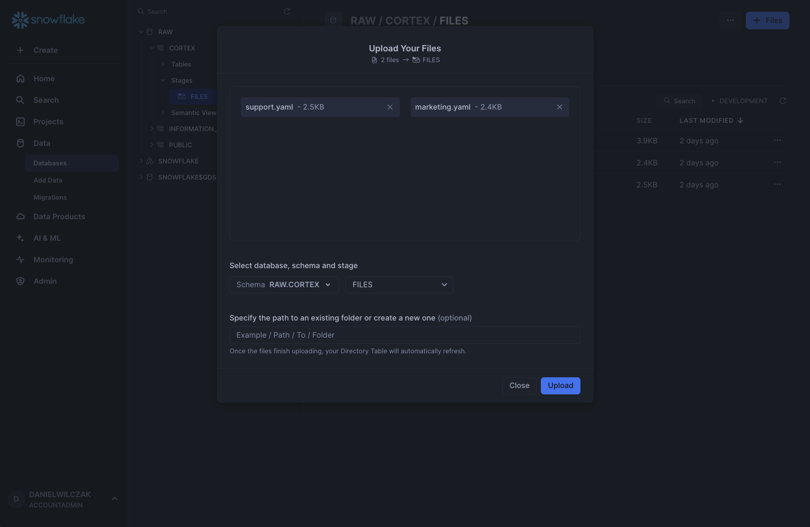

#### Flask
Lets walk throught the process of setting up the example files and starting our flask application. First we'll want to update our Snowflake account information in the ``app.py`` file.

=== ":octicons-image-16: Python"

  ```python linenums="1"  
  # If your snowflake account has an underscore then you must use the
  # account locator here for host. Otherwise it can we the same as account.
  HOST = "<Account Identifier>"
  ACCOUNT = "<Account Identifier>"
  USER = "<Username>"
  PASSWORD = "<Password>"
  ROLE = "<role>"
  ```

=== ":octicons-image-16: Example"

  ```python linenums="1"  
  # If your snowflake account has an underscore then you must use the
  # account locator here for host. Otherwise use your account URL.
  HOST = "EASYCONNECT-ACCOUNT.snowflakecomputing.com"
  ACCOUNT = "EASYCONNECT-ACCOUNT"
  USER = "danielwilczak"
  PASSWORD = "..."
  ROLE = "ACCOUNTADMIN"
  ```

=== ":octicons-image-16: Example 2"

  ```python linenums="1"  
  # If your snowflake account has an underscore then you must use the
  # account locator here for host. Otherwise use your account URL.
  HOST = "CVB15898.snowflakecomputing.com"
  ACCOUNT = "EASYCONNECT-TUTORIALS_AWS"
  USER = "danielwilczak"
  PASSWORD = "..."
  ROLE = "ACCOUNTADMIN"
  ```

Next we'll want to start a python virtual environment and install the packages we need. This may be different on windows.
=== ":octicons-image-16: Python"

  ```bash linenums="1"  
  python -m venv venv
  source venv/bin/activate
  pip install -r requirements.txt
  ```

Now that we have everything for the application, lets run it.
=== ":octicons-image-16: Python"

  ```bash linenums="1"  
  python app.py 
  ```

Now we can go to the I.P address provided and see our flask application with multiple semantic models.
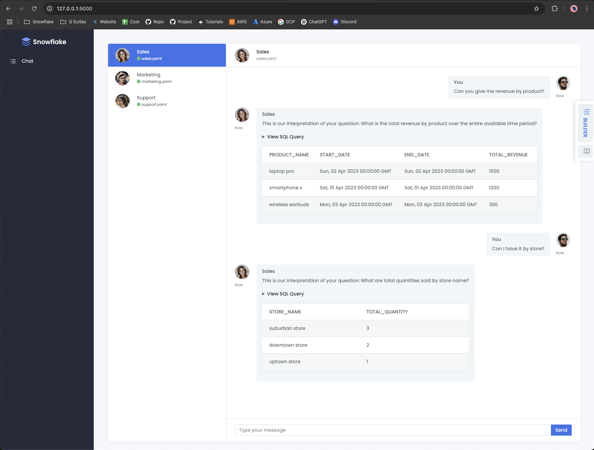


