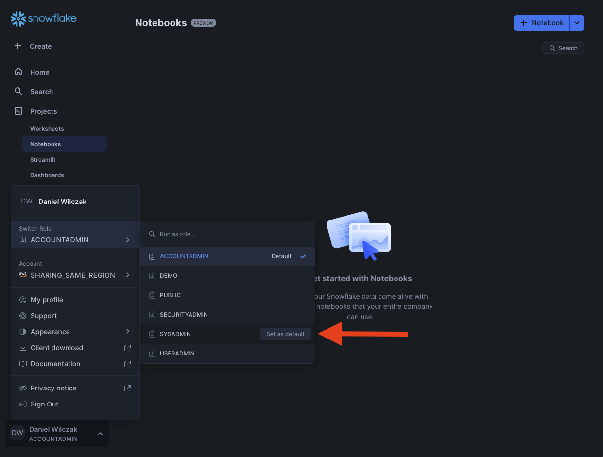
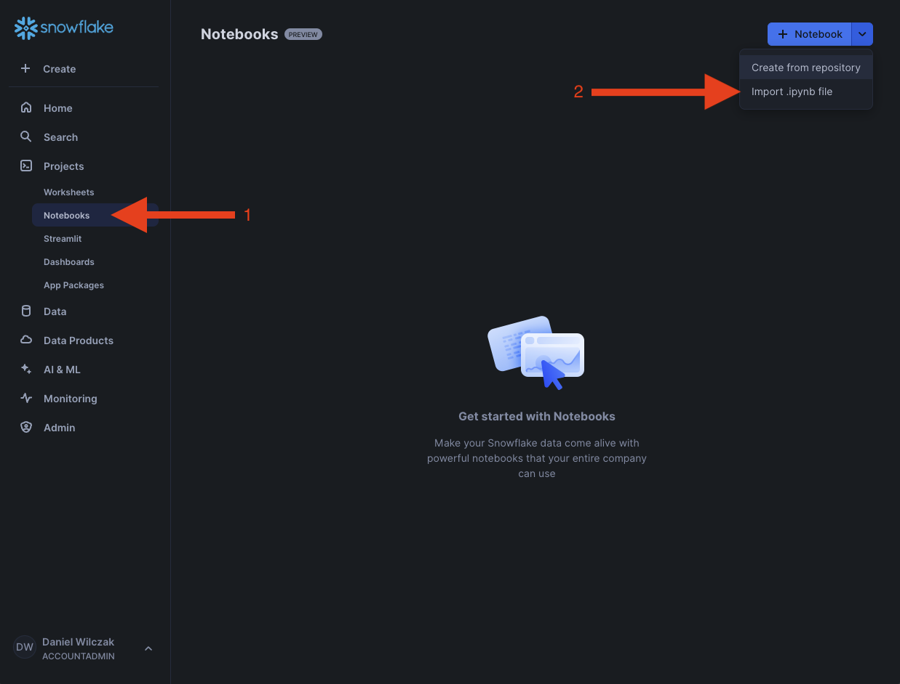
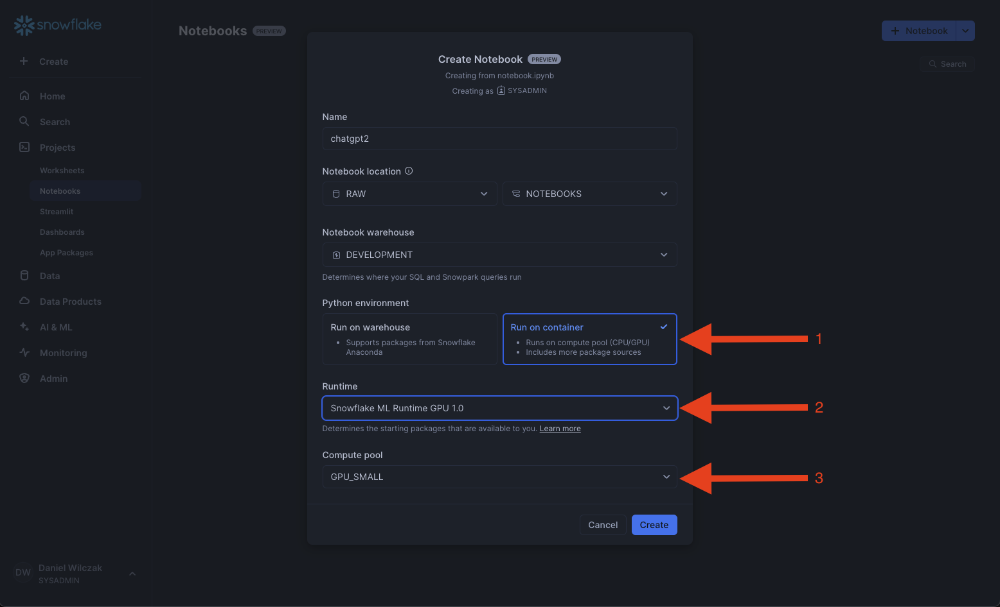
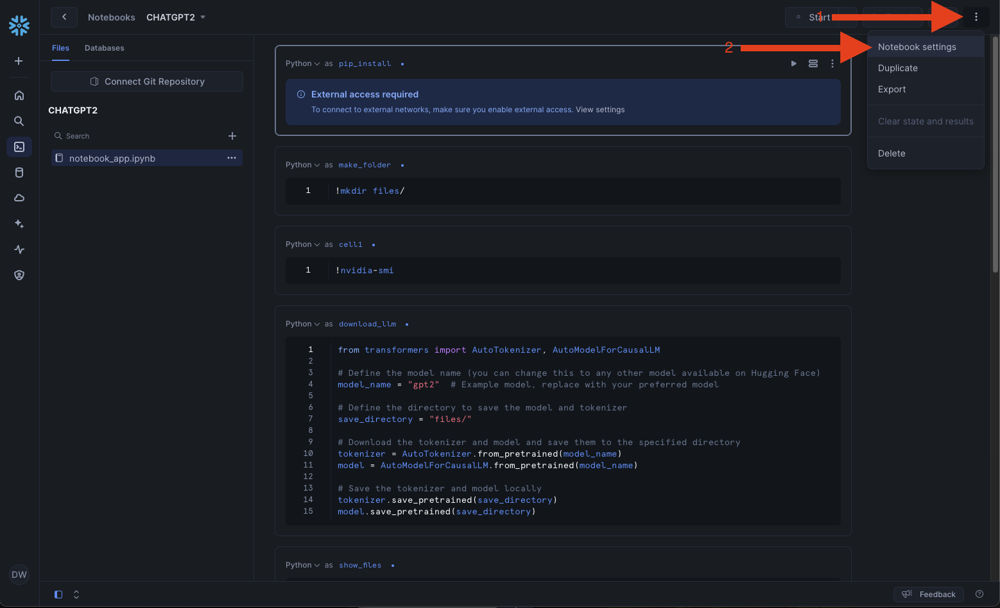
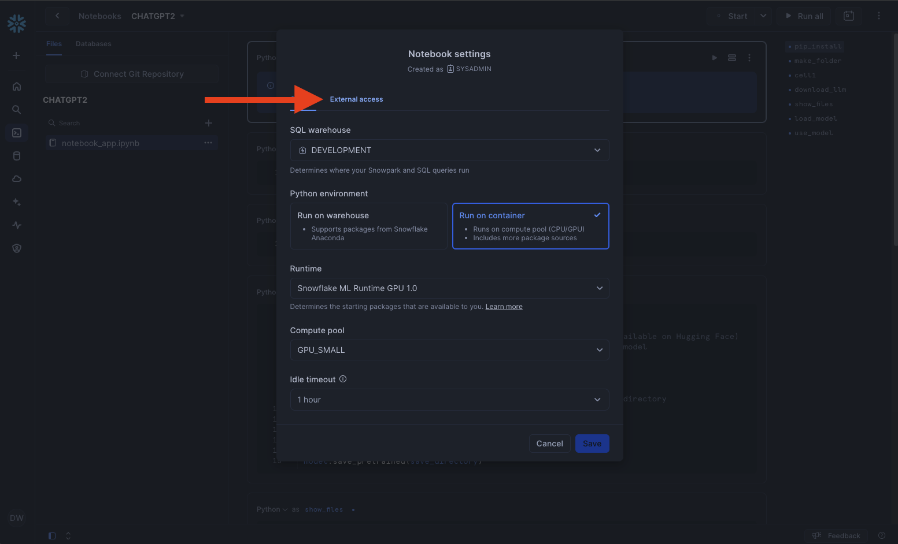
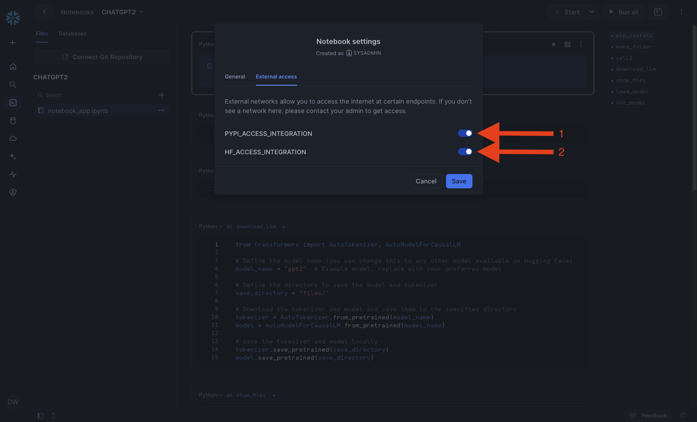
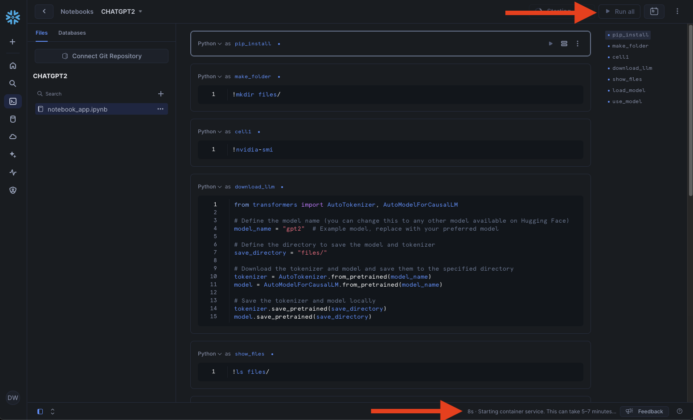
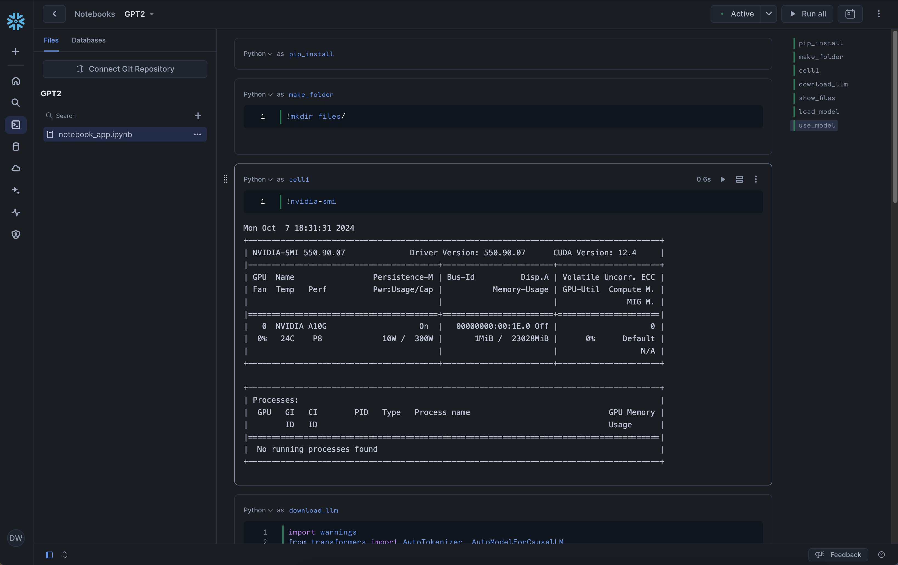
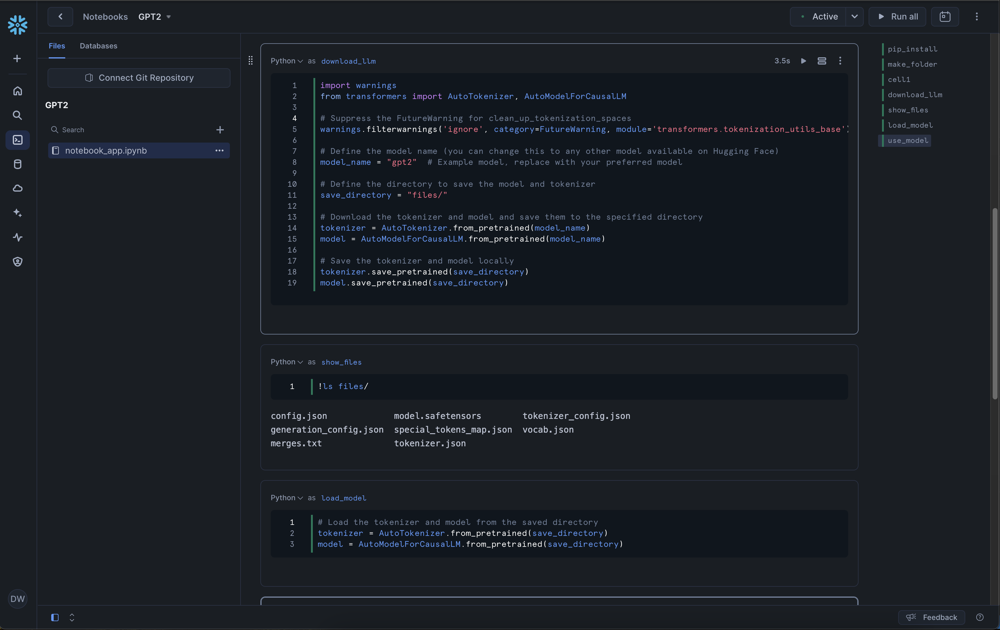
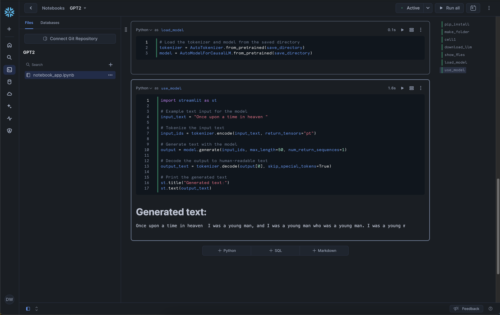

# Containerize Notebooks
In this tutorial we will show how to use containerized notebooks using the chatgpt 2 model from hugging face.

## Video
Video is still in development.

## Requirement
- Be in a [container services enabled region](https://docs.snowflake.com/en/developer-guide/snowpark-container-services/overview#available-regions).  
- You [CAN NOT be on a trial account](https://docs.snowflake.com/en/developer-guide/snowpark-container-services/overview).

## Downloads
- Notebook ([Link](https://sfc-gh-dwilczak.github.io/science/notebooks/containers/notebook/notebook.ipynb))

## Setup :octicons-feed-tag-16:
??? note "If you don't have a database, schema or warehouse yet."

    === ":octicons-image-16: Database, schema and warehouse"

        ```sql
        use role sysadmin;
        
        -- Create a database to store our schemas.
        create database if not exists raw;

        -- Create the schema. The schema stores all our objectss.
        create schema if not exists raw.notebook;

        /*
            Warehouses are synonymous with the idea of compute
            resources in other systems. We will use this
            warehouse to call our user defined function.
        */
        create warehouse if not exists development 
            warehouse_size = xsmall
            initially_suspended = true;

        use database raw;
        use schema notebook;
        use warehouse development;
        ```

### GPU Compute Pool
First lets start by creating a gpu compute pool for our notebook via accountadmin role and then grant sysadmin to use it.

=== ":octicons-image-16: Setup"

    ```sql linenums="1"
    use role accountadmin;

    create compute pool gpu_small
        min_nodes = 1
        max_nodes = 1
        instance_family = gpu_nv_s;

    grant usage on compute pool gpu_small to role sysadmin;
    ```  

=== ":octicons-image-16: Result"

    ``` linenums="1"
    Statement executed successfully.
    ```

### External Access
Lets create the network rules in a worksheet to allow our Snowflake Notebook to talk with our external source.
=== ":octicons-image-16: Setup"

    ```sql linenums="1"

    use role sysadmin;

    create or replace network rule pypi_network_rule
        mode = egress
        type = host_port
        value_list = ('pypi.org', 'pypi.python.org', 'pythonhosted.org',  'files.pythonhosted.org');

    create or replace network rule hf_network_rule
            mode = egress
            type = host_port
            value_list = ('huggingface.co', 'cdn-lfs.huggingface.co','cdn-lfs.hf.co');

    use role accountadmin;

    create or replace external access integration pypi_access_integration
        allowed_network_rules = (pypi_network_rule)
        enabled = true;

    create or replace external access integration hf_access_integration
        allowed_network_rules = (hf_network_rule)
        enabled = true;

    grant usage on integration pypi_access_integration to role sysadmin;
    grant usage on integration hf_access_integration to role sysadmin;
    ```  

=== ":octicons-image-16: Result"

    ``` linenums="1"
    Statement executed successfully.
    ```

### Notebook
??? warning "You can not use accountadmin. Please switch to sysadmin role."

Lets start by setting our role to sysadmin.


#### Setup
Upload the [example notebook](#) provided.


Select Run on container, ML runtime and the gpu compute pool we created earlier. 


To enable external connection to pypi and hugging face we will need to go to notebook settings.


Select External access.


Enable both pypi and huggingface.


Click run all, the notebook will provide you a timer. It typically takes 5-7 minutes.


#### Result
Once the notebook runs you will see we first make a directory for files to be downloaded to.


We then download the chatgpt 2 model and save it to our files folder.


We finally use our model and gpu to provide a prompt and get a response back.


