# Sharing - Direct
!!! warning 

    Direct data sharing can only be done to accounts on the same cloud provider and in the same region as your Snowflake account. To share to other providers/regions use a [data share listing](https://sfc-gh-dwilczak.github.io/tutorials/sharing/listing/).

In this tutorial we will cover how to create sercure views on our data and then direct data share with anther Snowflake account.

## Video
Video still in development.

## Requirements
- Snowflake account, you can use a [free trial](https://signup.snowflake.com/). We also assume no complex security needs.


## Second Account
Lets start by setting up our second account in our Snowflake orginization so that we can go through the process of sharing with a real life account. To create anther account please follow this [tutorial](https://sfc-gh-dwilczak.github.io/tutorials/configurations/account/add/) (3 minutes) but make sure it's in the same region as the first account.

Now that we have our second account we'll need that account's locator. Lets start by going to our account details.
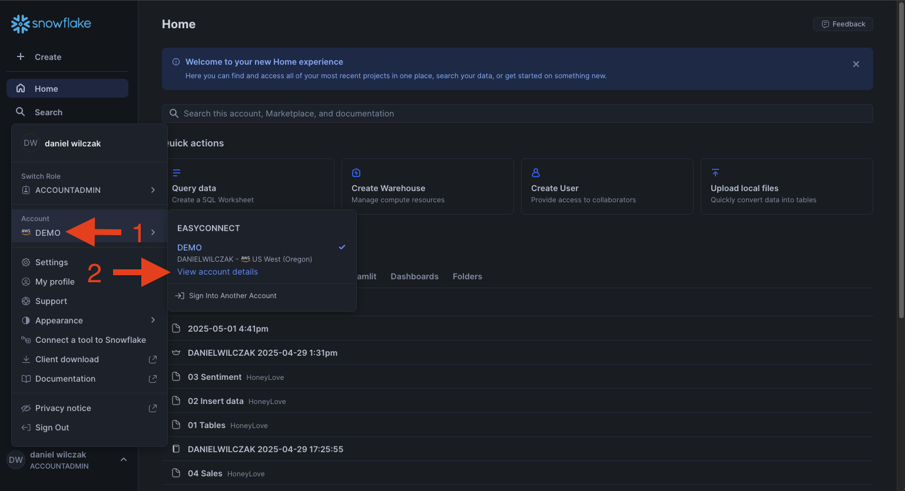

Copy the account locator, we'll need this for later.
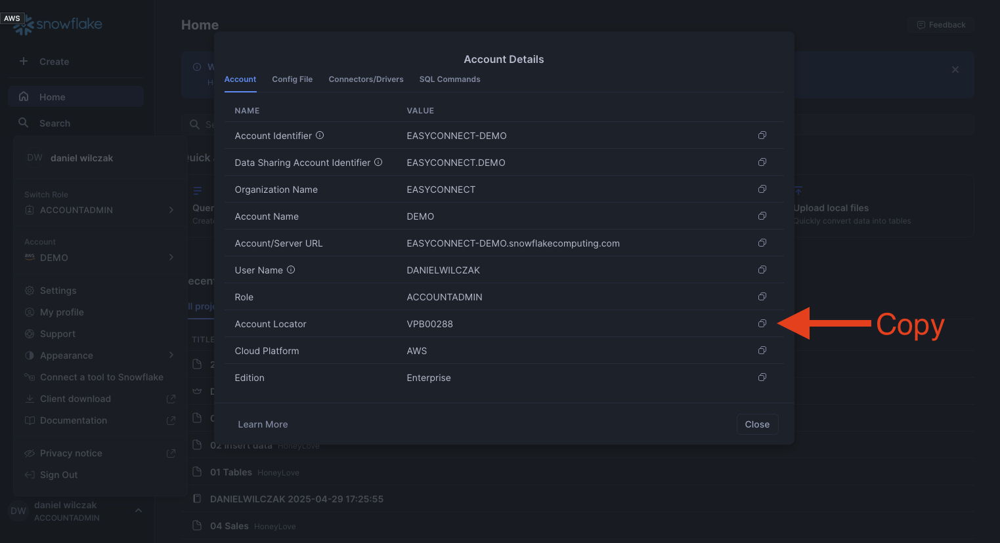

## Setup  :octicons-feed-tag-16:
Lets create some data and share it to our second account.

### Data
Lets now create some data to be shared with our second account. Lets start a sql worksheet and add the code below.

??? note "If you don't have a database, schema or warehouse yet."

    === ":octicons-image-16: Database, schema and warehouse"

        ```sql linenums="1"
        use role sysadmin;
        
        -- Create a database to store our schemas.
        create database if not exists sharing;

        -- Create the schema. The schema stores all our objectss.
        create schema if not exists sharing.data;

        /*
            Warehouses are synonymous with the idea of compute
            resources in other systems. We will use this
            warehouse to call our user defined function.
        */
        create warehouse if not exists development 
            warehouse_size = xsmall
            auto_suspend = 30
            initially_suspended = true;

        use database sharing;
        use schema data;
        use warehouse development;
        ```


=== ":octicons-image-16: Table"

    ```sql linenums="1"  
    create or replace table customers (
        id number autoincrement primary key,
        name string,
        email string
    );

    insert into customers (name, email)
        values
        ('john doe', 'john@example.com'),
        ('jane smith', 'jane@example.com'),
        ('carlos mendez', 'carlos@example.com');
    ```

=== ":octicons-sign-out-16: Result"

    | number of rows inserted |
    |-------------------------|
    | 3                       |

### Share
!!! note

    You must be using accountadmin or the button/dropdown won't show up. 

Now that we have our table, lets create a data share by going to private sharing and then in the top right clicking the dropdown to direct data sharing.
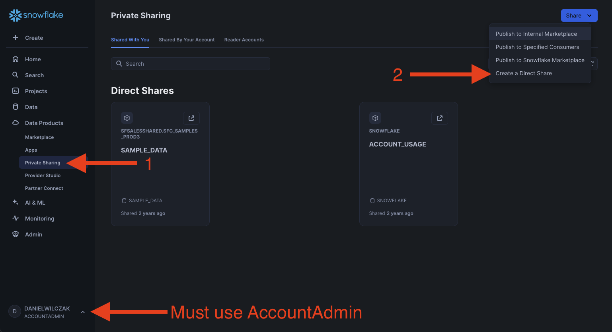

Lets click select data.
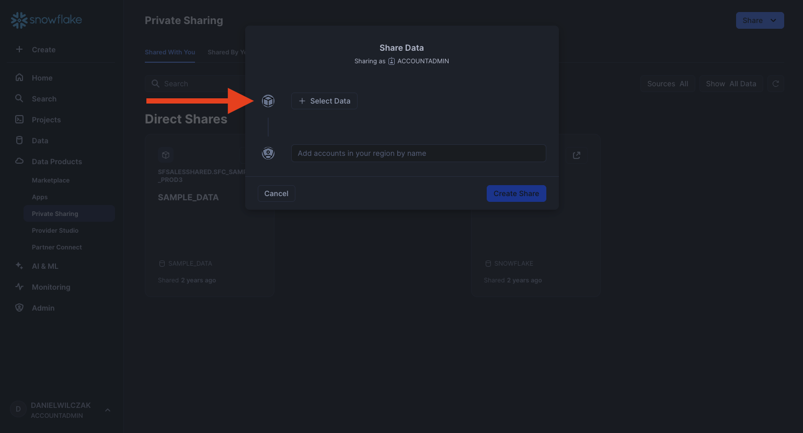

Navigate to the sharing database, data schema and finally lets select the customer data table.
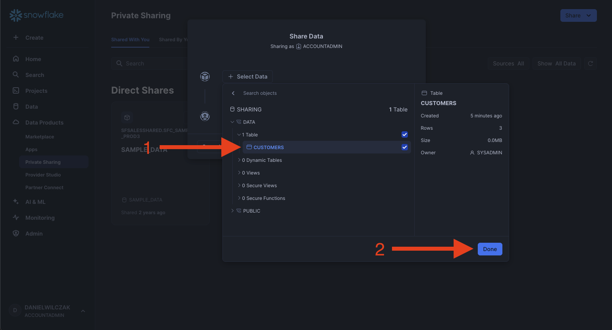

Now that we have our data selected lets give the share a name and description. The customer will see both when they add the share. Finally lets add the second accounts locator. If it's correct you will get the dropdown to select the account.
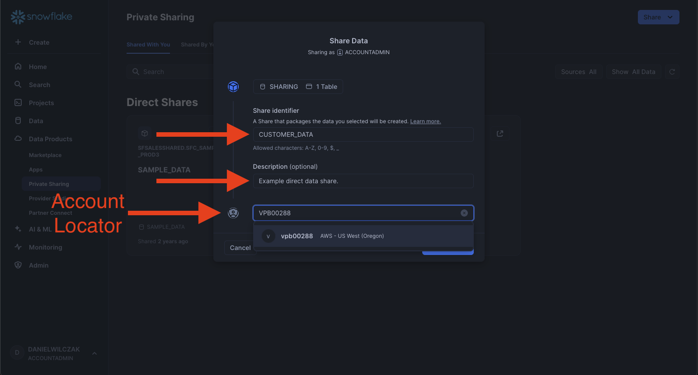

Once everything is to our liking we can click "create share".
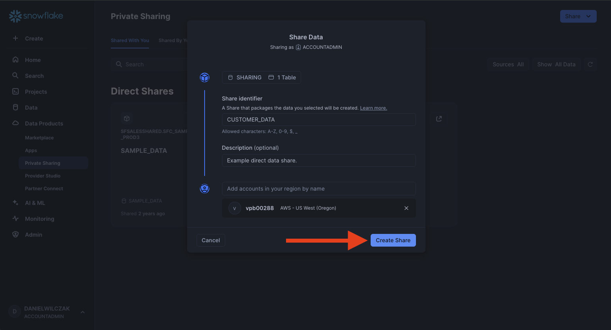

Once the share is created you'll see it's an object we can change if needed.
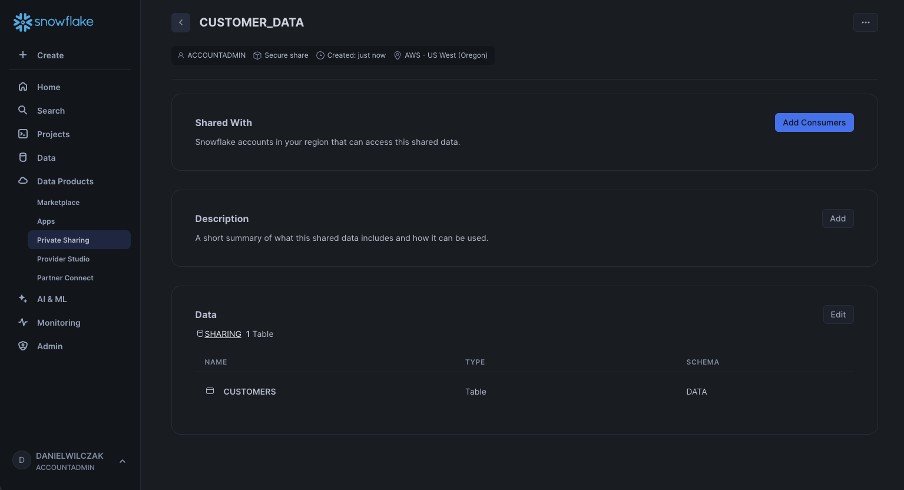

## Add data share
Lets now add the data share in the second account by going to private sharing and clicking the download button next to our share.
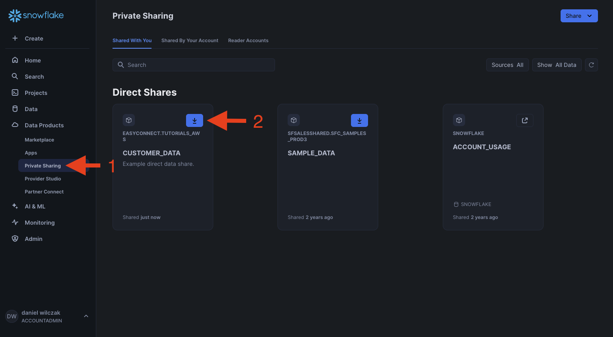

Lets update the database name and click "get data".
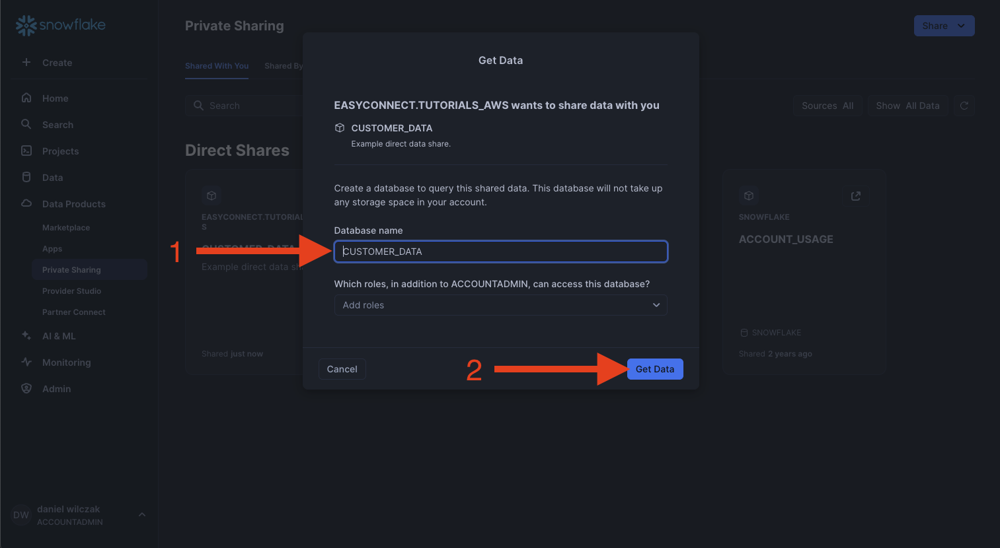

The data has now been added to the second account. Lets go view that data.
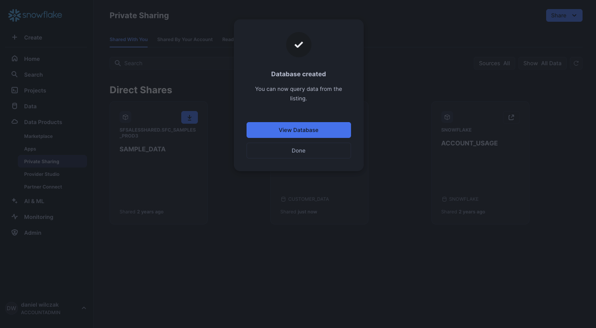

We can see it has been added with the database name we wantsed and we can go to the customers table to see the data.
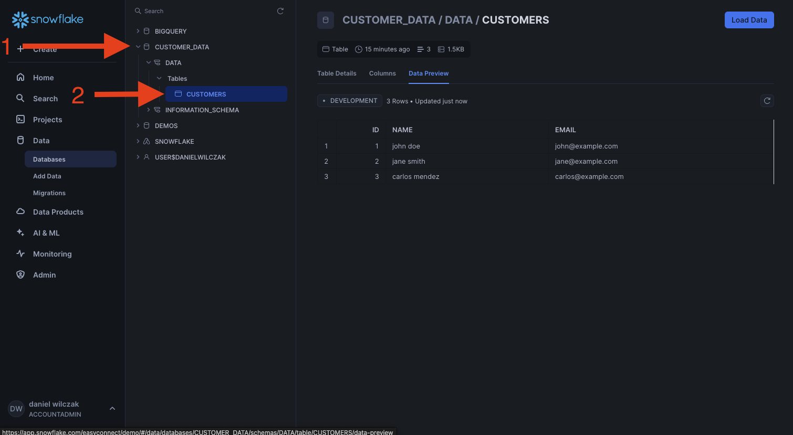

## Bonus - Sharing filtered data
We might want to only share specific data to anther account without that account knowing how we filtered the data. To do this we will create a [secure view](https://docs.snowflake.com/en/user-guide/views-secure) on top of our table to filter only to rows with the name "john doe".

=== ":octicons-image-16: View"

    ```sql linenums="1"  
    create or replace secure view filtered_customers as
        select
            *
        from
            customers
        where
            name = 'john doe';
    ```

=== ":octicons-sign-out-16: Result"

    | status                                        |
    |-----------------------------------------------|
    | View FILTERED_CUSTOMERS successfully created. |

Now this secure view can be selected instead of our table in the data share.


Lets edit our data share.


Lets uncheck our original table and select our secure view.
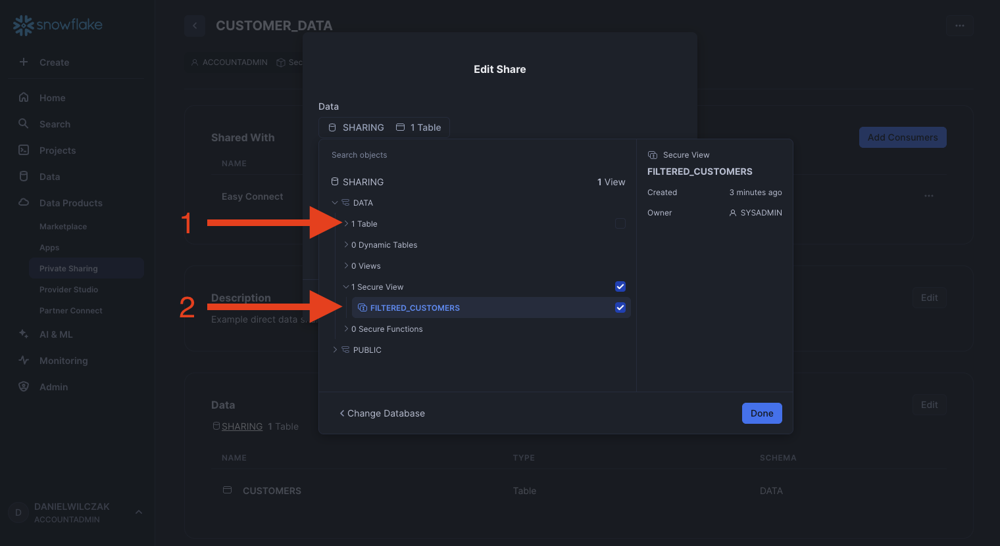

Click save.
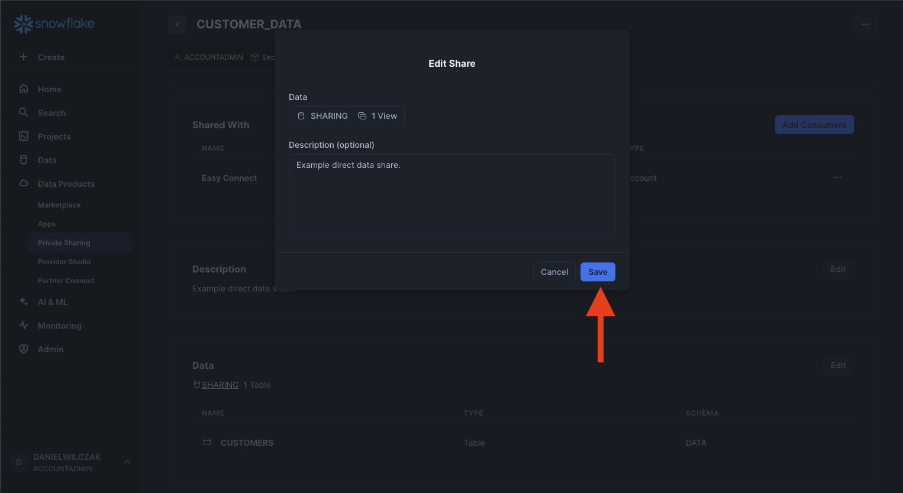

Now we can go to our second account and see that now the secure view object has been added and only the one row is now avaliable.
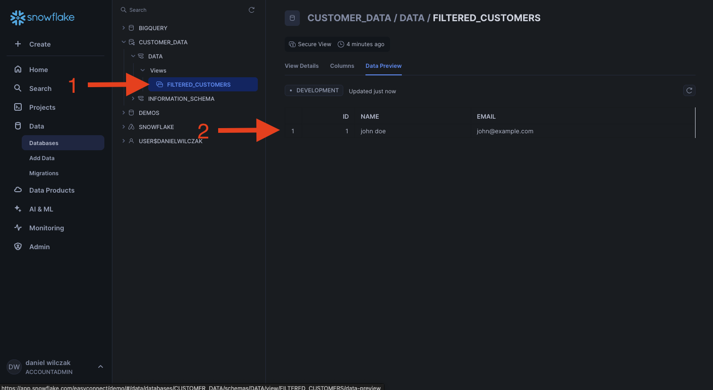