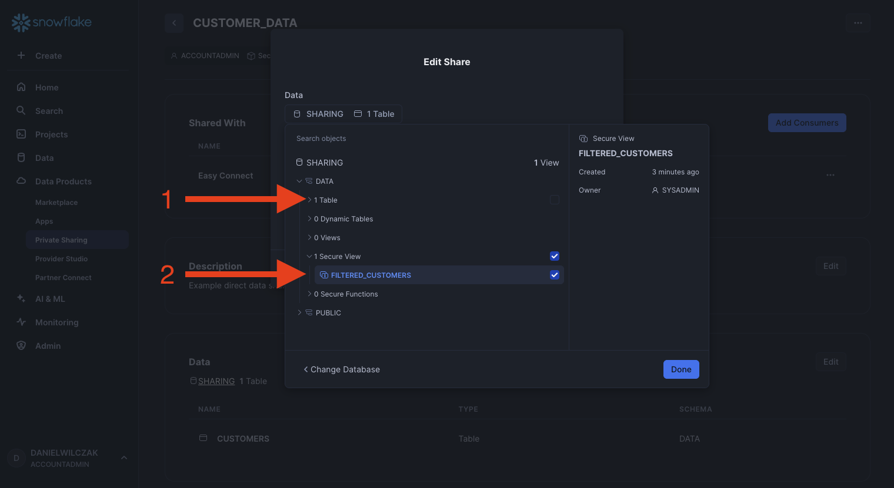
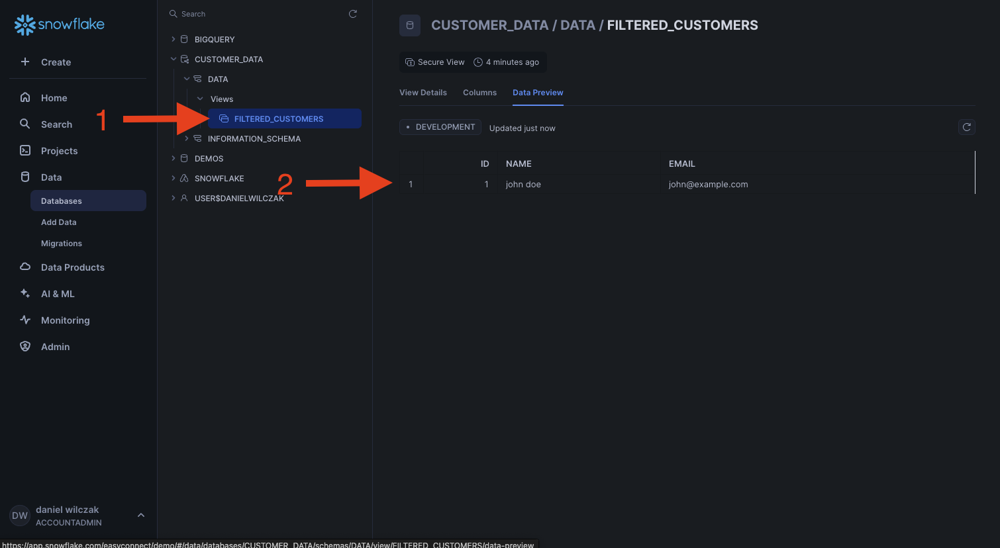

# Sharing - Listing
In this tutorial, we’ll walk through how to share data with another Snowflake account using a listing, even if the account is on a different cloud provider than your own.

## Video
Video still in development.

## Requirements
- Snowflake account, you can use a [free trial](https://signup.snowflake.com/). We also assume no complex security needs.

## Setup  :octicons-feed-tag-16:
Lets start by setting up our second account in our Snowflake orginization so that we can go through the process of sharing with a real life account.

### Second Account
To create anther account please follow this [tutorial](https://sfc-gh-dwilczak.github.io/configurations/account/add/) (3 minutes). In this tutorial we will setup the second account in Azure while our primary account is in AWS.

Now that we have our second account we'll need that account's ``Data Sharing Account Identifier``. Lets start by going to our account details.


Copy the ``Data Sharing Account Identifier``, we'll need this for later.


### Data
Lets now create some data to be shared with our second account. Lets start a sql worksheet and add the code below.

??? note "If you don't have a database, schema or warehouse yet."

    === ":octicons-image-16: Database, schema and warehouse"

        ```sql linenums="1"
        use role sysadmin;
        
        -- Create a database to store our schemas.
        create database if not exists sharing;

        -- Create the schema. The schema stores all our objectss.
        create schema if not exists sharing.data;

        /*
            Warehouses are synonymous with the idea of compute
            resources in other systems. We will use this
            warehouse to call our user defined function.
        */
        create warehouse if not exists development 
            warehouse_size = xsmall
            auto_suspend = 30
            initially_suspended = true;

        use database sharing;
        use schema data;
        use warehouse development;
        ```


=== ":octicons-image-16: Table"

    ```sql linenums="1"  
    create or replace table customers (
        id number autoincrement primary key,
        name string,
        email string
    );

    insert into customers (name, email)
        values
        ('john doe', 'john@example.com'),
        ('jane smith', 'jane@example.com'),
        ('carlos mendez', 'carlos@example.com');
    ```

=== ":octicons-sign-out-16: Result"

    | number of rows inserted |
    |-------------------------|
    | 3                       |

### Data Share

!!! note

    You must be using accountadmin or the button/dropdown won't show up. 

Now that we have our table, lets create a data share listing by going to private sharing and then in the top right click the dropdown to "Publish to Specified Consumer".


We'll give the listing a name, select "Only specified consumers" and click next.


We'll start with selecting our data.


Select our table.


!!! note "If you get error: This product can be shared only in the local region"

    If you see this error:
    
    
    You will need to use the main orginizational account to enable the primary account your working in to share with other providers/region.

    === ":octicons-image-16: Code"

        ```sql linenums="1"  
        CALL SYSTEM$ENABLE_GLOBAL_DATA_SHARING_FOR_ACCOUNT('<account_name>');
        ```

    === ":octicons-sign-out-16: Example"

        ```sql linenums="1"  
        CALL SYSTEM$ENABLE_GLOBAL_DATA_SHARING_FOR_ACCOUNT('tutorials_aws');
        ```

    === ":octicons-sign-out-16: Result"

        | SYSTEM$ENABLE_GLOBAL_DATA_SHARING_FOR_ACCOUNT |
        |-----------------------------------------------|
        | Statement executed successfully.              |

We'll give our share object a name, description and then we'll enter the ``Data Sharing Account Identifier``.


Once we enter our ``Data Sharing Account Identifier`` we'll see new options show up to allow us to set the data replication refresh internal. This will be how often the dat will be refreshed.


Now our listing is live and shared with our second account. Once it's added to the second account it will replicate the data and the second account will have access to the shared data.


### Second Account
Now that we have our data shared, lets add it to the second account. Lets go into our Azure account and add the data. You must use the accountadmin role.


!!! note

    You might have to validate your email before you can add the data share. Also keep in mind your must use the ``accountadmin`` role to add the data share.

Now that you have added it, it will start to replicate the data from AWS to Azure, this may take a fiew minutes depending on the volume of data. You'll recieve an email once the data is avaliable.


Now that the data is avaliable lets add it again. We'll give it a name and add it to the account.


Your data is now added.


We can see the new shared database in our accont with our table.


### Bonus - Sharing filtered data
We might want to only share specific data to anther account without that account knowing how we filtered the data. To do this we will create a [secure view](https://docs.snowflake.com/en/user-guide/views-secure) on top of our table to filter only to rows with the name "john doe".

=== ":octicons-image-16: View"

    ```sql linenums="1"  
    create or replace secure view filtered_customers as
        select
            *
        from
            customers
        where
            name = 'john doe';
    ```

=== ":octicons-sign-out-16: Result"

    | status                                        |
    |-----------------------------------------------|
    | View FILTERED_CUSTOMERS successfully created. |

Now this secure view can be selected instead of our table in the data share.


Lets edit our data share.


Lets uncheck our original table and select our secure view.


Click save.


Now we can go to our second account and see that now the secure view object has been added and only the one row is now avaliable.
