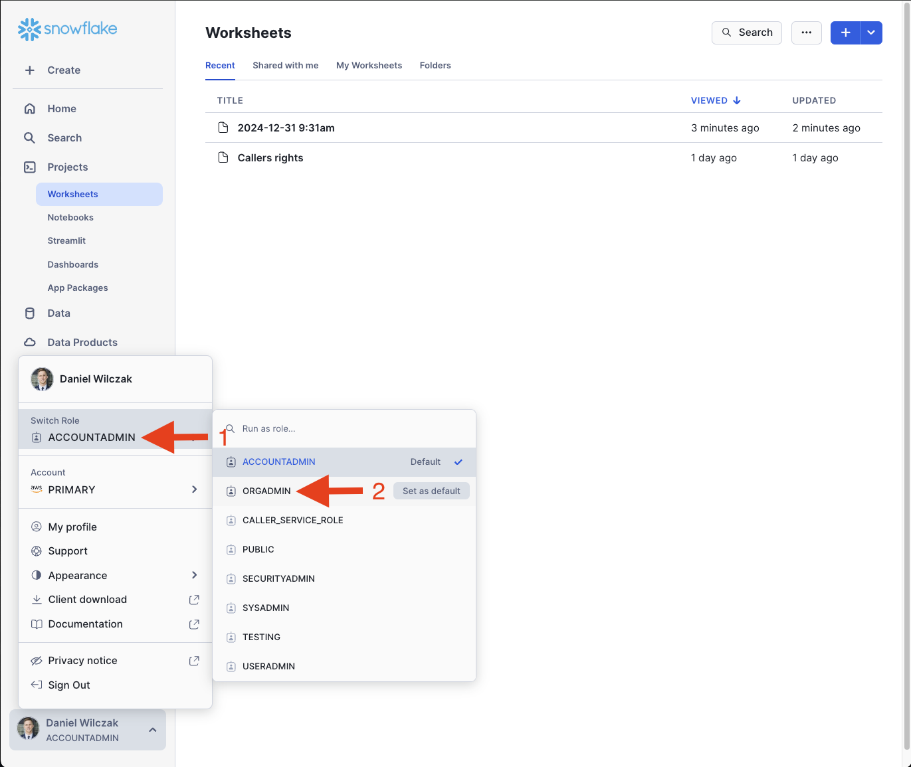
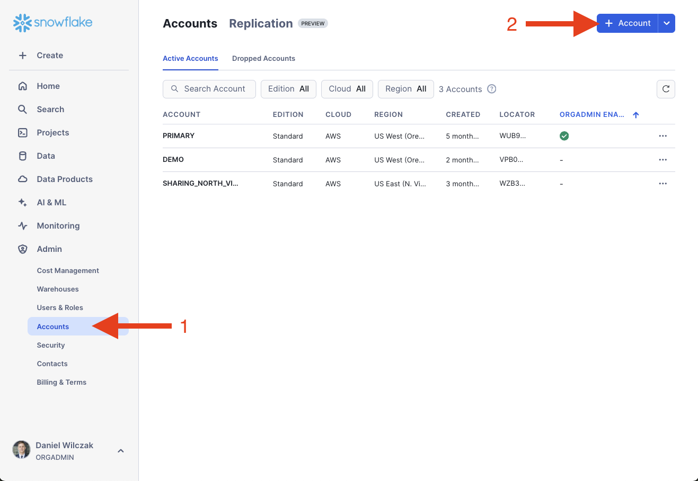
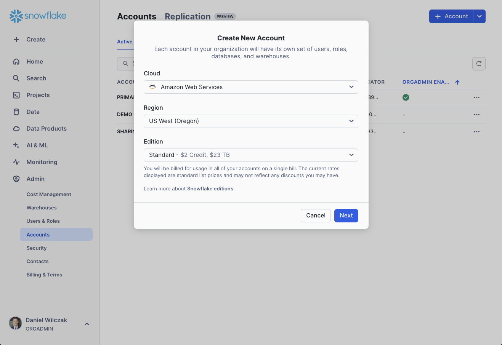

# Add new account to orginization
In this tutorial we will show how you can add a new Snowflake account under your orginization.

## Video
Video in development

## Requirement
- Must be on a on-demand (Paying) or contracted account, you CAN NOT be on [free trial](https://signup.snowflake.com/). We also assume no complex security needs.

## Walk Through :octicons-feed-tag-16:
We first want to start by enabling the ``orgadmin`` role and go to the accounts page. Start by running the code below to enable ``orgadmin``.

=== ":octicons-image-16: Code"

    ```sql linenums="1"
    -- Assume the ACCOUNTADMIN role
    use role accountadmin;

    -- Grant the ORGADMIN role to a user
    grant role orgadmin to user <username>;
    ```

=== ":octicons-image-16: Example"

    ```sql linenums="1"
    -- Assume the ACCOUNTADMIN role
    use role accountadmin;

    -- Grant the ORGADMIN role to a user
    grant role orgadmin to user danielwilczak;
    ```

=== ":octicons-sign-out-16: Result"

    | status                              |
    |-------------------------------------|
    | Statement executed successfully.    |


Once you have ``orgadmin`` role enabled for your user, we'll switch to the role.


Now that we switch to the ``orgadmin`` role we will see a new tab under the admin section called ``accounts``. We'll click on that and then click ``+ account`` in the top right hand corner.


From here you can select your preferred preferences for the account and click next, followed by create.
