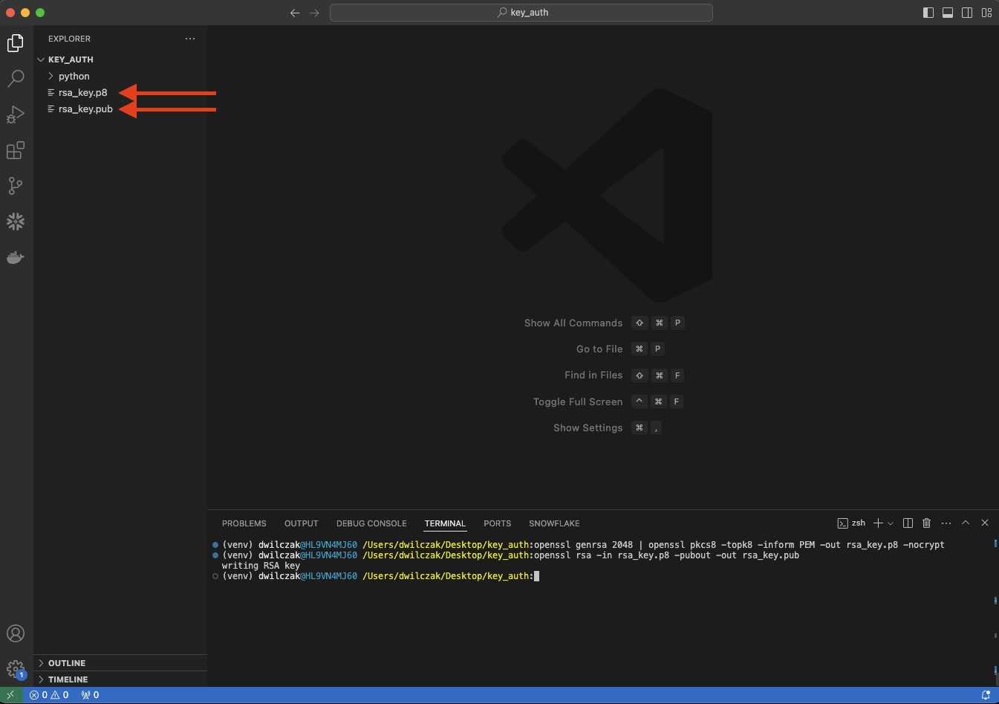
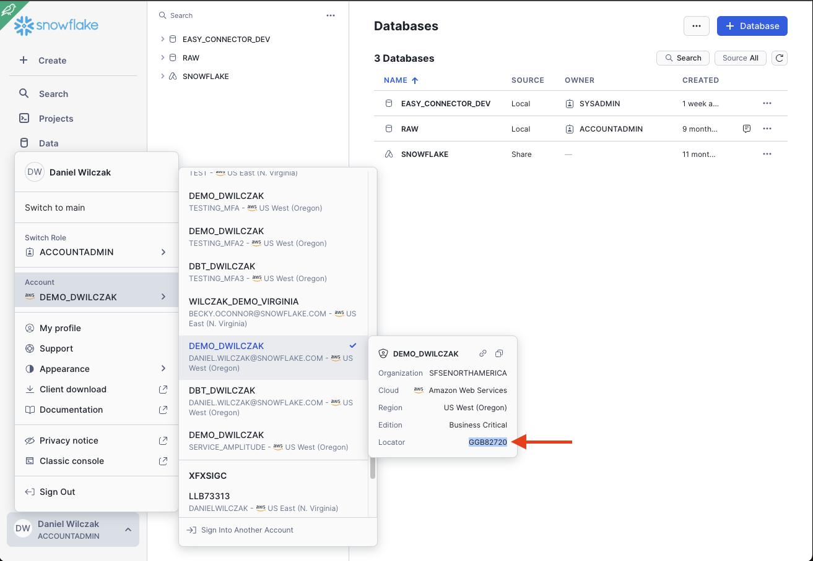

# Key Pair Authentication
In this tutorial we will show how to setup a user with key pair authentication. We will then use a python example to connect to our account and run a simple query.

For the official Snowflake documentation this tutorial was based on:
[https://docs.snowflake.com/en/user-guide/key-pair-auth](https://docs.snowflake.com/en/user-guide/key-pair-auth)

## Video
Video is still in development.

## Requirement
This tutorial assumes you have nothing in your Snowflake account ([Trial](https://signup.snowflake.com/)) and no complex security needs.

## Setup :octicons-feed-tag-16:
To start we will create a new user with no password setup. I added a role to show a parameter we can set. The user doesnt not need Sysadmin access.


### User creation
=== ":octicons-image-16: Setup"

    ```sql linenums="1"
    use role useradmin;

    create user <user_name>
        default_role = <role_name>>;
    ```   

=== ":octicons-image-16: Example"

    ```sql linenums="1"
    use role useradmin;

    create user danielwilczak
        default_role = sysadmin;
    ```

=== ":octicons-image-16: Result"

    ``` linenums="1"
    User DANIELWILCZAK successfully created.
    ```

### Create Key
Lets create the private and public key so that we can apply the public key to our user.

=== ":octicons-image-16: Setup"

    ```bash linenums="1"
    openssl genrsa 2048 | openssl pkcs8 -topk8 -inform PEM -out rsa_key.p8 -nocrypt
    openssl rsa -in rsa_key.p8 -pubout -out rsa_key.pub
    ```   

=== ":octicons-image-16: Result"

    ```bash linenums="1"
    Writing RSA key.
    ```

This will create two files in the folder we are currently located.


### Apply key to user
Lets apply the public key to our user in Snowflake. The public key file will end with ``.pub``.

=== ":octicons-image-16: Setup"

    ```sql linenums="1"
    alter user danielwilczak set 
        rsa_public_key='<Public Key>';  /* (1)! */
    ```   

    { .annotate }

    1.  The public key file will end with ``.pub``. We got this from our "create key step".

=== ":octicons-image-16: Example"

    ```sql linenums="1"
        alter user danielwilczak set 
        rsa_public_key='MIIBIjANBgkqhkiG9w0BAQEFAAOCAQ8AMIIBCgKCAQEAsLiIQpJ0SkB0KgyN/Cj5
            O+3W3zIN5HvjBwsQnVbXAGpu920fohXRQAFc5hZpMNZOGNsLvl1YY1HtQ15j4K7o
            Ip3Eo2.............................................EUnH8sGWDvH+U
            g5ha+Sa6KD5864ajlkylKFiu9T++GQaItyLNsOVx8AGi8J4oDtv02a6MlG7oDyOo
            ArBubofdmM+8exWL7NfYNfV04Wjnpz5itGNq9CM718Fx910mom4sIUPBGQC0Dnio
            Wr9cvDxXmfWdRUjgeKDGAwrvXP9+PtCMoLlo+eYjWhz9Gii2lxdHqfLgY67ZCa1t
            ZQIDAQAB';
    ```

=== ":octicons-image-16: Result"

    ``` linenums="1"
    Statement executed successfully.
    ```

## Example using Python :octicons-feed-tag-16:
With our key now set on the user, lets use the key to connect to Snowflake via a local python script.


### Dependencies
Lets pip install the needed packages first. I reccomend doing this in a python virtual envirement via ``python3 -m venv venv``.
=== ":octicons-image-16: Setup"

    ```sql linenums="1"
    pip3 install snowflake-connector-python
    pip3 install cryptography
    ```

### Code
Here is the code we'll use. Please fill in the four needed areas.

??? warning "Using the correct account locator."

    If your Snowflake account is in anther region other then US EAST (Oregon). Please prepend your locator with the region ``xy12345.us-east-1`` read the [Account Identifiers](https://docs.snowflake.com/en/user-guide/admin-account-identifier#non-vps-account-locator-formats-by-cloud-platform-and-region) documentation to learn how to format your account locator based on your region. 

=== ":octicons-image-16: Setup"

    ```python linenums="1"
    import snowflake.connector
    import os
    from cryptography.hazmat.backends import default_backend
    from cryptography.hazmat.primitives.asymmetric import rsa
    from cryptography.hazmat.primitives.asymmetric import dsa
    from cryptography.hazmat.primitives import serialization

    # Load the private key from a file
    with open("rsa_key.p8", "rb") as key:
        p_key = serialization.load_pem_private_key(
            key.read(),
            password=None,
            backend=default_backend()
        )

    # Convert the private key to bytes
    pkb = p_key.private_bytes(
        encoding=serialization.Encoding.DER,
        format=serialization.PrivateFormat.PKCS8,
        encryption_algorithm=serialization.NoEncryption()
    )

    # Connect to Snowflake
    ctx = snowflake.connector.connect(
        user='<User Name>',  /* (1)! */
        account='<Account Locator>',  /* (2)! */
        private_key=pkb
    )

    # Create a cursor
    cs = ctx.cursor()

    # Example query
    try:
        cs.execute("select current_user()")
        result = cs.fetchone()
        print(result)
    finally:
        cs.close()
        ctx.close()
    ```
    { .annotate }
    
    1.  Name we gave to the user in our setup section.

    2.  
        

=== ":octicons-image-16: Example"

    ```python linenums="1"
    import snowflake.connector
    import os
    from cryptography.hazmat.backends import default_backend
    from cryptography.hazmat.primitives.asymmetric import rsa
    from cryptography.hazmat.primitives.asymmetric import dsa
    from cryptography.hazmat.primitives import serialization

    # Load the private key from a file
    with open("rsa_key.p8", "rb") as key:
        p_key = serialization.load_pem_private_key(
            key.read(),
            password=None,
            backend=default_backend()
        )

    # Convert the private key to bytes
    pkb = p_key.private_bytes(
        encoding=serialization.Encoding.DER,
        format=serialization.PrivateFormat.PKCS8,
        encryption_algorithm=serialization.NoEncryption()
    )

    # Connect to Snowflake
    ctx = snowflake.connector.connect(
        user='danielwilczak',
        account='GGB82720',
        private_key=pkb
    )

    # Create a cursor
    cs = ctx.cursor()

    # Example query
    try:
        cs.execute("select current_user()")
        result = cs.fetchone()
        print(result)
    finally:
        cs.close()
        ctx.close()
    ```

=== ":octicons-image-16: Result"

    ``` linenums="1"
    ('DANIELWILCZAK',)
    ```