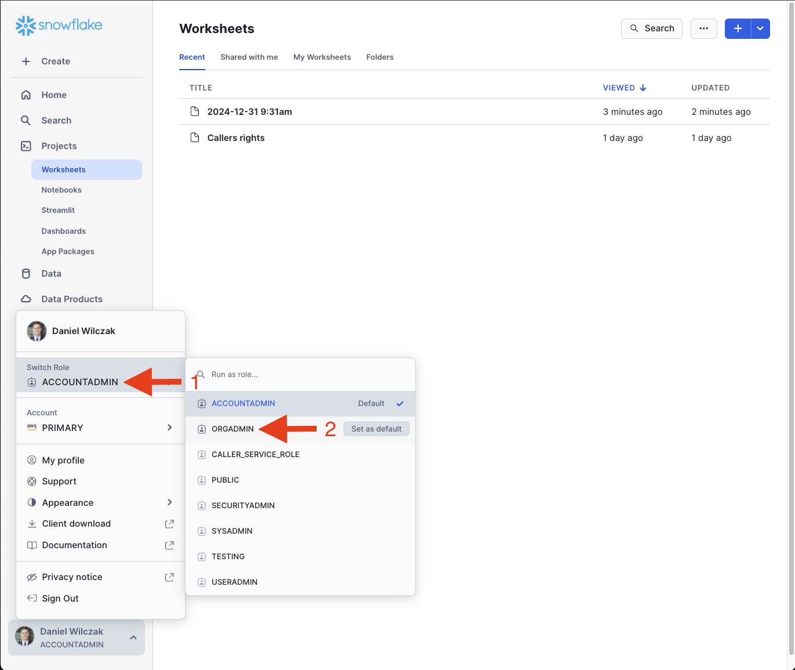
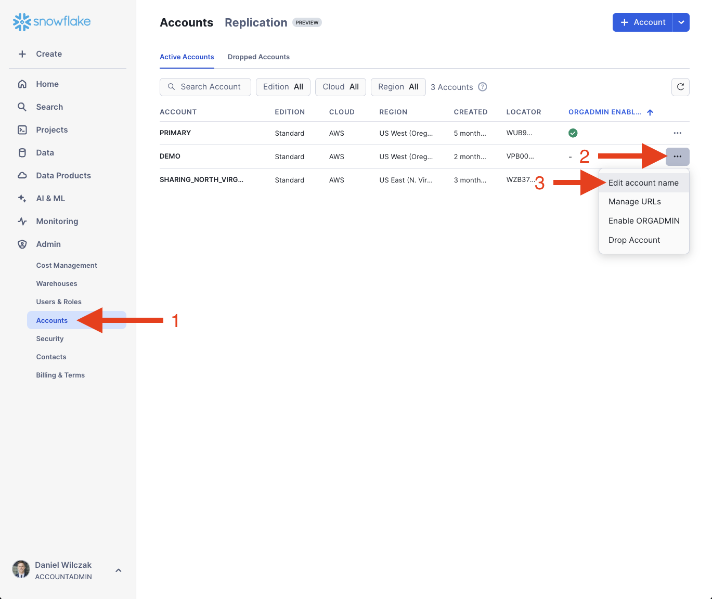

# Change Name - Account and Organization
In this tutorial we will show how you can update your orginization and account name.

## Video
Video in development

## Requirement
- Must be on a on-demand (Paying) or contracted account, you CAN NOT be on [free trial](https://signup.snowflake.com/). We also assume no complex security needs.

## Walk Through :octicons-feed-tag-16:
When it comes to updating organization names there is only one way and that is via a support ticket where as account name updates can happen one of two way. One being via a support ticket where as the other is via the UI. We will show both.

### Organization / account name
Lets start a support ticket to update our organization name. To start we will click on our profile name in the bottom left corner and click on support.


??? warning "If you have not submitted a ticket in the past or added your email to their user profile"

    You will have to setup an email in your profile before you are allowed to submit a support ticket. To add a email we will navigate to the your profile.
    

    Update the email and click save.
    


Click on "+ support ticket" to add a new ticket


We will fill in the support ticket with the settings showen and click "create case".


We are done! Typically your account will be updated the same day but could take 24-48 hours.

### Account name via UI (Option 2)
!!! warning 

    You can not edit your account name if it's the only account via this option. You will not be given the option and will have to submit a support ticket.

The section option is via the UI where we enable the ``orgadmin`` role and go to the accounts page to edit our accounts name. Start by running the code below to enable ``orgadmin``.

=== ":octicons-image-16: Code"

    ```sql linenums="1"
    -- Assume the ACCOUNTADMIN role
    USE ROLE accountadmin;

    -- Grant the ORGADMIN role to a user
    GRANT ROLE orgadmin TO USER <username>;
    ```

=== ":octicons-image-16: Example"

    ```sql linenums="1"
    -- Assume the ACCOUNTADMIN role
    USE ROLE accountadmin;

    -- Grant the ORGADMIN role to a user
    GRANT ROLE orgadmin TO USER danielwilczak;
    ```

=== ":octicons-sign-out-16: Result"

    | status                              |
    |-------------------------------------|
    | Statement executed successfully.    |


Once you have ``orgadmin`` role enable for your user, we'll switch to the role.


Now that we switch to the ``orgadmin`` role we will see a new tab under the admin section called ``accounts``. We'll click on that and then click the three dots next to the account we want to change the name of.


Now we can change the name of the account and click save.
