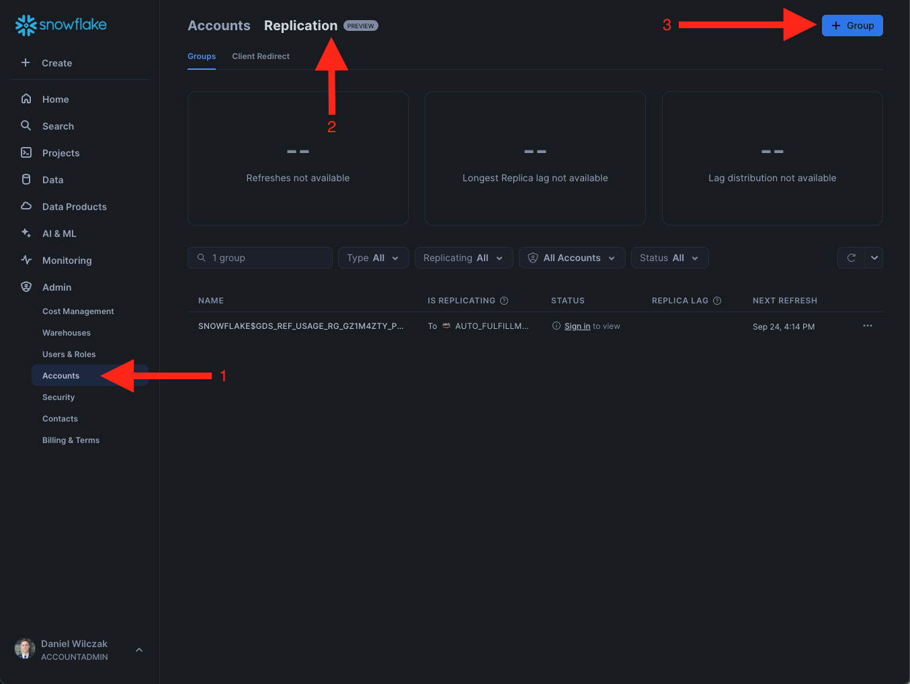
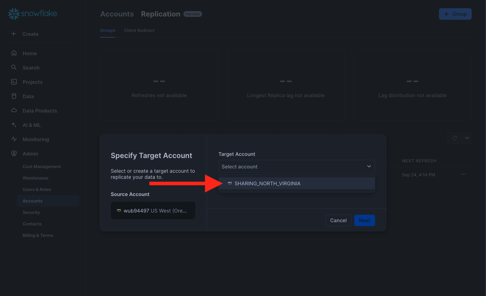
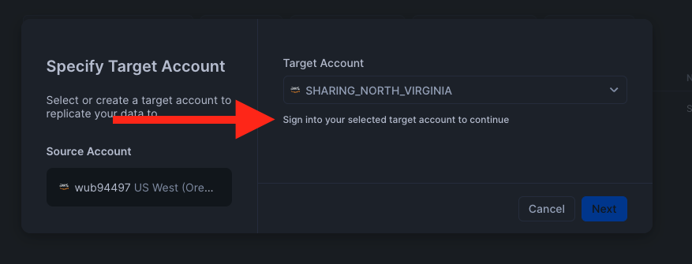
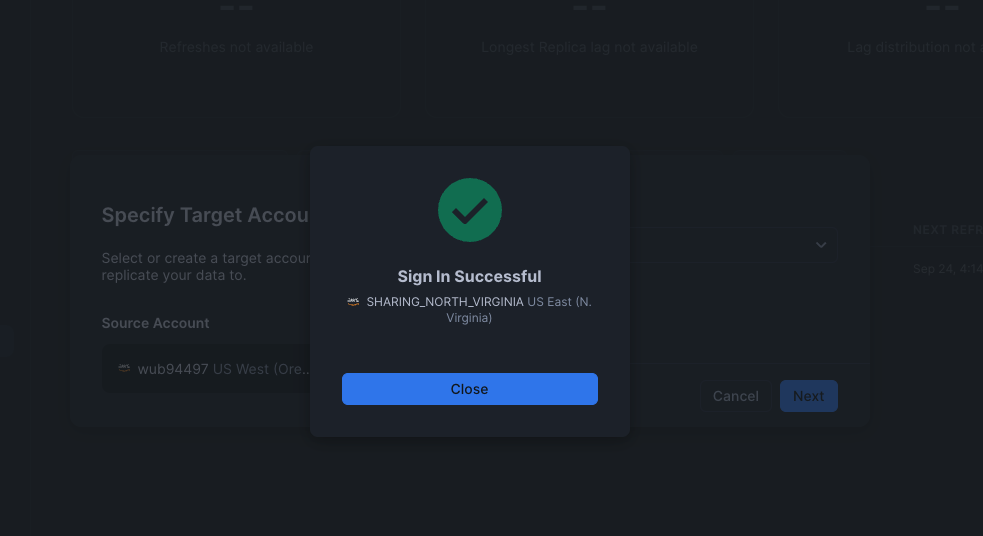
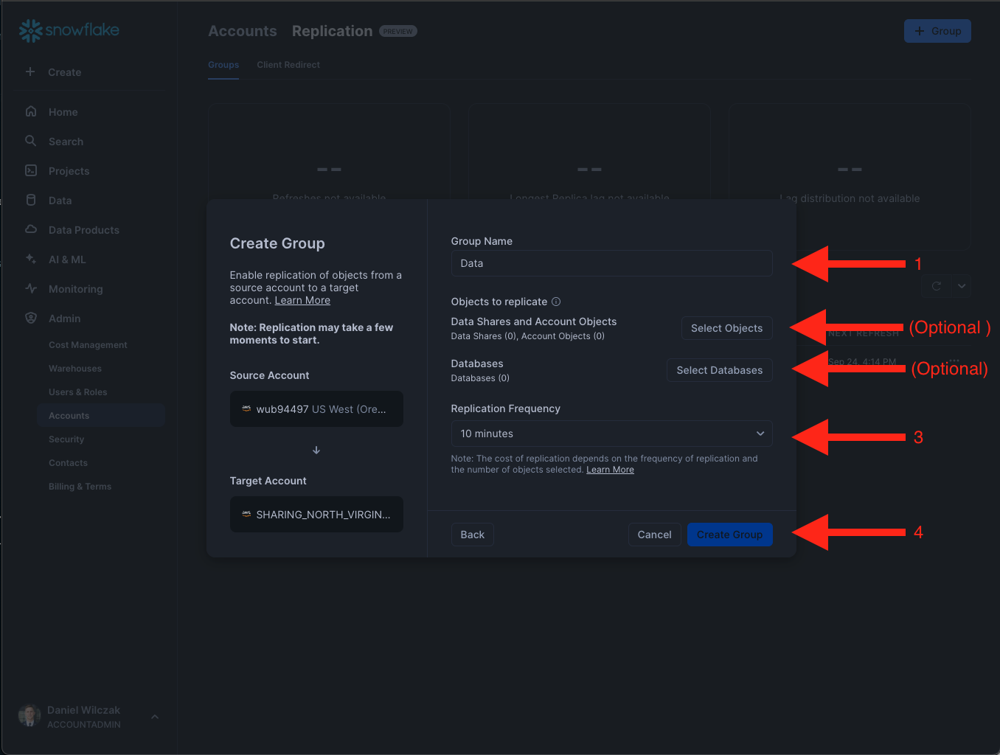
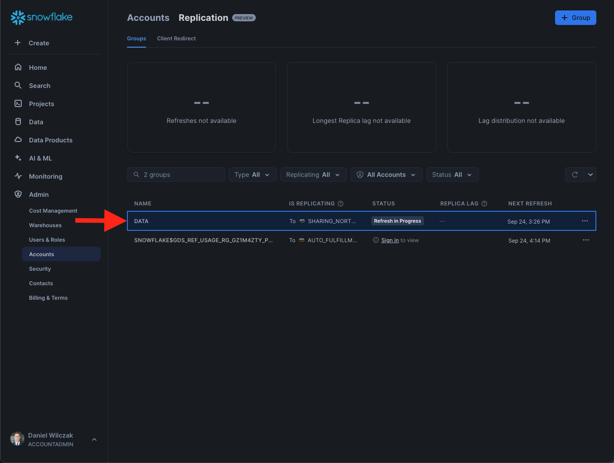

# Replication
This tutorial will show how to replicate your data from one Snowflake account to anther. 

## Video
Video is still in development.

## Requirement
You will need to be an **account admin** and **orgadmin** role.

?!? warning "You will need to enable orgadmin role to see the account page under the admin page."
```sql
use role accountadmin;

-- (option 1) grant the orgadmin role to a user.
grant role orgadmin to user <username>;

-- (option 2) grant orgadmin to a role.
grant role orgadmin to role <role>;
```


## Walk Through :octicons-feed-tag-16:

First we'll want to enable the other account to be able to replicate to. Please put in your orginization name and account name.
```sql
-- If you do not have this role please read warning above.
use role orgadmin;

/* View the list of the accounts in your organization. NOTE the
   organization name and account name for each account for which
    you are enabling replication.
*/
show accounts;

/* 
    Enable replication by executing this statement for
    each source and target account in your organization.
*/

select system$global_account_set_parameter(
    '<orginization>.<account name>',
    'enable_account_database_replication',
    'true'
);
```


Next navigate to the account page and select replication and finally "+ group".


Select the account you enabled.


Once selected you will want to login to confirm the connection of the other account.


Once logged in you will see it being succesful.


Next we'll want to name the replication, select the objects to replicate and a replication frequency.


Once you click create you will begin the replication process. Once it's replicated you will recieve metrics about how much has been replicated.
