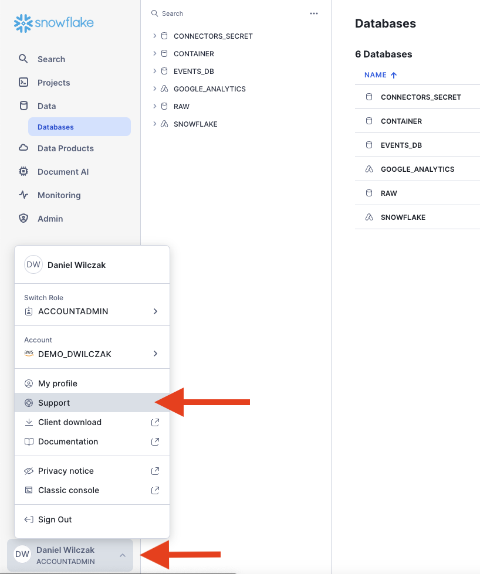
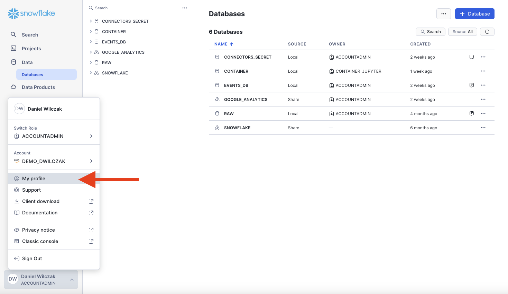
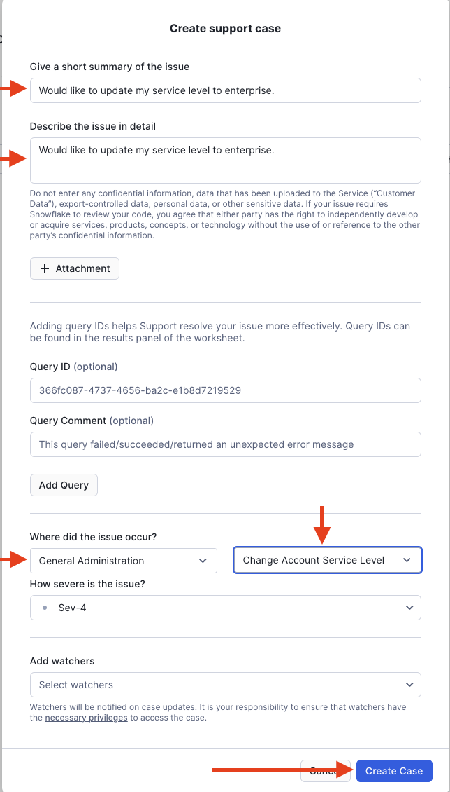

# Change Service Level
To change your service level in snowflake to Standard, Enterprise, or Busniess Critical we will need to submit a support ticket and this tutorial will show how.

## Video
<iframe width="850px" height="478px" src="https://www.youtube.com/embed/fQF8MZiY2nM?si=RjLCH-rId-vwHeRz" title="YouTube video player" frameborder="0" allow="accelerometer; autoplay; clipboard-write; encrypted-media; gyroscope; picture-in-picture; web-share" referrerpolicy="strict-origin-when-cross-origin" allowfullscreen></iframe>

## Requirement
You will need to be an **account admin** to submit the support ticket request.

## Walk Through :octicons-feed-tag-16:

To start we will click on our profile name in the bottom left corner and click on support.

??? warning "If you have not submitted a ticket in the past or added your email to their user profile"

    You will have to setup an email in your profile before you are allowed to submit a support ticket. To add a email we will navigate to the your profile.
    

    Update the email and click save.
    

Click on "+ support ticket" to add a new ticket

We will fill in the support ticket with the settings showen and click "create case".

We are done! Typically your account will be updated the same day but could take 24-48 hours. If this is not the case (Longer then 48 hours), please reachout to your account team.

