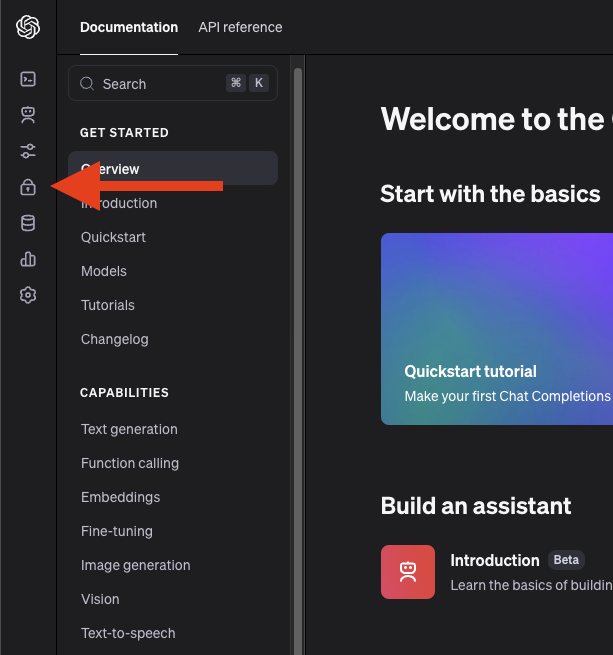
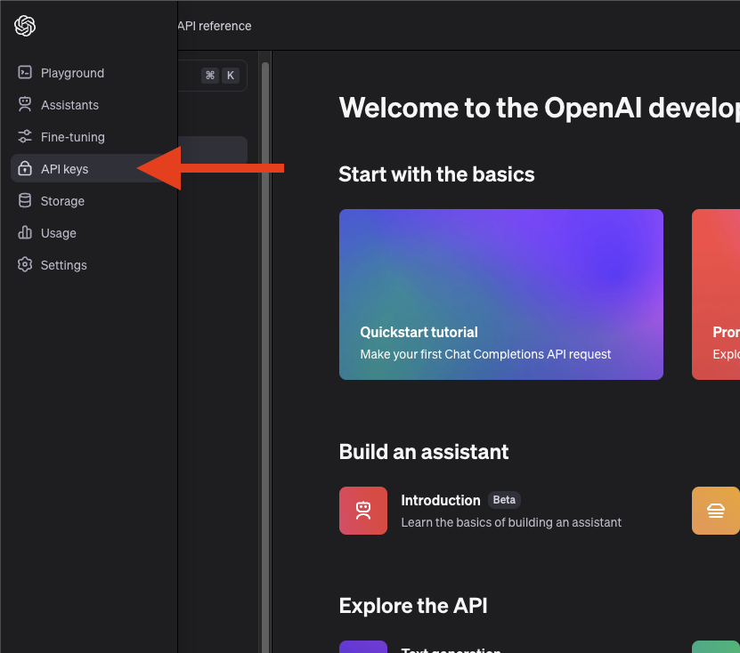
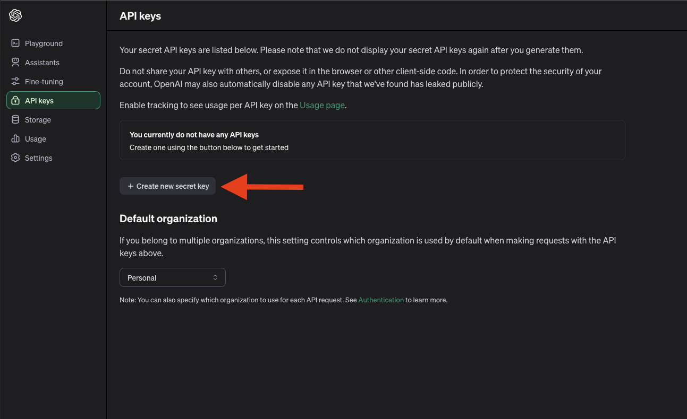

# Chatgpt in Snowflake
In this tutorial we will show you how to integrate chatgpt "Open.ai" into a user defined function in Snowflake, so it can be used anywhere.

## Video
Video still in development.

## Requirement
This tutorial assume you have an account with [openai.com](openai.com). You will need to get an api token from it.

## Setup :octicons-feed-tag-16:
In this section we will do the setup to support our user-defined function by:

??? note "If you don't have a database, schema or warehouse yet."

    === ":octicons-image-16: Database, schema and warehouse"

        ```sql
        use role sysadmin;
        
        -- Create a database to store our schemas.
        create database if not exists 
            api comment='This is only api data from our sources.';

        -- Create the schema. The schema stores all our objectss.
        create schema if not exists api.functions;

        /*
            Warehouses are synonymous with the idea of compute
            resources in other systems. We will use this
            warehouse to call our user defined function.
        */
        create warehouse if not exists developer 
            warehouse_size = xsmall
            initially_suspended = true;

        use database api;
        use schema functions;
        use warehouse developer;
        ```

=== ":octicons-image-16: Setup"

    ```sql linenums="1"
    use role accountadmin;

    create or replace network rule chatgpt_network_rule
        mode = egress
        type = host_port
        value_list = ('api.openai.com');

    create or replace secret chatgpt_api_key
        type = generic_string
        secret_string='OPENAI API KEY HERE';  /* (1)! */

    create or replace external access integration openai_integration
        allowed_network_rules = (chatgpt_network_rule)
        allowed_authentication_secrets = (chatgpt_api_key)
        enabled=true;
    ```
    { .annotate }

    1.  Go to [openai.com](openai.com) and log in.

        
        
        Click on Api Keys.
        

        Click create new secret key and then copy it into your code.
        


### Function
Let's create the python user defined function to make it easy to access later.

=== ":octicons-image-16: Function"

    ```python linenums="1"

    create or replace function api.functions.chatgpt("question" varchar)
        returns varchar
        language python
        runtime_version = '3.8'
        packages = ('requests','openai')
        handler = 'chatgpt'
        external_access_integrations = (openai_integration)
        secrets = ('cred'=chatgpt_api_key)
    AS '
    import _snowflake

    from openai import OpenAI

    def chatgpt(question):
        openai_api_key = _snowflake.get_generic_secret_string(''cred''')

        client = OpenAI(api_key=openai_api_key)
        completion = client.chat.completions.create(
            model="gpt-3.5-turbo",
            messages=[{"role": "user", "content": question}]
        )    
        return completion.choices[0].message.content
    ';
    ```

### Use
Lets use the function. Chatgpt's comments are so nice.

=== ":octicons-image-16: Use"

    ```sql linenums="1"
    select api.functions.chatgpt('Can you tell me how amazing daniels tutorials are?'); 
    ```

=== ":octicons-image-16: Result"
    Yes, Daniels tutorials are incredibly informative, easy to follow, and thorough. He breaks down complex concepts into simple, easy-to-understand steps and provides clear explanations and examples. Whether you are a beginner or an advanced learner, Daniels tutorials are a valuable resource for learning and mastering new skills. Overall, they are truly amazing and highly recommended.
