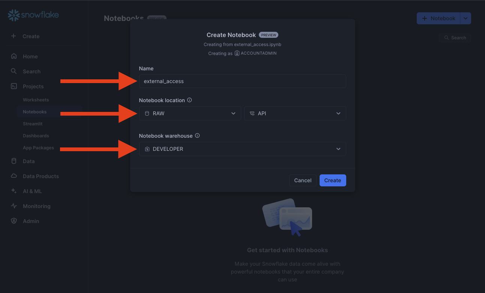
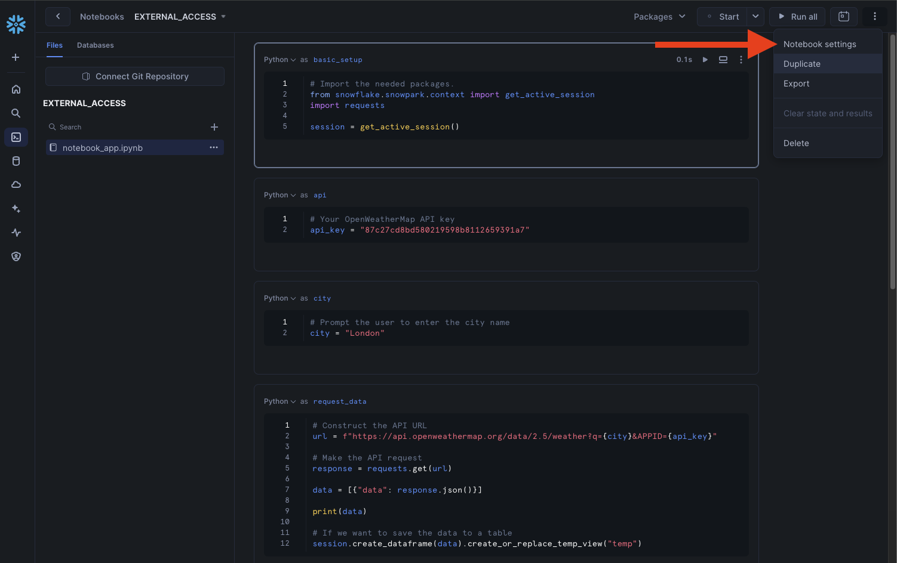

# Notebooks with external access
In this tutorial we will show how to connect a notebook to an external api to get data from it.

## Video
<iframe width="850px" height="478px" src="https://www.youtube.com/embed/SCEF0WZZmoY?si=1YYbM5XSxPIVNRDb" title="YouTube video player" frameborder="0" allow="accelerometer; autoplay; clipboard-write; encrypted-media; gyroscope; picture-in-picture; web-share" referrerpolicy="strict-origin-when-cross-origin" allowfullscreen></iframe>

## Requirement
- Must be on a on-demand (Paying) or contracted account. This is due to [external access](https://docs.snowflake.com/en/developer-guide/external-network-access/external-network-access-limitations#limitations) not being allowed on trial accounts. We also assume not complex security requirement.

## Downloads
- Notebook ([Link](https://sfc-gh-dwilczak.github.io/tutorials/snowflake/api/introduction/notebook/external_access.ipynb))

## Setup :octicons-feed-tag-16:
Lets start the network setup prcoess in Snowflake. 

??? note "If you don't have a database, schema or warehouse yet."

    === ":octicons-image-16: Database, schema and warehouse"

        ```sql
        use role sysadmin;
        
        -- Create a database to store our schemas.
        create database if not exists raw;

        -- Create the schema. The schema stores all our objectss.
        create schema if not exists raw.api;

        /*
            Warehouses are synonymous with the idea of compute
            resources in other systems. We will use this
            warehouse to call our user defined function.
        */
        create warehouse if not exists developer 
            warehouse_size = xsmall
            initially_suspended = true;

        use database raw;
        use schema api;
        use warehouse developer;
        ```


### External Access
First lets start by setting up the network rules in a worksheet to allow our Snowflake Notebook to talk with our external source.
=== ":octicons-image-16: Setup"

    ```sql linenums="1"
    create or replace network rule openweathermap_network_rule
        mode = egress
        type = host_port
        value_list = ('api.openweathermap.org');

    use role accountadmin;

    create or replace external access integration openweathermap_access_integration
        allowed_network_rules = (openweathermap_network_rule)
        enabled = true;
    ```   

=== ":octicons-image-16: Result"

    ``` linenums="1"
    Integration OPENWEATHERMAP_ACCESS_INTEGRATION successfully created.
    ```

### Notebook
Next lets import the example notebook in our database / schema.


Next lets assign it to our database/schema


To enable our notebook to talk outside of Snowflake we'll have to enable the notebook to use that external access we created before. We can do this by going to Notebooks settings.


Next clicking "external access" and then checking our external access.


Finally we'll click "run all" and see our notebook query an outside source and put the results into a table for us.


