# Snowflake - AWS S3 bucket:

<iframe width="850px" height="478px" src="https://www.youtube.com/embed/KYRlISpJx_E?si=_c4N9_GejASpxsZm" style="display:block;" title="YouTube video player" frameborder="0" allow="accelerometer; autoplay; clipboard-write; encrypted-media; gyroscope; picture-in-picture; web-share" allowfullscreen></iframe>

This tutorial assumes you have nothing in your Snowflake account ([Trial](https://signup.snowflake.com/)) and no complex security needs. The tutorial can be started at any step.


## 1. Snowflake - Setup:

Let's start by setting up snowflake before we jump to aws. Lets create a worksheet in snowflake and add the code below with your information and hit run:

=== ":octicons-image-16: Worksheet"
    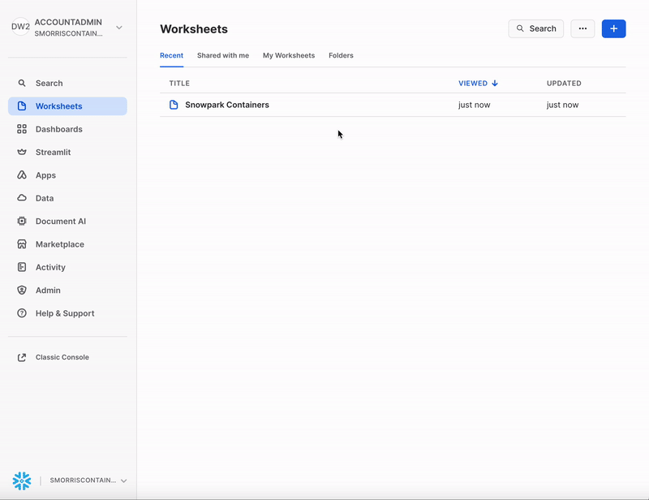

=== ":octicons-image-16: Code"
    ```sql
    use role sysadmin;
    create database if not exists raw comment='This is only raw data from your source.';

    -- Create the schema. The schema stores all objectss.
    create schema if not exists raw.aws;
    ```

=== ":octicons-sign-out-16: Result"
    ```
    Schema AWS successfully created.
    ```

### S3 Setup (Part 1):
Create the bucket you intend to use. In our case we'll call the bucket **danielwilczak**.
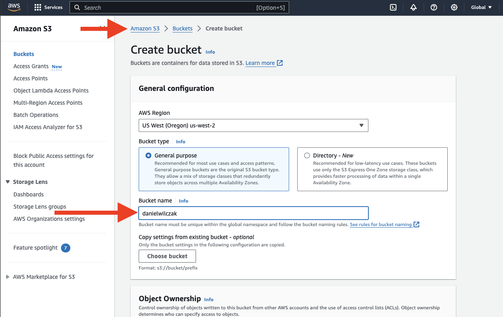

Upload the [sample data](https://sfc-gh-dwilczak.github.io/tutorials/snowflake/aws/data/sample.zip) to your s3 bucket (json/csv) provided in the data folder.
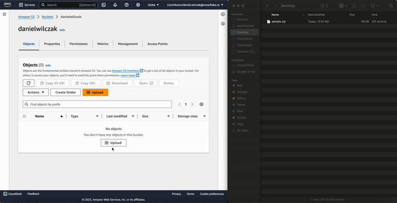

Copy your **ARN** name. This wil be used in step 7.
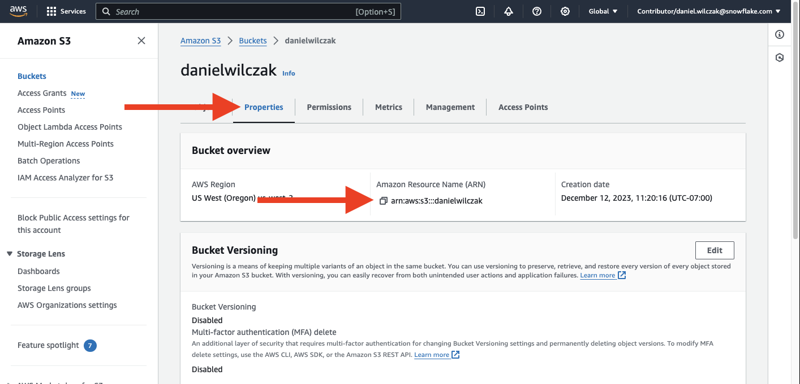

Go to IAM:
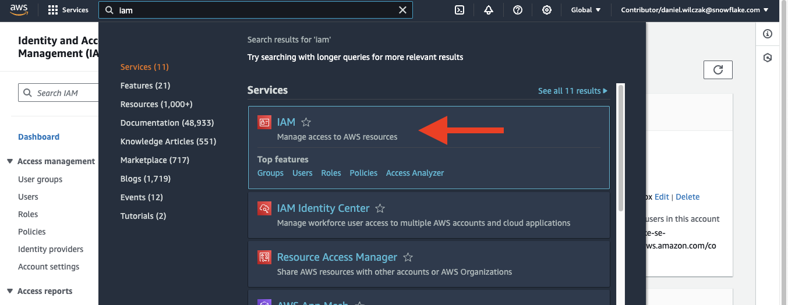

Create a policy:
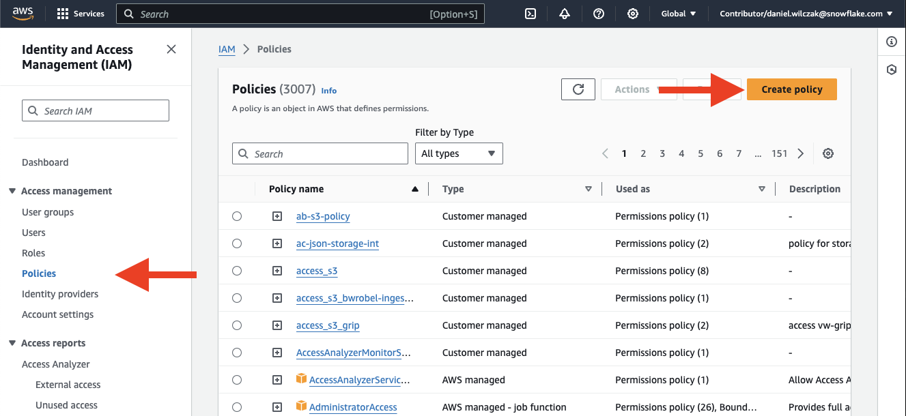

Give the policy a name:
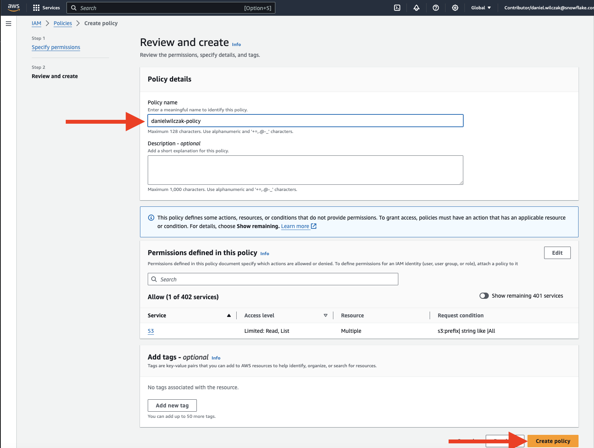

Add the template policy json code below and add your arn we copied from step 3 and click create policy:

=== ":octicons-image-16: Policy"

    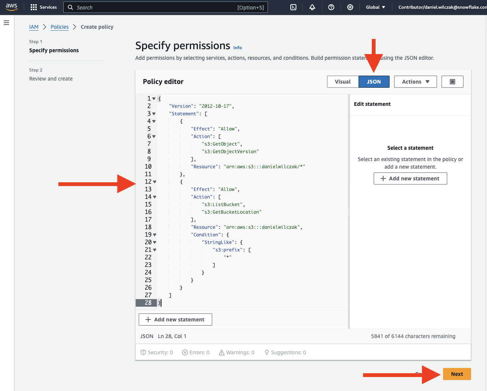
    
=== ":octicons-sign-out-16: Json Template"

    ```json
        {
            "Version": "2012-10-17",
            "Statement": [
                {
                    "Effect": "Allow",
                    "Action": [
                    "s3:GetObject",
                    "s3:GetObjectVersion"
                    ],
                    "Resource": "<COPY ARN HERE>/*"
                },
                {
                    "Effect": "Allow",
                    "Action": [
                        "s3:ListBucket",
                        "s3:GetBucketLocation"
                    ],
                    "Resource": "<COPY ARN HERE>",
                    "Condition": {
                        "StringLike": {
                            "s3:prefix": [
                                "*"
                            ]
                        }
                    }
                }
            ]
        }
    ```

Lets create a role! Navigate back to **IAM**:


Lets create a role:
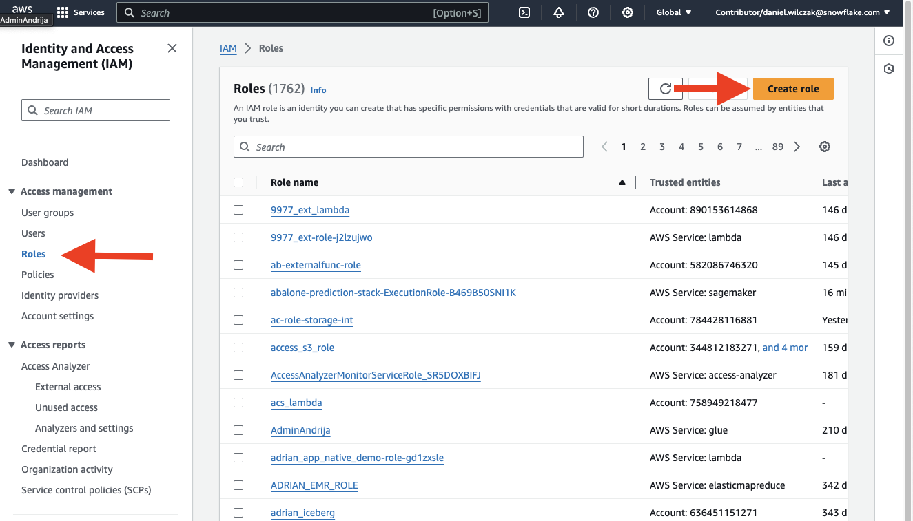

Select AWS account, This account(#), Require external ID and enter 0000 for now. We will update this later.
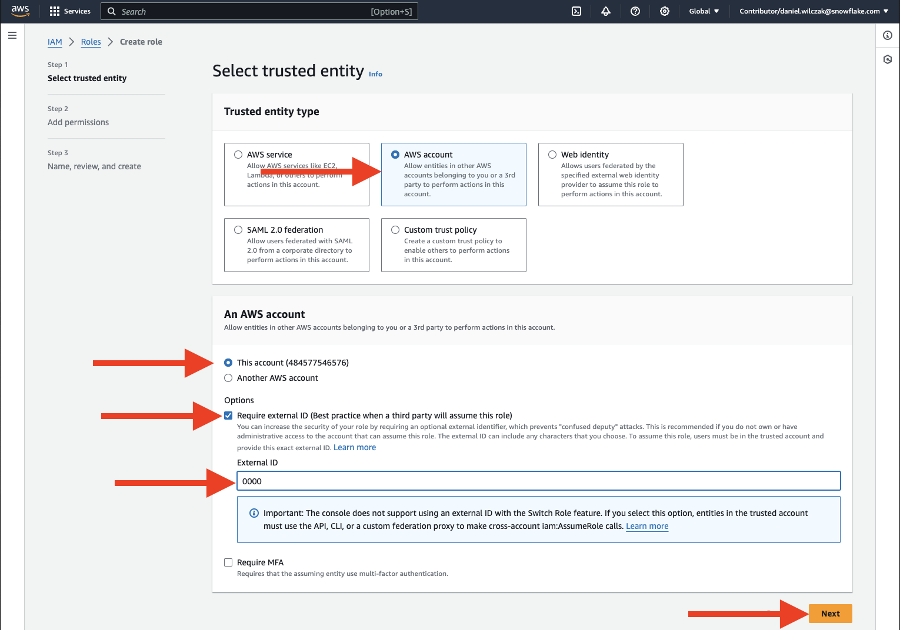

Add the policy to the role:
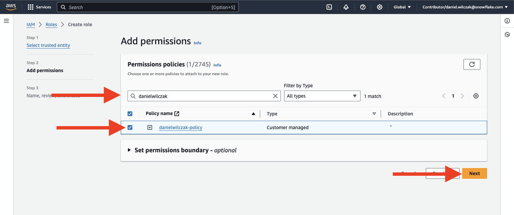

Add the role name and click "create role":
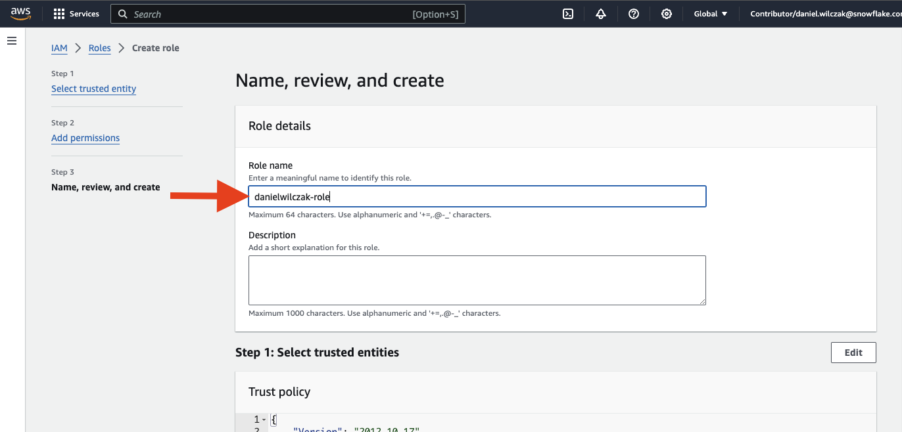

Once created click your role:
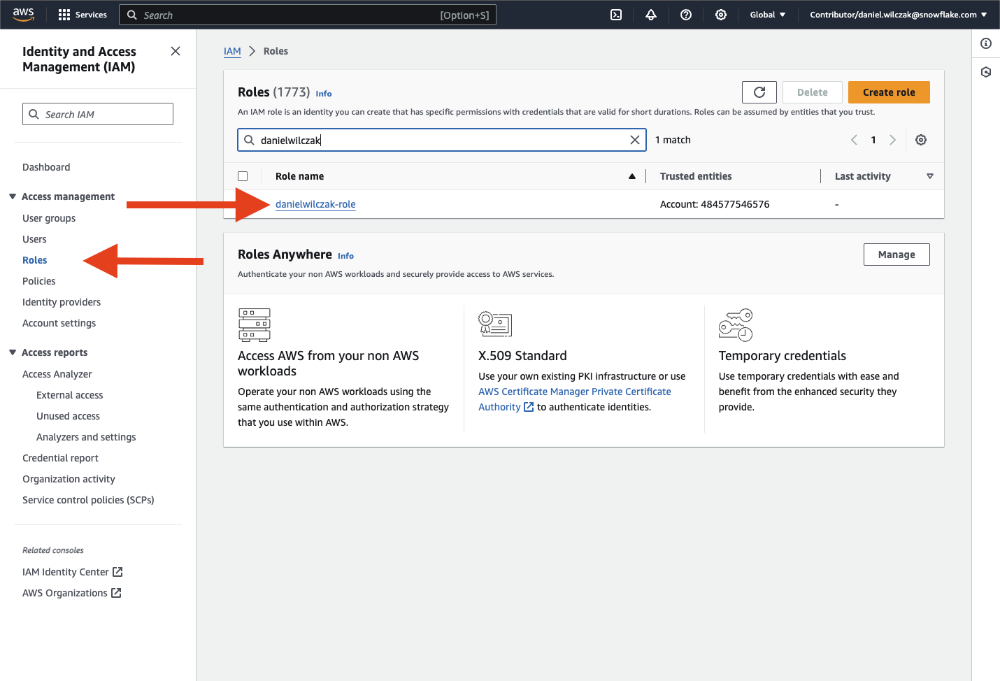

Copy your role ARN, this will be used in step 15:
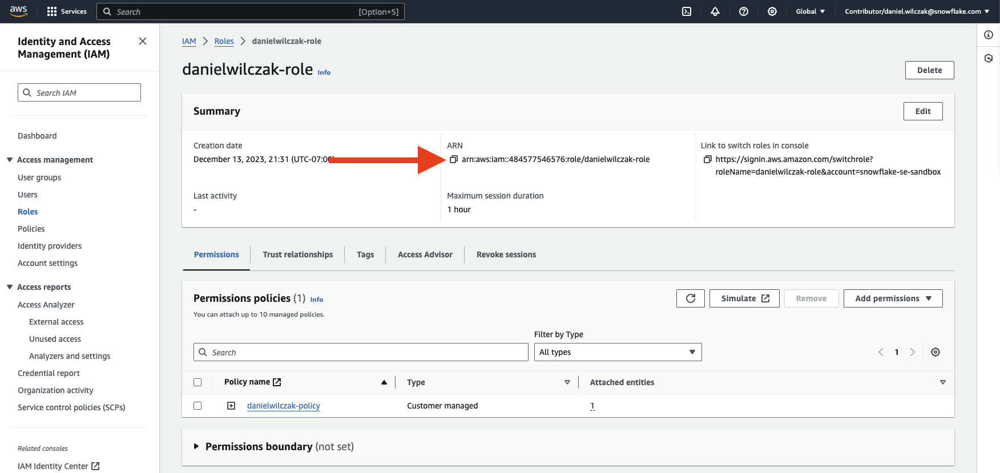

## 2. Snowflake - Integration:
Create the integration in snowflake by running the code below with **your copied role arn** and **bucket name**:

=== ":octicons-image-16: Code"

    ```sql
    use role ACCOUNTADMIN;

    create or replace storage integration s3_integration
    type = external_stage
    storage_provider = 's3'
    enabled = true
    storage_aws_role_arn = 'arn:aws:iam::484577546576:role/danielwilczak-role'
    storage_allowed_locations = ('s3://danielwilczak/');

    -- Give the sysadmin access to use the integration.
    grant usage on integration s3_integration to role sysadmin;

    -- Note the two below we will put them back into AWS later:
    --   STORAGE_AWS_IAM_USER_ARN
    --   STORAGE_AWS_EXTERNAL_ID 
    desc integration s3_integration;
    select "property", "property_value" from TABLE(RESULT_SCAN(LAST_QUERY_ID()))
    where "property" = 'STORAGE_AWS_IAM_USER_ARN' or "property" = 'STORAGE_AWS_EXTERNAL_ID';
    ```

=== ":octicons-sign-out-16: Result"

    | property                 | property_value                                  |
    |--------------------------|-------------------------------------------------|
    | STORAGE_AWS_IAM_USER_ARN | arn:aws:iam::001782626159:user/8pbb0000-s       |
    | STORAGE_AWS_EXTERNAL_ID  | GGB82720_SFCRole=2_vcN2MIiC7PW0OMOyA82W5BLJrqY= |

### S3 setup (Part 2):
Navigate back to the role:


Click trusted relationship:
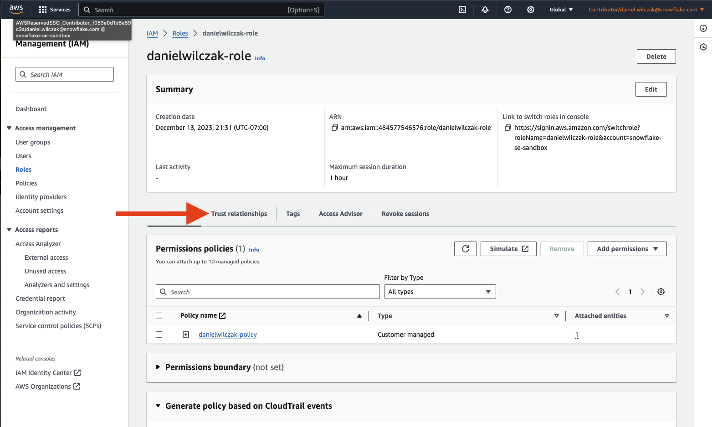

Click edit trust policy:
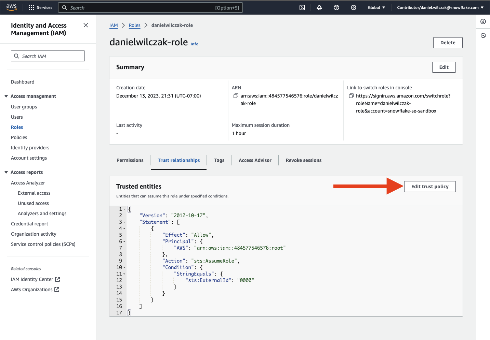

Copy the policy json template code below and add your "STORAGE_AWS_IAM_USER_ARN" and "STORAGE_AWS_EXTERNAL_ID" from [part 2](https://sfc-gh-dwilczak.github.io/tutorials/snowflake/aws/readme/#2-snowflake-integration).

=== ":octicons-image-16: Policy"

    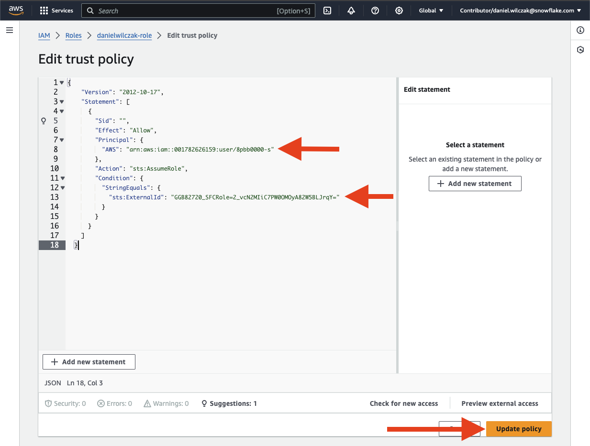
    
=== ":octicons-sign-out-16: Json Template"

    ```json
    {
        "Version": "2012-10-17",
        "Statement": [
        {
            "Sid": "",
            "Effect": "Allow",
            "Principal": {
            "AWS": "<STORAGE_AWS_IAM_USER_ARN>"
            },
            "Action": "sts:AssumeRole",
            "Condition": {
            "StringEquals": {
                "sts:ExternalId": "<STORAGE_AWS_EXTERNAL_ID>"
            }
            }
        }
        ]
    }
    ```

## 3. Snowflake - Stage and Load:
Final step, lets create a stage, file format, warehouse and table and copy data into it. Copy the code below and run it in a new worksheet.

=== ":octicons-image-16: Code"

    ```sql
    use role sysadmin;
    use database raw;
    use schema aws;

    -- Stages are synonymous with the idea of folders that can be either internal or external.
    create or replace stage s3
        storage_integration = s3_integration
        url = 's3://danielwilczak/'
        directory = ( enable = true);

    -- Create a file format so the "copy into" know how to copy the data.
    create or replace file format json
        type = 'json';

    -- Create a warehouse to do the compute/processing.
    create or replace warehouse developer 
        WAREHOUSE_SIZE=XSMALL
        INITIALLY_SUSPENDED=TRUE;

    -- Load json data
    create or replace table data (
        file_name varchar,
        data variant
    );

    copy into data(file_name,data)
    from (
        select 
            metadata$filename,
            $1
        from
            @s3/json
            (file_format => json)
    );
    ```

=== ":octicons-sign-out-16: Result"

    | file                                | status | rows_parsed | rows_loaded | error_limit | errors_seen |
    |-------------------------------------|--------|-------------|-------------|-------------|-------------|
    | s3://danielwilczak/json/sample.json | LOADED | 1           | 1           | 1           | 0           |


## 4. (Bonus) SnowPipe:
Lets create a pipe to automate copying data into a table. Create the file format, table and pipe in snowflake. This approach automates the process so you don't have to manually name all the columns.

=== ":octicons-image-16: Code"

    ```sql
    -- Copy CSV data using a pipe without having to write out the column names.
    create or replace file format infer
        type = csv
        parse_header = true
        skip_blank_lines = true
        field_optionally_enclosed_by ='"'
        trim_space = true
        error_on_column_count_mismatch = false;

    -- Creat the table with the column names generated for us.
    create or replace table csv
        using template (
            select array_agg(object_construct(*))
            within group (order by order_id)
            from table(
                infer_schema(        
                LOCATION=>'@s3/csv'
            , file_format => 'infer')
            )
        );

    -- Create the pipe to load any new data.
    create pipe csv auto_ingest=true as
        COPY into
            csv
        from
            @s3/csv
            
        FILE_FORMAT = (FORMAT_NAME= 'infer')
        MATCH_BY_COLUMN_NAME=CASE_INSENSITIVE;

    -- Get the arn for the pipe. We will add this to aws in step the next aws step.
    show pipes;
    select "name", "notification_channel" from TABLE(RESULT_SCAN(LAST_QUERY_ID()));
    ```

=== ":octicons-sign-out-16: Result"

    | name | notification_channel                                                                        |
    |------|---------------------------------------------------------------------------------------------|
    | CSV  | arn:aws:sqs:us-west-2:001782626159:sf-snowpipe-AIDAQA2SAW5XRW6XL6U34-jhWVvR4Mod-EuXdJBwygJQ |

Navigate to your bucket and click properties:
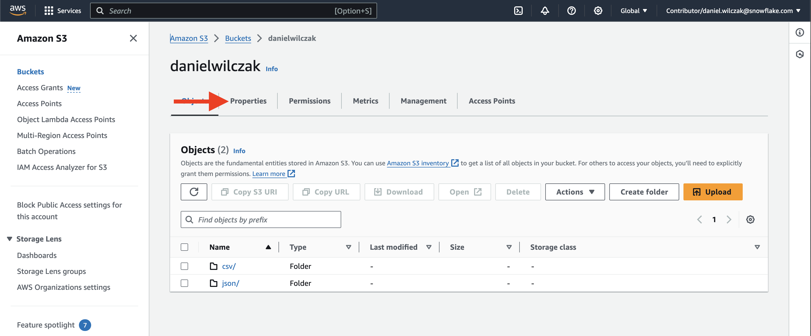

Scroll down to "Create event notification":
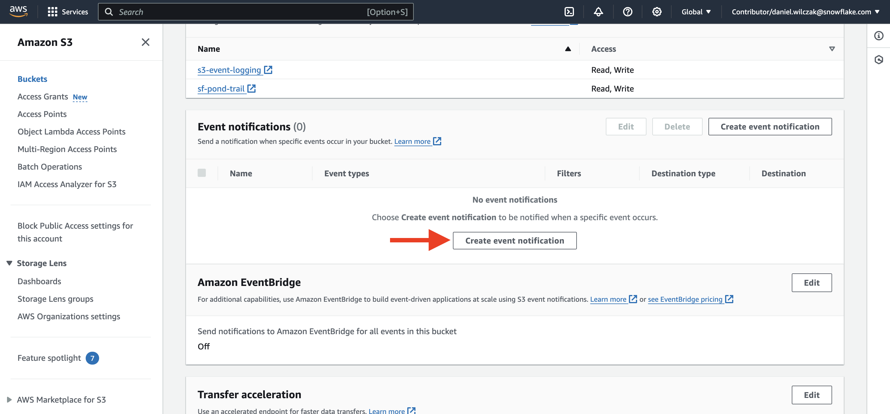

Add a name to the notification and select all object create notification:
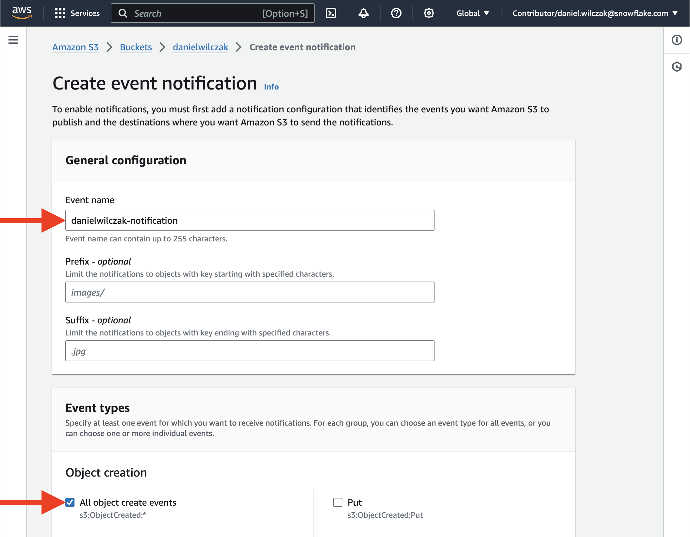

Scroll down and enter your sqs and click "save changes":
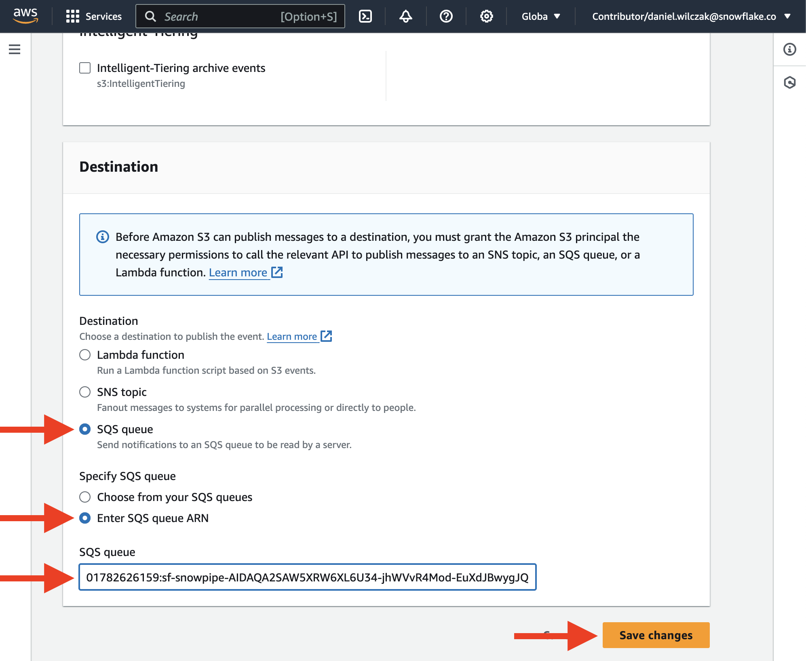

Almost done, in snowflake lets refresh the pipe so that we ingest all the current files.

=== ":octicons-image-16: Code"

    ```sql
    alter pipe csv refresh;
    ```

=== ":octicons-sign-out-16: Result"

    | File          | Status |
    |---------------|--------|
    | /samplev2.csv | SENT   |

Lets add a copy of the sample data into the s3 bucket folder with a new name and see it added in snowflake ~1 minutes later. We can see this by doing a count on our table and see 2k records where the csv only has 1k records.

=== ":octicons-sign-out-16: Result"

    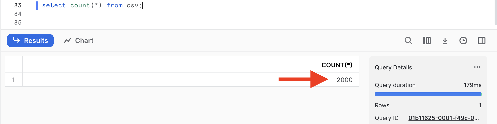

