# Connect Snowflake to S3 Storage
Goal of this tutorial is to load JSON and CSV data from a S3 bucket using the [Copy into](https://docs.snowflake.com/en/sql-reference/sql/copy-into-table) sql command and [Snowpipe](https://docs.snowflake.com/en/user-guide/data-load-snowpipe-intro) to automate the ingestion process. This tutorial assumes you have nothing in your Snowflake account ([Trial](https://signup.snowflake.com/)) and no complex security needs.

## Video
Video in development.

## Manual Loading  :octicons-feed-tag-16:
Lets start by setting up a snowflake connection to AWS s3 storage and load json data. After that use snowpipe to automate the ingestion of CSV files.

### AWS
Sign into your aws account. If you don't have one, a free [aws account](https://aws.amazon.com/free/) can be started.

#### Create S3 bucket
Create the bucket you intend to use. In our case we'll call the bucket **danielwilczak**.
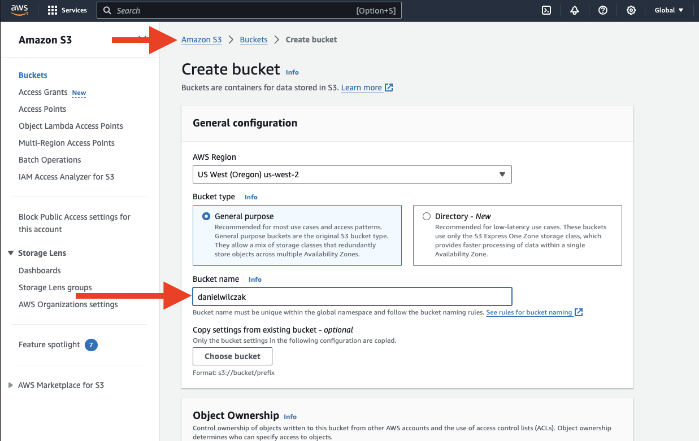

#### Upload sample data
Upload the [sample data](https://sfc-gh-dwilczak.github.io/tutorials/snowflake/data/data.zip) to your s3 bucket (json/csv) provided in the data folder.
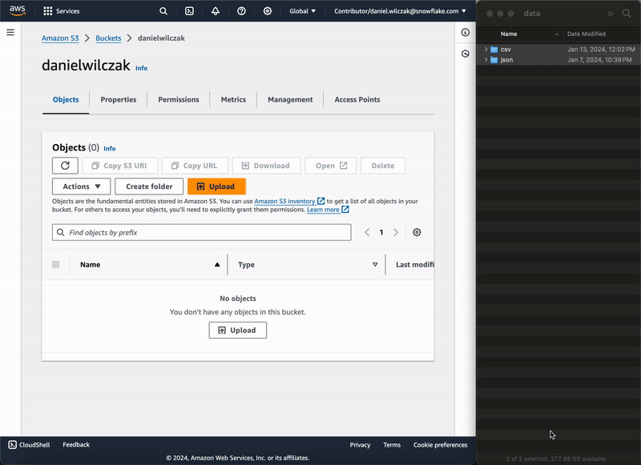

#### Policy and role
Copy your **ARN** name. This wil be used in the policy step.
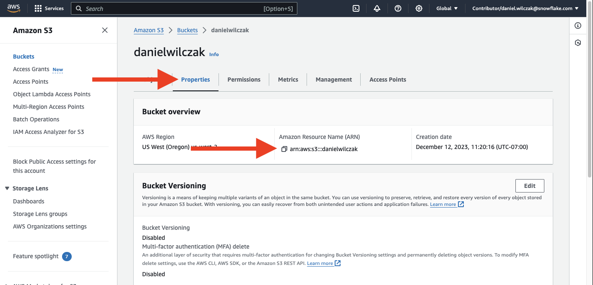

Go to IAM:
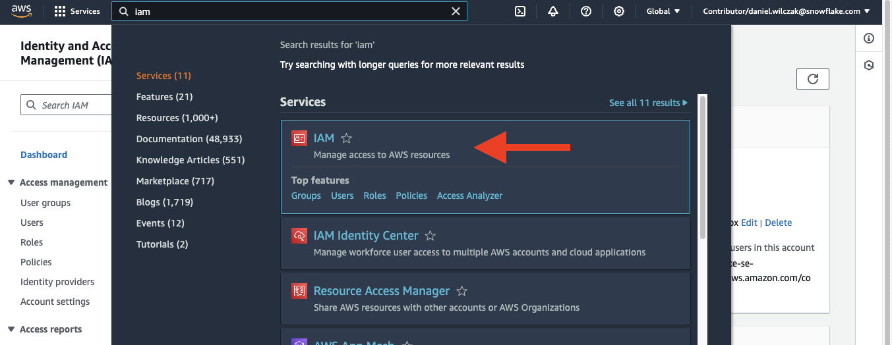

Create a policy:
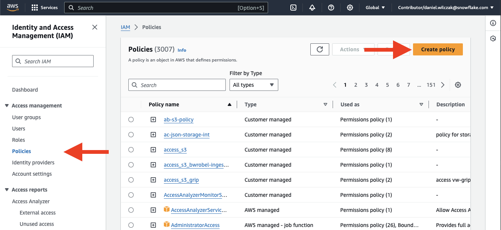

Copy the template policy json code below and add your buckets arn.

=== ":octicons-image-16: Template"

    ```json linenums="1"
    {
        "Version": "2012-10-17",
        "Statement": [
            {
                "Effect": "Allow",
                "Action": [
                "s3:GetObject",
                "s3:GetObjectVersion"
                ],
                "Resource": "<COPY ARN HERE>/*" /* (1)! */
            },
            {
                "Effect": "Allow",
                "Action": [
                    "s3:ListBucket",
                    "s3:GetBucketLocation"
                ],
                "Resource": "<COPY ARN HERE>", /* (2)! */
                "Condition": {
                    "StringLike": {
                        "s3:prefix": [
                            "*"
                        ]
                    }
                }
            }
        ]
    }
    ```
    { .annotate }

    1.  

    2.  

=== ":octicons-sign-out-16: Example"

    ```json linenums="1"
    {
        "Version": "2012-10-17",
        "Statement": [
            {
                "Effect": "Allow",
                "Action": [
                "s3:GetObject",
                "s3:GetObjectVersion"
                ],
                "Resource": "arn:aws:s3:::danielwilczak/*"
            },
            {
                "Effect": "Allow",
                "Action": [
                    "s3:ListBucket",
                    "s3:GetBucketLocation"
                ],
                "Resource": "arn:aws:s3:::danielwilczak",
                "Condition": {
                    "StringLike": {
                        "s3:prefix": [
                            "*"
                        ]
                    }
                }
            }
        ]
    }
    ```
Enter your policy using the template / example above and click next.
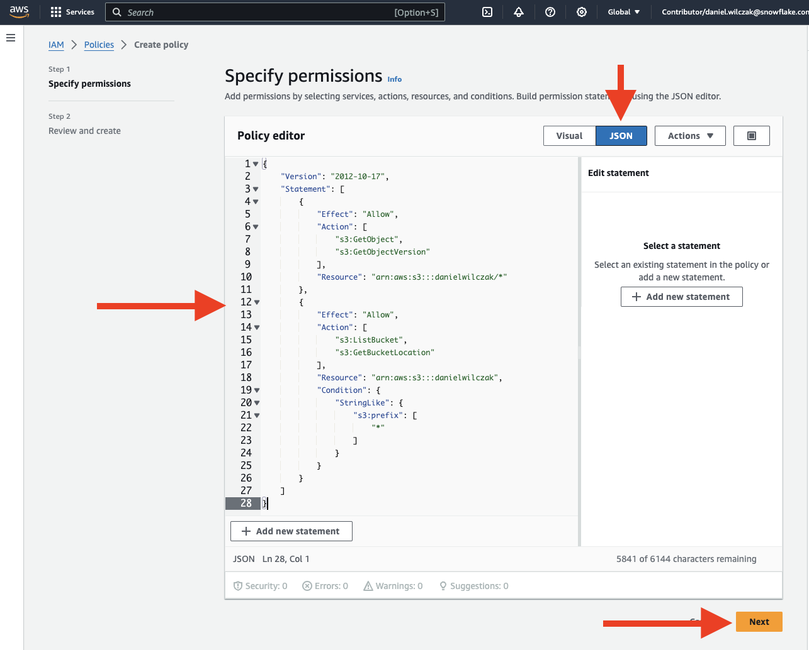

Give the policy a name and then click "create policy".
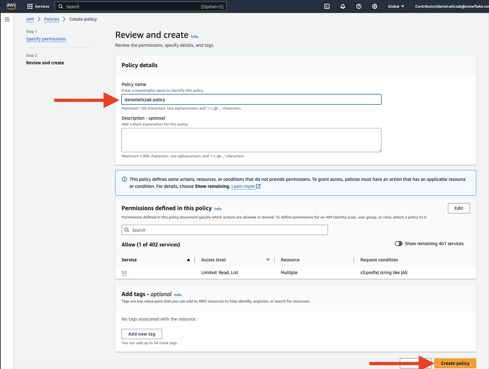

Next lets create a role! Navigate back to **IAM**:


Select Roles on the navbar and then click create role:
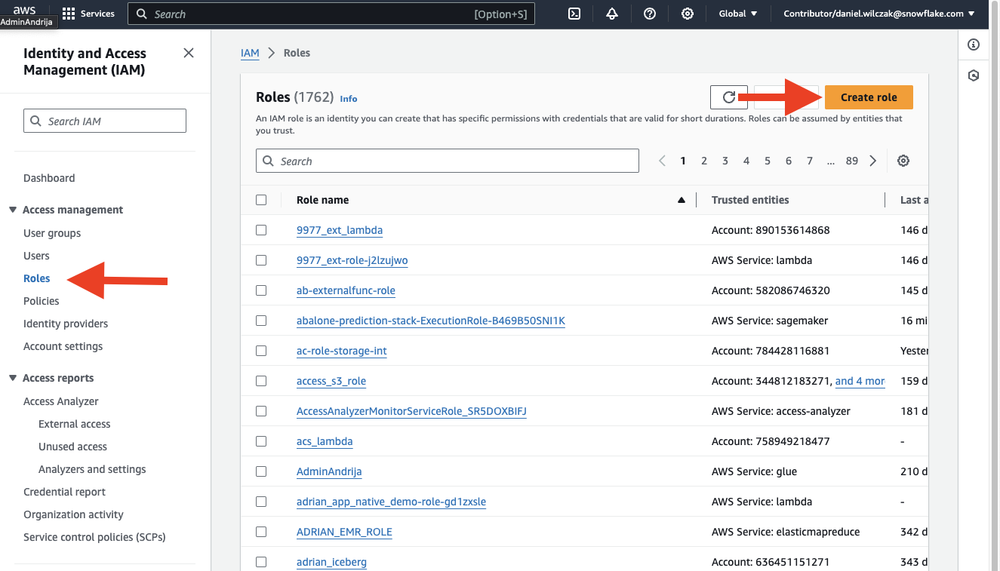

Select AWS account, This account(#), Require external ID and enter 0000 for now. We will update this later.
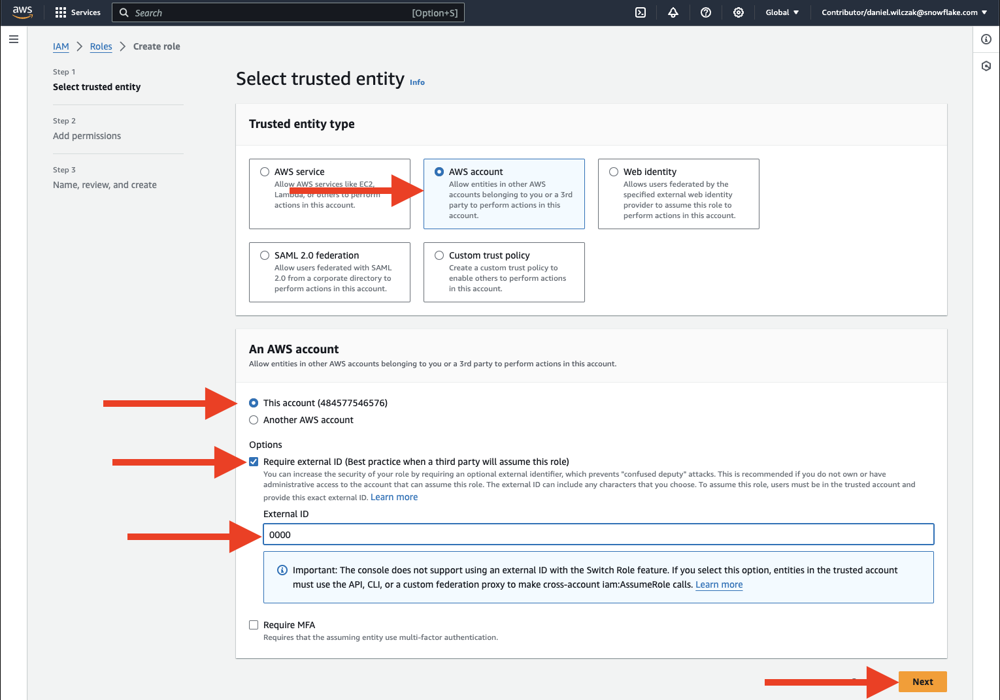

Add the policy to the role:
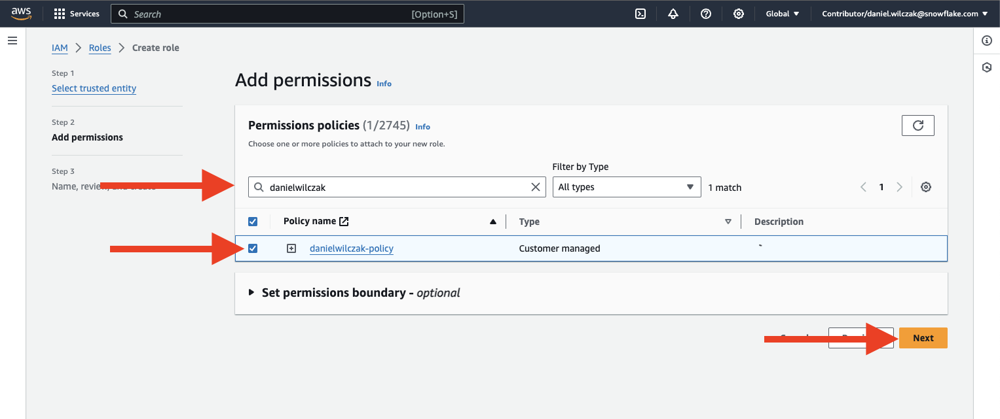

Add the role name and click "create role":
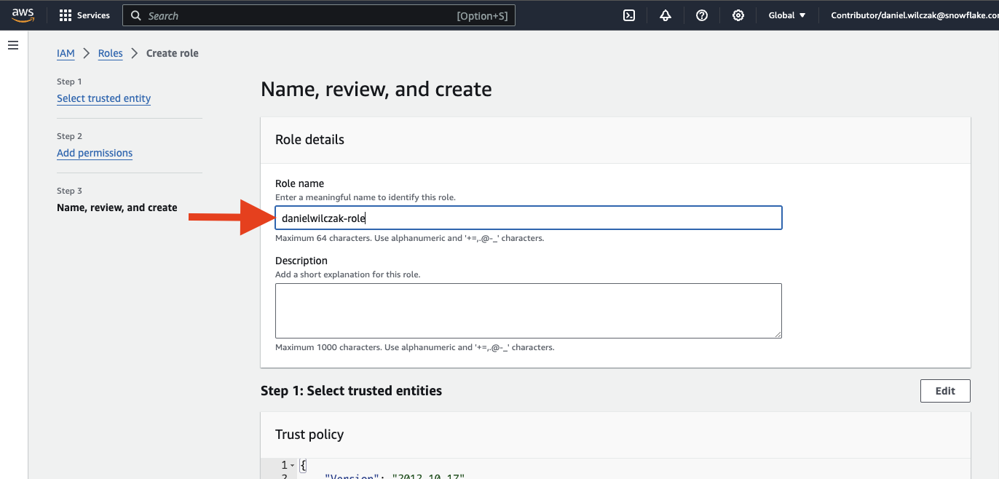

Once created click your role:
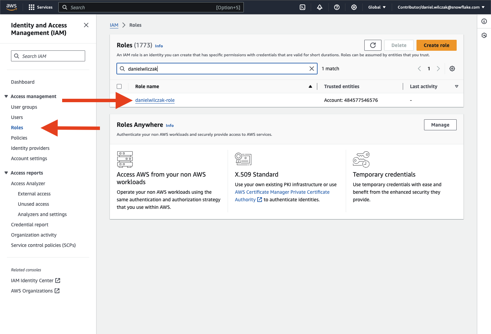

Copy your **role ARN**, this will be used in the next step:
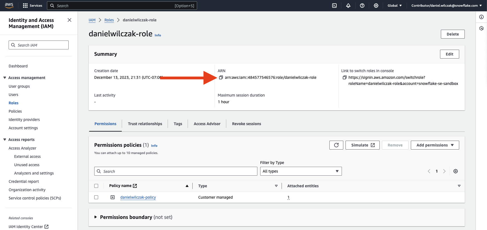

### Snowflake
Lets start the snowflake setup by creating our database and schema. Followed by creating the integration to AWS by running the code below with your [copied role arn](https://sfc-gh-dwilczak.github.io/tutorials/snowflake/aws/s3/#policy-and-role) and [bucket name](https://sfc-gh-dwilczak.github.io/tutorials/snowflake/aws/s3/#create-s3-bucket):

=== ":octicons-image-16: Template"

    ```sql linenums="1"
    use role sysadmin;

    -- Create a database to store our schemas.
    create database if not exists 
        raw comment='This is only raw data from our sources.';

    -- Create the schema. The schema stores all objects.
    create schema if not exists raw.aws;

    /*
        Warehouses are synonymous with the idea of compute
        resources in other systems. We will use this
        warehouse to query our integration and to load data.
    */
    create warehouse developer 
        warehouse_size = xsmall
        initially_suspended = true;

    /*
        Integrations are on of those important features that
        account admins should do because it's allowing outside 
        snowflake connections to your data.
    */
    use role accountadmin;

    create storage integration s3_integration
        type = external_stage
        storage_provider = 's3'
        enabled = true
        storage_aws_role_arn = '<ROLE ARN HERE>' /* (1)! */
        storage_allowed_locations = ('s3://<BUCKET NAME>/'); /* (2)! */

    -- Give the sysadmin access to use the integration.
    grant usage on integration s3_integration to role sysadmin;

    desc integration s3_integration;
    select "property", "property_value" from TABLE(RESULT_SCAN(LAST_QUERY_ID()))
    where "property" = 'STORAGE_AWS_IAM_USER_ARN' or "property" = 'STORAGE_AWS_EXTERNAL_ID';
    ```
    { .annotate }

    1.  

    2.  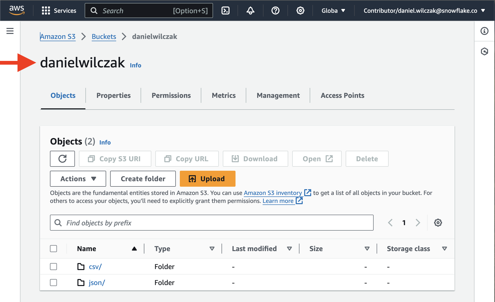

=== ":octicons-image-16: Example"

    ```sql linenums="1"
    use role sysadmin;

    -- Create a database to store our schemas.
    create database if not exists 
        raw comment='This is only raw data from our sources.';

    -- Create the schema. The schema stores all objectss.
    create schema if not exists raw.aws;

    /*
        Warehouses are synonymous with the idea of compute
        resources in other systems. We will use this
        warehouse to query our integration and to load data.
    */
    create warehouse developer 
        warehouse_size = xsmall
        initially_suspended = true;

    /*
        Integrations are on of those important features that
        account admins should do because it's allowing outside 
        snowflake connections to your data.
    */
    use role accountadmin;

    create storage integration s3_integration
        type = external_stage
        storage_provider = 's3'
        enabled = true
        storage_aws_role_arn = 'arn:aws:iam::484577546576:role/danielwilczak-role'
        storage_allowed_locations = ('s3://danielwilczak/');

    -- Give the sysadmin access to use the integration.
    grant usage on integration s3_integration to role sysadmin;

    desc integration s3_integration;
    select "property", "property_value" from TABLE(RESULT_SCAN(LAST_QUERY_ID()))
    where "property" = 'STORAGE_AWS_IAM_USER_ARN' or "property" = 'STORAGE_AWS_EXTERNAL_ID';
    ```

=== ":octicons-sign-out-16: Result"

    | property                 | property_value                                  |
    |--------------------------|-------------------------------------------------|
    | STORAGE_AWS_IAM_USER_ARN | arn:aws:iam::001782626159:user/8pbb0000-s       |
    | STORAGE_AWS_EXTERNAL_ID  | GGB82720_SFCRole=2_vcN2MIiC7PW0OMOyA82W5BLJrqY= |

Note the result, it will be used in the next step.

#### Grant Access in S3
Navigate back to the role:


Click trusted relationship:
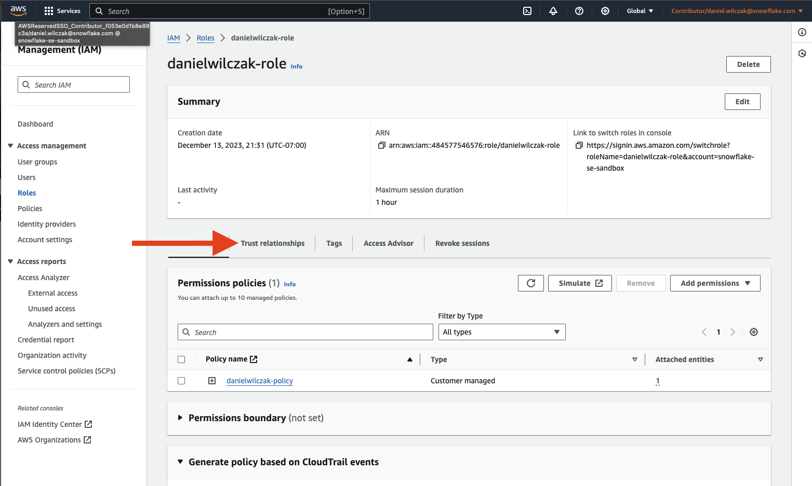

Click edit trust policy:
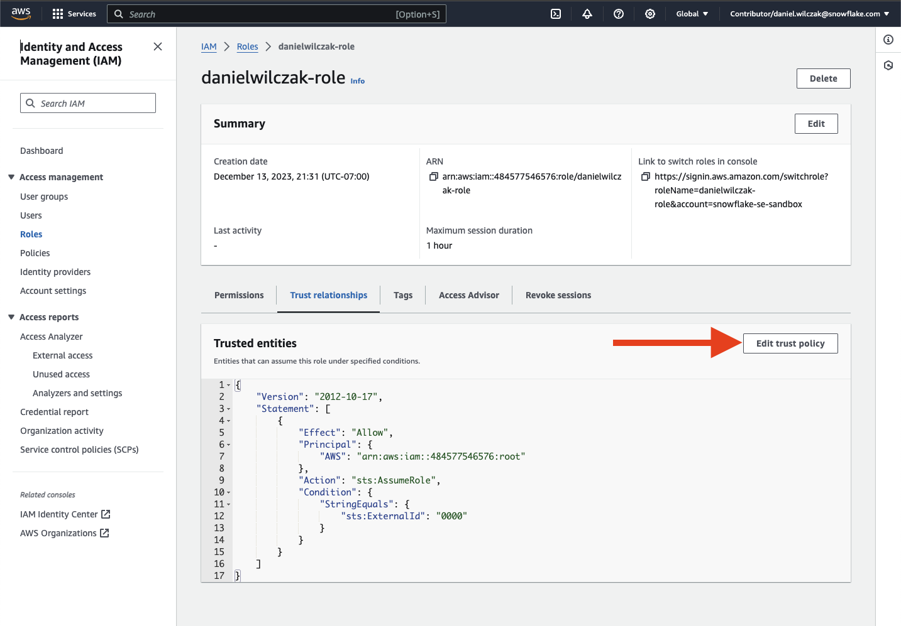

Copy the policy json template code below and add your "STORAGE_AWS_IAM_USER_ARN" and "STORAGE_AWS_EXTERNAL_ID" from prior [Snowflake](https://sfc-gh-dwilczak.github.io/tutorials/snowflake/aws/s3/#snowflake) step.

=== ":octicons-image-16: Template"

    ```json linenums="1"
    {
        "Version": "2012-10-17",
        "Statement": [
        {
            "Sid": "",
            "Effect": "Allow",
            "Principal": {
            "AWS": "<STORAGE_AWS_IAM_USER_ARN>" /* (1)! */
            },
            "Action": "sts:AssumeRole",
            "Condition": {
            "StringEquals": {
                "sts:ExternalId": "<STORAGE_AWS_EXTERNAL_ID>" /* (2)! */
            }
            }
        }
        ]
    }
    ```
    { .annotate }

    1.  From snowflake results we got earlier:
    
        | property                 | property_value                                  |
        |--------------------------|-------------------------------------------------|
        | STORAGE_AWS_IAM_USER_ARN | arn:aws:iam::001782626159:user/8pbb0000-s       |
        | STORAGE_AWS_EXTERNAL_ID  | GGB82720_SFCRole=2_vcN2MIiC7PW0OMOyA82W5BLJrqY= |
    
    2.  From snowflake results we got earlier:
    
        | property                 | property_value                                  |
        |--------------------------|-------------------------------------------------|
        | STORAGE_AWS_IAM_USER_ARN | arn:aws:iam::001782626159:user/8pbb0000-s       |
        | STORAGE_AWS_EXTERNAL_ID  | GGB82720_SFCRole=2_vcN2MIiC7PW0OMOyA82W5BLJrqY= |


=== ":octicons-sign-out-16: Example"

    ```json linenums="1"
    {
        "Version": "2012-10-17",
        "Statement": [
        {
            "Sid": "",
            "Effect": "Allow",
            "Principal": {
            "AWS": "arn:aws:iam::001782626159:user/8pbb0000-s"
            },
            "Action": "sts:AssumeRole",
            "Condition": {
            "StringEquals": {
                "sts:ExternalId": "GGB82720_SFCRole=2_vcN2MIiC7PW0OMOyA82W5BLJrqY="
            }
            }
        }
        ]
    }
    ```

Enter your policy using the template / example above.
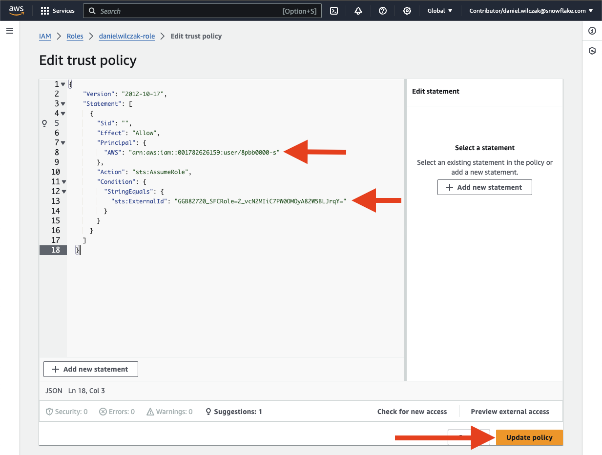

### Load the data
Lets setup the stage, file format, warehouse and finally load some json data.

=== ":octicons-image-16: Template"

    ```sql linenums="1"
    use role sysadmin;
    use database raw;
    use schema aws;
    use warehouse developer;

    /*
       Stages are synonymous with the idea of folders
       that can be either internal or external.
    */
    create or replace stage s3
        storage_integration = s3_integration
        url = 's3://<BUCKET NAME>/' /* (1)! */
        directory = ( enable = true);

    /* 
        Create a file format so the "copy into"
        command knows how to copy the data.
    */
    create or replace file format json
        type = 'json';

    -- Create the table.
    create or replace table data (
        file_name varchar,
        data variant
    );

    -- Load json data.
    copy into data(file_name,data)
    from (
        select 
            metadata$filename,
            $1
        from
            @s3/json
            (file_format => json)
    );
    ```
    { .annotate }

    1.  

=== ":octicons-image-16: Example"

    ```sql linenums="1"
    use role sysadmin;
    use database raw;
    use schema aws;

    /*
       Stages are synonymous with the idea of folders
       that can be either internal or external.
    */
    create or replace stage s3
        storage_integration = s3_integration
        url = 's3://danielwilczak/'
        directory = ( enable = true);

    /* 
        Create a file format so the "copy into"
        command knows how to copy the data.
    */
    create or replace file format json
        type = 'json';

    /*
        Warehouses are synonymous with the idea of
        compute resources in other systems.
    */
    create or replace warehouse developer 
        warehouse_size=xsmall
        initially_suspended=true;

    -- Create the table.
    create or replace table data (
        file_name varchar,
        data variant
    );

    -- Load json data.
    copy into data(file_name,data)
    from (
        select 
            metadata$filename,
            $1
        from
            @s3/json
            (file_format => json)
    );
    ```

=== ":octicons-sign-out-16: Result"

    | file                                | status |
    |-------------------------------------|--------|
    | s3://danielwilczak/json/sample.json | LOADED |


Look at the data you just loaded.
=== ":octicons-image-16: Code"

    ```sql linenums="1"
    select * from raw.aws.json; 
    ```

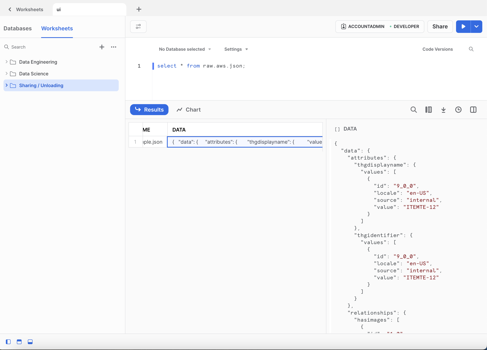


## Automatic Loading  :octicons-feed-tag-16:

!!! warning 

    If you have not [manually loaded](https://sfc-gh-dwilczak.github.io/tutorials/snowflake/aws/s3/#manual-loading) data yet from S3. Please go back and complete that section first.

Lets create a pipe to automate copying data into a table. Create the file format, table and pipe in snowflake. This approach automates the process so you don't have to manually name all the columns. This code will also give you your **SQS queue** string to be entered into AWS later.

### Snowflake
!!! Note

    Sometimes it may take 1-2 minutes before you see data in the table. This depends on how AWS is feeling today.

In this case we'll load a csv file by automating the creation of the table and infering the names in the csv pipe.

=== ":octicons-image-16: Code"

    ```sql linenums="1"

    use role sysadmin;
    use database raw;
    use schema aws;
    use warehouse developer;

    /*
        Copy CSV data using a pipe without having
        to write out the column names.
    */
    create or replace file format infer
        type = csv
        parse_header = true
        skip_blank_lines = true
        field_optionally_enclosed_by ='"'
        trim_space = true
        error_on_column_count_mismatch = false;

    /*
        Creat the table with the column names
        generated for us.
    */
    create or replace table csv
        using template (
            select array_agg(object_construct(*))
            within group (order by order_id)
            from table(
                infer_schema(        
                LOCATION=>'@s3/csv'
            , file_format => 'infer')
            )
        );

    -- Create the pipe to load any new data.
    create pipe csv auto_ingest=true as
        COPY into
            csv
        from
            @s3/csv
            
        file_format = (format_name= 'infer')
        match_by_column_name=case_insensitive;

    /*
        Get the arn for the pipe. We will add this
        to aws in step the next AWS step.
    */
    show pipes;
    select "name", "notification_channel" as sqs_queue
    from TABLE(RESULT_SCAN(LAST_QUERY_ID()));
    ```

=== ":octicons-sign-out-16: Result"

    | name | sqs_queue                                               |
    |------|---------------------------------------------------------|
    | CSV  | arn:aws:sqs:us-west-2:001782626159:sf-snowpipe-AIDAQ... |

#### Grant Access in S3 

Navigate to your bucket and click properties:
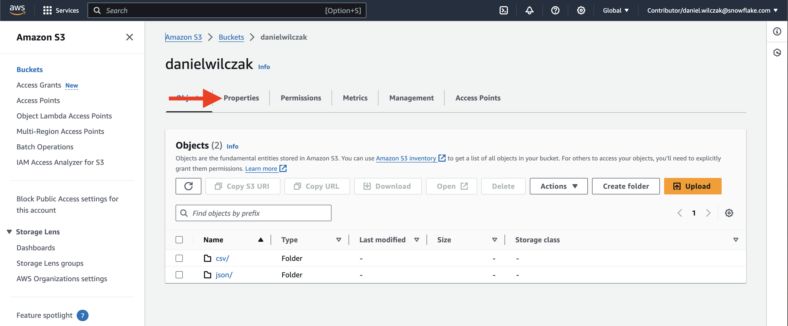

Scroll down to "Create event notification":
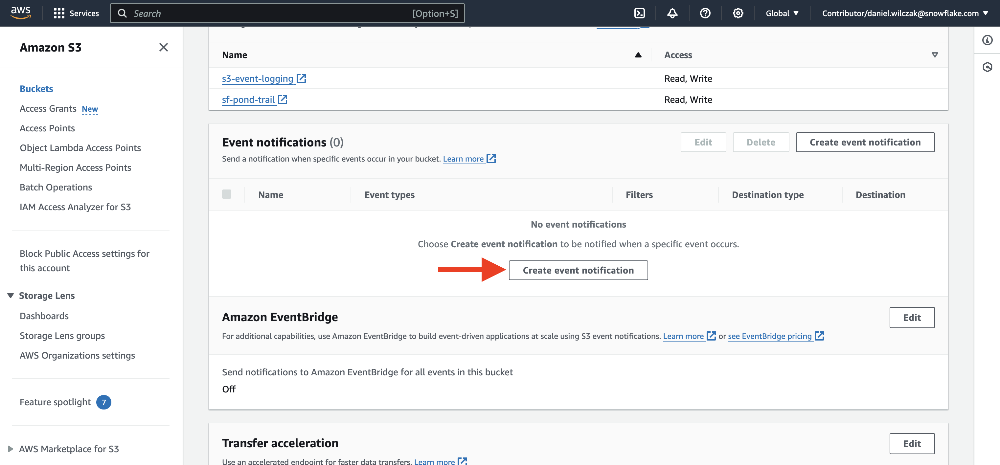

Add a name to the notification and select all object create notification:
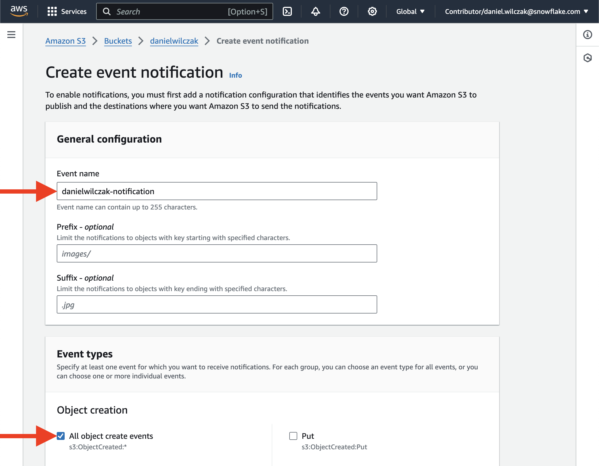

Scroll down and enter your [sqs queue](https://sfc-gh-dwilczak.github.io/tutorials/snowflake/aws/s3/#snowflake_1) we got from our snowflake step and click "save changes":
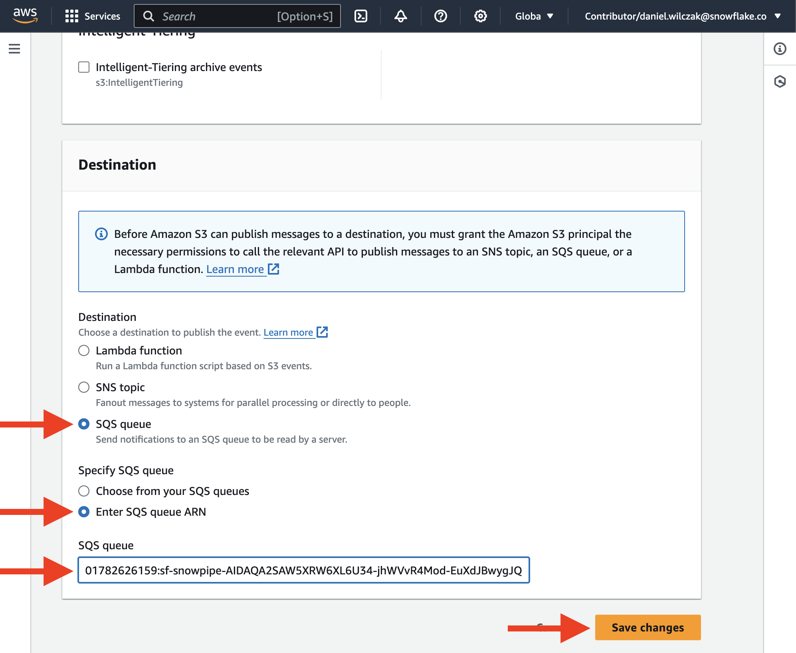

Almost done, in snowflake lets refresh the pipe so that we ingest all the current files.

### Load the data
=== ":octicons-image-16: Code"

    ```sql linenums="1"
    alter pipe raw.aws.csv refresh;
    ```

=== ":octicons-sign-out-16: Result"

    | File          | Status |
    |---------------|--------|
    | /sample_1.csv | SENT   |

### Result
!!! Note

    Sometimes it may take 1-2 minutes before you see data in the table. This depends on how AWS is feeling today.

Let's add more [sample data](https://sfc-gh-dwilczak.github.io/tutorials/snowflake/data/csv/sample_2.csv) into the S3 bucket CSV folder and see it added in snowflake ~30 seconds later. We can see this by doing a count on our table and seeing 20 records, whereas the original CSV only has 10 records.

<iframe width="850px" height="478px" src="https://www.youtube.com/embed/I0QVJWjR5Qw?si=FDW-4b6LaEdTVVKf" style="display:block;" title="YouTube video player" frameborder="0" allow="accelerometer; autoplay; clipboard-write; encrypted-media; gyroscope; picture-in-picture; web-share" allowfullscreen></iframe>