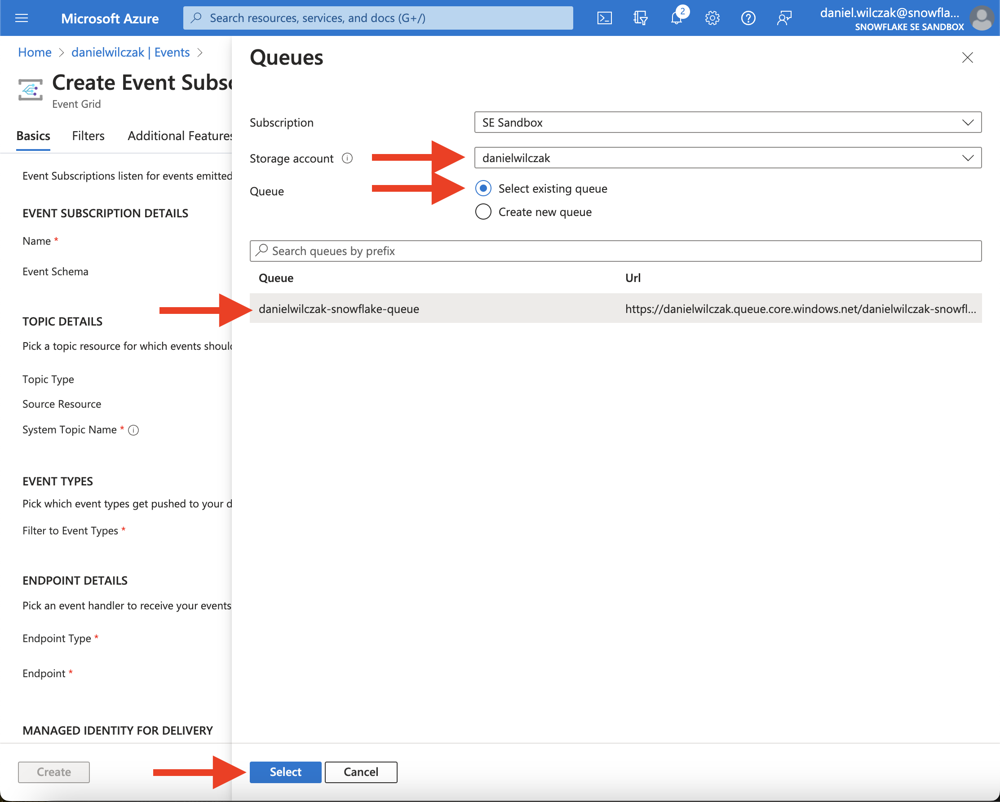

# Connect Snowflake to Azure Storage
Goal of this tutorial is to load JSON and CSV data from a Azure Storage using the [Copy into](https://docs.snowflake.com/en/sql-reference/sql/copy-into-table) sql command and [Snowpipe](https://docs.snowflake.com/en/user-guide/data-load-snowpipe-intro) to automate the ingestion process. This tutorial assumes you have nothing in your Snowflake account ([Trial](https://signup.snowflake.com/)) and no complex security needs.

## Video
Video in development.

## Manual Loading  :octicons-feed-tag-16:
Lets start by setting up a Snowflake connection to Azure storage and load json data. After that use snowpipe to automate the ingestion of CSV files.

### Azure
Sign into your azure account. If you don't have one, a free [azure account](https://azure.microsoft.com/en-us/free/) can be started.

#### Create Storage account 
Create the stoage account you intend to use. 


In our case we'll call the stoage account **danielwilczak** and make it's region the same as the one our Snowflake account. It's okay if it's not with the same provider or region, it's just the quickest. We will also use the default for everything else. If creating a resource group just enter a name and take the defaults.


We will then navigate into the storage account.


#### Create Container 
Create a storage container. 


In our case we will call it **data**.


Navigate into the data container.


#### Upload sample data
Lets upload some sample data


Upload the [sample data](https://sfc-gh-dwilczak.github.io/tutorials/snowflake/data/data.zip) to your azure storage bucket (json/csv) provided in the data folder.


#### Get teanent ID
Using the search bar, look up **tenant properties**.


Copy your **Tenant ID**. We will use this in two places.


### Snowflake

Let's transition to Snowflake by creating a worksheet and adding the code below with your information:

=== ":octicons-image-16: Template"

    ```sql linenums="1"
    /*
        We switch to "sysadmin" to create an object
        because it will be owned by that role.
    */
    use role sysadmin;

    -- Create a database to store our schemas.
    create database if not exists raw ;

    -- Create the schema. The schema stores all objects.
    create schema if not exists raw.azure;

    /*
        Warehouses are synonymous with the idea of
        compute resources in other systems.
    */
    create warehouse development 
        warehouse_size = xsmall
        auto_suspend = 30
        initially_suspended = true;

    /*
        Integrations are on of those important features that account admins
        should do because it's allowing outside snowflake connections to your data.
    */
    use role accountadmin;

    create or replace storage integration azure_integration
        type = external_stage
        storage_provider = 'azure'
        enabled = true 
        azure_tenant_id = '<TENANT_ID>' /* (1)! */
            storage_allowed_locations = (
    'azure://<STORAGE ACCOUNT NAME>.blob.core.windows.net/<CONTAINER NAME>' /* (2)! */ /* (3)! */
            );

    -- Give the sysadmin access to use the integration later.
    grant usage on integration azure_integration to role sysadmin;

    -- Get the URL to authenticate with azure and the app name to use later.
    describe storage integration azure_integration;
    select "property", "property_value" from TABLE(RESULT_SCAN(LAST_QUERY_ID()))
    where "property" = 'AZURE_CONSENT_URL' or "property" = 'AZURE_MULTI_TENANT_APP_NAME';
    ```
    { .annotate }

    1.  Using the search bar, look up **tenant properties**.
        

        Copy your **Tenant ID**.
        

    2.  

    3.  

=== ":octicons-image-16: Example"

    ```sql linenums="1"
    /*
        We switch to "sysadmin" to create an object
        because it will be owned by that role.
    */
    use role sysadmin;

    -- Create a database to store our schemas.
    create database if not exists raw;

    -- Create the schema. The schema stores all objects.
    create schema if not exists raw.azure;

    /*
        Warehouses are synonymous with the idea of
        compute resources in other systems.
    */
    create or replace warehouse development 
        warehouse_size = xsmall
        auto_suspend = 30
        initially_suspended = true;

    /*
        Integrations are on of those important features that account admins
        should do because it's allowing outside snowflake connections to your data.
    */
    use role accountadmin;

    create or replace storage integration azure_integration
        type = external_stage
        storage_provider = 'azure'
        enabled = true 
        azure_tenant_id = '9a2dkd8cb-73e9-40ee-a558-fcdnj5ef57a7'
            storage_allowed_locations = (
                'azure://danielwilczak.blob.core.windows.net/data'
            );

    -- Give the sysadmin access to use the integration later.
    grant usage on integration azure_integration to role sysadmin;

    -- Get the URL to authenticate with azure and the app name to use later.
    describe storage integration azure_integration;
    select "property", "property_value" from TABLE(RESULT_SCAN(LAST_QUERY_ID()))
    where "property" = 'AZURE_CONSENT_URL' or "property" = 'AZURE_MULTI_TENANT_APP_NAME';
    ```

=== ":octicons-sign-out-16: Result"

    | property                    | property_value                            |
    |-----------------------------|-------------------------------------------|
    | AZURE_CONSENT_URL           | https://login.microsoftonline.com/9a2d... |
    | AZURE_MULTI_TENANT_APP_NAME | c9pnugsnowflakepacint_1700096201187       |

Please **Ctrl+Click** the URL or copy and paste it into your browser.


#### Grant Access in Azure

Lets navigate to IAM so that we can give snowflake access to our storage account.


Search for **Storage Blob Data Contributor**, select the role and click next.


!!! note

    You only need to enter the first half of the string for azure to find the member in the search.

Lets add the Snowflake member by selecting "select member" and search for our **AZURE_MULTI_TENANT_APP_NAME** that we got earlier from snowflake. 


Once selected, click Review and Assign.


### Load the data

Lets setup the stage, file format, warehouse and finally load some json data.

=== ":octicons-image-16: Template"

    ```sql linenums="1"
    use database raw;
    use schema azure;
    use role sysadmin;
    use warehouse development;

    /*
       Stages are synonymous with the idea of folders
       that can be either internal or external.
    */
    create or replace stage azure
    storage_integration = azure_integration
    url = 'azure://<STORAGE NAME>.blob.core.windows.net/<CONTAINER NAME>' /* (1)! */ /* (2)! */
    directory = ( enable = true);

    /* 
        Create a file format so the "copy into"
        command knows how to copy the data.
    */
    create or replace file format raw.azure.json
        type = 'json';

    -- Create the table to load into.
    create or replace table json (
        file_name varchar,
        data variant
    );

    -- Load the json file from the json folder.
    copy into json(file_name,data)
    from (
        select 
            metadata$filename,
            $1
        from
            @azure/json
            (file_format => json)
    );
    ```
    { .annotate }

    1.  

    2.  

=== ":octicons-image-16: Example"

    ```sql linenums="1"
    use database raw;
    use schema azure;
    use role sysadmin;
    use warehouse development;

    /*
       Stages are synonymous with the idea of folders
       that can be either internal or external.
    */
    create or replace stage azure
        storage_integration = azure_integration
        url = 'azure://danielwilczak.blob.core.windows.net/data'
        directory = ( enable = true);

    /* 
        Create a file format so the "copy into"
        command knows how to copy the data.
    */
    create or replace file format raw.azure.json
        type = 'json';

    -- Create the table to load into.
    create or replace table json (
        file_name varchar,
        data variant
    );

    -- Load the json file from the json folder.
    copy into json(file_name,data)
    from (
        select 
            metadata$filename,
            $1
        from
            @azure/json
            (file_format => json)
    );
    ```

=== ":octicons-sign-out-16: Result"

    | file                                                              | status |
    |-------------------------------------------------------------------|--------|
    | azure://danielwilczak.blob.core.windows.net/data/json/sample.json | LOADED |


Look at the data you just loaded.
=== ":octicons-image-16: Code"

    ```sql linenums="1"
    select * from raw.azure.json; 
    ```


## Automatic Loading  :octicons-feed-tag-16:

!!! warning

    If you have not [manually loaded](https://sfc-gh-dwilczak.github.io/tutorials/snowflake/azure/blob/#manual-loading) data yet from azure storage. Please go back and complete that section first.


### Azure 
Lets start with azure by creating a queue. All you need is a name. I've named mine `danielwilczak-snowflake-queue`. 


Store the URL. It will be used later.


Next lets create an event subscription. 


Enter in the highlighted fields. I've named mine `danielwilczak-snowflake-event`. Once entered click "configure endpoint".


Enter the storage account and selct your queue that we setup prior.


To finish the event, click "create".


Result


### Snowflake

Open a worksheet and enter in your `queue url` and `tenant_id`.
=== ":octicons-image-16: Template"

    ```sql linenums="1"
    use role accountadmin;

    -- Setup the storage notification to know when storage events happen.
    create or replace notification integration azure_snowpipe_integration
        enabled = true
        type = queue
        notification_provider = azure_storage_queue
        azure_storage_queue_primary_uri = '<QUEUE URL>' /* (1)! */
        azure_tenant_id = '<TENANT ID>'; /* (2)! */

    -- Give the sysadmin access to use the integration.
    grant usage on integration azure_snowpipe_integration to role sysadmin;

    describe notification integration azure_snowpipe_integration;
    select "property", "property_value" as property_value
    from table(result_scan(last_query_id()))
    where "property" = 'AZURE_CONSENT_URL' or "property" = 'AZURE_MULTI_TENANT_APP_NAME';
    ```
    { .annotate }

    1.  

    2.  Using the search bar, look up **tenant properties**.
        

        Copy your **Tenant ID**.
        

=== ":octicons-image-16: Example"

    ```sql linenums="1"
    use role accountadmin;

    -- Setup the storage notification to know when storage events happen.
    create or replace notification integration azure_snowpipe_integration
        enabled = true
        type = queue
        notification_provider = azure_storage_queue
        azure_storage_queue_primary_uri = 'https://danielwilczak.queue.core.windows.net/danielwilczak-snowflake-queue'
        azure_tenant_id = '9a2d78cb-73e9-40ee-a558-fc1adfff57a7';

    -- Give the sysadmin access to use the integration.
    grant usage on integration azure_snowpipe_integration to role sysadmin;

    describe notification integration azure_snowpipe_integration;
    select "property", "property_value" as property_value
    from table(result_scan(last_query_id()))
    where "property" = 'AZURE_CONSENT_URL' or "property" = 'AZURE_MULTI_TENANT_APP_NAME';
    ```

=== ":octicons-sign-out-16: Result"

    | property                    | PROPERTY_VALUE                             |
    |-----------------------------|--------------------------------------------|
    | AZURE_CONSENT_URL           | https://login.microsoftonline.com/9a2d7... |
    | AZURE_MULTI_TENANT_APP_NAME | tzpbnzsnowflakepacint_1700112906001        |

Please ctrl+click the url or enter it into your browser you will have to accept the integration on azure. 


#### Grant Access in Azure

Using the left side search "iam" and select Access Control and "add role assignment".


Search for "storage queue data contributor" and select it and click next.


!!! note

    You only need to enter the first half of the string for azure to find the member in the search.
    
Click "Select members" and add your `AZURE_MULTI_TENANT_APP_NAME` that we recieved from Snowflake in the prior snowflake step. 


Final Azure step, select review and assign and your done with azure.


### Load the data
!!! Note

    Sometimes it may take 1-2 minutes before you see data in the table. This depends on how Azure is feeling today.

We'll load a csv file by automating the creation of the table and infering the names in the csv pipe.

=== ":octicons-image-16: SQL"

    ```sql linenums="1"
    use role sysadmin;
    use database raw;
    use schema azure;
    use warehouse development;

    /*
        Copy CSV data using a pipe without having
        to write out the column names.
    */
    create or replace file format infer
        type = csv
        parse_header = true
        skip_blank_lines = true
        field_optionally_enclosed_by ='"'
        trim_space = true
        error_on_column_count_mismatch = false;

    /*
        Creat the table with the column names
        generated for us.
    */
    create or replace table csv
        using template (
            select array_agg(object_construct(*))
            within group (order by order_id)
            from table(
                infer_schema(        
                LOCATION=>'@azure/csv'
            , file_format => 'infer')
            )
        );

    /*
        Load the data and assign the pipe notification
        to know when a file is added.
    */
    create or replace pipe csv 
        auto_ingest = true 
        integration = 'AZURE_SNOWPIPE_INTEGRATION' 
        as
        
        COPY into
            csv
        from
            @azure/csv

        file_format = (format_name= 'infer')
        match_by_column_name=case_insensitive;
        
    /* 
        Refresh the state of the pipe to make
        sure it's updated with all files.
    */
    alter pipe csv refresh;
    ```

=== ":octicons-sign-out-16: Result"

    | File          | Status |
    |---------------|--------|
    | /sample_1.csv | SENT   |


### Result
!!! Note

    Sometimes it may take 1-2 minutes before you see data in the table. This depends on how Azure is feeling today.

Lets add more [sample data](https://sfc-gh-dwilczak.github.io/tutorials/snowflake/data/csv/sample_2.csv) into the azure csv folder and see it added in snowflake ~30 seconds later. We can see this by doing a count on our table and see 20 records where th original csv only has 10 records.

<iframe width="850px" height="478px" src="https://www.youtube.com/embed/ZBr6gKOFvw4?si=MfWVGshDNIy3RAtE" style="display:block;" title="YouTube video player" frameborder="0" allow="accelerometer; autoplay; clipboard-write; encrypted-media; gyroscope; picture-in-picture; web-share" allowfullscreen></iframe>


