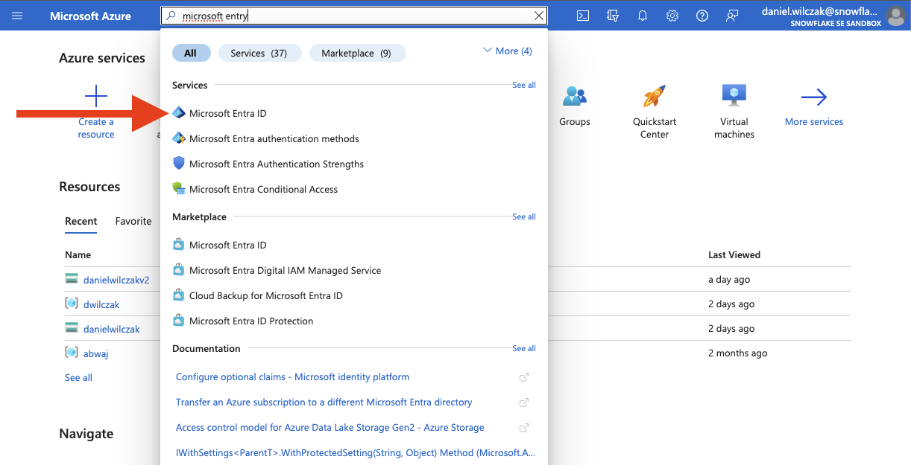
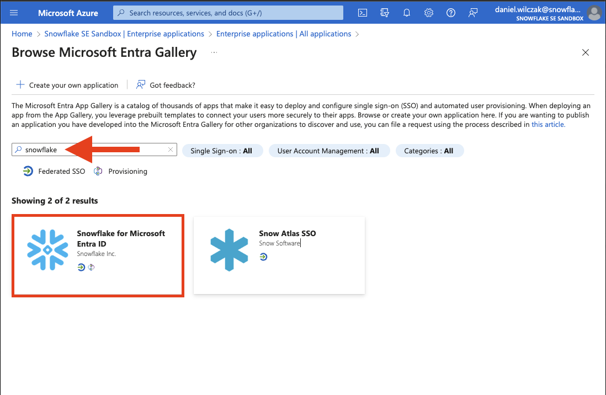
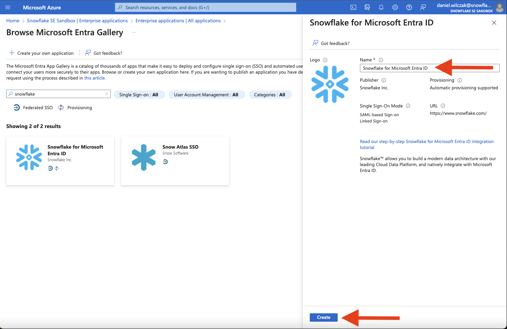
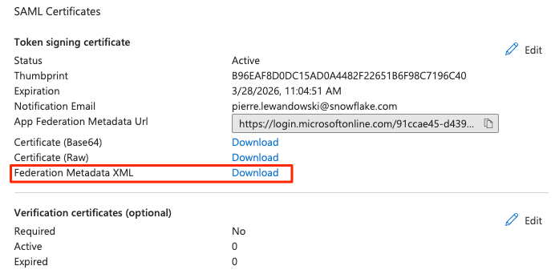

# Azure Active Directory (SSO) to Snowflake
In this tutorial we will show how to setup authentication to Snowflake using SSO with Azure Active Directory Identity Provider. 

## Video
Video is still in developemnt.

## Azure :octicons-feed-tag-16:
Lets start in azure by setting up the SSO and then adding the users to the approved list.

### Setup
Lets start in azure by logging into our [azure](https://portal.azure.com/) and navigate to Microsoft Entra ID.


Next lets click on Enterprise Applications on the left navbar.


Click on new application.


In the Browse Azure AD Gallery search bar, search for Snowflake, and choose Snowflake for Microsoft Entra ID application.


Give your Snowflake application a name, then click the Create button at the bottom.


Once the application is created, on the left side choose Single sign-on, then choose SAML in the middle panel.


In the middle pane under the Basic SAML configuration section, click the Edit button.


 Next we'll want to get our Snowflake [account identifier url](). An example can be seen below that comes from ``AWS US West (Oregon)`` or you can use this chart (1).
{ .annotate }

1.  | URL type                 | URL format                                                         |
    |--------------------------|--------------------------------------------------------------------|
    | Regional                 | https://locator.region.snowflakecomputing.com                      |
    | Organization             | https://organization-name.snowflakecomputing.com                   |
    | Connection               | https://organization-connection.snowflakecomputing.com             |
    | Regional Privatelink     | https://locator.region.privatelink.snowflakecomputing.com          |
    | Organization Privatelink | https://organization-name.privatelink.snowflakecomputing.com       |
    | Connection Privatelink   | https://organization-connection.privatelink.snowflakecomputing.com |


!!! warning
    If you format your URL incorrectly the SSO login will not work. Please read the [Account Identifiers](https://docs.snowflake.com/en/user-guide/admin-account-identifier#non-vps-account-locator-formats-by-cloud-platform-and-regionr) documentation to learn how to format your URL based on your snowflake service provider and server location. 

In the Basic SAML Configuration section, configure your Identifier (Entity ID) with your snowflake account identifier URL and also again for your Reply URL (Assertion consumer service URL) but follow it with ``/fed/login`` and click save.


Go back to the application's SAML-based Sign-on page, scroll down to the SAML Certificates section. Download the Federation Metadata XML. We will use this file in our Snowflake steps.


### Add users
!!! warning
    If you don't add the user in the Azure AD group they will not be able to use the SSO login on Snowflake. 

Lets add users into the azure AD group for the application. First click on "Users and groups" on the left side navbar and then "add user/group". 


Select Users and groups.


Select the user or groups you want to add. The search bar can be very helpful when you have alot of users/groups.


Finally click assign.


## Snowflake :octicons-feed-tag-16:
Next we will setup Snowflake with the information we got from our ``federation metadata xml`` file. To make this process easier I suggest formatting your XML file so it's easier to look through. I used [VS code](https://code.visualstudio.com/) and an [xml formatter](https://marketplace.visualstudio.com/items?itemName=redhat.vscode-xml) to accomplish this. Once you have the file open in vs code and the xml extension installed, select all the code and right clicl -> "Format Document". 

### Setup
Lets open a worksheet in snowflake and enter the code below by entering in the necessary areas from our federation metadata xml file..

=== ":octicons-image-16: Template"

    ```sql linenums="1"
    use role accountadmin;
    create security integration azureadintegration
        type = saml2
        enabled = true
        saml2_issuer = 'https://sts.windows.net/[...]]/'  /* (1)! */
        saml2_sso_url = 'https://login.microsoftonline.com/[...]/saml2' /* (2)! */
        saml2_provider = 'CUSTOM'
        saml2_x509_cert = '<idp certificate>'  /* (3)! */
        saml2_sp_initiated_login_page_label = 'AzureADSSO'
        saml2_enable_sp_initiated = true;
    ```
    { .annotate }

    1. ```
       <EntityDescriptor ID="_8416250f-50fb-...8bcd335e92" entityID="https://sts.windows.net/9a2d78cb-73...fc1ac5ef57a7/" xmlns="urn:oasis:names:tc:SAML:2.0:metadata">
       ```

    2. ```
       <SingleSignOnService Binding="urn:oasis:names:tc:SAML:2.0:bindings:HTTP-Redirect" Location="https://login.microsoftonline.com/9a2d78c...-fc1ac5ef57a7/saml2" />
       ```

    3.  ```
        <X509Certificate>
        MIIC8DCCAdigAwIBAgIQQH4r9rnBiKlPEFVEjpdNhTANBgkqhkiG9w0BAQ
        .......
        Y9B1uSBpb4OmtWZ/LRNzHBDcDNbR oQ6PiPd2yWhtUfbYClOoNcMFOkk8E
        </X509Certificate>
        ```

=== ":octicons-image-16: Example"

    ```sql linenums="1"
    use role accountadmin;
    create security integration azureadintegration
        type = saml2
        enabled = true
        saml2_issuer = 'https://sts.windows.net/9a2d78cb-73e9-40ee-a55...1ac5ef57a7/' 
        saml2_sso_url = 'https://login.microsoftonline.com/9a2d78cb-73e...ac5ef57a7/saml2'
        saml2_provider = 'CUSTOM'
        saml2_x509_cert = 'miic8dccadigawibagiqqh4r9rnbiklpefvejpdnhtanbgkqhkig9w0baqsfada0mtiwmaydvqqdeylnawnyb3nvznqgqxp1
        ......
        oq6pipd2ywhtufbyclooncmfokk8e6n48t33kivtvurwwta52olbt2eorzbvwaglt8dlkfhpzzd0szfystjyvd5k2tezsqy8hqlfh33m6+sa2e74x1yj' 
        saml2_sp_initiated_login_page_label = 'AzureADSSO'
        saml2_enable_sp_initiated = true;
    ```

=== ":octicons-image-16: Result"

    | status                                               |
    |------------------------------------------------------|
    | Integration AZUREADINTEGRATION successfully created. |

!!! success
    If you configured the Basic SAML configuration in the azure section using the Regional Locator Snowflake URL (1), you can move on to the next step by adding users and testing your login.
    { .annotate }

    1. This is an example of a regional locator URL: https://mbb41651.snowflakecomputing.com/

??? warning "If you've chosen to use a different URL format then regional locator"
    If you've chosen to use a different URL format such as Organization, Connection or one of the Privatelink URLs, follow the steps below. 

    Review the current integration configuration. Confirm the values of the ``SAML2_SNOWFLAKE_ACS_URL`` and ``SAML_SNOWFLAKE_ISSUER_URL`` parameters are using the Regional Locator URL (1).
    { .annotate }

    1. This is an example of a regional locator URL: https://mbb41651.snowflakecomputing.com/


    === ":octicons-image-16: Check"

        ```sql linenums="1"
        desc security integration azureadintegration;
        ```

    If they are not, alter the security integration by using the code below.
    === ":octicons-image-16: Alter integration"

        ```sql linenums="1"
        use role accountadmin;

        alter security integration azureadintegration 
            set SAML2_SNOWFLAKE_ACS_URL = 'https://<organization name>-<account name>.snowflakecomputing.com/fed/login';
        
        -- OR

        alter security integration azureadintegration
            set SAML2_SNOWFLAKE_ISSUER_URL = 'https://<organization name>-<account name>.snowflakecomputing.com';
        ```

    Notes:  
    - The above statement uses the Organization URL as an example. You should use the URL format the Azure Single sign on application was configured with.  
    - The value for the parameter SAML2_SNOWFLAKE_ACS_URL ends with /fed/login.  
    - The value for the parameter SAML2_SNOWFLAKE_ISSUER_URL is only the Snowflake account URL, in the format matching the Azure application configuration.  

### Add or modify users.

!!! warning
    Your users must use their email for logging into Snowflake that matches in Azure AD or it will not work.

!!! note
    If you already have users in Snowflake and they already are using their email for logging in then you can skip this section. 

Lets add the user to snowflake using the users email. It is also suggested to give that user a role at this point.

=== ":octicons-image-16: Add user with email"

    ```sql linenums="1"
    use role accountadmin;
    
    create user "<USER EMAIL>";
    ```

=== ":octicons-image-16: Example"

    ```sql linenums="1"
    use role accountadmin;
    
    create user "daniel.wilczak@snowflake.com";
    ```

=== ":octicons-image-16: Result"
    | status                                                  |
    |---------------------------------------------------------|
    | User daniel.wilczak@snowflake.com successfully created. |

If you already have users in snowflake but when they were created they didn't use their email.

=== ":octicons-image-16: Modify user to set email"

    ```sql linenums="1"
    use role accountadmin;
    
    alter user <USERNAME> rename to "<USER EMAIL>";
    ```

=== ":octicons-image-16: Example"

    ```sql linenums="1"
    use role accountadmin;

    alter user danielw rename to "hi@hi.com";
    ```

=== ":octicons-image-16: Result"
    | status                           |
    |----------------------------------|
    | Statement executed successfully. |

### Test login
!!! note
    If you get an error stating the user doesnt exist, you either forgot to add the user in Azure or Snowflake.

Lets make sure your Azure AD is working. Logout of your Snowflake account and you should now see the Azure AD login button.


