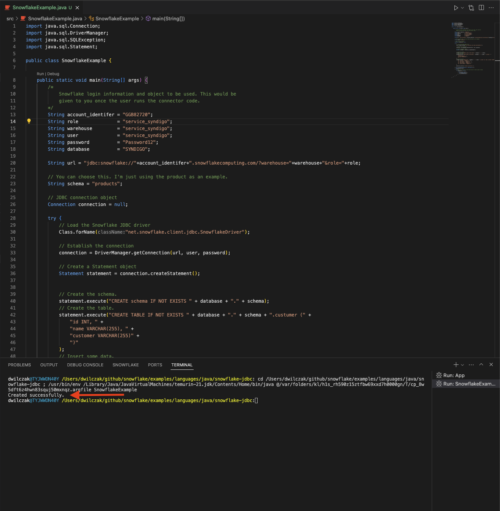
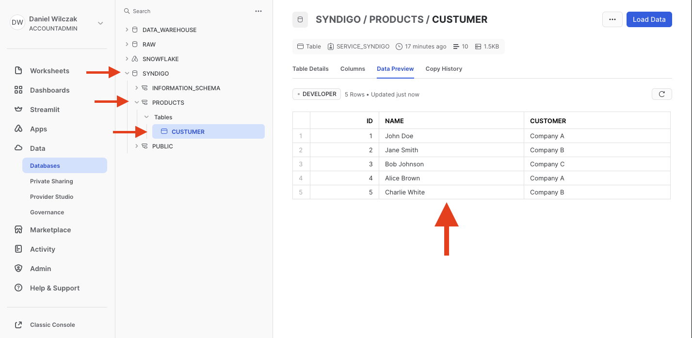

# Snowflake - JDBC connection

<iframe width="850px" height="478px" src="https://www.youtube.com/embed/KYRlISpJx_E?si=_c4N9_GejASpxsZm" style="display:block;" title="YouTube video player" frameborder="0" allow="accelerometer; autoplay; clipboard-write; encrypted-media; gyroscope; picture-in-picture; web-share" allowfullscreen></iframe>

This tutorial will show you how to create a connector to load data into snowflake from your java application using our jdbc library.

## 1. Prequestes:

### Snowflake account url
We will need our account url. This can be found in the url bar when you log into Snowflake. It will end with ``.snowflakecomputing.com``.

### Add JDBC library
Add the jdbc library (.jar) file into your java project / application. This will depend on the application and IDE. I have linked the [.jar I used](#) in the tutorial. A list can be found here. I used the most recent (closest to current date).

https://repo1.maven.org/maven2/net/snowflake/snowflake-jdbc/

## 2. Code 

Get your customer to run this sql in there snowflake account and then have them tell you what they used as variables:

This is an example where the user would give you the string values for connection, role, warehouse and database. It creates a schema called products and a table called customers in products schema. I have also inserted some sample data. 

=== ":octicons-image-16: Sql"

    ```sql
    Begin; 
        -- create variables for user / password / role / warehouse / database (needs to be uppercase for objects)
        set role_name = 'service_jdbc';
        set user_name = 'service_jdbc';
        set user_password = 'Password12';
        set warehouse_name = 'service_jdbc';
        set database_name = 'jdbc';

        -- change role to securityadmin for user / role steps
        use role securityadmin;

        -- create role for jdbc
        create role if not exists identifier($role_name);
        grant role identifier($role_name) to role SYSADMIN;

        -- create a user for jdbc
        create user if not exists identifier($user_name)
        password = $user_password
        default_role = $role_name
        default_warehouse = $warehouse_name;

        grant role identifier($role_name) to user identifier($user_name);

        -- change role to sysadmin for warehouse / database steps
        use role sysadmin;

        -- create a warehouse for jdbc
        create warehouse if not exists identifier($warehouse_name)
        warehouse_size = xsmall
        warehouse_type = standard
        auto_suspend = 60
        auto_resume = true
        initially_suspended = true;

        -- create database for jdbc
        create database if not exists identifier($database_name);

        -- grant jdbc role access to warehouse
        grant USAGE
        on warehouse identifier($warehouse_name)
        to role identifier($role_name);

        -- grant jdbc access to database
        use role ACCOUNTADMIN;
        grant CREATE SCHEMA, MONITOR, USAGE
        on database identifier($database_name)
        to role identifier($role_name);
    commit;
    ```

=== ":octicons-image-16: Java"

    ```java
    import java.sql.Connection;
    import java.sql.DriverManager;
    import java.sql.SQLException;
    import java.sql.Statement;

    public class SnowflakeExample {

        public static void main(String[] args) {
            /* 
                Snowflake login information and object to be used. This would be
                given to you once the user runs the connector code.

                For documentation on what the account url will be use our snowflake docs:
                https://docs.snowflake.com/en/user-guide/admin-account-identifier#non-vps-account-locator-formats-by-cloud-platform-and-region
            */ 
            String account_url = "GGB82720.snowflakecomputing.com";
            String role        = "service_jdbc";
            String warehouse   = "service_jdbc";
            String user        = "service_jdbc";
            String password    = "Password12";
            String database    = "jdbc";

            String url = "jdbc:snowflake://"+account_url+"/?warehouse="+warehouse+"&role="+role;
        
            // You can choose this. I'm just using the product as an example.
            String schema = "data";
            String table  = "example";

            // JDBC connection object
            Connection connection = null;

            try {
                // Load the Snowflake JDBC driver
                Class.forName("net.snowflake.client.jdbc.SnowflakeDriver");

                // Establish the connection
                connection = DriverManager.getConnection(url, user, password);

                // Create a Statement object
                Statement statement = connection.createStatement();
                
                // Create the schema.
                statement.execute("CREATE schema IF NOT EXISTS " + database + "." + schema);
                // Create the table.
                statement.execute("CREATE TABLE IF NOT EXISTS " + database + "." + schema + "."+ table +" (" +
                    "id INT, " +
                    "name VARCHAR(255), " +
                    "customer VARCHAR(255)" +
                    ")"
                );
                // Insert some data.
                statement.execute("INSERT INTO " + database + "." + schema + "."+ table +" (id, name, customer) VALUES " +
                    "(1, 'John Doe', 'Company A'), " +
                    "(2, 'Jane Smith', 'Company B'), " +
                    "(3, 'Bob Johnson', 'Company C'), " +
                    "(4, 'Alice Brown', 'Company A'), " +
                    "(5, 'Charlie White', 'Company B')"
                );

                System.out.println("Created successfully.");

            } catch (ClassNotFoundException | SQLException e) {
                e.printStackTrace();
            } finally {
                // Close the connection in the finally block to ensure proper cleanup
                if (connection != null) {
                    try {
                        connection.close();
                    } catch (SQLException e) {
                        e.printStackTrace();
                    }
                }
            }
        }
    }
    ```


=== ":octicons-sign-out-16: Result"
    Run:
    

    The result in snowflake:
    


