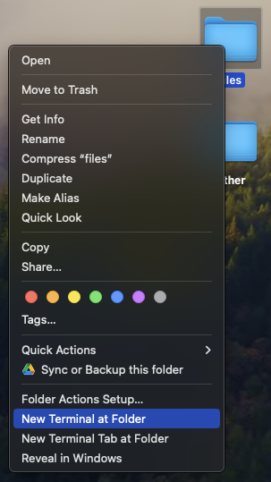

# Container Services - CPU Jupyter Notebook
Goal of this tutorial is to get a Facebook's Llama 2 running on Snowflake's container services and have the capability call on that LLM using a Snowflake [user defined function](https://docs.snowflake.com/en/developer-guide/udf/udf-overview). This tutorial assumes you have nothing in your Snowflake account ([Trial](https://signup.snowflake.com/)) and no complex security needs.

## Video
Video coming soon.

## Requirements 
As of now, you need to have an account that is in a [container services enabled region](https://docs.snowflake.com/en/developer-guide/snowpark-container-services/overview#available-regions).

## Setup :octicons-feed-tag-16:
Let's start by setting up Snowflake before we jump to docker. Create a worksheet in snowflake and add the code below. Please fill in a password and hit run:

=== ":octicons-image-16: Code"

    ```sql
    set role_name       = 'service_llm';
    set user_name       = 'service_llm';
    set user_password   = '....';
    set warehouse_name  = 'service_llm';

    set database_name   = 'llm';
    set schema_name     = 'llama';

    set pool_name       = 'service_llm';
    set repo_name       = 'image';
    set stage_name      = 'service';
    set service_name    = 'llama';
    set service_file    = 'service.yaml';

    use role accountadmin; 

    -- Create a user for container services:
    create user if not exists identifier($user_name)
        password = $user_password
        default_warehouse = $warehouse_name
        must_change_password = false
        comment = 'LLM in container services.';

    -- Create role for container services and grant the role to sysadmin and our user:
    create role if not exists identifier($role_name);
    grant role identifier($role_name) to role sysadmin;
    grant role identifier($role_name) to user identifier($user_name);


    -- Set the default role for the user to our role. (Required or it wont work).
    alter user identifier($user_name) set default_role = $role_name;

    -- Create the compute pool:
    create compute pool identifier($pool_name)
        min_nodes = 1
        max_nodes = 1
        instance_family = CPU_X64_L
        comment='Container compute that will be used for llm llama models.';

    -- Grant role required services 
    -- (https://docs.snowflake.com/en/sql-reference/sql/create-service#access-control-requirements):
    grant usage   on compute pool identifier($pool_name) to role identifier($role_name);
    grant monitor on compute pool identifier($pool_name) to role identifier($role_name);
    grant bind service endpoint on account to role identifier($role_name);

    -- Create the warehouse. this will be the warehouse used if any snowflake data is queried.
    create warehouse if not exists identifier($warehouse_name)
        warehouse_size = xsmall
        warehouse_type = standard
        auto_suspend = 60
        auto_resume = true
        initially_suspended = true;

    -- Grant all warhouse control to our container role.
    grant all on warehouse identifier($warehouse_name) to role identifier($role_name);

    -- create the database were everything will live and give ownership to our container user.
    create database identifier($database_name);
    grant ownership on database identifier($database_name) to role identifier($role_name);

    -- Create a security integration to login to.
    create security integration if not exists snowservices_ingress_oauth
        type = oauth
        oauth_client = snowservices_ingress
        enabled = true;

    -- Setup context for adding schema, image repository and stage.
    use role identifier($role_name);
    use database identifier($database_name);

    -- Adding schema, image repository and stage so it can be used in the notebook.
    create schema identifier($schema_name);  
    use schema identifier($schema_name);
    create or replace image repository identifier($repo_name);
    create or replace stage identifier($stage_name) 
        directory = ( enable = true ) ENCRYPTION = (type = 'SNOWFLAKE_SSE');

    -- Tell us where to upload our docker image to. This will be used later.
    show image repositories;
    select "repository_url" from table(result_scan(last_query_id()));
    ```

=== ":octicons-sign-out-16: Result"
    ```
    | repository_url                                                                    |
    |-----------------------------------------------------------------------------------|
    | sfsenorthamerica-demo-dwilczak.registry.snowflakecomputing.com/llm/llama/image    |
    ```

## Docker :octicons-feed-tag-16:

### Download

#### Docker and services files
Lets first [download the files](https://sfc-gh-dwilczak.github.io/tutorials/snowflake/container/cpu/llm/files.zip) we'll need for the docker file and service file later.

#### Llama 2 Model
You will want to select and download your [Llama model](https://huggingface.co/TheBloke/Llama-2-7B-Chat-GGUF/tree/main). For this tutorial I downloaded the "[llama-2-7b-chat.Q2_K.gguf](https://huggingface.co/TheBloke/Llama-2-7B-Chat-GGUF/resolve/main/llama-2-7b-chat.Q2_K.gguf?download=true)" model due to it being the smallest model.

### Run Locally 
Our goal is to run the application locally and check if it works and then upload the dockerfile / image to our snowflake image repository so it can be hosted on Snowflake container services.

!!! Note
    Please install docker desktop - [https://www.docker.com/products/docker-desktop/](https://www.docker.com/products/docker-desktop/)


Using terminal, navigate to the folder that has the docker file you downloaded. Put the Model you downloaded into the folder and build and run the docker file locally. For those not familiar with terminal you can right click the folder on MAC and click "New Terminal at folder". (1)
{ .annotate }

1.  

=== ":octicons-image-16: Build and Run"
    ```bash
    docker build --rm -t llama:endpoint .
    docker run --rm -p 8080:8080 llama:endpoint
    ```
    

This is where you can use a tool like Postman to query the api or use terminal directly.

#### Postman
EITHER ADD A VIDEO OF ME DOING IT OR GIF.

#### Curl
```bash
UPDATE WITH CURL CODE FOR TERMINAL
``` 

### Upload

Using terminal and the file / folder from the prior step, tag the image with your repository_url we get from the setup step. (1)  Once tagged you can go into docker desktop and see the image (2) that is properly tagged. 
{ .annotate }

1.  | repository_url                                                                    |
    |-----------------------------------------------------------------------------------|
    | sfsenorthamerica-demo-dwilczak.registry.snowflakecomputing.com/llm/llama/image    |

2.  UPDATE WITH IMAGE OF TAGGED CONTAINER


=== ":octicons-image-16: Code"

    ```bash
    docker tag llama:endpoint <URL GOES HERE>/llama:endpoint
    ```

=== ":octicons-image-16: Example"

    ```bash
    docker tag llama:endpoint \
    sfsenorthamerica-demo-dwilczak.registry.snowflakecomputing.com/llm/llama/image/llama:endpoint
    ```

Next docker login to our snowflake image repo and upload the image. We will use the login name **service_llm** and the **password you specified at the start** of the tutorial.
=== ":octicons-image-16: Code"

    ```bash
    docker login <FIRST PART OF THE URL> -u service_llm
    ```
=== ":octicons-image-16: Example"

    ```bash
    docker login sfsenorthamerica-demo-dwilczak.registry.snowflakecomputing.com/ -u service_llm
    ```


Finally push the image to your image repository living on Snowflake.
=== ":octicons-sign-out-16: Code"
    ```bash
    docker push <URL GOES HERE>/llama:endpoint
    ```
=== ":octicons-sign-out-16: Example"
    ```bash
    docker push sfsenorthamerica-demo-dwilczak.registry.snowflakecomputing.com/llm/llama/image/llama:endpoint
    ```

#### Video walkthrough
UPDATE WALKTHROUGH VIDEO HERE

## Snowflake :octicons-feed-tag-16:

### Upload service file
Upload the service specification file we [downloaded earlier](https://sfc-gh-dwilczak.github.io/tutorials/snowflake/container/cpu/llama/#download) to the stage. We will use snowflake UI to do this. An example can be seen below.

UPDATE SERVICE FILE UPLOAD GIF

### Run the container service
Create the service from the service specification file and go to the URL given.

!!! warning
    Login with the user we created. Username: "service_llm" and the password you gave to the setup script.

!!! Note
    Continue to refresh the result by **running the last two commands** (1) until Snowflake give you a proper URL.
    { .annotate }

    1.  ```sql
        show endpoints in service identifier($service_name);
        select "ingress_url" from table(result_scan(last_query_id()));
        ```


=== ":octicons-image-16: SQL"

    ```sql
    set role_name       = 'service_llm';
    set pool_name       = 'service_llm';
    set service_name    = 'llama';

    use role identifier($role_name);

    create service identifier($service_name)
        in compute pool identifier($pool_name)
        from @service
        spec='service.yml'
        min_instances=1
        max_instances=1;

 
    show endpoints in service identifier($service_name);
    select "ingress_url" from table(result_scan(last_query_id()));
    ```

=== ":octicons-image-16: Result"
    | ingress_url                                                        |
    |--------------------------------------------------------------------|
    | zwxbzi-sfsenorthamerica-demo-dwilczak.snowflakecomputing.app       |


### User defined function
Lets create a user defined funciton to access our llama 2 llm endpoint.

=== ":octicons-image-16: SQL"

    ```sql
    create or replace function llama(
        system_message varchar,
        user_message varchar,
        max_tokens integer
    )
    returns varchar
    service=llama
    endpoint=llama
    as '/llama';
    ```

=== ":octicons-image-16: Result"
    | status                                    |
    |-------------------------------------------|
    | Function LLAMA successfully created.      |

### Use
Finally lets use our llama 2 llm user defined function. The result will come back in roughly ~60 seconds. This is due to it being run via a cpu and not a gpu. The gpu tutorial will be coming soon.

=== ":octicons-image-16: SQL"

    ```sql
    select llama(
        'You are a helpful assistant',
        'Generate a list of 5 funny dog names',
        300
    );
    ```

=== ":octicons-image-16: Result"

    Of course! Here are five funny dog names that might suit your furry friend:

    1. Barnaby Barkinstein - This name has a bit of a play on words, with "Barnaby" being a old-fashioned name and "Barkinstein" being a pun on the word "Bark". It's sure to bring some laughs when you introduce your dog to friends and family.

    2. Sir Paws-a-Lot - This name combines the regal-sounding "Sir" with the playful "Paws" to create a fun and catchy moniker for your pup. It's perfect for a dog that's always getting into mischief.

    3. Puddles McFluffin - This name plays on the idea of a dog having a "fluffy" coat, while also incorporating a cute and quirky nickname like "Puddles". It's sure to bring a smile to everyone's face when you introduce your dog with this name.

    4. Rufus McSnuggles - This name combines two cute and playful nicknames to create a fun and silly moniker for your pup. "Rufus" is a classic name with a fun twist, while "McSnuggles" adds a playful touch to the end of the name.


## Clean up script :octicons-feed-tag-16:
If you don't plan to keep this running. Which I don't reccomend considering it's using 1.66 credits per hour. Here is a clean up script.

=== ":octicons-image-16: SQL"

    ```sql
    use role accountadmin;

    alter compute pool service_llm stop all;
    drop compute pool service_llm;
    drop warehouse service_llm;
    drop user service_llm;
    drop role service_llm;
    drop database llm;
    ```

=== ":octicons-image-16: Result"
    | status                        |
    |-------------------------------|
    | LLM successfully dropped.     |


