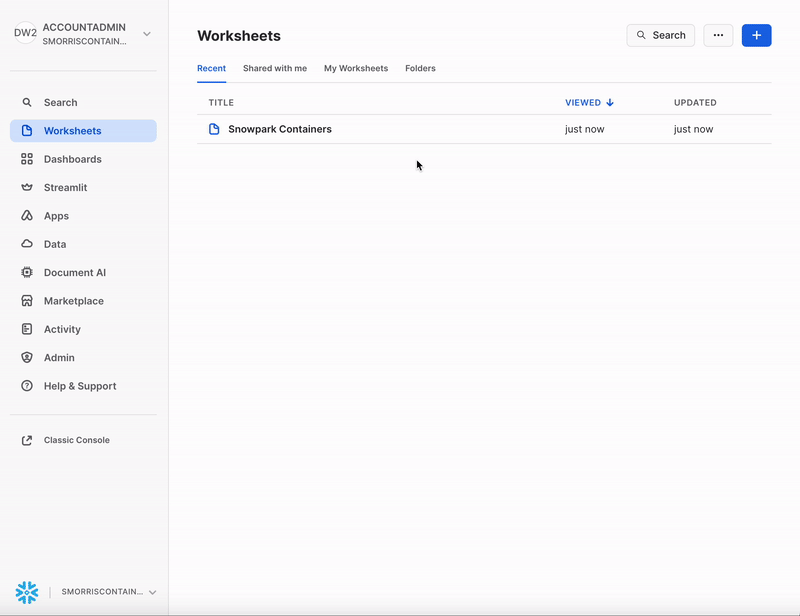

# Container Services - CPU Jupyter Notebook Setup:

## Video

VIDEO HERE

This tutorial assumes you have nothing in your Snowflake account ([Trial](https://signup.snowflake.com/)) and no complex security needs. The tutorial can be started at any step.

## Files
PUT LINK TO TUTORIAL FILES

## 1. Snowflake - Setup

Let's start by setting up snowflake before we jump to docker. Lets create a worksheet in snowflake and add the code below with your information and hit run:

=== ":octicons-image-16: Worksheet"
    

=== ":octicons-image-16: Code"

    ```sql
    set role_name       = 'container_jupyter';
    set user_name       = 'container_jupyter';
    set user_password   = 'Password12';
    set warehouse_name  = 'jupyter';

    set database_name   = 'container';
    set schema_name     = 'jupyter';

    set pool_name       = 'container_jupyter';
    set repo_name       = 'image_repo';
    set stage_name      = 'image_stage';
    set service_name    = 'jupyter';

    use role accountadmin; 

    -- Create a user for container services:
    create user if not exists identifier($user_name)
        password = $user_password
        default_warehouse = $warehouse_name
        must_change_password = false
        comment = 'Jupyter notebook in container services.';

    -- Create role for container services and grant the role to sysadmin and our user:
    create role if not exists identifier($role_name);
    grant role identifier($role_name) to role sysadmin;
    grant role identifier($role_name) to user identifier($user_name);

    -- Set the default role for the user to our role. (Required or it wont work).
    alter user identifier($user_name) set default_role = $role_name;

    -- Create the compute pool:
    create compute pool identifier($pool_name)
    min_nodes = 1
    max_nodes = 1
    instance_family = standard_1
    comment='Container compute that will be used for juypter notebooks.';

    -- Grant usage and monitor for the compute resourse to our role:
    grant usage on compute pool identifier($pool_name) to role identifier($role_name);
    grant monitor on compute pool identifier($pool_name) to role identifier($role_name);

    -- Create the warehouse. this will be the warehouse used if any snowflake data is queried.
    create warehouse if not exists identifier($warehouse_name)
    warehouse_size = xsmall
    warehouse_type = standard
    auto_suspend = 60
    auto_resume = true
    initially_suspended = true;

    -- Grant all warhouse control to our container role.
    grant all on warehouse identifier($warehouse_name) to role identifier($role_name);

    -- create the database were everything will live and give ownership to our container user.
    create database identifier($database_name);
    grant ownership on database identifier($database_name) to role identifier($role_name);

    -- Create a security integration to login to.
    create security integration if not exists snowservices_ingress_oauth
    type=oauth
    oauth_client=snowservices_ingress
    enabled=true;

    -- Setup context for adding schema, image repository and stage.
    use role identifier($role_name);
    use database identifier($database_name);

    -- Adding schema, image repository and stage so it can be used in the notebook.
    create schema identifier($schema_name);  
    use schema identifier($schema_name);
    create or replace image repository identifier($repo_name);
    create or replace stage identifier($stage_name) 
        directory = ( enable = true ) ENCRYPTION = (type = 'SNOWFLAKE_SSE');

    -- Tell us where to upload our docker image to. This will be used later.
    show image repositories;
    select "repository_url" from table(result_scan(last_query_id()));
    ```

=== ":octicons-sign-out-16: Result"
    ```
    | repository_url                                                                                 |
    |------------------------------------------------------------------------------------------------|
    | sfsenorthamerica-smorriscontainer.registry.snowflakecomputing.com/container/jupyter/image_repo |
    ```

## 2. Docker

### Run Locally 
Our goal is to run the application locally and check it works and then upload the dockerfile / image to our snowflake image repository so it can be hosted on Snowflake container services.

Please install docker desktop - https://www.docker.com/products/docker-desktop/

Using terminal, **navigate to the folder that has the docker file you downloaded. Build and run the docker file locally. Once built, go to [http://localhost:8080/lab](http://localhost:8080/lab) to see the application. Ctrl+c to exit the application.


=== ":octicons-image-16: Code"
    ```bash
    docker build --rm -t jupyter:tutorial . &&
    docker run --rm -p 8080:8888 jupyter:tutorial
    ```

=== ":octicons-image-16: Result"
    ```
    GIF of running it on terminal.
    ```

### Upload to Snowflake

- Tag the image with your repository_url we got from **step 1**.
- Log into docker and upload the image. We will use the login name **container_jupyter** and the password **Password12**.
- Upload/push your image to snowflake.

=== ":octicons-image-16: TAG"

    ```bash
    docker tag jupyter:tutorial \
    sfsenorthamerica-smorriscontainer.registry.snowflakecomputing.com/container/jupyter/image_repo/jupyter:tutorial
    ```

=== ":octicons-image-16: Login"

    ```bash
    docker login sfsenorthamerica-smorriscontainer.registry.snowflakecomputing.com/ -u container_jupyter
    ```

=== ":octicons-sign-out-16: Push"
    ```bash
    docker push sfsenorthamerica-smorriscontainer.registry.snowflakecomputing.com/container/jupyter/image_repo/jupyter:tutorial
    ```

=== ":octicons-image-16: Result"
    ```sql
    RESULT HERE
    ```


## 3. Snowflake - Upload Service File
Upload the service specification file to the stage. We will use snowflake UI to do this. An example can be seen below.

GIF GOES HERE.


## 4. Snowflake - Run
Final step, Create the service from the service specification file and go to the URL given.

=== ":octicons-image-16: SQL"

    ```sql
    CREATE SERVICE identifier($service_name)
        IN COMPUTE POOL identifier($pool_name)
        FROM @image_stage
        SPEC='service.yaml'
        MIN_INSTANCES=1
        MAX_INSTANCES=1;
    ```

=== ":octicons-sign-out-16: Status"

    ```sql
    DESCRIBE SERVICE identifier($service_name);
    
    ```


=== ":octicons-sign-out-16: Result"
    ```
    GIF
    ```

WAIT for public endpoint to **NOT** say: Endpoints provisioning in progress... check back in a few minutes. It will give you a url.


