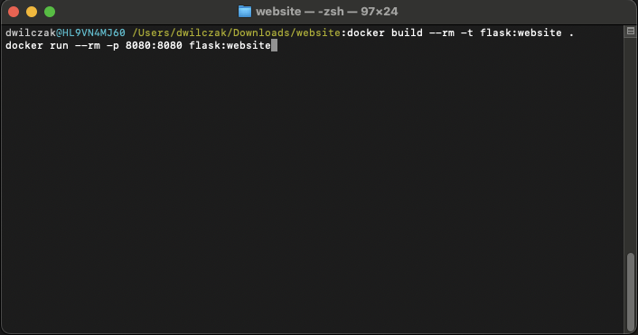
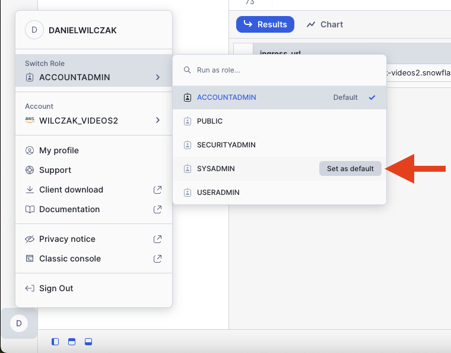
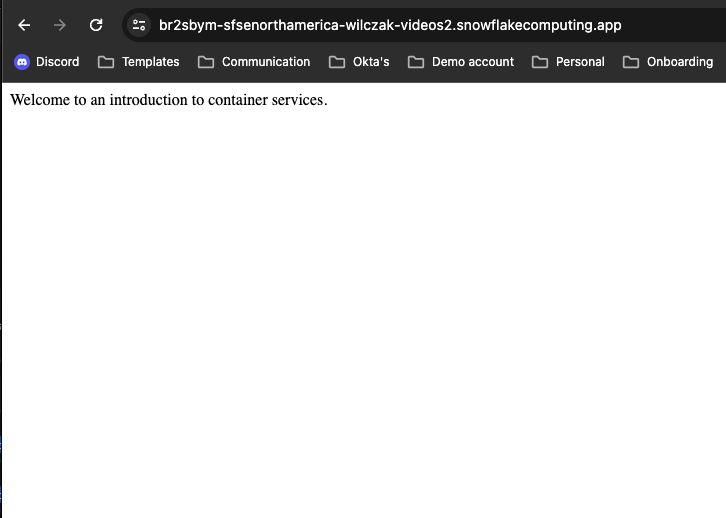

# Container Services - Introduction
Goal of this tutorial is to get a introduction to Snowflake Container services by creating a flask website and then uploading / running it in Snowflake.

## Video
Video currently in development.

## Requirements 
- Be in a container services enabled region.([Link](https://docs.snowflake.com/en/developer-guide/snowpark-container-services/overview#available-regions))
- You can NOT be on a trial account. ([Link](https://docs.snowflake.com/en/developer-guide/snowpark-container-services/overview))

## Download
- Files ([Link](https://sfc-gh-dwilczak.github.io/tutorials/snowflake/container/introduction/data/website.zip))

## Setup :octicons-feed-tag-16:
Lets go through some setup before to go into our application.

### Snowflake
Let's start by setting up Snowflake before we jump to docker. Create a worksheet in snowflake and add / run the code below.

??? note "If you don't have a database, schema or warehouse yet."

    === ":octicons-image-16: Database, schema and warehouse"

        ```sql
        use role sysadmin;

        -- Create a database to store our schemas.
        create database raw;

        -- Create the schema. The schema stores all our objectss.
        create schema raw.website;

        /*
            Warehouses are synonymous with the idea of compute
            resources in other systems. We will use this
            warehouse to call our user defined function.
        */
        create warehouse if not exists developer 
            warehouse_size = xsmall
            initially_suspended = true;

        use database raw;
        use schema website;
        use warehouse developer;
        ```

=== ":octicons-image-16: Setup"

    ```sql linenums="1"
    -- Use account admin for the integration.
    use role accountadmin;

    -- Allow sysadmin to create our website url.
    grant bind service endpoint on account to role sysadmin;

    -- Use sysadmin for everything else.
    use role sysadmin;

    -- Compute pool to run containers on.
    create compute pool cpu_x64_xs
        min_nodes = 1
        max_nodes = 1
        instance_family = cpu_x64_xs;

    -- Image registry to upload our docker image to.
    create or replace image repository images;

    -- Give us the url to upload our docker container to.
    show image repositories;
    select "repository_url" from table(result_scan(last_query_id()));
    ```

=== ":octicons-image-16: Result"

    | repository_url                                                                      |
    |-------------------------------------------------------------------------------------|
    | sfsenorthamerica-wilczak-videos2.registry.snowflakecomputing.com/raw/website/images |


### Docker
Our goal is to run the application locally and check if it works and then upload the built docker image to our snowflake image repository so it can be hosted on Snowflake container services.

!!! Note
    Please install docker desktop - [https://www.docker.com/products/docker-desktop/](https://www.docker.com/products/docker-desktop/)


Using terminal, navigate to the folder that has the docker file you downloaded. 



=== ":octicons-image-16: Build and Run"

    ```bash linenums="1"
    docker build --rm -t flask:website .
    docker run --rm -p 8080:8080 flask:website
    ```

=== ":octicons-image-16: Result"

    ```linenums="1"
    WARNING: The requested image's platform (linux/amd64) does not match the detected host platform (linux/arm64/v8) and no specific platform was requested
    * Serving Flask app 'app'
    * Debug mode: off
    WARNING: This is a development server. Do not use it in a production deployment. Use a production WSGI server instead.
    * Running on all addresses (0.0.0.0)
    * Running on http://127.0.0.1:8080
    * Running on http://172.17.0.2:8080
    ```


Now you can go to [Localhost](http://localhost:8080/) or the direct local url [http://127.0.0.1:8080/](http://127.0.0.1:8080/). To see what the website will look like before we upload it.

### Upload

Now that we have our image created. Lets upload it to Snowflake. We will need our Snowflake image url (1) that we got from our Snowflake setup.
{ .annotate }

1.  | repository_url                                                                         |
    |----------------------------------------------------------------------------------------|
    | sfsenorthamerica-wilczak-videos2.registry.snowflakecomputing.com/raw/website/images    |


=== ":octicons-image-16: Code"

    ```bash linenums="1"
    docker tag flask:website <URL GOES HERE>/flask:website
    ```

=== ":octicons-image-16: Example"

    ```bash linenums="1"
    docker tag flask:website \
    sfsenorthamerica-wilczak-videos2.registry.snowflakecomputing.com/raw/website/images/flask:website
    ```

Next docker login to our snowflake image repo and upload the image. We will use the login name that has access to **sysadmin** role.
=== ":octicons-image-16: Code"

    ```bash linenums="1"
    docker login <FIRST PART OF THE URL> -u danielwilczak
    ```
=== ":octicons-image-16: Example"

    ```bash linenums="1"
    docker login sfsenorthamerica-wilczak-videos2.registry.snowflakecomputing.com/ -u danielwilczak
    ```


Finally push the image to your image repository living on Snowflake.
=== ":octicons-sign-out-16: Code"

    ```bash linenums="1"
    docker push <URL GOES HERE>/flask:website
    ```
=== ":octicons-sign-out-16: Example"

    ```bash linenums="1"
    docker push sfsenorthamerica-wilczak-videos2.registry.snowflakecomputing.com/raw/website/images/flask:website
    ```
=== ":octicons-sign-out-16: Result"

    ```
    The push refers to repository [sfsenorthamerica-wilczak-videos2.registry.snowflakecomputing.com/raw/website/images/flask]
    5c496785191b: Pushed 
    af426fba40ce: Pushed 
    89732b928ca7: Pushed 
    c3fcfdebbdeb: Pushed 
    5930c727f5d3: Pushed 
    fe4e91e03123: Pushed 
    1ee7a83db2c7: Pushed 
    57bbd9d1460f: Pushed 
    2920aec4783e: Pushed 
    61255a2b6a94: Pushed 
    4c519b360763: Pushed 
    abf3d7b50651: Pushed 
    a0b7220ad76b: Pushed 
    website: digest: sha256:f0ef0b8e2a6e9fa218fd7cd771bce6befeecd1d62a26c740df8fb8b45ed6831c size: 3045
    ```

## Run :octicons-feed-tag-16:
Lets switch back to snowflake to start our container. 

### Start Service
Create the service to host the container with our inline service specification..

=== ":octicons-image-16: SQL"

    ```sql linenums="1"
    use role sysadmin;

    -- Create the service that will host our containerized application.
    create service website
        in compute pool cpu_x64_xs
        from specification $$
        spec:
            container:  
            - name: website
              image: /raw/website/images/flask:website
            
            endpoint:
            - name: app
              port: 8080
              public: true
        $$;

    -- Give us a URL to see our application.
    show endpoints in service website;
    select "ingress_url" from table(result_scan(last_query_id()));
    ```

=== ":octicons-image-16: Result"
    | ingress_url                                                          |
    |----------------------------------------------------------------------|
    | br2sbye-sfsenorthamerica-wilczak-videos2.snowflakecomputing.app      |

### Set default role
Before we go to our URL. Please make sure your default role is set to Sysadmin


Now go to the webiste url, login and see your amazing website!


## Clean up script :octicons-feed-tag-16:
If you don't plan to keep this running. Which I don't reccomend considering it's using .11 credits per hour. Here is a clean up script.

=== ":octicons-image-16: SQL"

    ```sql linenums="1"
    use role sysadmin;

    drop service website;
    drop compute pool cpu_x64_xs;
    drop warehouse developer;
    drop database raw;
    ```

=== ":octicons-image-16: Result"
    | status                        |
    |-------------------------------|
    | RAW successfully dropped.     |


