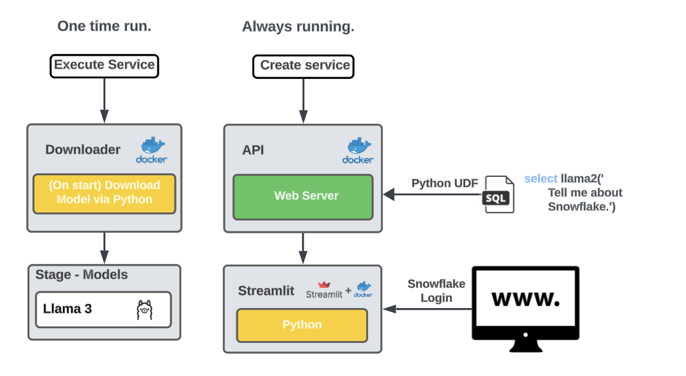
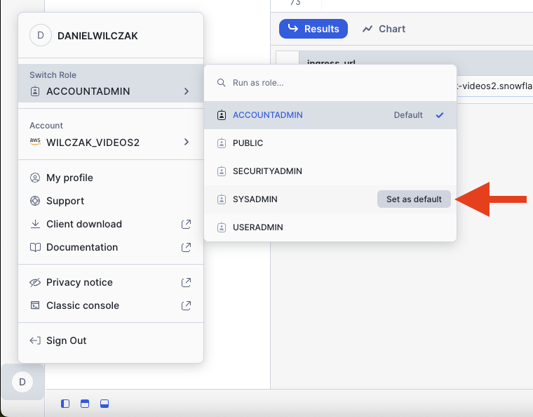

# Container Services - Introduction
Goal of this tutorial is to download the llama3 model from huggingface and host it in container services. We will also use the model via a model and (UDF) in Snowflake.



## Video
Video currently in development.

## Requirements 
- Be in a [container services enabled region](https://docs.snowflake.com/en/developer-guide/snowpark-container-services/overview#available-regions).  
- You [CAN NOT be on a trial account](https://docs.snowflake.com/en/developer-guide/snowpark-container-services/overview).

## Download
- [Flask Application, Docker File and Download Script](#)

## Setup :octicons-feed-tag-16:
Lets go through some setup before to go into our application.

### Snowflake
Let's start by setting up Snowflake before we jump to docker. Create a worksheet in snowflake and add / run the code below.

??? note "If you don't have a database, schema or warehouse yet."

    === ":octicons-image-16: Database, schema and warehouse"

        ```sql
        use role sysadmin;

        -- Create a database to store our schemas.
        create database raw;

        -- Create the schema. The schema stores all our objectss.
        create schema raw.llm;

        /*
            Warehouses are synonymous with the idea of compute
            resources in other systems. We will use this
            warehouse to call our user defined function.
        */
        create warehouse if not exists developer 
            warehouse_size = xsmall
            initially_suspended = true;

        use database raw;
        use schema llm;
        use warehouse developer;
        ```

=== ":octicons-image-16: Setup"

    ```sql linenums="1"
    -- Use account admin for the integration.
    use role accountadmin;

    ------ Setup network connections to download model and access to website. -----
    create or replace network rule hf_network_rule
        mode = egress
        type = host_port
        value_list = ('huggingface.co', 'cdn-lfs.huggingface.co');

    create or replace external access integration hf_access_integration
        allowed_network_rules = (hf_network_rule)
        enabled = true;

    create or replace security integration snowservices_ingress_oauth
        type=oauth
        oauth_client=snowservices_ingress
        enabled=true;

    -- Allow sysadmin to create our website url.
    grant usage on integration hf_access_integration to role sysadmin;
    grant bind service endpoint on account to role sysadmin;
    
    -- Use sysadmin for everything else.
    use role sysadmin;

    -- Compute for our containers.
    create compute pool cpu_x64_xs
        min_nodes = 1
        max_nodes = 1
        instance_family = cpu_x64_xs;

    create compute pool gpu_nv_s
        min_nodes = 1
        max_nodes = 1
        instance_family = gpu_nv_s;

    -- stage to store llm models
    create stage if not exists models
        directory = (enable = true)
        encryption = (type='snowflake_sse');

    -- Image registry to upload our docker image to.
    create or replace image repository images;

    -- Give us the url to upload our docker container to.
    show image repositories;
    select "repository_url" from table(result_scan(last_query_id()));
    ```

=== ":octicons-image-16: Result"

    | repository_url                                                                      |
    |-------------------------------------------------------------------------------------|
    | sfsenorthamerica-wilczak-videos2.registry.snowflakecomputing.com/raw/llm/images |


### Docker
Our goal is to run the application locally and check if it works and then upload the built docker image to our snowflake image repository so it can be hosted on Snowflake container services.

!!! Note
    Please install docker desktop - [https://www.docker.com/products/docker-desktop/](https://www.docker.com/products/docker-desktop/)


Using terminal, navigate to the folder that has the docker file you will be building. 

=== ":octicons-image-16: Build Downloader"

    ```bash linenums="1"
    docker build --rm -t download:huggingface .
    ```

=== ":octicons-image-16: Build Flask App"

    ```bash linenums="1"
    docker build --rm -t flask:website .
    ```
    
### Upload

Now that we have our image created. Lets upload it to Snowflake. We will need our Snowflake image url (1) that we got from our Snowflake setup.
{ .annotate }

1.  | repository_url                                                                         |
    |----------------------------------------------------------------------------------------|
    | sfsenorthamerica-wilczak-videos2.registry.snowflakecomputing.com/raw/llm/images        |


=== ":octicons-image-16: Code"

    ```bash linenums="1"
    docker tag flask:website <URL GOES HERE>/download:huggingface
    docker tag flask:website <URL GOES HERE>/flask:website
    ```

=== ":octicons-image-16: Example"

    ```bash linenums="1"
    docker tag flask:website sfsenorthamerica-wilczak-videos2.registry.snowflakecomputing.com/raw/website/images/download:huggingface
    docker tag flask:website sfsenorthamerica-wilczak-videos2.registry.snowflakecomputing.com/raw/website/images/flask:website
    ```

Next docker login to our snowflake image repo and upload the image. We will use the login name that has access to **sysadmin** role.
=== ":octicons-image-16: Code"

    ```bash linenums="1"
    docker login <FIRST PART OF THE URL> -u danielwilczak
    ```
=== ":octicons-image-16: Example"

    ```bash linenums="1"
    docker login sfsenorthamerica-wilczak-videos2.registry.snowflakecomputing.com/ -u danielwilczak
    ```


Finally push the image to your image repository living on Snowflake.
=== ":octicons-sign-out-16: Code"

    ```bash linenums="1"
    docker push <URL GOES HERE>/download:huggingface
    docker push <URL GOES HERE>/flask:website
    ```
=== ":octicons-sign-out-16: Example"

    ```bash linenums="1"
    docker push sfsenorthamerica-wilczak-videos2.registry.snowflakecomputing.com/raw/website/images//download:huggingface
    docker push sfsenorthamerica-wilczak-videos2.registry.snowflakecomputing.com/raw/website/images/flask:website
    ```
=== ":octicons-sign-out-16: Result"

    ```
    The push refers to repository [sfsenorthamerica-wilczak-videos2.registry.snowflakecomputing.com/raw/website/images/flask]
    5c496785191b: Pushed 
    af426fba40ce: Pushed 
    89732b928ca7: Pushed 
    c3fcfdebbdeb: Pushed 
    5930c727f5d3: Pushed 
    fe4e91e03123: Pushed 
    1ee7a83db2c7: Pushed 
    57bbd9d1460f: Pushed 
    2920aec4783e: Pushed 
    61255a2b6a94: Pushed 
    4c519b360763: Pushed 
    abf3d7b50651: Pushed 
    a0b7220ad76b: Pushed 
    website: digest: sha256:f0ef0b8e2a6e9fa218fd7cd771bce6befeecd1d62a26c740df8fb8b45ed6831c size: 3045
    ```

## Run :octicons-feed-tag-16:
Lets switch back to snowflake to start our container. 


### Execute Download
This is where I will explain the download operation of the job.

=== ":octicons-image-16: SQL"

    ```sql linenums="1"
    use role sysadmin;

    -- Download the model one time (Docker up and then docker down)
    execute service 
    in compute pool cpu_x64_xs
    from specification $$
    spec:
    containers:
        - name: huggingface
        image: /raw/llm/images/huggingface
        env:
            HF_TOKEN: <HUGGING FACE TOKEN GOES HERE>
            HF_MODEL: Llama-2-70b-chat-hf
            HF_ORG: meta-llama
            TARGET_DIR: /models/Llama-2-70b-chat-hf
        volumeMounts:
            - name: models
            mountPath: /models
    volumes:
        - name: models
        source: "@models"
    $$
    EXTERNAL_ACCESS_INTEGRATIONS = (HF_ACCESS_INTEGRATION);

    -- Check the statis of the download. (UPDATE THIS)
    SELECT SYSTEM$GET_JOB_LOGS('<UPDATE HERE>', 'huggingface');
    ```

=== ":octicons-image-16: Result"
    UPDATE TO SHOW STATUS

### Start Service
Create the service to host the container that will give us our api and frontend application.

=== ":octicons-image-16: SQL"

    ```sql linenums="1"
    use role sysadmin;

    -- Create the service that will host our containerized application.
    create service website
        in compute pool gpu_nv_s
        from specification 
        $$
        spec:
          containers:
            - name: website
              image: /raw/llm/images/website
              resources:
                requests:
                  nvidia.com/gpu: 1 # if running NV_M or NV_L, update accordingly
                limits:
                  nvidia.com/gpu: 1 # if running NV_M or NV_L, update accordingly
              env:
                HF_TOKEN: <ENTER TOKEN HERE>
                HF_MODEL: Llama-2-70b-chat-hf
                HF_ORG: meta-llama
                TARGET_DIR: /models/Llama-2-70b-chat-hf
                NUM_GPU: 1 # if running in NV_M or NV_L, update accordingly
                MAX_GPU_MEMORY: 24Gib # if running in NV_M or NV_L, update accordingly
              volumeMounts:
                - name: models
                mountPath: /models
          endpoints:
              - name: chat
                port: 5000
                public: false
              - name: llm
                port: 8080
                public: true
          volumes:
              - name: models
                source: "@raw.llm.models"
        $$;

    -- Give us a URL to see our application.
    show endpoints in service website;
    select "ingress_url" from table(result_scan(last_query_id()));
    ```

=== ":octicons-image-16: Result"
    | ingress_url                                                          |
    |----------------------------------------------------------------------|
    | br2sbye-sfsenorthamerica-wilczak-videos2.snowflakecomputing.app      |

### Set default role
Before we go to our URL. Please make sure your default role is set to Sysadmin.


### Website
Now go to the webiste url, login and see your amazing website!

### SQL - UDF
Now lets query the model via a user defined function.

=== ":octicons-image-16: SQL"

    ```sql linenums="1"
    create function llama2(prompt text)
        returns text
        service=website
        endpoint=chat;
    ```


## Clean up script :octicons-feed-tag-16:
If you don't plan to keep this running. Which I don't reccomend considering it's using .11 credits per hour. Here is a clean up script.

=== ":octicons-image-16: SQL"

    ```sql linenums="1"
    use role sysadmin;

    drop service website;
    drop compute pool cpu_x64_xs;
    drop compute pool gpu_nv_s;
    drop warehouse developer;
    drop database raw;
    ```

=== ":octicons-image-16: Result"
    | status                        |
    |-------------------------------|
    | RAW successfully dropped.     |


