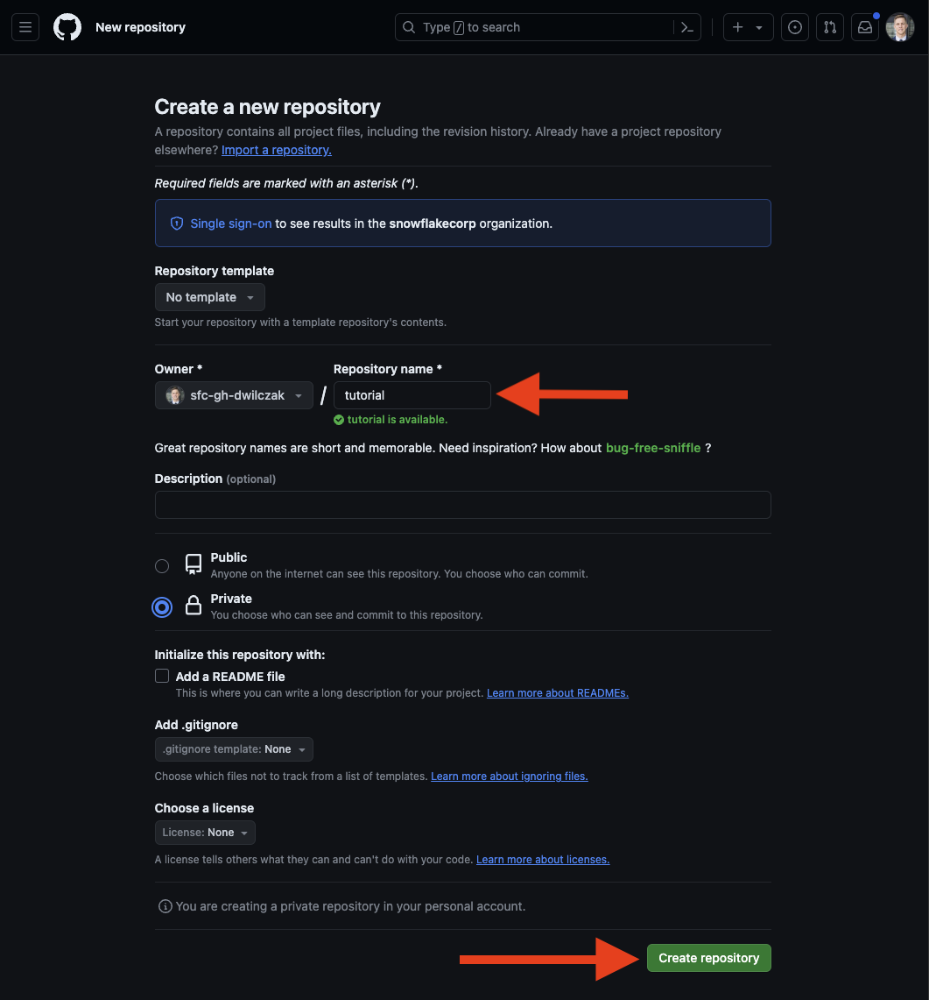
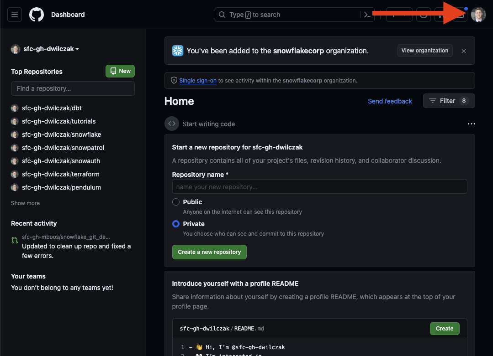
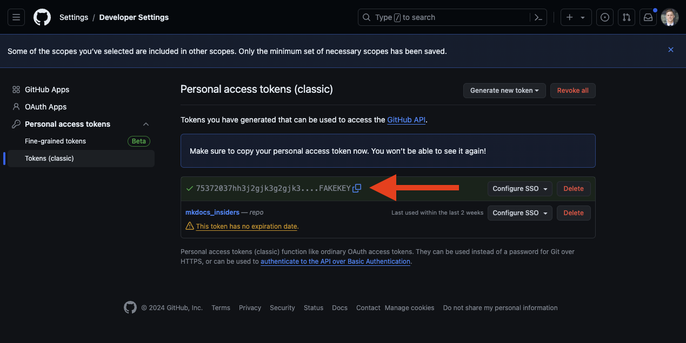
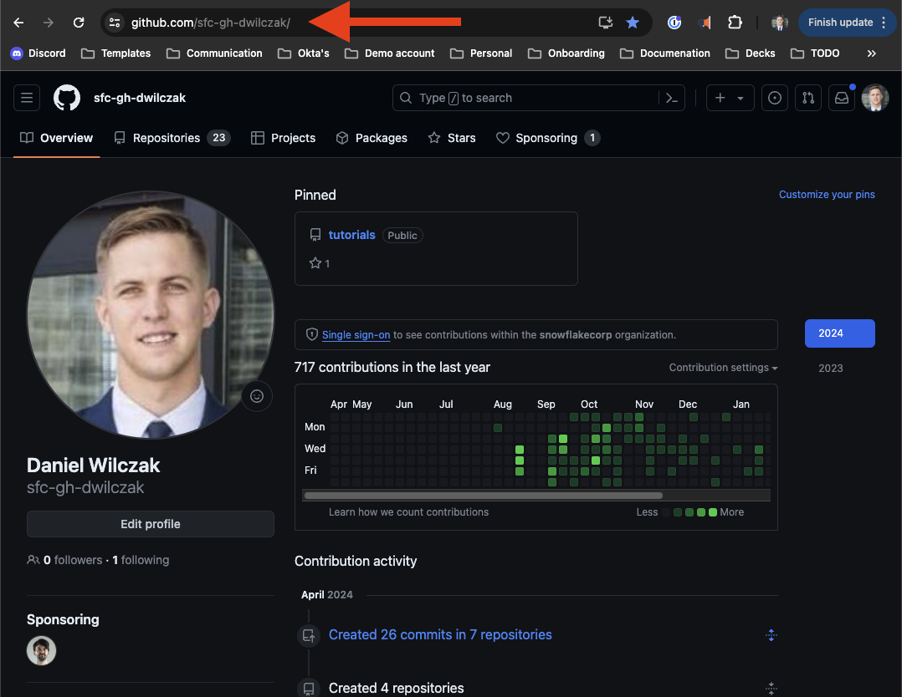

# Snowflake Git Integration
In this tutorial we will show you how to integrate Git into your Snowflake account. We will walk through two main subjects:  

- Pull the repo into Snowflake and navigating around.  
- Create a stored procedure, streamlit dashboard, and run a query from files that lives on github.  

Credit for the orginial tutorial goes to [Mark Boos](https://www.linkedin.com/in/mark-w-boos/)!  

## Video
<iframe width="850px" height="478px" src="https://www.youtube.com/embed/WEklZ63mMr4?si=35VTyboIMMQGX1DU" style="display:block;" title="YouTube video player" frameborder="0" allow="accelerometer; autoplay; clipboard-write; encrypted-media; gyroscope; picture-in-picture; web-share" allowfullscreen></iframe>

## Requirements
You will need a [github](https://github.com/) repo and the ability to [create a personal access token](https://docs.github.com/en/authentication/keeping-your-account-and-data-secure/managing-your-personal-access-tokens). We will show how to create the token in this tutorial. 

## Download
- [Repository files](https://sfc-gh-dwilczak.github.io/tutorials/snowflake/git/data/repo.zip)

## Setup :octicons-feed-tag-16:
In this section we will upload the example code to a repository and then setup Snowflake:

### Github Repository
Start by creating a repo.


Call it "tutorial". It can be public or private. 


!!! Caution "Please do not upload the repo folder itself. Just the files in it."

Upload the [example repository](https://sfc-gh-dwilczak.github.io/tutorials/snowflake/git/data/repo.zip).


Your good to go.


### Personal Access Token
We will need a persoanl access token to allow Snowflake to work with our Git repository. First lets navigate to the token page.


Click on settings.


Next developer settings.


We'll be using a classic token.


Next we'll enter in a name, the experation of the token, and select "repo" for the scope of the permissions.


We'll copy our token, it will be used in the following Snowflake step.


### Snowflake
Lets now use snowflake to connect to our repository.

??? note "If you don't have a database, schema or warehouse yet."

    === ":octicons-image-16: Database, schema and warehouse"

        ```sql
        use role sysadmin;
        
        -- Create a database to store our schemas.
        create database raw;

        -- Create the schema. The schema stores all our objectss.
        create schema raw.git;

        /*
            Warehouses are synonymous with the idea of compute
            resources in other systems. We will use this
            warehouse to call our user defined function.
        */
        create warehouse if not exists developer 
            warehouse_size = xsmall
            initially_suspended = true;

        use database raw;
        use schema git;
        use warehouse developer;
        ```


=== ":octicons-image-16: Setup"

    ```sql linenums="1"
    use role accountadmin;

    create or replace secret github_secret
        type = password
        username = '<Github Username>' /* (1)! */
        password = '<Personal Access Token>'; /* (2)! */

    create or replace api integration git_api_integration
        api_provider = git_https_api
        api_allowed_prefixes = ('<Base Github URL>') /* (3)! */
        allowed_authentication_secrets = (github_secret)
        enabled = true;
  
    create or replace git repository tutorial
        api_integration = git_api_integration
        git_credentials = github_secret
        origin = '<REPOSITORY URL>'; /* (4)! */

    ```
    { .annotate }

    1.  
        
    2. 

    3. 

    4. 

=== ":octicons-image-16: Example"

    ```sql linenums="1"
    use role accountadmin;

    create secret github_secret
        type = password
        username = 'sfc-gh-dwilczak'
        password = 'huifuhf.....f94894h2';

    create api integration git_api_integration
        api_provider = git_https_api
        api_allowed_prefixes = ('https://github.com/sfc-gh-dwilczak')
        allowed_authentication_secrets = (github_secret)
        enabled = true;
  
    create git repository tutorial
        api_integration = git_api_integration
        git_credentials = github_secret
        origin = 'https://github.com/sfc-gh-dwilczak/tutorial';
    ```


=== ":octicons-image-16: Result"

    | status                                            |
    |---------------------------------------------------|
    | Git Repository TUTORIAL was successfully created. |


## Examples :octicons-feed-tag-16:
Now that we have our Snowflake and Git repository setup lets go through a few examples.

### Navigation
Lets navigate and show parts of our repo in Snowflake.

=== ":octicons-image-16: Navigation"

    ```sql linenums="1"
    -- Show repos added to snowflake.
    show git repositories;

    -- Show branches in the repo.
    show git branches in git repository tutorial;

    -- List files.
    ls @tutorial/branches/main;

    -- Show code in file.
    select $1 from @tutorial/branches/main/examples/app.py;

    -- Fetch git repository updates.
    alter git repository tutorial fetch; 
    ```


### Run a File
Lets execute a file on Snowflake that lives in our repositroy.

=== ":octicons-image-16: Example"

    ```sql linenums="1"
    -- Run the files in Snowflake.
    execute immediate from @tutorial/branches/main/examples/hello.sql;
    ```

=== ":octicons-image-16: Result"

    | GREETING                     |
    |------------------------------|
    | Hello World from a SQL query |


### Stored Procedure
Lets create a snowflake stored procedure from a file that lives in the repository.

=== ":octicons-image-16: Example"

    ```sql linenums="1"
    -- Create snowpark procedure
    create or replace procedure hello()
        returns string
        language python 
        runtime_version= '3.8'
        packages=('snowflake-snowpark-python')
        imports=('@tutorial/branches/main/examples/hello.py')
        handler='hello.main';
                                
    call hello();
    ```

=== ":octicons-image-16: Result"

    | Hello        |
    |--------------|
    | Hello World! |

### Streamlit
Lets create a Streamlit application in Snowflake using a file in our repository.

=== ":octicons-image-16: Example"

    ```sql linenums="1"
    -- Create streamlit application from file.
    create or replace streamlit streamlit_application
        root_location = @raw.git.tutorial/branches/main/examples
        main_file = '/app.py'
        query_warehouse = 'developer';
    ```

=== ":octicons-image-16: Result"

    | status                                                |
    |-------------------------------------------------------|
    | Streamlit STREAMLIT_APPLICATION successfully created. |

Lets navigate to the streamlit in snowflake tab and select our dashboard that we just created.


Look at our simple streamlit dashboard that was create from our file in our Git repository!
