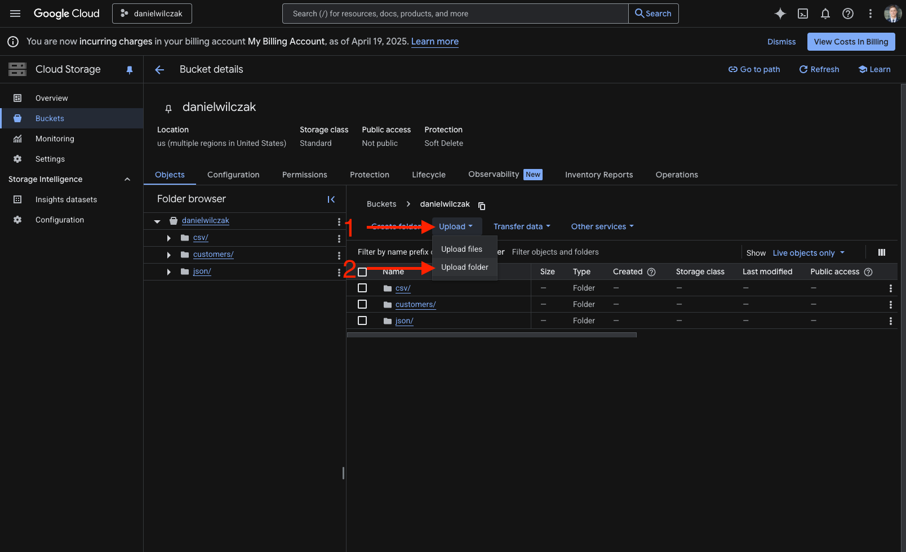

# External Tables - Google Cloud Storage
Goal of this tutorial is to setup a Snowflake [external table](https://docs.snowflake.com/en/sql-reference/sql/create-external-table#examples) on files that are stored in an external google cloud storage bucket.

## Video
Video in development.

## Requirements
- Snowflake account, you can use a [free trial](https://signup.snowflake.com/). We also assume no complex security needs.
- Google cloud account, you can setup a [free account](https://cloud.google.com/) to get started.

## Download
- [Sample Data](https://sfc-gh-dwilczak.github.io/tutorials/snowflake/google/external/files/data.zip)

## Setup :octicons-feed-tag-16:
!!! warning 

    This tutorial assumes you have already setup a stage with read/write privligies. If you want to enable autorefresh on the external table you'll also want to do to the autoloading section. If you have not [please follow this tutorial](https://sfc-gh-dwilczak.github.io/tutorials/snowflake/google/cloud_storage/).
    
In this section we will upload the new [sample files](https://sfc-gh-dwilczak.github.io/tutorials/snowflake/google/external/files/data.zip) to a GCP folder and then setup Snowflake.



## External Table :octicons-feed-tag-16:
Lets create the table on top of the [sample files](https://sfc-gh-dwilczak.github.io/tutorials/snowflake/google/external/files/data.zip) we have stored in the bucket / stage.

=== ":octicons-image-16: Code"

    ```sql linenums="1"
    create or replace file format customers_csv_format
        type = 'csv'
        field_optionally_enclosed_by = '"'
        skip_header = 1;

    create or replace external table ext_customers (
        customer_id number as (value:c1::number),
        first_name string as (value:c2::string),
        last_name string as (value:c3::string),
        email string as (value:c4::string)
    )
    with 
        location = @gcp/customers
        file_format = customers_csv_format
        auto_refresh = false;
    ```

=== ":octicons-sign-out-16: Result"

    | status                                    |
    |-------------------------------------------|
    | Table EXT_CUSTOMERS successfully created. |