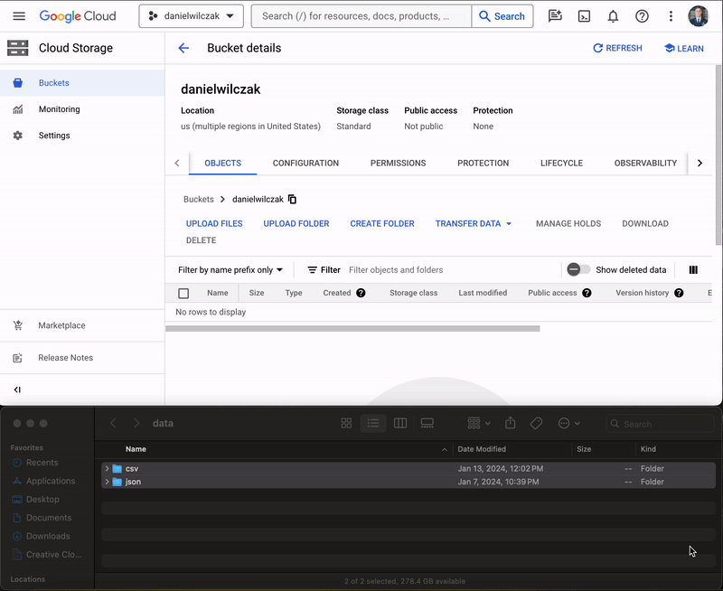
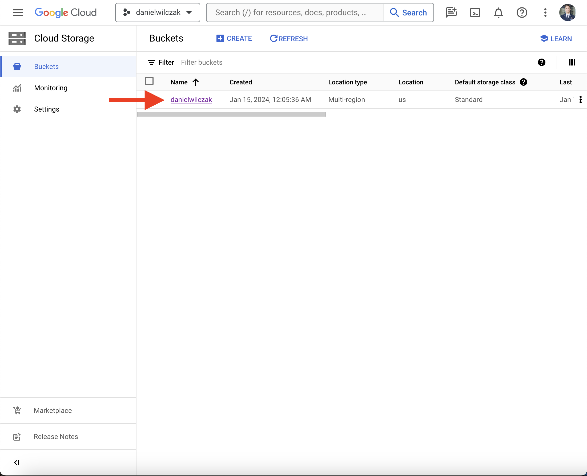
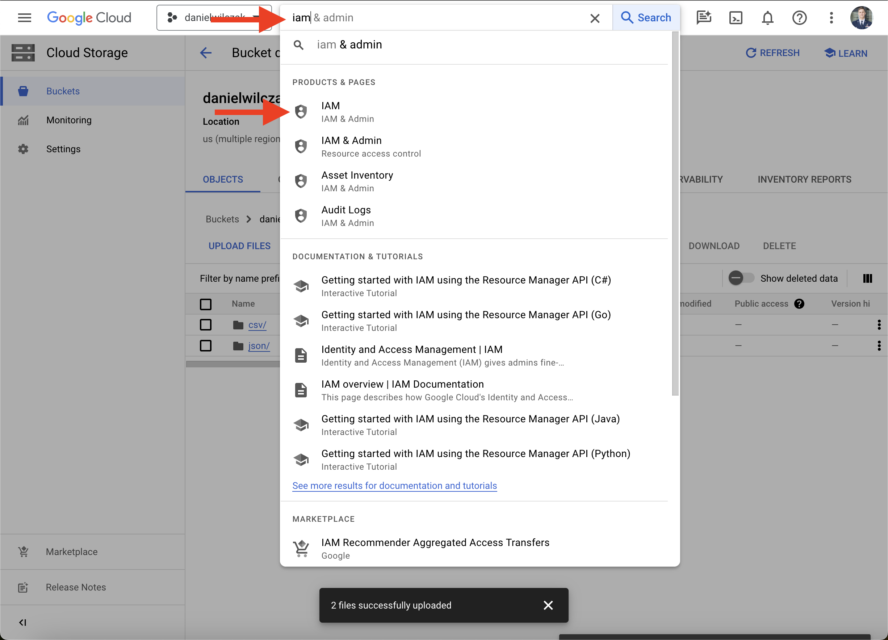
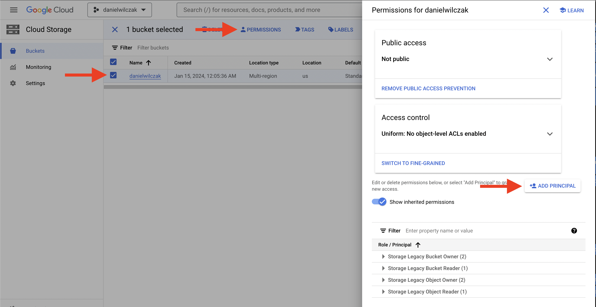
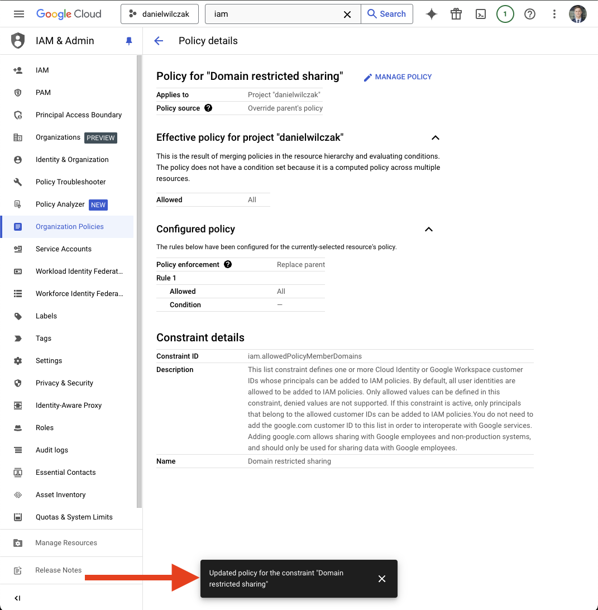

# Google Cloud Storage - Eternal Table
Goal of this tutorial is to setup an Snowflake [external table](#) on files that are stored in an external google cloud storage bucket.

## Video
Video in development.

## Requirements
- Snowflake account, you can use a [free trial](https://signup.snowflake.com/). We also assume no complex security needs.
- Google cloud account, you can setup a [free account](https://cloud.google.com/) to get started.

## Download  :octicons-feed-tag-16:
- Sample data ([Link](https://sfc-gh-dwilczak.github.io/tutorials/snowflake/data/data.zip))

## Integration  :octicons-feed-tag-16:
Lets start by setting up a Snowflake connection to Google Cloud Storage.

### Google Cloud
Sign into your google account. 

#### Create project 
If you don't have a project, start by selecting/creating a project.


Click create project.


In our case we'll call the project `danielwilczak` and select the default `no orginization` for the locaition.


#### Create cloud storage
We will select our new project and click `cloud storage` to create a storage bucket.


Click `create` or `create bucket`.


I'm going to name the bucket `danielwilczak` as well. Copy this name, we will use it later.


#### Upload sample data

Upload the [sample data](https://sfc-gh-dwilczak.github.io/tutorials/snowflake/data/data.zip) to your google cloud storage bucket (json/csv) provided in the data folder.


### Snowflake

Let's setup snowflake by creating a worksheet in snowflake and add the code below with your bucket name from earlier and hit run:

=== ":octicons-image-16: Template"

    ```sql linenums="1"
    /*
        We switch to "sysadmin" to create an object
        because it will be owned by that role.
    */
    use role sysadmin;

    --- Create a database to store our schemas.
    create database if not exists raw;

    -- Create the schema. The schema stores all objects.
    create schema if not exists raw.gcp;

    /*
        Warehouses are synonymous with the idea of compute
        resources in other systems. We will use this
        warehouse to query our integration and to load data.
    */
    create warehouse if not exists development 
        warehouse_size = xsmall
        auto_suspend = 30
        initially_suspended = true;

    /*
        Integrations are on of those important features that
        account admins should do because it's allowing outside 
        snowflake connections to your data.
    */
    use role accountadmin;

    create storage integration gcp_integration
        type = external_stage
        storage_provider = 'gcs'
        enabled = true
        storage_allowed_locations = ('gcs://<storage bucket name>'); /* (1)! */

    -- Give the sysadmin access to use the integration.
    grant usage on integration gcp_integration to role sysadmin;

    desc storage integration gcp_integration;
    select "property", "property_value" as principal from table(result_scan(last_query_id()))
    where "property" = 'STORAGE_GCP_SERVICE_ACCOUNT';
    ```
    { .annotate }

    1.  

    
=== ":octicons-image-16: Example"

    ```sql linenums="1"
    /*
        We switch to "sysadmin" to create an object
        because it will be owned by that role.
    */
    use role sysadmin;

    --- Create a database to store our schemas.
    create database if not exists raw;

    -- Create the schema. The schema stores all objectss.
    create schema if not exists raw.gcp;

    /*
        Warehouses are synonymous with the idea of compute
        resources in other systems. We will use this
        warehouse to query our integration and to load data.
    */
    create warehouse if not exists development 
        warehouse_size = xsmall
        auto_suspend = 30
        initially_suspended = true;

    /*
        Integrations are on of those important features that
        account admins should do because it's allowing outside 
        snowflake connections to your data.
    */
    use role accountadmin;

    create storage integration gcp_integration
        type = external_stage
        storage_provider = 'gcs'
        enabled = true
        storage_allowed_locations = ('gcs://danielwilczak');

    -- give the sysadmin access to use the integration.
    grant usage on integration gcp_integration to role sysadmin;

    desc storage integration gcp_integration;
    select "property", "property_value" as principal from table(result_scan(last_query_id()))
    where "property" = 'STORAGE_GCP_SERVICE_ACCOUNT';
    ```

=== ":octicons-sign-out-16: Result"

    | property                    | principal                                     |
    |-----------------------------|-----------------------------------------------|
    | STORAGE_GCP_SERVICE_ACCOUNT | rbnxkdkujw@prod3-f617.iam.gserviceaccount.com |


#### Grant Access in Google Cloud

Lets navigate to IAM so that we can give snowflake access to our storage account.


Create a new role.


Fill in the role information. We will call it `snowflake`. After that click `Add Permissions`.


The permissions to select can be found on [Snowflake's documentation](https://docs.snowflake.com/en/user-guide/data-load-gcs-config#creating-a-custom-iam-role). In this tutorial I have choosen `Data loading and unloading`. I have also provided a gif to show how to select the permissions because the user interface is terrible.


Navigate back to our bucket. Click `permissions`, followed by `add principle`.


In the new principles section, add your [STORAGE_GCP_SERVICE_ACCOUNT](https://sfc-gh-dwilczak.github.io/tutorials/snowflake/google/cloud_storage/#snowflake) given by Snowflake earlier.


Now add your role by clicking `select role` -> `custom` -> `snowflake`. The last one will be your role name.


??? warning "If you get a 'Domain restricted sharing' error when you click 'Save'. "

    If you run into this error it's because google cloud has updated thier policy as of March 2024. We'll have to update them. First select your orginization (not your project), then go to IAM in the search, followed by clicking "grant access".
    

    Next we'll add our user email into the new principals area. We'll search and click on "Organization Policy Administrator".
    

    Click save.
    

    Next we'll want to update the policy. By searching IAM, selecting orgianization policies, searching domain and clicking on "Domain restricted sharing".
    

    Click Manage polcy.
    

    !!! Note

    "Allow All" is the simple approach but feel free to use [more fine grain approach via Snowflake documentation](https://docs.snowflake.com/en/user-guide/data-load-gcs-config#assigning-the-custom-role-to-the-cloud-storage-service-account).

    We'll want to overide the parent policy with a new rule. Select replace the policy and then select "Allow All". Click done and "Set Polcy." and your good to go. 
    

    The policy has been updated and you can retry adding the role to the new principal.
    


Click `Save` and your finished with Google Cloud for manual loading.


#### Stage :octicons-feed-tag-16:
Lets setup the stage so that our external table can reference it.

=== ":octicons-image-16: Template"

    ```sql linenums="1"
    use database raw;
    use schema gcp;
    use role sysadmin;
    use warehouse development;

    /*
       Stages are synonymous with the idea of folders
       that can be either internal or external.
    */
    create or replace stage raw.gcp.gcp
        storage_integration = gcp_integration
        url = 'gcs://<BUCKET NAME>/' /* (1)! */
        directory = ( enable = true);

  
    ```
    { .annotate }

    1.  

=== ":octicons-image-16: Example"

    ```sql linenums="1"
    use database raw;
    use schema gcp;
    use role sysadmin;
    use warehouse development;

    /*
       Stages are synonymous with the idea of folders
       that can be either internal or external.
    */
    create or replace stage raw.gcp.gcp
        storage_integration = gcp_integration
        url = 'gcs://danielwilczak/'
        directory = ( enable = true);
    ```

=== ":octicons-sign-out-16: Result"

    UPDATE


## External Table :octicons-feed-tag-16:

ADD CODE FOR EXTERNAL TABLE ON EXAMPLE DATA.