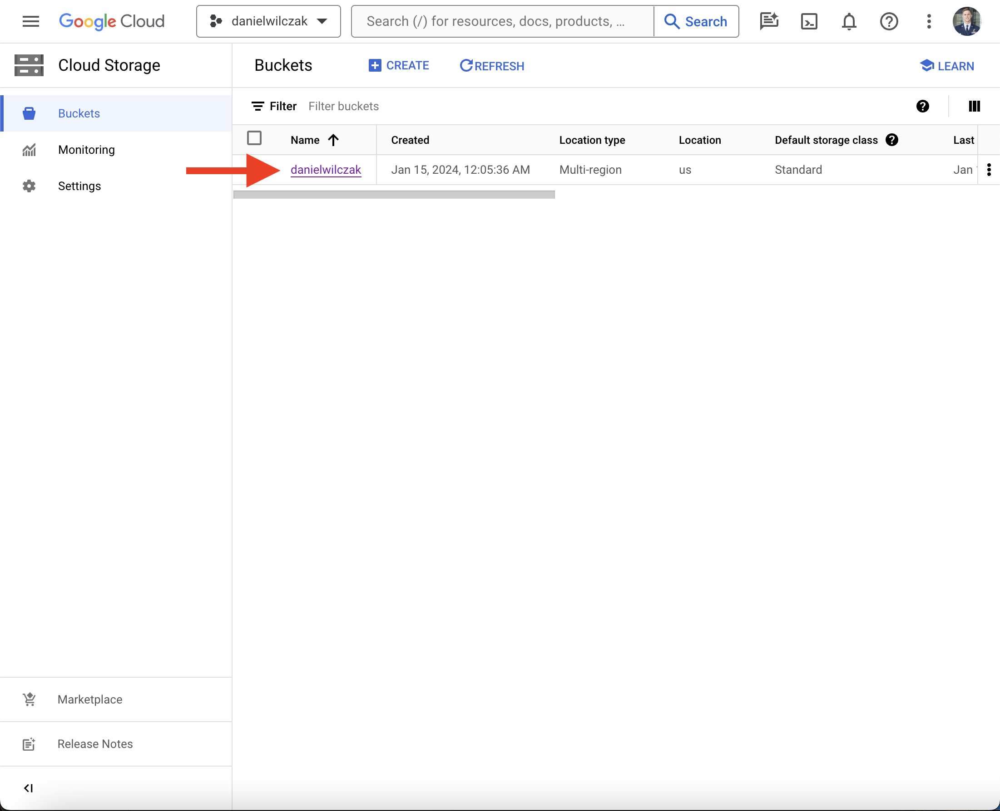
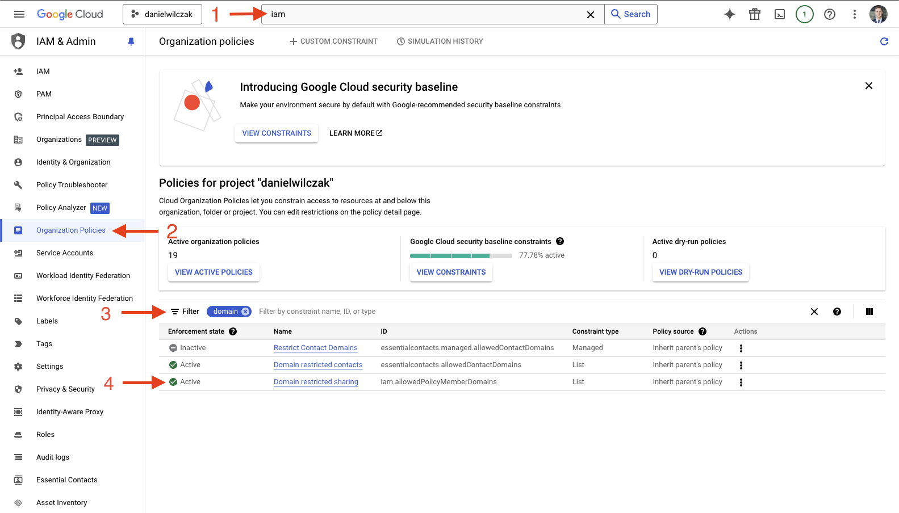

# Iceberg - Google Cloud Storage
Goal of this tutorial is to setup the an external volume in Snowflake to be able to create an manage iceberg table.

## Video
Video still in development.

## Requirements
- Snowflake account, you can use a [free trial](https://signup.snowflake.com/). We also assume no complex security needs.
- Google cloud account, you can setup a [free account](https://cloud.google.com/) to get started.

!!! warning 

    Your GCP bucket and Snowflake acount have to be in the same region to be able to create iceberg tables.

## Setup  :octicons-feed-tag-16:
Lets start by setting up a Snowflake connection to Google Cloud Storage. After that we'll create and load data into some Iceberg tables.

### Google Cloud
Sign into your google account. 

#### Create project 
If you don't have a project, start by selecting/creating a project.


Click create project.


In our case we'll call the project `danielwilczak` and select the default `no orginization` for the locaition.


#### Create cloud storage
We will select our new project and click `cloud storage` to create a storage bucket.


Click `create` or `create bucket`.


I'm going to name the bucket `danielwilczak` as well. Copy this name, we will use it later.


### Snowflake
Let's setup snowflake by creating a worksheet in snowflake and add the code below with your bucket name from earlier and hit run.

??? note "If you don't have a database, schema or warehouse yet."

    === ":octicons-image-16: Database, schema and warehouse"

        ```sql linenums="1"
        use role sysadmin;
        
        -- Create a database to store our schemas.
        create database if not exists raw;

        -- Create the schema. The schema stores all our objectss.
        create schema if not exists raw.gcp;

        /*
            Warehouses are synonymous with the idea of compute
            resources in other systems. We will use this
            warehouse to call our user defined function.
        */
        create warehouse if not exists development 
            warehouse_size = xsmall
            auto_suspend = 30
            initially_suspended = true;

        use database raw;
        use schema gcp;
        use warehouse development;
        ```


=== ":octicons-image-16: Template"

    ```sql linenums="1"  
    use role accountadmin;

    -- Create a volume which will act as our connection to GCP.
    create or replace external volume external_volume
        storage_locations =
        (
            (
            name = 'external_volume'
            storage_provider = 'GCS'
            storage_base_url = 'gcs://<storage bucket name>/' /* (1)! */
            )
        );
    
    -- Grant sysadmin access to the volume.
    grant all on external volume external_volume to role sysadmin with grant option;

    -- Get our principal url to be used in GCP.
    describe external volume external_volume;
    select 
        "property",
        REPLACE(GET_PATH(PARSE_JSON("property_value"), 'STORAGE_GCP_SERVICE_ACCOUNT')::STRING, '"', '') AS url
    from
        table(result_scan(last_query_id()))
    where
        "property" = 'STORAGE_LOCATION_1';
    ```
    { .annotate }

    1.  

    
=== ":octicons-image-16: Example"

    ```sql linenums="1"
    use role accountadmin;
    
    -- Create a volume which will act as our connection to GCP.
    create or replace external volume external_volume
        storage_locations =
        (
            (
            name = 'external_volume'
            storage_provider = 'GCS'
            storage_base_url = 'gcs://danielwilczak/' /* (1)! */
            )
        );
    
    -- Grant sysadmin access to the volume.
    grant all on external volume external_volume to role sysadmin with grant option;

    -- Get our principal url to be used in GCP.
    describe external volume external_volume;
    select 
        "property",
        REPLACE(GET_PATH(PARSE_JSON("property_value"), 'STORAGE_GCP_SERVICE_ACCOUNT')::STRING, '"', '') AS url
    from
        table(result_scan(last_query_id()))
    where
        "property" = 'STORAGE_LOCATION_1';
    ```

=== ":octicons-sign-out-16: Result"

    | property           | URL                                           |
    |--------------------|-----------------------------------------------|
    | STORAGE_LOCATION_1 | jtongh...k@prod3-f617.iam.gserviceaccount.com |


#### Grant Access in Google Cloud

Lets navigate to IAM so that we can give snowflake access to our storage account.


Create a new role.


Fill in the role information. We will call it `snowflake`. After that click `Add Permissions`.


The permissions to select can be found on [Snowflake's documentation](https://docs.snowflake.com/en/user-guide/data-load-gcs-config#creating-a-custom-iam-role). In this tutorial I have choosen `Data loading and unloading`. I have also provided a gif to show how to select the permissions because the user interface is terrible.


Navigate back to our bucket. Click `permissions`, followed by `add principle`.


In the new principles section, add your [STORAGE_GCP_SERVICE_ACCOUNT](https://sfc-gh-dwilczak.github.io/tutorials/snowflake/google/cloud_storage/#snowflake) given by Snowflake earlier.


Now add your role by clicking `select role` -> `custom` -> `snowflake`. The last one will be your role name.


??? warning "If you get a 'Domain restricted sharing' error when you click 'Save'. "

    If you run into this error it's because google cloud has updated thier policy as of March 2024. We'll have to update them. First select your orginization (not your project), then go to IAM in the search, followed by clicking "grant access".
    

    Next we'll add our user email into the new principals area. We'll search and click on "Organization Policy Administrator".
    

    Click save.
    

    Next we'll want to update the policy. By searching IAM, selecting orgianization policies, searching domain and clicking on "Domain restricted sharing".
    

    Click Manage polcy.
    

    !!! Note

        "Allow All" is the simple approach but feel free to use [more fine grain approach via Snowflake documentation](https://docs.snowflake.com/en/user-guide/data-load-gcs-config#assigning-the-custom-role-to-the-cloud-storage-service-account).

    We'll want to overide the parent policy with a new rule. Select replace the policy and then select "Allow All". Click done and "Set Polcy." and your good to go. 
    

    The policy has been updated and you can retry adding the role to the new principal.
    


Click `Save` and your finished with Google Cloud for manual loading.


## Iceberg Table :octicons-feed-tag-16:
Lets create a table and add data to it.

=== ":octicons-image-16: Template"

    ```sql linenums="1"  
    use role sysadmin;

    create or replace iceberg table csv (x integer, y integer)  
        catalog='SNOWFLAKE'
        external_volume='external_volume'
        base_location='iceberg';

    insert into csv (x, y)
        values (1, 2),
            (3, 4),
            (5, 6);

    ```

=== ":octicons-sign-out-16: Result"

    | number of rows inserted |
    |-------------------------|
    | 3                       |

Once the table is created we can query data living in the table or look at the data that is now stored in our bucket under the folder "icebeg".

