# Google Authenticator to Snowflake (SSO / SAML)
In this tutorial, we will show how to set up authentication to Snowflake using SSO / SAML with Google Authenticator.

## Video
<iframe width="850px" height="478px" src="https://www.youtube.com/embed/vvIPfL6rOIQ?si=FgvZfOrR99X8rnqf" title="YouTube video player" frameborder="0" allow="accelerometer; autoplay; clipboard-write; encrypted-media; gyroscope; picture-in-picture; web-share" referrerpolicy="strict-origin-when-cross-origin" allowfullscreen></iframe>

## Requirements
- Snowflake account, you can use a [free trial](https://signup.snowflake.com/). We also assume no complex security needs.
- Google cloud account, you can setup a [free account](https://cloud.google.com/) to get started.

## Setup :octicons-feed-tag-16:
Lets start with some basic setup.

### Snowflake
Please make sure your username is the email that is in google or else the SSO will not work. To edit your user to be a email please go to your user under admin and update it by adding double quotes and your email in the username block.
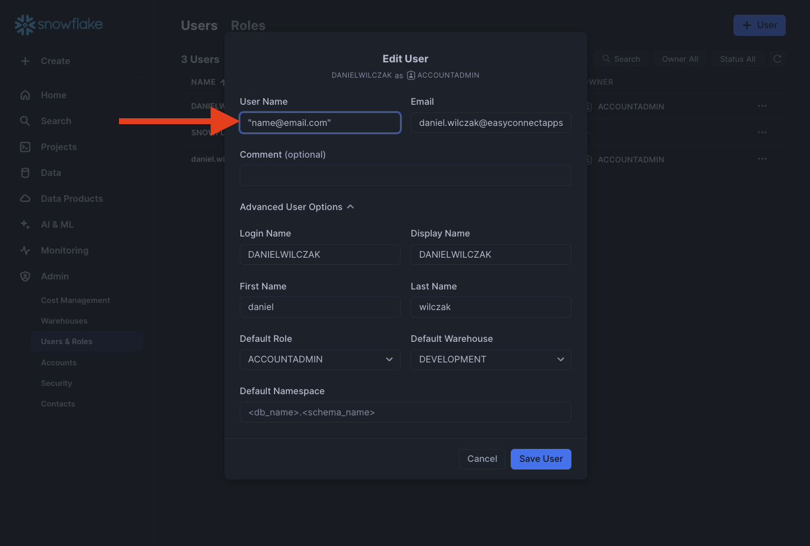

Now that we have our username setup, we'll copy our account url and add it to a worksheet. We'll need this later.
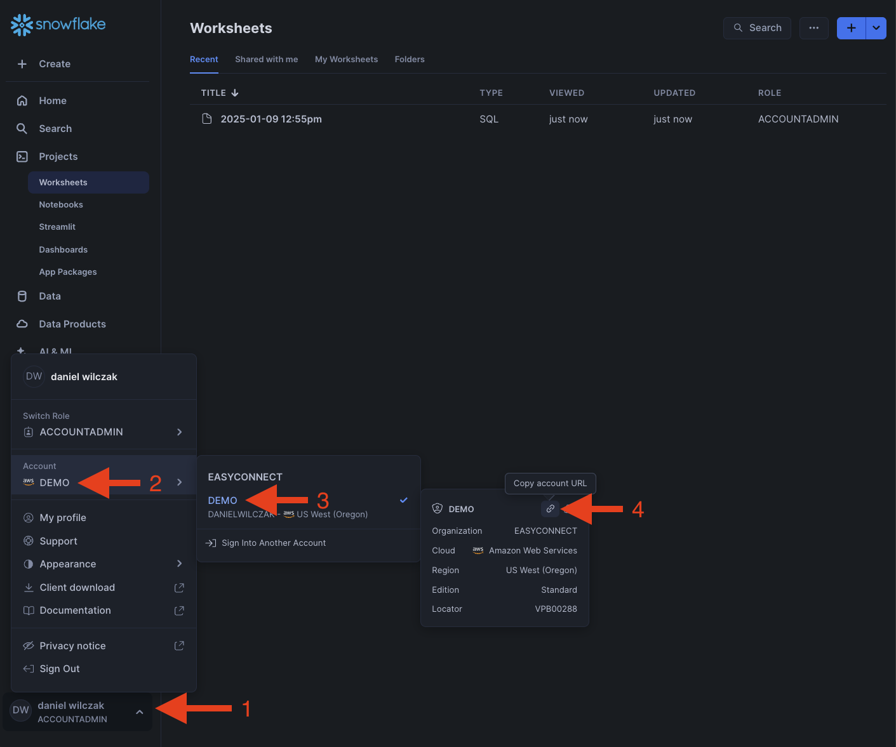

### Google 
Lets start in google by going to our [Google administrator account](https://admin.google.com/).
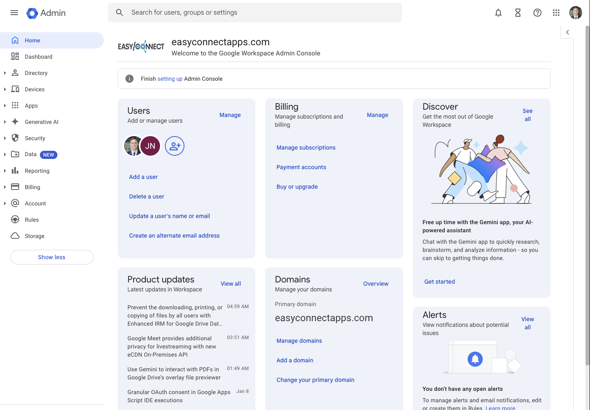

Click Apps > Web and mobile apps > Add app > Add custom SAML app.
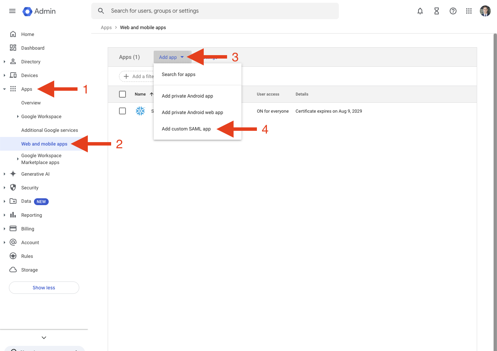

Give the integration a name. This name is only used in Google.
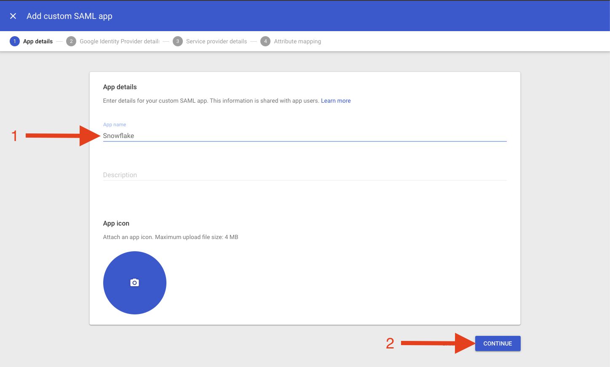

We'll want to copy the SSO URL, Entity ID and Certificate to a Snowflake worksheet. We will need these in the next step.
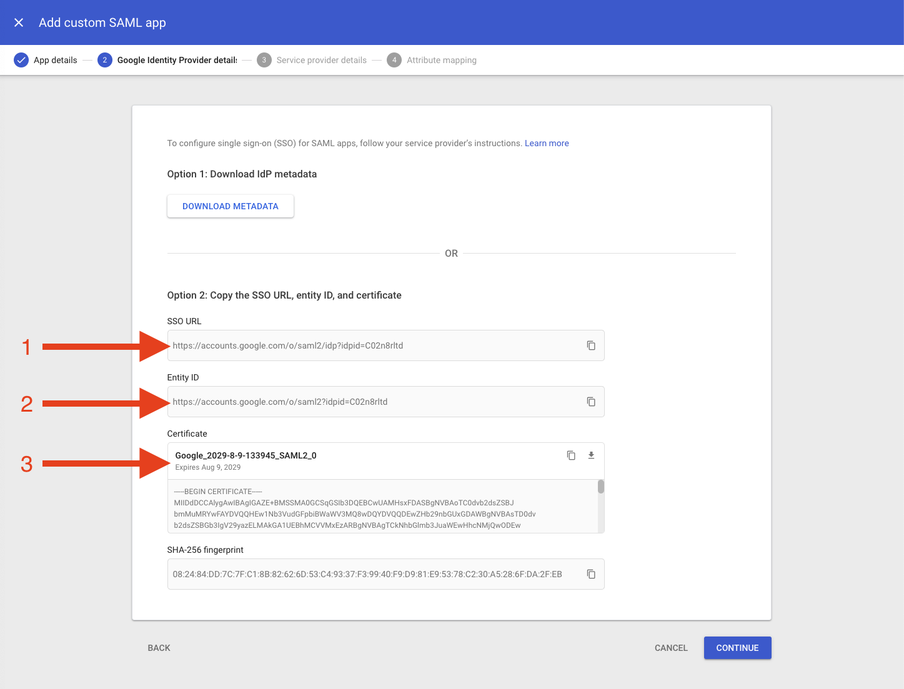

## Integration  :octicons-feed-tag-16:
Now that we have our Snowflake account URL, SSO URL, Entity ID and Certificate we can put it all together in Snowflake to enable the SSO.

### Snowflake
!!! warning 

    Please remove the ``-----BEGIN CERTIFICATE-----`` and ``-----END CERTIFICATE-----`` from the certificate, it will give you an eror.

Now in our worksheet we'll want to add the code below with the information we've copied so far.
=== ":octicons-image-16: Code"

    ```sql linenums="1"
    use role accountadmin;

    create security integration GOOGLE_SSO
        type = saml2
        enabled = true
        saml2_issuer  = '<Entity ID HERE>'
        saml2_sso_url = '<SSO URL HERE>'
        saml2_snowflake_acs_url    = '<ACCOUNT URL HERE>/fed/login'
        saml2_snowflake_issuer_url = '<ACCOUNT URL HERE>'
        saml2_sp_initiated_login_page_label = 'GOOGLE SSO'
        saml2_enable_sp_initiated = true
        saml2_provider  = 'custom'
        saml2_x509_cert = '<Certificate HERE>';

    desc integration GOOGLE_SSO;
    select "property", "property_value" from TABLE(RESULT_SCAN(LAST_QUERY_ID()))
    where "property" = 'SAML2_SNOWFLAKE_ACS_URL' or "property" = 'SAML2_SNOWFLAKE_ISSUER_URL';
    ```

=== ":octicons-image-16: Example"

    ```sql linenums="1"
    use role accountadmin;

    create security integration GOOGLE_SSO
        type = saml2
        enabled = true
        saml2_issuer    = 'https://accounts.google.com/o/saml2?idpid=C02n8rltd'
        saml2_sso_url   = 'https://accounts.google.com/o/saml2/idp?idpid=C02n8rltd'
        saml2_snowflake_acs_url    = 'https://vpb00288.snowflakecomputing.com/fed/login'
        saml2_snowflake_issuer_url = 'https://vpb00288.snowflakecomputing.com'
        saml2_sp_initiated_login_page_label = 'GOOGLE SSO'
        saml2_enable_sp_initiated = true
        saml2_provider  = 'custom'
        saml2_x509_cert = 'MIIDdDCCAlygAwIBAgIGAZE+BMSSMA0GCSqGSIb3DQEBCwUAMHsxFDASBgNVBAoTC0dvb2dsZSBJ
        bmMuMRYwFAYDVQQHEw1Nb3VudGFpbiBWaWV3MQ8wDQYDVQQDEwZHb29nbGUxGDAWBgNVBAsTD0dv
        b2dsZSBGb3IgV29yazELMAkGA1UEBhMCVVMxEzARBgNVBAgTCkNhbGlmb3JuaWEwHhcNMjQwODEw
        MjAzOTQ1WhcNMjkwOD........................Yq/o1B/utIgjtWX6Vru3yGpnIead1vvbzJ
        fT0SNwzSVsoplblpU5O+nfJ96/fGj5eBk8u8X+BPA+KqTZHTb9CisHB6o8j4SjnZQVTrmU7HJet1
        a1PvW+pCw+M2WXr8mZyID+/UAtQ/kM/jDgG/5ZDK0HOg';

        desc integration GOOGLE_SSO;
        select "property", "property_value" from TABLE(RESULT_SCAN(LAST_QUERY_ID()))
        where "property" = 'SAML2_SNOWFLAKE_ACS_URL' or "property" = 'SAML2_SNOWFLAKE_ISSUER_URL';
    ```

=== ":octicons-sign-out-16: Result"

    | property                   | property_value                                    |
    |----------------------------|---------------------------------------------------|
    | SAML2_SNOWFLAKE_ACS_URL    | https://vpb00288.snowflakecomputing.com/fed/login |
    | SAML2_SNOWFLAKE_ISSUER_URL | https://vpb00288.snowflakecomputing.com           |


### Google.
Lets take the output of our Snowflake and finish off in Google. Take the ``SAML2_SNOWFLAKE_ACS_URL`` -> ``ACS URL`` and ``SAML2_SNOWFLAKE_ISSUER_URL`` -> ``Entity ID``
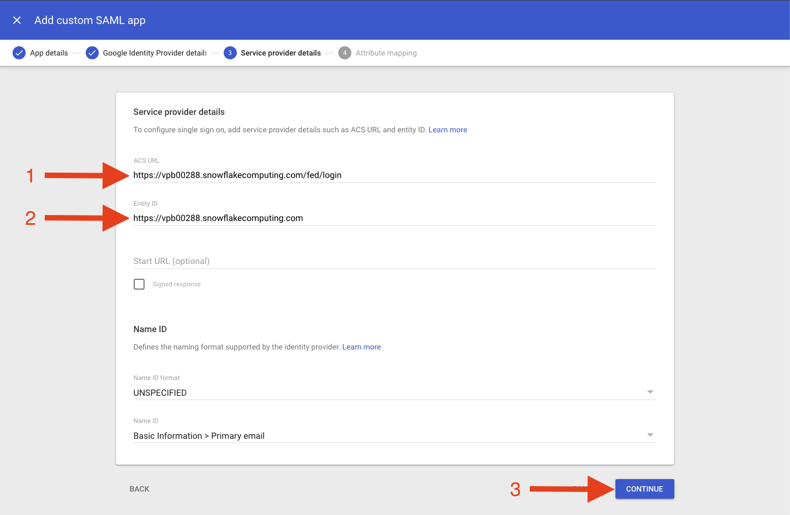

Click finished.
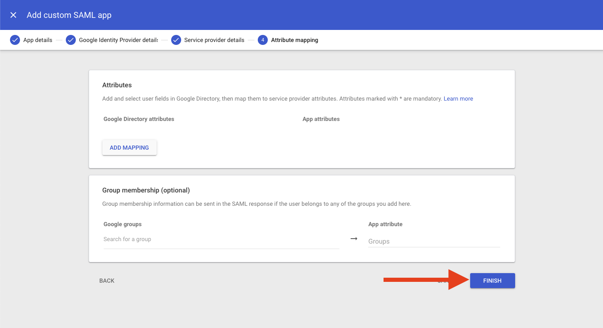

Next we'll want to enable user access. Click the ``User access`` box.
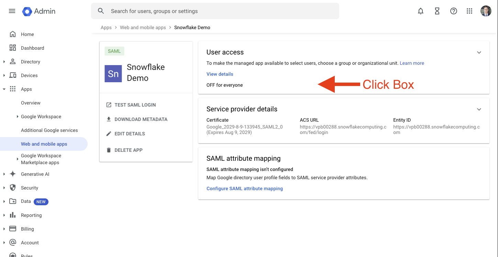

Enable for everyone.
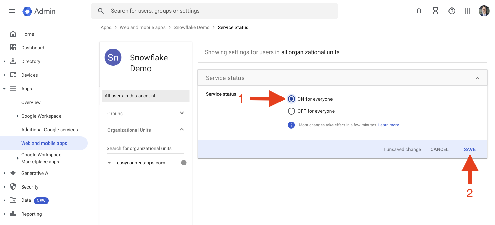

## Login
!!! warning 

    Please make sure your username is the email that is in google or else the SSO will not work. You can edit your user in the admin section as shown in part one of this tutorial.

Now you should be able to go to your Snowflake login page and see the new ``Google SSO`` version.
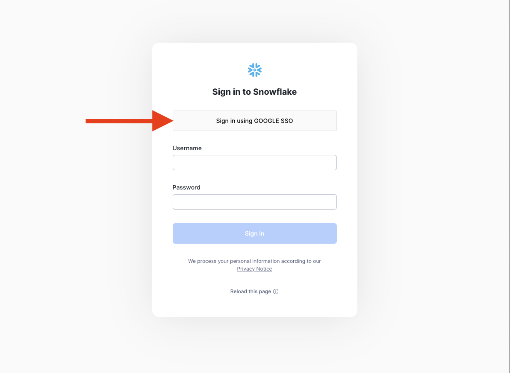