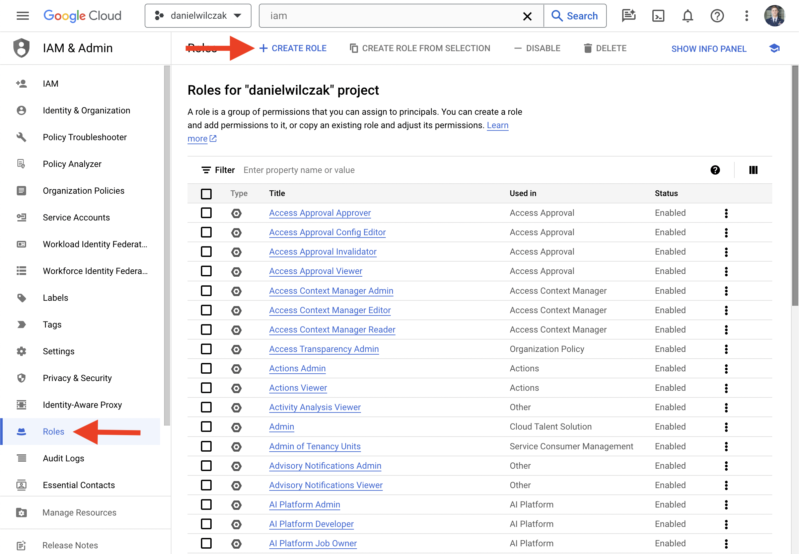
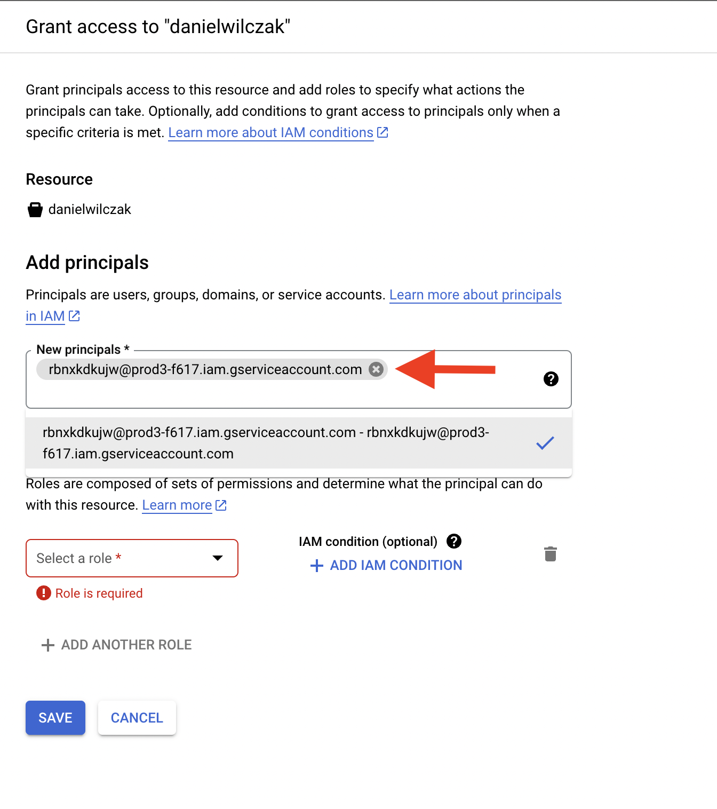
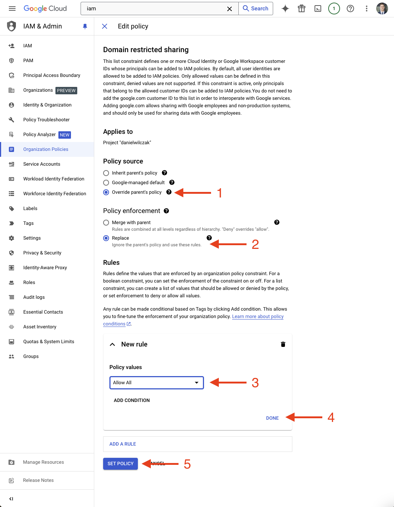
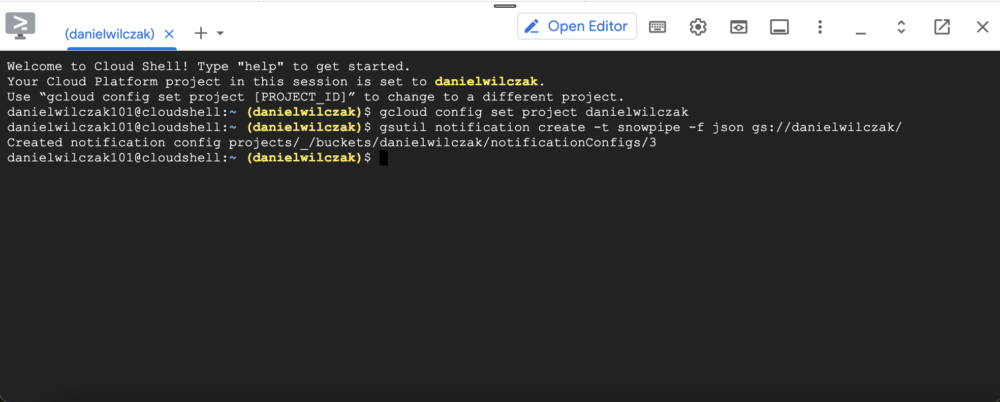
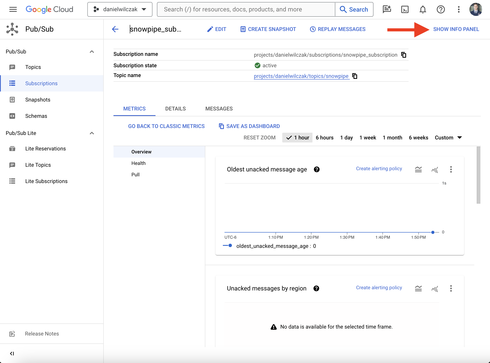

# Connect Snowflake to Google Cloud Storage
Goal of this tutorial is to load JSON and CSV data from a Google Cloud Storage using the [Copy into](https://docs.snowflake.com/en/sql-reference/sql/copy-into-table) sql command and [Snowpipe](https://docs.snowflake.com/en/user-guide/data-load-snowpipe-intro) to automate the ingestion process.

## Video
<iframe width="850px" height="478px" src="https://www.youtube.com/embed/Q4nldiYqCzo?si=8fX823UOz_R3o6Uu" title="YouTube video player" frameborder="0" allow="accelerometer; autoplay; clipboard-write; encrypted-media; gyroscope; picture-in-picture; web-share" referrerpolicy="strict-origin-when-cross-origin" allowfullscreen></iframe>

## Requirements
- Snowflake account, you can use a [free trial](https://signup.snowflake.com/). We also assume no complex security needs.
- Google cloud account, you can setup a [free account](https://cloud.google.com/) to get started.

## Download  :octicons-feed-tag-16:
- Sample data ([Link](https://sfc-gh-dwilczak.github.io/tutorials/snowflake/data/data.zip))

## Manual Loading  :octicons-feed-tag-16:
Lets start by setting up a Snowflake connection to Google Cloud Storage and load json data. After that use snowpipe to automate the ingestion of CSV files.

### Google Cloud
Sign into your google account. 

#### Create project 
If you don't have a project, start by selecting/creating a project.


Click create project.


In our case we'll call the project `danielwilczak` and select the default `no orginization` for the locaition.


#### Create cloud storage
We will select our new project and click `cloud storage` to create a storage bucket.


Click `create` or `create bucket`.


I'm going to name the bucket `danielwilczak` as well. Copy this name, we will use it later.


#### Upload sample data

Upload the [sample data](https://sfc-gh-dwilczak.github.io/tutorials/snowflake/data/data.zip) to your google cloud storage bucket (json/csv) provided in the data folder.


### Snowflake

Let's setup snowflake by creating a worksheet in snowflake and add the code below with your bucket name from earlier and hit run:

=== ":octicons-image-16: Template"

    ```sql linenums="1"
    /*
        We switch to "sysadmin" to create an object
        because it will be owned by that role.
    */
    use role sysadmin;

    --- Create a database to store our schemas.
    create database if not exists raw;

    -- Create the schema. The schema stores all objects.
    create schema if not exists raw.gcp;

    /*
        Warehouses are synonymous with the idea of compute
        resources in other systems. We will use this
        warehouse to query our integration and to load data.
    */
    create warehouse if not exists development 
        warehouse_size = xsmall
        auto_suspend = 30
        initially_suspended = true;

    /*
        Integrations are on of those important features that
        account admins should do because it's allowing outside 
        snowflake connections to your data.
    */
    use role accountadmin;

    create storage integration gcp_integration
        type = external_stage
        storage_provider = 'gcs'
        enabled = true
        storage_allowed_locations = ('gcs://<storage bucket name>'); /* (1)! */

    -- Give the sysadmin access to use the integration.
    grant usage on integration gcp_integration to role sysadmin;

    desc storage integration gcp_integration;
    select "property", "property_value" as principal from table(result_scan(last_query_id()))
    where "property" = 'STORAGE_GCP_SERVICE_ACCOUNT';
    ```
    { .annotate }

    1.  

    
=== ":octicons-image-16: Example"

    ```sql linenums="1"
    /*
        We switch to "sysadmin" to create an object
        because it will be owned by that role.
    */
    use role sysadmin;

    --- Create a database to store our schemas.
    create database if not exists raw;

    -- Create the schema. The schema stores all objectss.
    create schema if not exists raw.gcp;

    /*
        Warehouses are synonymous with the idea of compute
        resources in other systems. We will use this
        warehouse to query our integration and to load data.
    */
    create warehouse if not exists development 
        warehouse_size = xsmall
        auto_suspend = 30
        initially_suspended = true;

    /*
        Integrations are on of those important features that
        account admins should do because it's allowing outside 
        snowflake connections to your data.
    */
    use role accountadmin;

    create storage integration gcp_integration
        type = external_stage
        storage_provider = 'gcs'
        enabled = true
        storage_allowed_locations = ('gcs://danielwilczak');

    -- give the sysadmin access to use the integration.
    grant usage on integration gcp_integration to role sysadmin;

    desc storage integration gcp_integration;
    select "property", "property_value" as principal from table(result_scan(last_query_id()))
    where "property" = 'STORAGE_GCP_SERVICE_ACCOUNT';
    ```

=== ":octicons-sign-out-16: Result"

    | property                    | principal                                     |
    |-----------------------------|-----------------------------------------------|
    | STORAGE_GCP_SERVICE_ACCOUNT | rbnxkdkujw@prod3-f617.iam.gserviceaccount.com |


#### Grant Access in Google Cloud

Lets navigate to IAM so that we can give snowflake access to our storage account.


Create a new role.


Fill in the role information. We will call it `snowflake`. After that click `Add Permissions`.


The permissions to select can be found on [Snowflake's documentation](https://docs.snowflake.com/en/user-guide/data-load-gcs-config#creating-a-custom-iam-role). In this tutorial I have choosen `Data loading and unloading`. I have also provided a gif to show how to select the permissions because the user interface is terrible.


Navigate back to our bucket. Click `permissions`, followed by `add principle`.


In the new principles section, add your [STORAGE_GCP_SERVICE_ACCOUNT](https://sfc-gh-dwilczak.github.io/tutorials/snowflake/google/cloud_storage/#snowflake) given by Snowflake earlier.


Now add your role by clicking `select role` -> `custom` -> `snowflake`. The last one will be your role name.


??? warning "If you get a 'Domain restricted sharing' error when you click 'Save'. "

    If you run into this error it's because google cloud has updated thier policy as of March 2024. We'll have to update them. First select your orginization (not your project), then go to IAM in the search, followed by clicking "grant access".
    

    Next we'll add our user email into the new principals area. We'll search and click on "Organization Policy Administrator".
    

    Click save.
    

    Next we'll want to update the policy. By searching IAM, selecting orgianization policies, searching domain and clicking on "Domain restricted sharing".
    

    Click Manage polcy.
    

    !!! Note

    "Allow All" is the simple approach but feel free to use [more fine grain approach via Snowflake documentation](https://docs.snowflake.com/en/user-guide/data-load-gcs-config#assigning-the-custom-role-to-the-cloud-storage-service-account).

    We'll want to overide the parent policy with a new rule. Select replace the policy and then select "Allow All". Click done and "Set Polcy." and your good to go. 
    

    The policy has been updated and you can retry adding the role to the new principal.
    


Click `Save` and your finished with Google Cloud for manual loading.


### Load the data

Lets setup the stage, file format and finally load some json data.

=== ":octicons-image-16: Template"

    ```sql linenums="1"
    use database raw;
    use schema gcp;
    use role sysadmin;
    use warehouse development;

    /*
       Stages are synonymous with the idea of folders
       that can be either internal or external.
    */
    create or replace stage raw.gcp.gcp
        storage_integration = gcp_integration
        url = 'gcs://<BUCKET NAME>/' /* (1)! */
        directory = ( enable = true);

    /* 
        Create a file format so the "copy into"
        command knows how to copy the data.
    */
    create or replace file format json
        type = 'json';


    -- Create the table to load into.
    create or replace table json (
        file_name varchar,
        data variant
    );

    -- Load the json file from the json folder.
    copy into json(file_name,data)
    from (
        select 
            metadata$filename,
            $1
        from
            @gcp/json
            (file_format => json)
    );
    ```
    { .annotate }

    1.  

=== ":octicons-image-16: Example"

    ```sql linenums="1"
    use database raw;
    use schema gcp;
    use role sysadmin;
    use warehouse development;

    /*
       Stages are synonymous with the idea of folders
       that can be either internal or external.
    */
    create or replace stage raw.gcp.gcp
        storage_integration = gcp_integration
        url = 'gcs://danielwilczak/'
        directory = ( enable = true);

    /* 
        Create a file format so the "copy into"
        command knows how to copy the data.
    */
    create or replace file format raw.gcp.json
        type = 'json';

    -- Create the table to load into.
    create or replace table json (
        file_name varchar,
        data variant
    );

    -- Load the json file from the json folder.
    copy into json(file_name,data)
    from (
        select 
            metadata$filename,
            $1
        from
            @gcp/json
            (file_format => json)
    );
    ```

=== ":octicons-sign-out-16: Result"

    | file                                 | status |
    |--------------------------------------|--------|
    | gcs://danielwilczak/json/sample.json | LOADED |

Look at the data you just loaded.
=== ":octicons-image-16: Code"

    ```sql linenums="1"
    select * from raw.gcp.json; 
    ```


## Automatic Loading  :octicons-feed-tag-16:

!!! warning 

    If you have not [manually loaded](https://sfc-gh-dwilczak.github.io/tutorials/snowflake/google/cloud_storage/#manual-loading) data yet from Google Cloud storage. Please go back and complete that section first.


### Google Cloud

First we'll start by clicking on the project selector.


We'll copy our project id. We will use this later.


Next we'll open the google cloud command line interface (CLI).


You will have to authorize the CLI but once opened a window below will show.


First we'll set the current project
=== ":octicons-image-16: Template"

    ```sql linenums="1"
    gcloud config set project <Project ID>
    ```
=== ":octicons-image-16: Example"

    ```sql linenums="1"
    gcloud config set project danielwilczak
    ```


Next we'll create the notification topic for our cloud storage.
=== ":octicons-image-16: Template"

    ```sql linenums="1"
    gsutil notification create -t snowpipe -f json gs://<Storage Bucket Name>/ /* (1)! */
    ```
    { .annotate }

    1.  

=== ":octicons-image-16: Example"

    ```sql linenums="1"
    gsutil notification create -t snowpipe -f json gs://danielwilczak/
    ```



After that we're done with the CLI. We can close it.


Next we'll navigate to pub/sub using the search bar.


We'll click on the topic we created.


We'll click `create subscription`.


We'll give it a name. I used `snowpipe_subscription` and make sure it's set to `Pull`.


We'll click `create`.


Once created we'll copy the full `subscription name`. We will use this in the next step.


### Snowflake

Lets create the notification integration in a Snowflake worksheet.

=== ":octicons-image-16: Template"

    ```sql linenums="1"
    use role accountadmin;

    create or replace notification integration gcp_notification_integration
        type = queue
        notification_provider = gcp_pubsub
        enabled = true
        gcp_pubsub_subscription_name = '<SUBSCRIPTION NAME>'; /* (1)! */

    grant usage on integration gcp_notification_integration to role sysadmin;

    desc notification integration gcp_notification_integration;
    select "property", "property_value" as principal from table(result_scan(last_query_id()))
    where "property" = 'GCP_PUBSUB_SERVICE_ACCOUNT';
    ```
    { .annotate }

    1.  

    

=== ":octicons-image-16: Example"

    ```sql linenums="1"
    use role accountadmin;

    create or replace notification integration gcp_notification_integration
        type = queue
        notification_provider = gcp_pubsub
        enabled = true
        gcp_pubsub_subscription_name = 'projects/danielwilczak/subscriptions/snowpipe_subscription';

    grant usage on integration gcp_notification_integration to role sysadmin;

    desc notification integration gcp_notification_integration;
    select "property", "property_value" as principal from table(result_scan(last_query_id()))
    where "property" = 'GCP_PUBSUB_SERVICE_ACCOUNT';
    ```

=== ":octicons-sign-out-16: Result"

    | property                   | principal                                     |
    |----------------------------|-----------------------------------------------|
    | GCP_PUBSUB_SERVICE_ACCOUNT | geimkrazlq@prod3-f617.iam.gserviceaccount.com |


#### Grant Access in Google Cloud

Lets go back into google cloud and click on our subscription.


Click show panel if not open already.


Click `Add Principle`.


Add your principle login user we got from snowflake in the [prior step](https://sfc-gh-dwilczak.github.io/tutorials/snowflake/google/storage/#snowflake_1).


Click select role and select `Pub / Sub` -> `Pub / Sub Subscriber`.


Click `Save`.


Next we'll want to go back to IAM.


Click `Grant Access`.


Add your principle login user we got from snowflake in the [prior step](https://sfc-gh-dwilczak.github.io/tutorials/snowflake/google/storage/#snowflake_1).


Click select role and search `Monitoring Viewer` and click `Monitoring Viewer`.


Final Google Cloud step - Click `Save`.


### Load the data
!!! Note

    Sometimes it may take 1-2 minutes before you see data in the table. This depends on how Google Cloud is feeling today.

In this case we'll load a csv file by automating the creation of the table and infering the names in the csv pipe.
=== ":octicons-image-16: SQL"

    ```sql linenums="1"
    use role sysadmin;
    use database raw;
    use schema gcp;
    use warehouse development;

    /*
        Copy CSV data using a pipe without having
        to write out the column names.
    */
    create or replace file format infer
        type = csv
        parse_header = true
        skip_blank_lines = true
        field_optionally_enclosed_by ='"'
        trim_space = true
        error_on_column_count_mismatch = false;

    /*
        Creat the table with the column names
        generated for us.
    */
    create or replace table csv
        using template (
            select array_agg(object_construct(*))
            within group (order by order_id)
            from table(
                infer_schema(        
                LOCATION=>'@gcp/csv'
            , file_format => 'infer')
            )
        );

    /*
        Load the data and assign the pipe notification
        to know when a file is added.
    */
    create or replace pipe csv 
        auto_ingest = true 
        integration = 'GCP_NOTIFICATION_INTEGRATION' 
        as
        
        COPY into
            csv
        from
            @gcp/csv

        file_format = (format_name= 'infer')
        match_by_column_name=case_insensitive;
        
    /* 
        Refresh the state of the pipe to make
        sure it's updated with all files.
    */
    alter pipe csv refresh;
    ```

=== ":octicons-sign-out-16: Result"

    | File          | Status |
    |---------------|--------|
    | /sample_1.csv | SENT   |

### Result

!!! Note

    Sometimes it may take 1-2 minutes before you see data in the table. This depends on how Google Cloud is feeling today.

Lets add more [sample data](https://sfc-gh-dwilczak.github.io/tutorials/snowflake/data/csv/sample_2.csv) into the google cloud storage bucket csv folder and see it added in snowflake ~30 seconds later. We can see this by doing a count on our table and see 20 records where the original csv only has 10 records.

<iframe width="850px" height="478px" src="https://www.youtube.com/embed/Zuw1Llfb9Rw?si=7jGUMtfjJG5m0LvI" style="display:block;" title="YouTube video player" frameborder="0" allow="accelerometer; autoplay; clipboard-write; encrypted-media; gyroscope; picture-in-picture; web-share" allowfullscreen></iframe>


       
