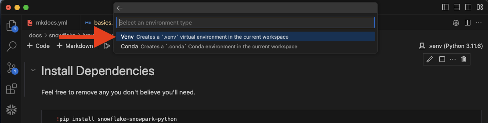

# Snowflake - Basic Jupyter Notebook Setup

## Objective 
Getting data from snowflake into our local jupyter notebook.

## Installing Jupyter Notebook
The fastest way I get jupyter notebooks up and running is by installing [VsCode](https://code.visualstudio.com/) and then creating a new file with the extension ".ipynb".


## Example

### Code
You can either enter the jupyter notebook code below or download the notebook [here](https://sfc-gh-dwilczak.github.io/tutorials/snowflake/jupyter/notebooks/basic.ipynb). You will still have to run the snowflake code below.


### Snowflake / Jupyter Notebook
=== ":octicons-image-16: Snowflake - Code"

    ```sql
    /* 
        The code we are going to use below will
        generate some random data for us. 
    */

    use role sysadmin;

    -- Create the raw database for our data and a science database for our models.
    create database if not exists 
        raw comment='This is only raw data from your source.';

    -- Create the schema. The schema stores all objects that we will need later.
    create schema if not exists
        raw.training comment='Store training data in this schema.';

    CREATE TABLE xy (
        x INT,
        y INT
    );

    -- Insert 15 rows of fake data
    INSERT INTO xy (x, y)
        VALUES
        (1, 10),
        (2, 15),
        (3, 23),
        (4, 25),
        (5, 32),
        (6, 35),
        (7, 40),
        (8, 43),
        (9, 50),
        (10, 52);
    ```

=== ":octicons-image-16: Jupyter - Dependencies"

    ```bash
    !pip install snowflake-snowpark-python
    !pip install snowflake-connector-python
    !pip install "snowflake-connector-python[pandas]"
    ```

=== ":octicons-image-16: Jupyter- Connect"

    ```python
    from snowflake.snowpark import Session as SnowflakeSession

    # Your account information. Account identifier documentation: 
    # - https://docs.snowflake.com/en/user-guide/admin-account-identifier
    connection_parameters = {
        "account":  "",
        "user":     "",
        "password": ""
    }

    session = SnowflakeSession.builder.configs(connection_parameters).create() 

    dataframe = session.table('raw.training.xy').to_pandas()

    print(dataframe)
    ```

=== ":octicons-sign-out-16: Jupyter - Result"
    |    | X  |  Y  |
    |----|----|----|
    | 0  | 1  | 10 |
    | 1  | 2  | 15 |
    | 2  | 3  | 23 |
    | 3  | 4  | 25 |
    | 4  | 5  | 32 |
    | 5  | 6  | 35 |
    | 6  | 7  | 40 |
    | 7  | 8  | 43 |
    | 8  | 9  | 50 |
    | 9  | 10 | 52 |
    | 10 | 11 | 60 |

### Results


## Troubleshooting

### Can't find module - Snowflake


#### Solution 1
If you run into an issue where you install the dependencies but when you run the snowflake connect code it doesn't work. Try restarting the kernal.


#### Solution 2
If restarting the kernal did not work then you might have to change your envirement to a "virtual envirement". Steps shown below.



