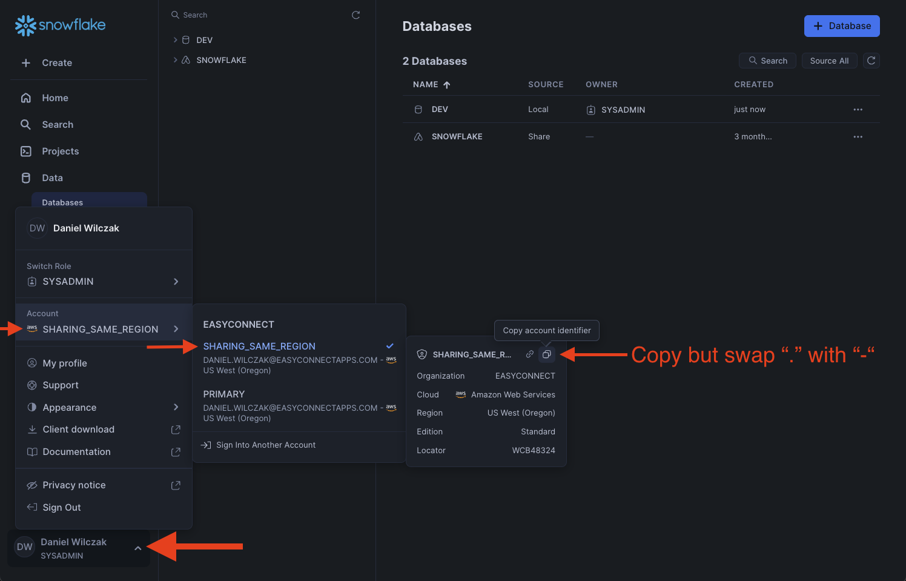
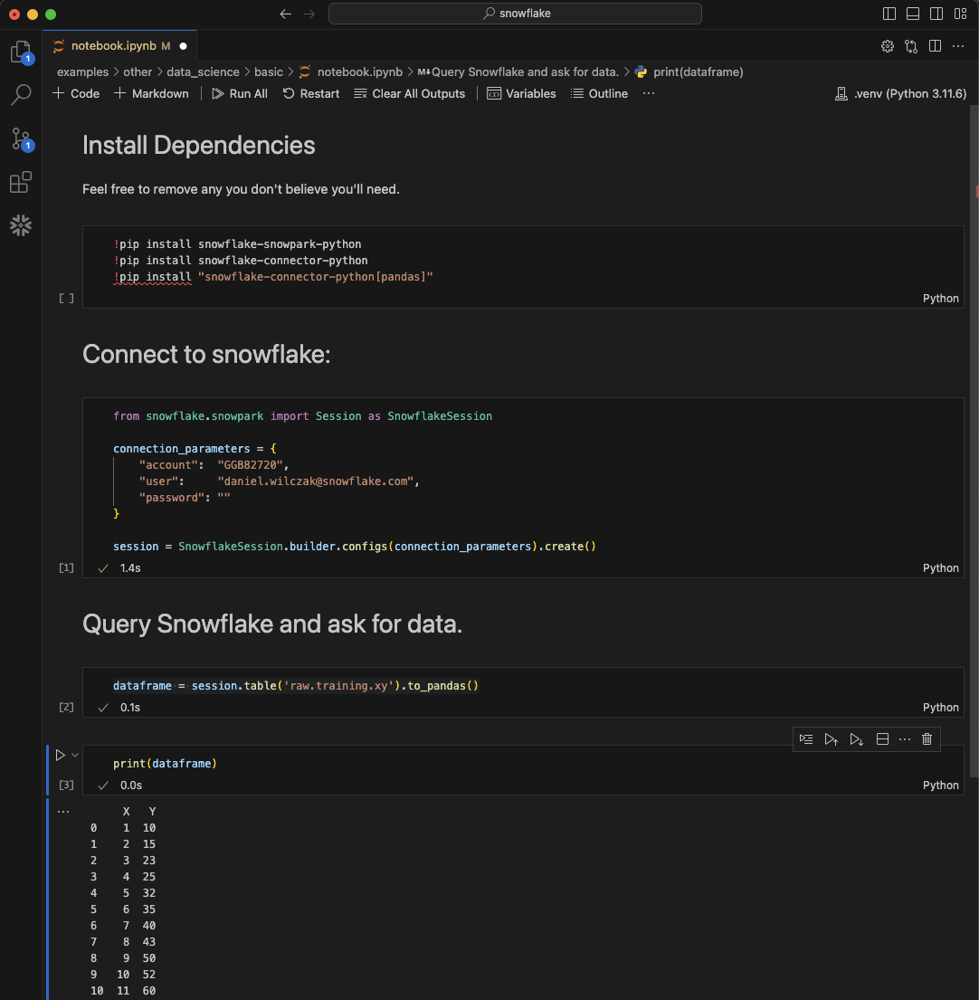

# Introduction to Jupyter Notebook
In this tutorial you will learn how to get data from snowflake into our local jupyter notebook.

## Video
Video is still in development

## Installing Jupyter Notebook :octicons-feed-tag-16:
The fastest way I got jupyter notebooks up and running is by installing [VsCode](https://code.visualstudio.com/) and then creating a new file with the extension ".ipynb".

## Downloads
- Notebook ([Link](https://sfc-gh-dwilczak.github.io/tutorials/snowflake/jupyter/introduction/files/notebook.ipynb))

## Setup :octicons-feed-tag-16:
Lets start with some setup.

### Snowflake

??? note "If you don't have a database, schema or warehouse yet."

    === ":octicons-image-16: Database, schema and warehouse"

        ```sql linenums="1"
        use role sysadmin;

        -- Create the raw database for our data and a science database for our models.
        create database if not exists raw;

        -- Create the schema. The schema stores all objects that we will need later.
        create schema if not exists raw.jupyter;

        /*
            Warehouses are synonymous with the idea of compute
            resources in other systems. We will use this
            warehouse to call our user defined function.
        */
        create warehouse if not exists development 
            warehouse_size = xsmall
            auto_suspend = 30
            initially_suspended = true;
        ```

Lets create the table we'll query later in the notebook.
=== ":octicons-image-16: Code"

    ```sql linenums="1"
    create table xy (
        x int,
        y int
    );

    -- Insert 15 rows of fake data
    insert into xy (x, y)
        values
        (1, 10),
        (2, 15),
        (3, 23),
        (4, 25),
        (5, 32),
        (6, 35),
        (7, 40),
        (8, 43),
        (9, 50),
        (10, 52);
    ```

=== ":octicons-image-16: Result"

    ``` linenums="1"
    Unumber of rows inserted - 10
    ```

### Jupyter Notebook
??? Warning "Please enable token caching if you get to many MFA notifications"
    ```sql
    alter account set allow_client_mfa_caching = TRUE;
    ```


To add our development environment we'll want to get our account identifier. 


In the notebook we'll have to update our connectection parameters. Once pasted we'll make sure we replace the ``.`` with a ``-`` otherwise it won't connect to the account.
=== ":octicons-image-16: Setup"

    ```python linenums="1"
    connection_parameters = {
        "account":  "<ACCOUNT IDENTIFIER>",
        "user":     "<MY USERNAME>",
        "password": "<YOUR PASSWORD>"
    }   
    ```

=== ":octicons-image-16: Example"

    ```python linenums="1"
    connection_parameters = {
        "account":  "wzb37388.gh787th",
        "user":     "daniel.wilczak@snowflake.com",
        "password": "password123"
    }   
    ```


### Results
We can follow along in the notebook or see the result in the image below.


## Troubleshooting :octicons-feed-tag-16:
Here are some common errors I've seen during the setup process.

### Can't find module - Snowflake
If you encounter an error like "module not found" or "Can't find module," it indicates that the Snowflake Python package has not been installed in your Jupyter Notebook environment.


#### Solution 1
If you run into an issue where you install the dependencies but when you run the snowflake connect code it doesn't work. Try restarting the kernal.


#### Solution 2
If restarting the kernal did not work then you might have to change your envirement to a "virtual envirement". Steps shown below.


