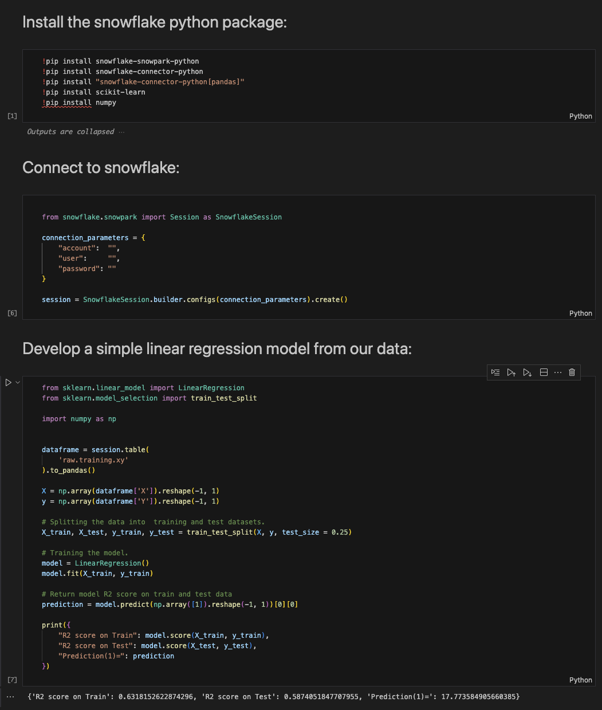

# Snowflake - ML Model Jupyter Notebook
In this tutorial we will learn how to train a model locally and then productionize it in snowflake so that it can be train and used as a function in any SQL enabled tool.

## Video
Video in development.

## Basics
If you have never ran a model locally on jupyter notebook. I suggest trying the [basic tutorial](https://sfc-gh-dwilczak.github.io/tutorials/snowflake/jupyter/basics/) first.


## Example :octicons-feed-tag-16:

### Setup
Lets setup the objects for the example.

=== ":octicons-image-16:  Sql"

    ```sql
    use role sysadmin;

    -- Create the raw database for our data and a science database for our models.
    create database if not exists 
        raw comment='This is only raw data from your source.';
    create database if not exists 
        science comment='This is only for data science use cases.';

    -- Create the schema. The schema stores all objects that we will need later.
    create schema if not exists raw.training;
    create schema if not exists science.linear;

    -- Create a stage (folder) to store our model in.
    use schema science.linear;
    create stage if not exists models
        directory = ( enable = true);

    -- Create some fake x,y data for our model.
    use schema raw.training;
    CREATE TABLE xy (
        x INT,
        y INT
    );

    -- Insert 15 rows of fake data
    INSERT INTO xy (x, y)
        VALUES
        (1, 10),
        (2, 15),
        (3, 23),
        (4, 25),
        (5, 32),
        (6, 35),
        (7, 40),
        (8, 43),
        (9, 50),
        (10, 52);

    -- Create a warehouse to do the training
    create or replace warehouse scientist 
        warehouse_size = xsmall
        initially_suspended = true;
    ```

=== ":octicons-image-16: Result"

    ```
    Warehouse scientist create succesfully.
    ```

### Run locally
Train and run the model locally. A [jupyter notebook](https://sfc-gh-dwilczak.github.io/tutorials/snowflake/jupyter/basics/notebooks/model.ipynb) file is provided for this step. If you have never connected to snowflake via jupyter notebook. I suggest trying the [basic tutorial](https://sfc-gh-dwilczak.github.io/tutorials/snowflake/jupyter/basics/) first.



### Save Model on Snowflake
Lets transition our local model to a snowflake stored procedure so that we can call on it to train and save the model to a stage.

=== ":octicons-image-16:  Sql"

    ```sql
    use database science;
    use schema linear;
    use warehouse scientist;

    create or replace procedure train()
    returns variant
    language python
    runtime_version = 3.8
    packages = ('snowflake-snowpark-python', 'scikit-learn', 'joblib')
    handler = 'main'
    as 
    $$

    import snowflake.snowpark

    from sklearn.linear_model import LinearRegression
    from sklearn.model_selection import train_test_split
    from joblib import dump

    import numpy as np
    import os


    def main(session):
        
        # Select the raw data from our table.
        dataframe = session.table(
        'raw.training.xy'
        ).to_pandas()

        X = np.array(dataframe['X']).reshape(-1, 1)
        y = np.array(dataframe['Y']).reshape(-1, 1)
            
        # Splitting the data into  training and test datasets.
        X_train, X_test, y_train, y_test = train_test_split(X, y, test_size = 0.25)
            
        # Training the model.
        model = LinearRegression() 
        model.fit(X_train, y_train)

        # Save the model to a temp folder.
        file = os.path.join('/tmp', 'linear_regression.joblib')
        dump(model,file)
        # Save the model file to a stage.
        session.file.put(file, "@models",overwrite=True)

        
        prediction = model.predict(np.array([1]).reshape(-1, 1))[0][0]
        # Return model R2 score on train and test data and what it predicted(1)
        return {
            "R2 score on Train": model.score(X_train, y_train),
            "R2 score on Test": model.score(X_test, y_test),
            "Prediction(1)=": prediction
        }
    $$;
    ```

=== ":octicons-image-16: Result"

    ```
    Function TRAIN successfully created.
    ```


### Train
=== ":octicons-image-16:  Sql"

    ```sql
    use warehouse scientist;

    -- Train the model and save it to our model stage we created during setup.
    call science.linear.train();
    
    ```

=== ":octicons-image-16: Result"

    ```json
    TRAIN {
        "Prediction(1)=": 19.65025906735751,
        "R2 score on Test": 0.39521017373294376,
        "R2 score on Train": 0.5841447127694137
    }
    ```

### Function
Lets create a sql function that will load our model in and make the preciction using our loaded model.
=== ":octicons-image-16: Sql"

    ```sql
    use database science;
    use schema linear;

    -- User definded function to be used anywhere.
    create or replace function predict(value int)
        returns int
        language python
        runtime_version = '3.8'
        packages = ('snowflake-snowpark-python', 'joblib', 'scikit-learn')
        imports=('@models/linear_regression.joblib.gz')
        handler = 'main'
    as
    $$
    from joblib import load
    import numpy as np
    import sklearn
    import sys
    import os


    def main(value):
        # Get the directory stimpulated above.
        import_directory = sys._xoptions["snowflake_import_directory"]
        
        # Load the model.
        model = load(import_directory + 'linear_regression.joblib.gz')

        # Make the pediction using our saved model.
        prediction = model.predict(np.array([value]).reshape(-1, 1))[0][0] 

        return prediction
    $$;
    ```

=== ":octicons-image-16: Result"

    ```
    Function PREDICT successfully created.
    ```

### Use
Finally lets use our model like a user would.
=== ":octicons-image-16: Sql"

    ```sql
    select science.linear.predict(15) as prediction;
    ```

=== ":octicons-image-16: Result"

    ```
    52
    ```
