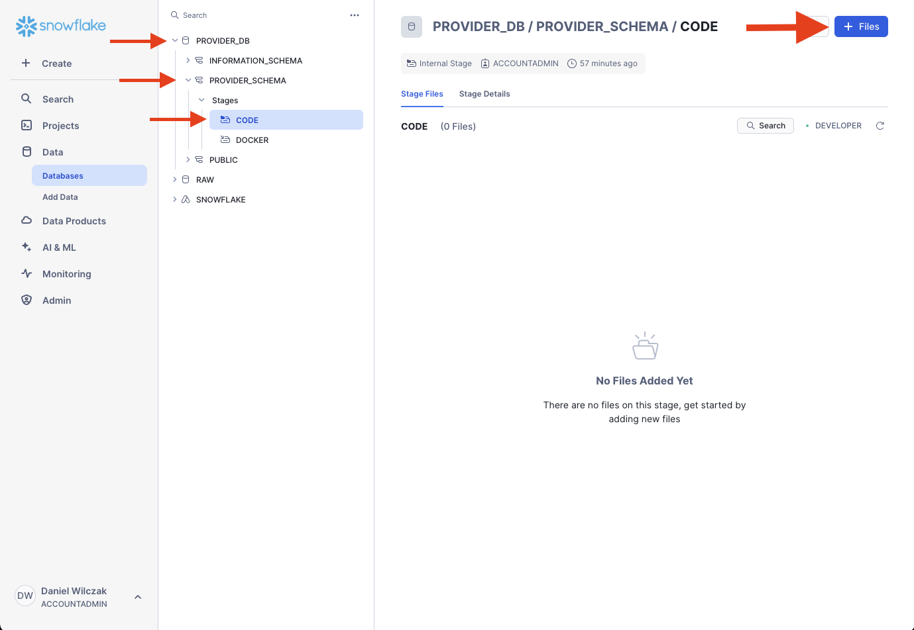
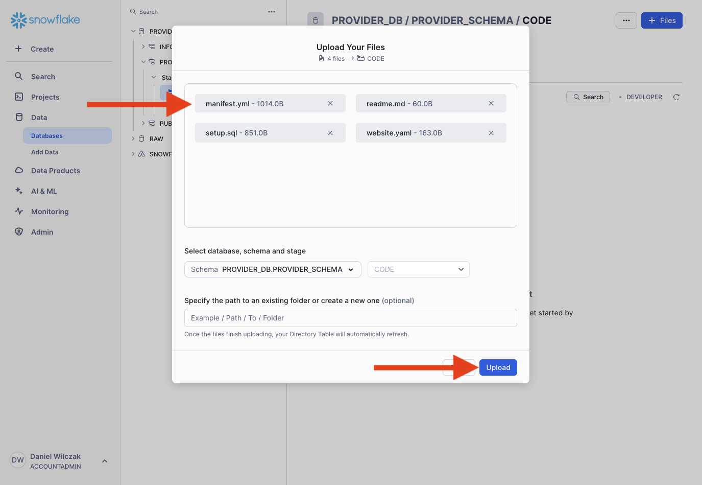
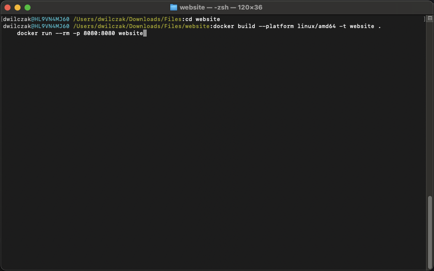
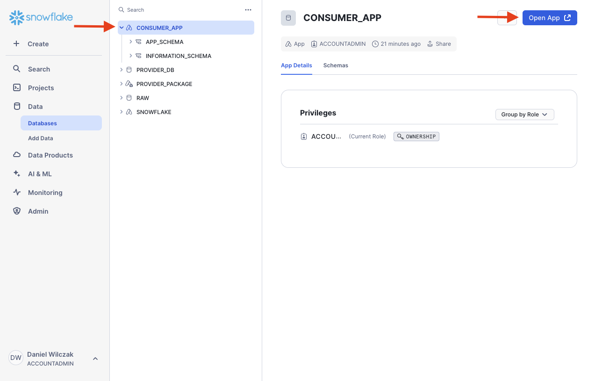
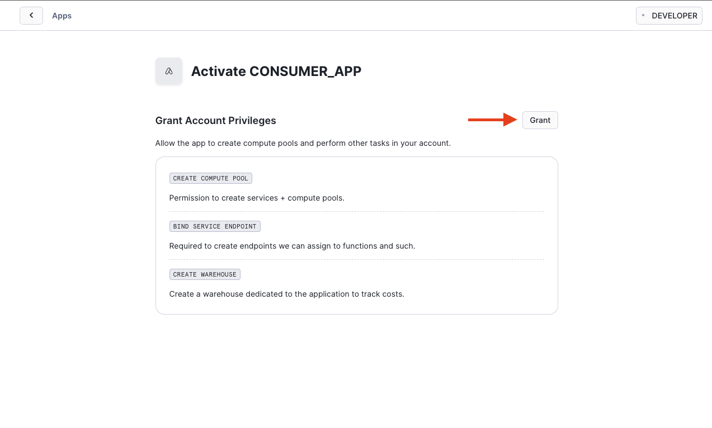
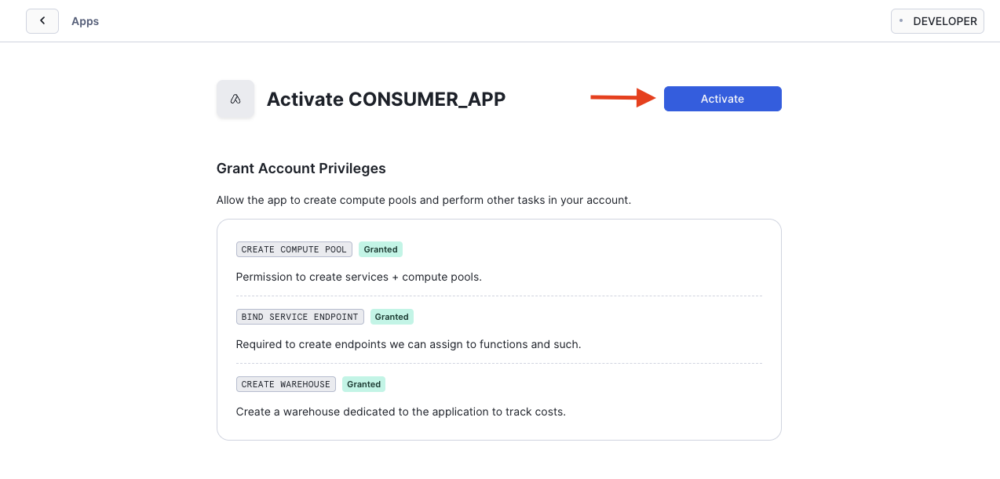
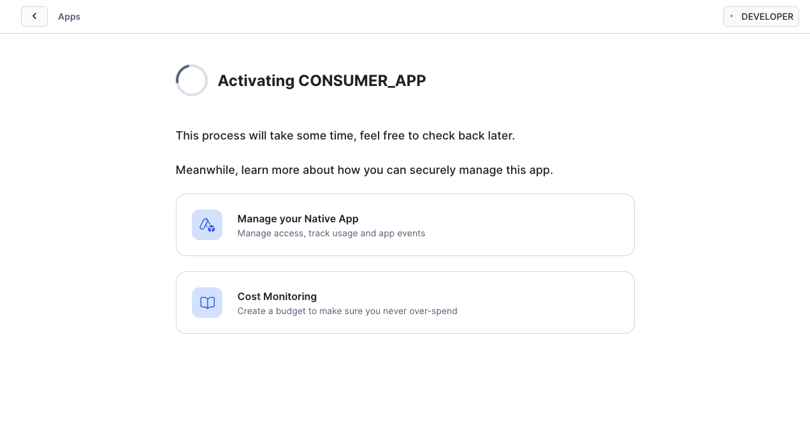
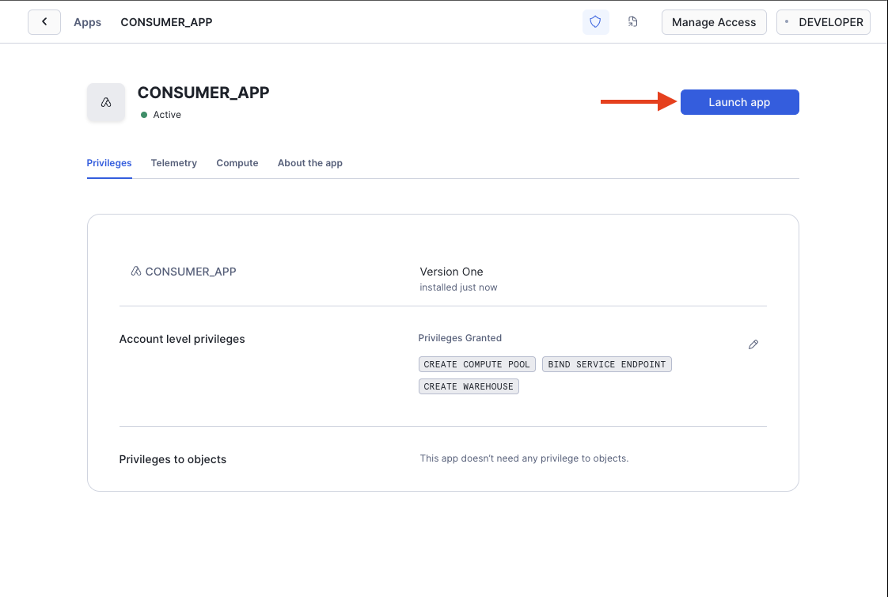
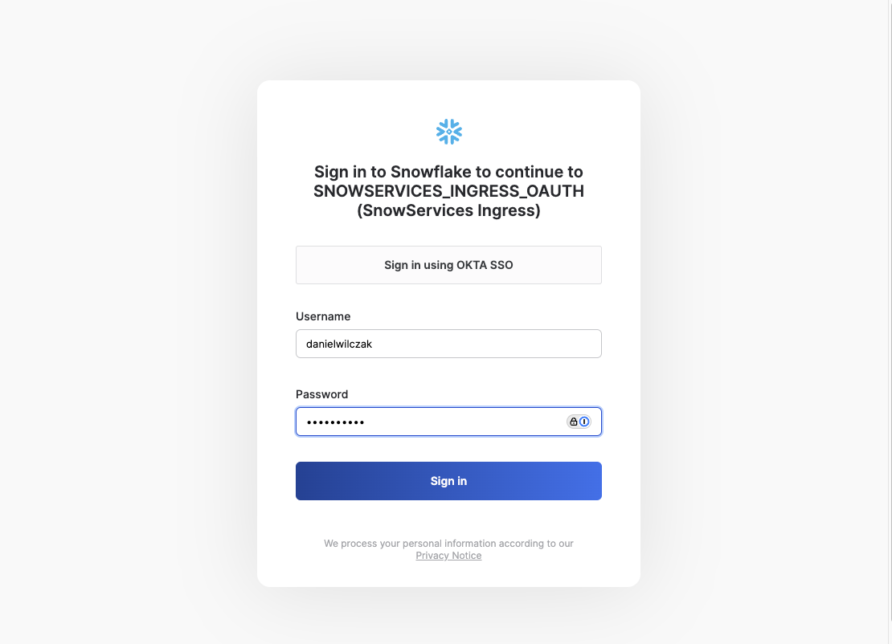
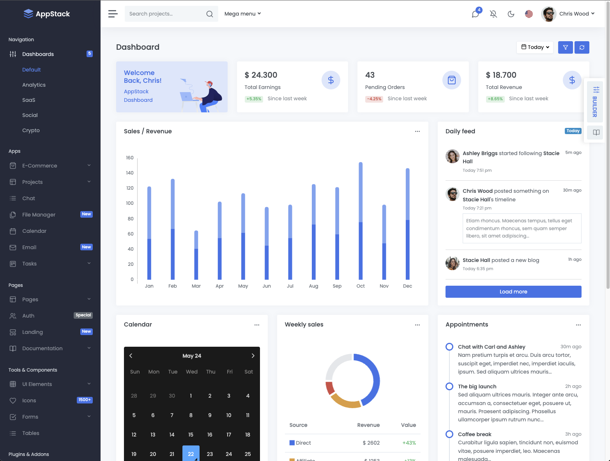

# Native App + Container Services (Intro)
Goal of this tutorial is to get a introduction to Native App + Container Services. In this tutorial you will build a containerized website and then deploy it via a Native app + Container Services. This is the same container we used in our [container services introduction](https://sfc-gh-dwilczak.github.io/tutorials/snowflake/container/introduction/introduction/) tutorial.

## Video
Video currently in development.

## Requirements 
- Be in a container services enabled region.([Link](https://docs.snowflake.com/en/developer-guide/snowpark-container-services/overview#available-regions))
- You can NOT be on a trial account. ([Link](https://docs.snowflake.com/en/developer-guide/snowpark-container-services/overview))
- Please install docker desktop - [https://www.docker.com/products/docker-desktop/](https://www.docker.com/products/docker-desktop/)

## Download (Choose 1)
- Files for simple website - ([Image](images/09.png)) ([Link](https://sfc-gh-dwilczak.github.io/tutorials/snowflake/native/containers/data/simple/Files.zip))   
- Files for fancy website - ([Image](images/11.png)) ([Link](https://sfc-gh-dwilczak.github.io/tutorials/snowflake/native/containers/data/fancy/Files.zip))   

## Setup :octicons-feed-tag-16:
Lets go through some setup before going to docker / building our native application.

### Snowflake
Let's start by setting up Snowflake before we jump to docker. Create a worksheet in Snowflake and add / run the code below.

!!! note
    Copy the resulting URL, we will use it in Docker later.

=== ":octicons-image-16: Setup"

    ```sql linenums="1"
    use role accountadmin;

    -- Database
    create database provider_db;

    -- Schema
    create schema provider_db.provider_schema;

    -- Stage
    create stage provider_db.provider_schema.code
        directory = (enable = true)
        encryption = (type='snowflake_sse')
        file_format = (type = 'csv' field_delimiter = '|' skip_header = 1);
    
    -- Docker image repo.
    create image repository provider_db.provider_schema.docker;

    -- Tell us where to upload our docker image to. This will be used later.
    show image repositories;
    select "repository_url" from table(result_scan(last_query_id()));
    ```

=== ":octicons-image-16: Result"

    | repository_url                                                                      |
    |-------------------------------------------------------------------------------------|
    | sfsenorthamerica-wilczak-videos2.registry.snowflakecomputing.com/raw/website/images |


### Upload Native App Files
In this section we will go back to our "provider_db/provider_schema" database/schema and upload our [native app code](https://sfc-gh-dwilczak.github.io/tutorials/snowflake/native/containers/data/files.zip) we got earlier into the "code" stage.



Next we'll take the files from the "stage" folder and upload them. 



## Docker :octicons-feed-tag-16:
Our goal is to run the application locally and check if it works and then upload the built docker image to our snowflake image repository so it can be hosted on Snowflake container services followed by a Native App.

!!! Note
    Please install docker desktop and have it running - [https://www.docker.com/products/docker-desktop/](https://www.docker.com/products/docker-desktop/)


Using terminal, navigate into the "website" folder. And run the code below to build the application locally.



=== ":octicons-image-16: Build and Run"

    ```bash linenums="1"
    docker build --platform linux/amd64 -t website .
    docker run --rm -p 8080:8080 website
    ```

=== ":octicons-image-16: Result"

    ```linenums="1"
    WARNING: The requested image's platform (linux/amd64) does not match the detected host platform (linux/arm64/v8) and no specific platform was requested
    * Serving Flask app 'app'
    * Debug mode: off
    WARNING: This is a development server. Do not use it in a production deployment. Use a production WSGI server instead.
    * Running on all addresses (0.0.0.0)
    * Running on http://127.0.0.1:8080
    * Running on http://172.17.0.2:8080
    ```


Now you can go to [Localhost](http://localhost:8080/) or the direct local url [http://127.0.0.1:8080/](http://127.0.0.1:8080/). To see what the website will look like before we upload it. Press Ctrl+C to stop the application.

### Upload

Now that we have our image created. Lets upload it to Snowflake. We will need our Snowflake image url (1) that we got from our Snowflake setup.
{ .annotate }

1.  | repository_url                                                                                       |
    |------------------------------------------------------------------------------------------------------|
    | sfsenorthamerica-demo-dwilczak.registry.snowflakecomputing.com/provider_db/provider_schema/docker    |


=== ":octicons-image-16: Code"

    ```bash linenums="1"
    docker tag website <URL GOES HERE>/website
    ```

=== ":octicons-image-16: Example"

    ```bash linenums="1"
    docker tag website sfsenorthamerica-demo-dwilczak.registry.snowflakecomputing.com/provider_db/provider_schema/docker/website
    ```

Next docker login to our snowflake image repo using only the part of the url prior to the first forward slash. We will use the user with accountadmin access.
=== ":octicons-image-16: Code"

    ```bash linenums="1"
    docker login <FIRST PART OF THE URL> -u <USERNAME>
    ```
=== ":octicons-image-16: Example"

    ```bash linenums="1"
    docker login sfsenorthamerica-demo-dwilczak.registry.snowflakecomputing.com/ -u danielwilczak
    ```


Finally push the image to your image repository living on Snowflake.
=== ":octicons-sign-out-16: Code"

    ```bash linenums="1"
    docker push <URL GOES HERE>/website
    ```
=== ":octicons-sign-out-16: Example"

    ```bash linenums="1"
    docker push sfsenorthamerica-demo-dwilczak.registry.snowflakecomputing.com/provider_db/provider_schema/docker/website
    ```

=== ":octicons-sign-out-16: Result"

    ```
    Using default tag: latest
    The push refers to repository [sfsenorthamerica-demo-dwilczak.registry.snowflakecomputing.com/provider_db/provider_schema/docker/website]
    df7fb4f01ad1: Pushed 
    620025ace117: Pushed 
    3e2bded7d904: Pushed 
    4ad6620b3816: Pushed 
    6828fc9c1ffb: Pushed 
    4a40ad7ca2cf: Pushed 
    064ffeaf7830: Pushed 
    28f8d0721800: Pushed 
    cbe4fb5e267b: Pushed 
    734c0f0b65c2: Pushed 
    8845ab872c1c: Pushed 
    d7d4c2f9d26b: Pushed 
    bbe1a212f7e9: Pushed 
    latest: digest: sha256:1d6431ee1c749261d35129ee07ebc34ea2868fe2473e0b226078cf774951dc99 size: 3045
    ```


## Build Application :octicons-feed-tag-16:
Now were ready to build our application package and test it by building/testing it in our Snowflake account. Lets go back to our worksheet and copy the code below.

=== ":octicons-image-16: Application"

    ```sql linenums="1"
    use role accountadmin;

    -- Create the package.
    create application package provider_package;

    -- Copy our native app code and docker image over to the package.
    alter application package provider_package add version v1 using @provider_db.provider_schema.code;

    -- Create the application from the package.
    create application consumer_app from application package provider_package using version v1;
    ```

=== ":octicons-image-16: Result"

    | status                                           |
    |--------------------------------------------------|
    | Application 'CONSUMER_APP' created successfully. |


### Using the App
Lets walk through the prcoess of installing the application. Lets click on our new application called "consumer_app".


Grant the application the privligies to create a warehouse, compute pool, and endpoint to acccess the website.


Click activate, this will start the build process.


!!! warning
     I recommend to refresh the screen once in a while, the UI might just hung up.

The build will go into a loading screen. This can load for upward of a few minutes for a simple application and longer for more complex apps.


Once the application is installed we can launch the app.


We'll login with a user who has the accountadmin role.


Now we can see the amazing website we have made in Native apps and Container Services on Snowflake.



## (Extra) Sharing

!!! warning
    Your second account will also have to be enabled.

If you want to share your application, you will have to set a default version.

=== ":octicons-image-16: Application"

    ```sql linenums="1"
    -- if you want to publish it.
    alter application package provider_package set default release directive version=v1 patch=0;
    ```

=== ":octicons-image-16: Result"

    | status                                                  |
    |---------------------------------------------------------|
    | Default release directive set to version 'V1', patch 0. |