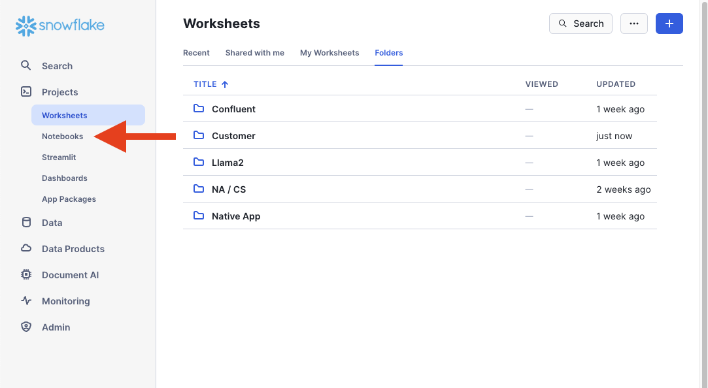
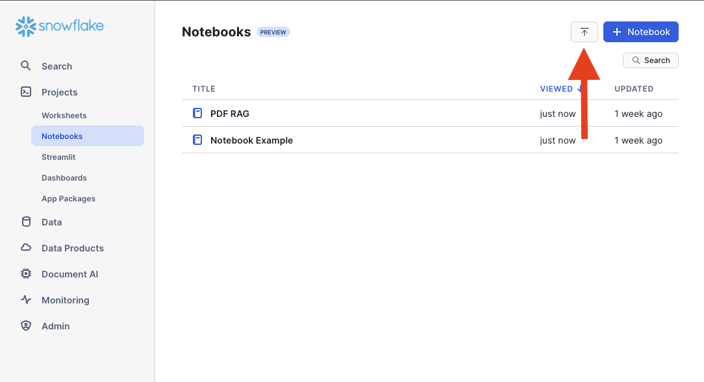
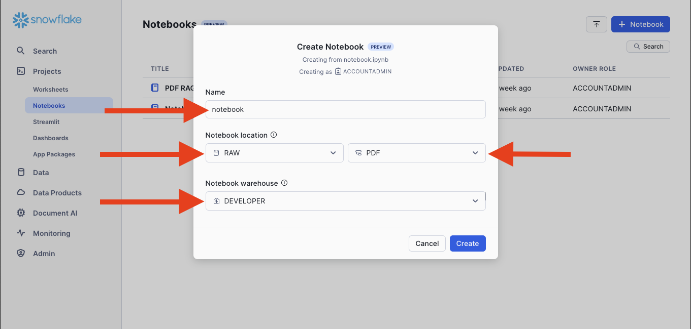
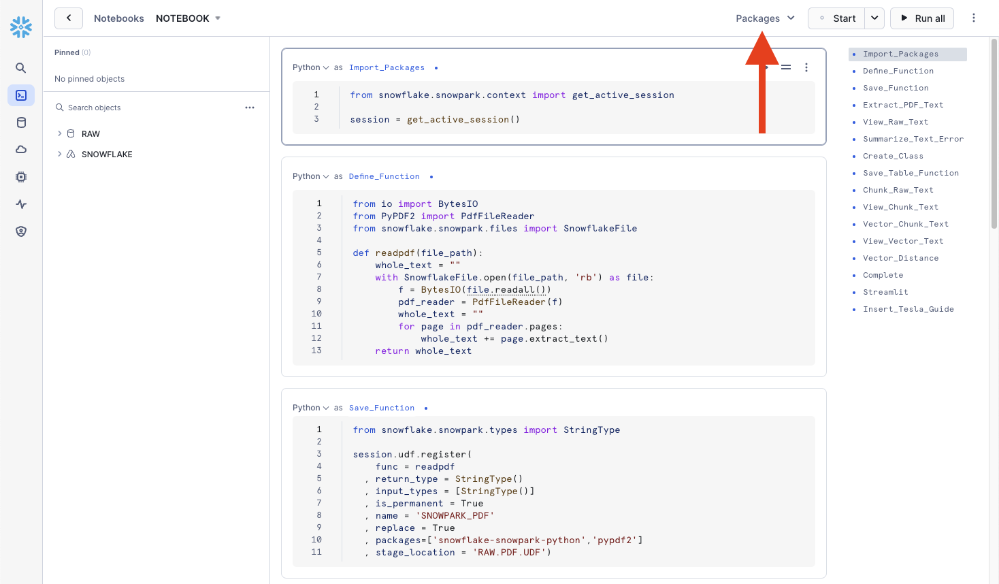
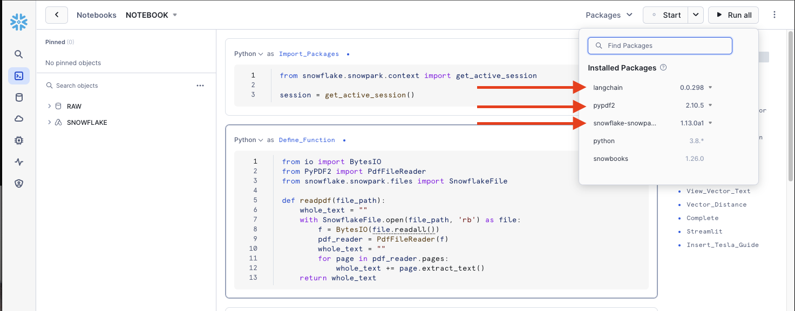
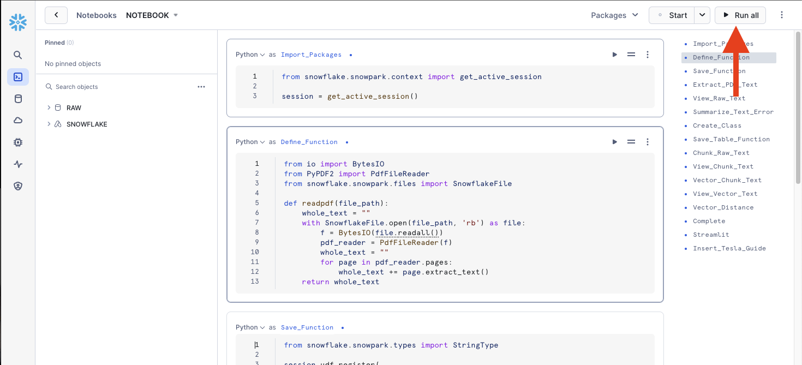
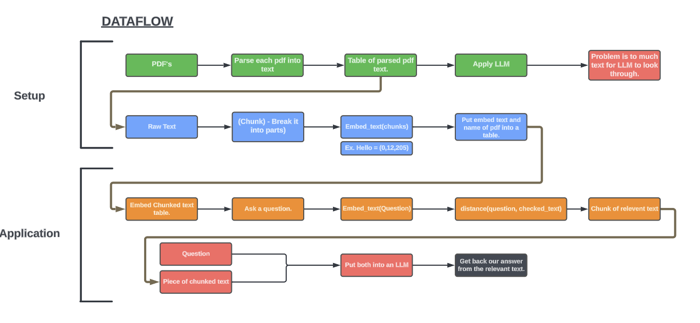

# Snowflake Notebook RAG with PDF's
In this tutorial we will show you how to perform RAG on a series of PDF's in Snowflake using Snowflake notebooks. To make it usable to users we will also add a streamlit application in our notebook so that it's simple for users to interat with the content.

## Video
<iframe width="850px" height="478px" src="https://www.youtube.com/embed/SZAAIAl31UI?si=UK4jA8fDrbm2vlFi" style="display:block;" title="YouTube video player" frameborder="0" allow="accelerometer; autoplay; clipboard-write; encrypted-media; gyroscope; picture-in-picture; web-share" allowfullscreen></iframe>

## Requirements
If you have a Snowflake account, reach out to your account team to have these enabled.  

- You will need access to [Snowflake Notebooks](https://docs.snowflake.com/LIMITEDACCESS/snowsight-notebooks/ui-snowsight-notebooks-about) which is still currently in private preview.  
- You will need access to our [embed/vector LLM functions](https://docs.snowflake.com/LIMITEDACCESS/vector-data-type) which is still currently in private preview.  

## Download
- [Notebook](https://sfc-gh-dwilczak.github.io/tutorials/snowflake/notebooks/RAG/pdf/data/notebook.ipynb)
- [PDF files](https://sfc-gh-dwilczak.github.io/tutorials/snowflake/notebooks/RAG/pdf/data/pdfs.zip)

## Tutorial
Lets start by setting up some objects in snowflake and follow it up with uploading and using the notebook.

### Setup
In this section we will do the setup to support our notebook. Lets open a notebook and run the code below.

=== ":octicons-image-16: Setup"

    ```sql
    use role accountadmin;
    
    -- Create a database to store our schemas.
    create database if not exists 
        raw comment='This is only api data from our sources.';

    -- Create the schema. The schema stores all our objectss.
    create schema if not exists raw.pdf;

    /*
        Warehouses are synonymous with the idea of compute
        resources in other systems. We will use this
        warehouse to call our user defined function.
    */
    create warehouse if not exists developer 
        warehouse_size = xsmall
        initially_suspended = true;

    use database raw;
    use schema pdf;
    use warehouse developer;
    /*
        Setup our two stages (aka filder) that the
        user defined functions and our pdf files will live in.
    */
    create or replace stage udf;
    create or replace stage folder;
    ```
=== ":octicons-image-16: Result"

    ```sql
    Stage area FOLDER successfully created. 
    ```

### Upload PDF's
Using the UI we will upload our downloaded pdf's into our stage (folder on Snowflake).


### Notebook
Let's start with going to the notebooks.


Click the upload button so that we can upload our [provided notebooks]().


Input the name of the notebook, select the database, schema and warehouse.


Select the packages drop-down.


Lookup and added these three packages:  

- langchain  
- pypdf2  
- snowflake-snowpark-python  



You can either run all the cells or one by one.


## Dataflow
Here we can see the data flow of of our notebook / application.


## Step by Step
I will add this section later but for now the video will be best. 

