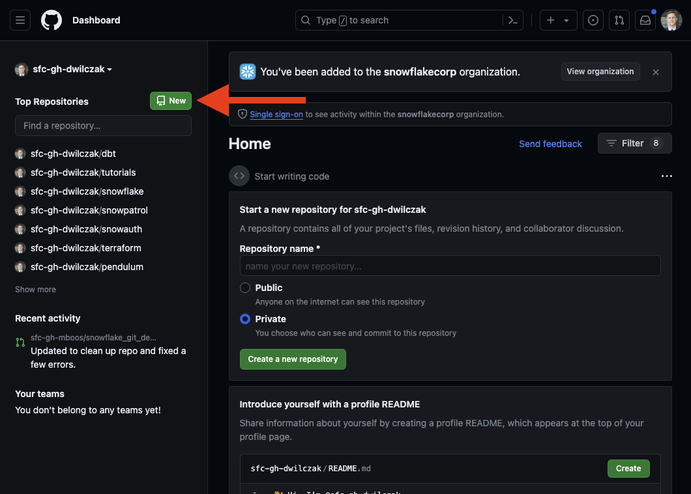
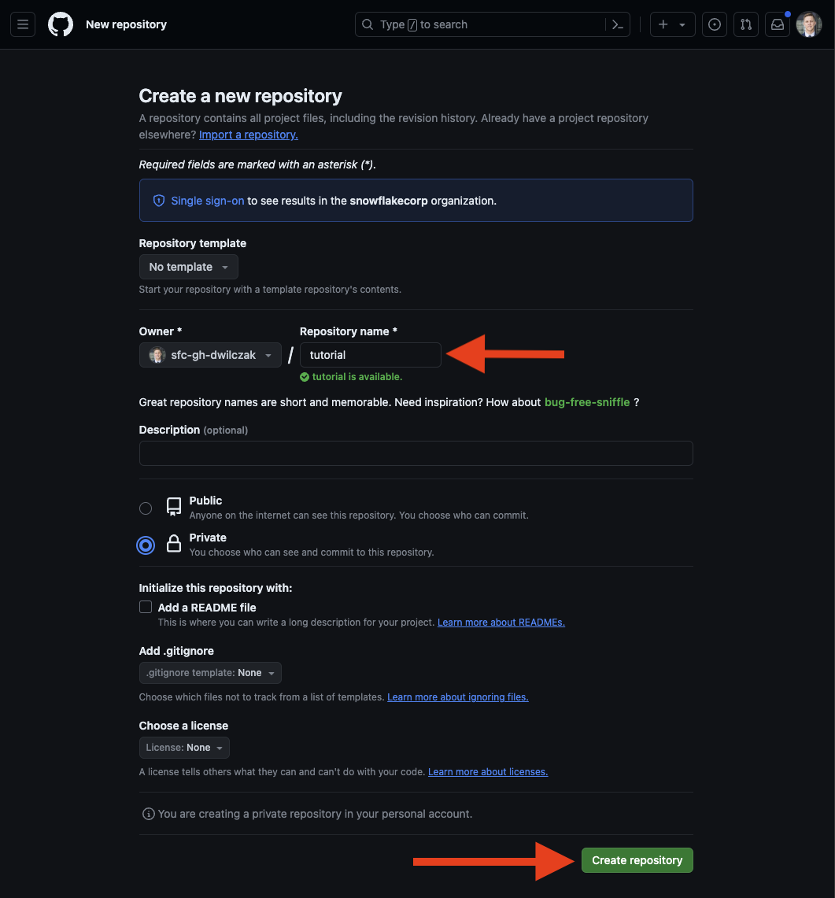
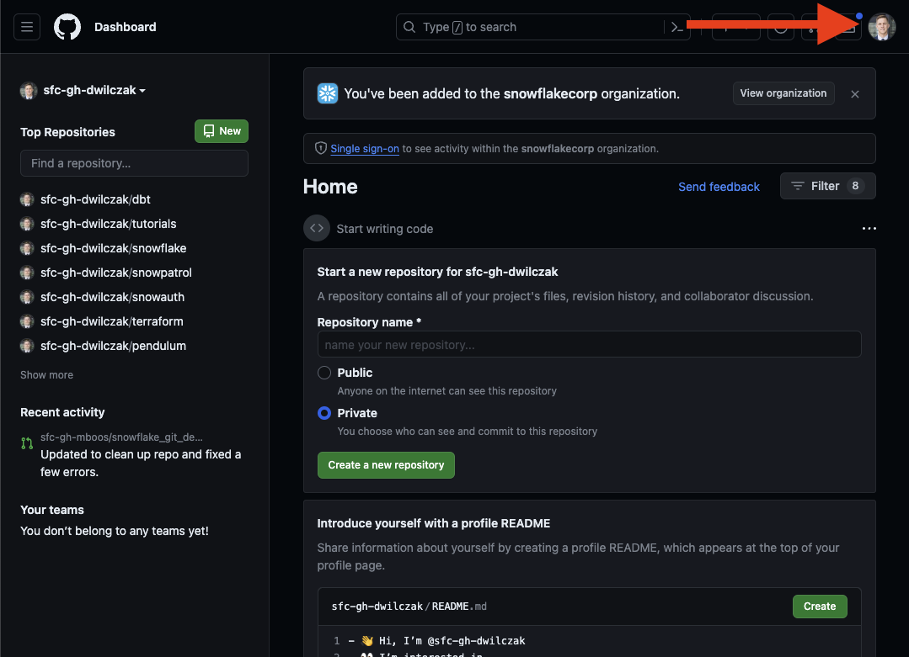
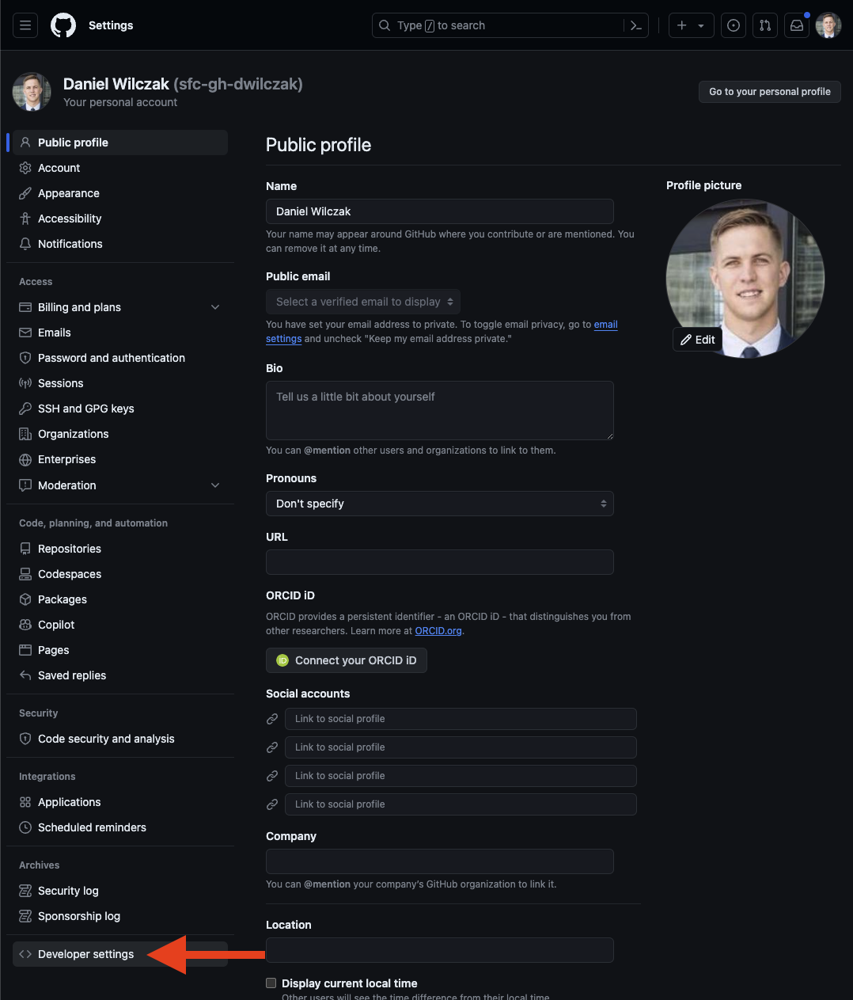
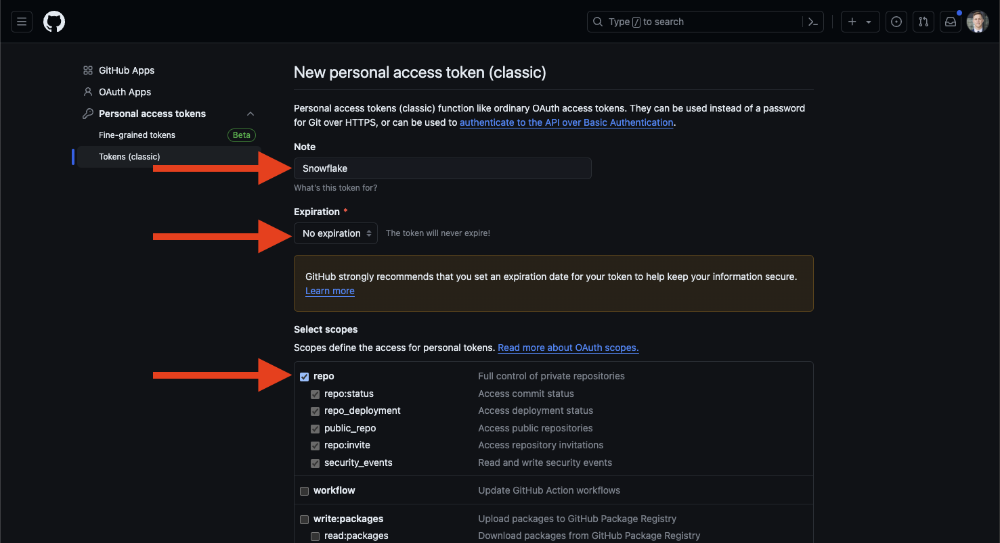
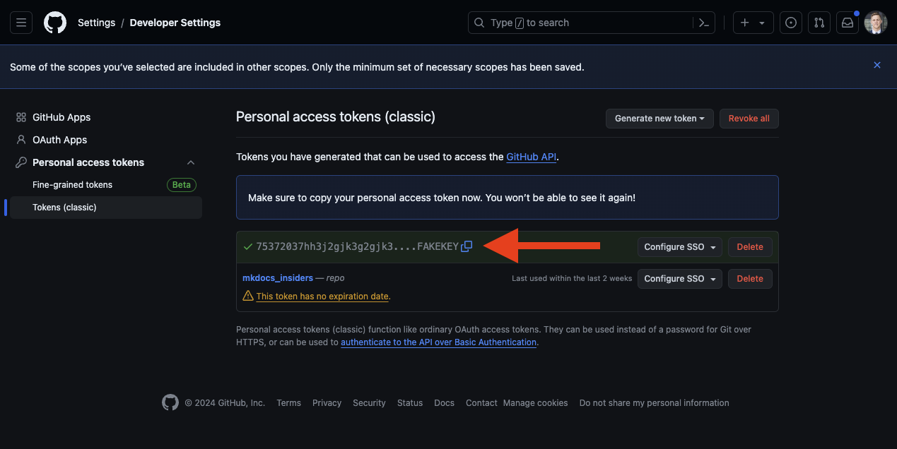
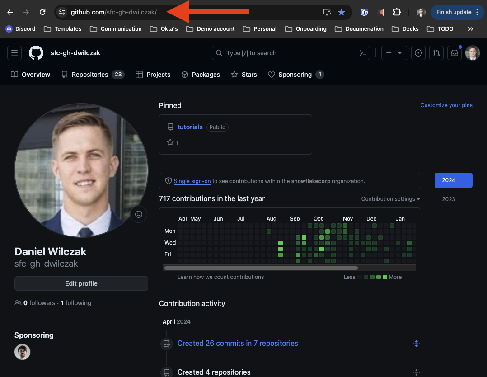
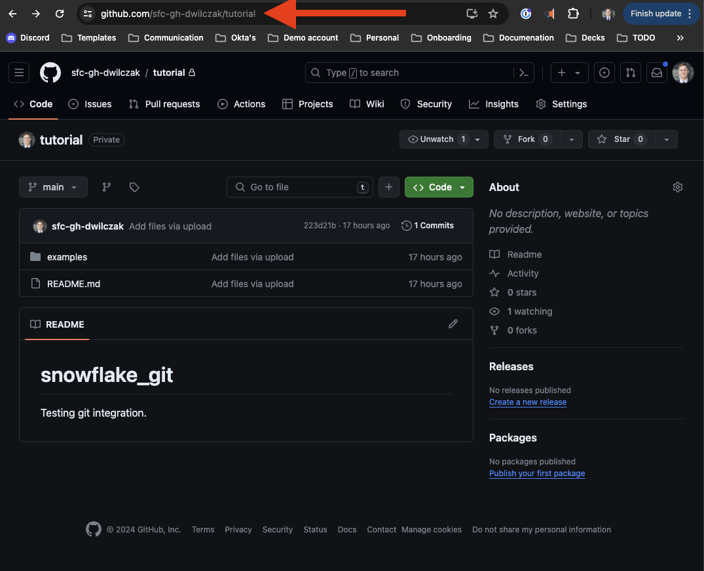

# Snowflake Notebook - Git Integration
In this tutorial we will show you how to integrate Git into your Snowflake account. We will walk through two main subjects. The first is pulling the repo into Snowflake and navigating around. The second is creating a stored procedure, streamlit dashboard, and run a query from files that lives on github.  

## Video
Video in development.

## Requirements
You will need a [github](https://github.com/) repo and the ability to [create a personal access token](https://docs.github.com/en/authentication/keeping-your-account-and-data-secure/managing-your-personal-access-tokens). We will show how to create the token in this tutorial. 

## Download
- [Repository files](https://sfc-gh-dwilczak.github.io/tutorials/snowflake/git/data/repo.zip)

## Setup :octicons-feed-tag-16:
In this section we will upload the example code to a repository and then setup Snowflake:

### Github Repository
Start by creating a repo.


UPDATE IMAGE.... Call it "notebook". It can be public or private. 


PDATE IMAGE.... Your good to go.


### Personal Access Token
We will need a persoanl access token to allow Snowflake to work with our Git repository. First lets navigate to the token page.


Click on settings.


Next developer settings.


We'll be using a classic token.


Next we'll enter in a name, the experation of the token, and select "repo" for the scope of the permissions.


We'll copy our token, it will be used in the following Snowflake step.


### Snowflake
Lets now use snowflake to connect to our repository.

??? note "If you don't have a database, schema or warehouse yet."

    === ":octicons-image-16: Database, schema and warehouse"

        ```sql
        use role sysadmin;
        
        -- Create a database to store our schemas.
        create database raw;

        -- Create the schema. The schema stores all our objectss.
        create schema raw.git;

        /*
            Warehouses are synonymous with the idea of compute
            resources in other systems. We will use this
            warehouse to call our user defined function.
        */
        create warehouse if not exists developer 
            warehouse_size = xsmall
            initially_suspended = true;

        use database raw;
        use schema git;
        use warehouse developer;
        ```


=== ":octicons-image-16: Setup"

    ```sql linenums="1"
    use role accountadmin;

    create or replace secret github_secret
        type = password
        username = '<Github Username>' /* (1)! */
        password = '<Personal Access Token>'; /* (2)! */

    create or replace api integration git_api_integration
        api_provider = git_https_api
        api_allowed_prefixes = ('<Base Github URL>') /* (3)! */
        allowed_authentication_secrets = (github_secret)
        enabled = true;
  
    create or replace git repository tutorial
        api_integration = git_api_integration
        git_credentials = github_secret
        origin = '<REPOSITORY URL>'; /* (4)! */

    ```
    { .annotate }

    1.  
        
    2. 

    3. 

    4. 

=== ":octicons-image-16: Example"

    ```sql linenums="1"
    use role accountadmin;

    create secret github_secret
        type = password
        username = 'sfc-gh-dwilczak'
        password = 'huifuhf.....f94894h2';

    create api integration git_api_integration
        api_provider = git_https_api
        api_allowed_prefixes = ('https://github.com/sfc-gh-dwilczak')
        allowed_authentication_secrets = (github_secret)
        enabled = true;
  
    create git repository tutorial
        api_integration = git_api_integration
        git_credentials = github_secret
        origin = 'https://github.com/sfc-gh-dwilczak/tutorial';
    ```


=== ":octicons-image-16: Result"

    | status                                            |
    |---------------------------------------------------|
    | Git Repository TUTORIAL was successfully created. |


## Notebook :octicons-feed-tag-16:
Now that we have our Snowflake and Git repository setup lets go through connecting to it via a notebook.